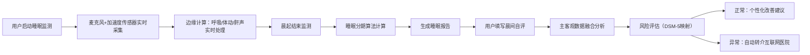

## 1. 产品概述

无感式睡眠健康干预平台，基于手机麦克风与加速度传感器实现非接触睡眠监测，为用户提供从睡眠数据采集、睡眠质量分析、个性化干预到医疗级风险评估的全流程闭环服务。

- 面向人群：存在睡眠困扰的都市人群、焦虑压力人群、鼾症/疑似呼吸暂停人群、关注睡眠健康的普通用户
- 核心价值：无需可穿戴设备的轻量化监测体验，结合CBT-I循证干预体系，实现从自我管理到医疗转介的健康闭环

## 2. 核心功能

### 2.1 用户角色

| 角色 | 注册方式 | 核心权限 |
|------|----------|----------|
| 普通用户 | 手机号/邮箱注册 | 睡眠监测、音频库使用、睡眠改善计划、自评报告、风险评估结果查看 |
| 医生端（合作互联网医院） | 医疗机构认证 | 接收转诊病例、查看患者睡眠报告、远程初筛建议 |
| 管理员 | 后台账号 | 音频内容管理、水印追踪、模型参数配置、转诊记录审核 |

### 2.2 功能模块

1. **首页/仪表盘**：睡眠概览卡片、昨夜核心指标、今日改善建议、快捷入口
2. **睡眠监测页**：实时监测开始/停止、传感器状态指示、实时波形可视化、监测中环境提示
3. **睡眠报告页**：睡眠分期、呼吸节律、翻身次数、鼾声频谱、入睡潜伏期、历史趋势
4. **音频干预库**：白噪音/自然音、引导冥想、按场景分类（焦虑/压力/失眠）、播放控制器、定时关闭
5. **睡眠改善计划**：渐进式作息调整日历、CBT-I认知行为训练模块（睡眠限制、刺激控制、认知重构）、任务打卡
6. **晨间自评**：清醒度量表、睡眠质量自评、情绪评分、前一日睡眠满意度
7. **风险评估中心**：DSM-5睡眠障碍风险映射、呼吸暂停事件预警、自动转介互联网医院
8. **个人中心**：个人资料、设备授权管理、音频收藏、历史记录导出、隐私设置

### 2.3 页面详情

| 页面名称 | 模块名称 | 功能描述 |
|----------|----------|----------|
| 首页仪表盘 | 睡眠概览卡片 | 展示昨夜睡眠总时长、睡眠效率、呼吸频率均值、翻身次数，环形进度条可视化 |
| 首页仪表盘 | 今日建议模块 | 基于昨夜数据动态推荐干预内容（如：检测到鼾声偏多→推荐侧睡引导冥想） |
| 首页仪表盘 | 快捷操作区 | 开始睡眠监测、启动助眠音频、查看睡眠报告、填写晨间自评 |
| 首页仪表盘 | 睡眠趋势图 | 近7日/30日睡眠质量趋势折线图，异常日期高亮标记 |
| 睡眠监测页 | 传感器状态指示 | 麦克风音量波形、加速度传感器活动度实时显示、环境噪音等级提示 |
| 睡眠监测页 | 实时监测画布 | Canvas绑定呼吸波形与体动活动双轴实时滚动波形，夜间模式低亮度 |
| 睡眠监测页 | 监测控制区 | 开始/暂停/结束按钮、预计起床时间设定、助眠音频快捷启动、防误触锁屏提示 |
| 睡眠报告页 | 睡眠分期时间轴 | 深睡/浅睡/REM/清醒分段可视化时间条，悬停查看每段详情 |
| 睡眠报告页 | 核心指标网格 | 呼吸节律（箱线图）、翻身次数（柱状）、鼾声频谱（热力图）、入睡潜伏期（对比周均值） |
| 睡眠报告页 | 异常事件标记 | 呼吸暂停事件、异常体动、高噪音时段时间点标记，点击查看详情 |
| 睡眠报告页 | 历史对比 | 与上周同期、与个人最佳记录对比，进步/退步箭头标识 |
| 音频干预库 | 场景分类标签栏 | 焦虑缓解 / 压力释放 / 深度失眠 / 专注冥想 四大场景标签切换 |
| 音频干预库 | 音频卡片瀑布流 | 封面图+时长+收藏数+简介，支持收藏、下载、添加自定义列表 |
| 音频干预库 | 底部播放器 | 常驻底部播放栏：封面轮播、进度条、音量、定时关闭（15/30/45/60分钟）、上一曲/下一曲 |
| 睡眠改善计划 | 作息调整日历 | 渐进式早睡/起床时间规划，每日打卡完成率环形图，调整梯度提示 |
| 睡眠改善计划 | CBT-I训练模块 | 睡眠限制：根据睡眠效率动态调整卧床时间；刺激控制：入睡前行为清单；认知重构：负性思维改写练习 |
| 睡眠改善计划 | 任务打卡面板 | 今日任务列表（含助眠行动、CBT-I练习、作息执行），完成动画效果 |
| 晨间自评 | 多维度评估量表 | 斯坦福嗜睡量表（SSS）、睡眠质量主观评分、情绪VAS量表、入睡前思绪干扰程度 |
| 晨间自评 | 自评完成反馈 | 展示昨日自评→今日自评变化趋势，生成简短情绪洞察 |
| 风险评估中心 | DSM-5风险映射表 | 失眠障碍/阻塞性睡眠呼吸暂停/不宁腿综合征等维度风险分层（低/中/高） |
| 风险评估中心 | 呼吸暂停预警卡片 | 基于AHI指数估算，显示事件次数、持续时长统计，触发阈值后自动生成转诊建议 |
| 风险评估中心 | 互联网医院转介流程 | 授权同意→数据脱敏→生成转诊报告→匹配合作医院→预约远程初筛，流程进度追踪 |
| 个人中心 | 隐私与授权 | 麦克风/传感器权限状态、数据本地存储选项、医疗数据分享授权开关 |
| 个人中心 | 音频版权追踪 | 展示已播放音频的版权水印信息（含播放次数、来源标识），版权声明入口 |

## 3. 核心流程

### 3.1 睡眠监测至报告生成流程
用户睡前启动监测 → 系统实时采集麦克风音频与加速度数据 → 后台边缘计算模块处理：呼吸节律提取、体动识别、鼾声检测与频谱分析 → 晨起用户结束监测 → 算法生成睡眠分期与核心指标 → 用户填写晨间自评 → 系统综合主客观数据生成睡眠报告 → 风险评估模块自动筛查异常

### 3.2 音频干预使用流程
用户选择场景分类 → 浏览/搜索音频内容 → 播放白噪音或引导冥想 → 设定定时关闭 → 系统记录播放时长与内容ID → 嵌入版权水印追踪 → 结合次日睡眠数据评估干预效果 → 智能推荐更匹配内容

### 3.3 呼吸暂停自动转介流程
监测中检测到疑似呼吸暂停事件 → AHI指数达到阈值（≥5次/小时）→ 风险评估中心触发红色预警 → 弹窗告知风险并请求授权 → 用户同意后数据脱敏打包 → 生成DSM-5格式的转诊报告 → 推送至合作互联网医院HIS系统 → 用户收到初筛预约通知

## 4. 用户界面设计

### 4.1 设计风格
- **主色系**：深夜靛蓝 `#0B1437` → 静谧蓝紫 `#1E2A5C` 渐变，营造助眠沉浸感；辅以柔和薄荷绿 `#7BC8A4` 作为数据正常态标识，珊瑚橙 `#FF6B6B` 作为异常预警色
- **辅助色**：星空银 `#C4C9D9` 用于文字层级，梦境紫 `#9B7EDB` 用于冥想类内容标识
- **按钮风格**：胶囊形圆角按钮（radius 999px），主按钮采用玻璃拟态渐变+轻微发光效果，次要按钮为半透明磨砂玻璃
- **字体**：标题使用「思源宋体 Light」呈现文艺沉静感，正文使用「PingFang SC」确保中文易读性，数字指标使用「JetBrains Mono」等宽字体增强数据感
- **布局风格**：大圆角卡片（radius 24px）+ 玻璃拟态层叠布局 + 深色星空背景点缀微光粒子，关键数据模块悬浮投影
- **图标/装饰**：线性简约图标（2px描边），关键页面使用柔和呼吸光点、睡眠呼吸节奏波形、星月夜空粒子动效

### 4.2 页面设计概览

| 页面名称 | 模块名称 | UI元素 |
|----------|----------|--------|
| 首页仪表盘 | 睡眠概览卡片 | 玻璃拟态卡片、环形进度条带呼吸动画、4项核心指标2×2网格、渐变背景粒子浮动 |
| 首页仪表盘 | 今日建议模块 | 左侧圆形推荐音频封面（带脉冲播放按钮）、右侧标题+简述+「立即体验」胶囊按钮 |
| 首页仪表盘 | 睡眠趋势图 | SVG折线图、渐变填充区域、悬停tooltip显示当日详情、异常点红色光晕标记 |
| 睡眠监测页 | 实时画布 | 深色背景、双轴Canvas波形（呼吸波形青色渐变、体动波形紫色点状）、顶部呼吸节奏引导圈 |
| 睡眠监测页 | 传感器状态 | 三个状态胶囊：麦克风音量条（绿/黄/红分段）、加速度活动度（点状指示器）、环境噪音（分贝数） |
| 睡眠报告页 | 睡眠分期时间轴 | 横向分段时间条、四段颜色区分（深睡#3B4F8A/浅睡#6B82C9/REM#9B7EDB/清醒#FF6B6B）、时间刻度 |
| 睡眠报告页 | 鼾声频谱热力图 | 24小时×频率二维热力图、冷色→暖色渐变表示能量强度、异常频谱白色边框圈出 |
| 音频干预库 | 卡片瀑布流 | 不等高卡片、封面模糊背景+标题白字叠加、右下角收藏心形按钮、播放时长胶囊标识 |
| 音频干预库 | 底部播放器 | 毛玻璃固定底栏、封面圆形旋转动画、波形进度条、定时关闭图标带倒计时气泡 |
| 睡眠改善计划 | 作息日历 | 月视图日历、每日入睡/起床时间箭头连线、完成日打勾图标、今日高亮发光边框 |
| 睡眠改善计划 | CBT-I模块 | 三个训练Tab切换、训练内容卡片含步骤进度条、认知重构练习输入框（支持打字机动效提示） |
| 风险评估中心 | DSM-5映射雷达图 | 六维雷达图（失眠/OSA/不宁腿/周期性腿动/发作性睡病/昼夜节律）、填充区域透明度分层、阈值红线 |
| 风险评估中心 | 转诊流程条 | 5步横向流程条、当前步骤发光高亮、已完成步骤打勾、待完成步骤灰态 |

### 4.3 响应式设计
- 桌面端优先：1440px基准栅格，12列布局，侧边导航固定
- 平板端（768-1024px）：栅格降为8列，导航变为顶部汉堡菜单
- 移动端（<768px）：栅格降为4列，卡片间距缩小，底部Tab导航替代侧边栏，监测画布全屏显示，报告图表自适应单列
- 触控优化：所有可交互区域最小尺寸44×44px，滑动手势支持报告页切换、音频列表左右切换分类

### 4.4 动效与交互细节
- 监测启动动画：屏幕渐暗→星光粒子汇聚成呼吸引导圈→波形从中心扩散展开
- 睡眠分期切换：时间轴分段渐次填充，相邻分段边界柔和过渡
- 音频播放：封面圆形360°旋转，进度条使用音频波形可视化填充
- CBT-I打卡完成：Confetti粒子爆发（柔和星光色）+ 卡片轻微弹跳
- 风险预警：预警卡片红光脉冲呼吸+顶部横幅缓慢滑入
- 全局背景：低亮度星空粒子缓慢漂移，鼠标移动时视差偏移（最大2px）
