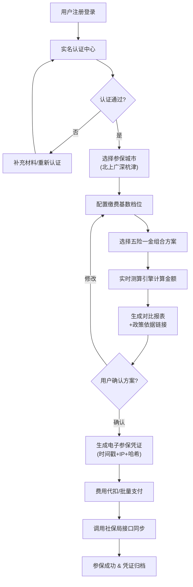

## 1. 产品概述
覆盖北京、上海、广州、深圳、杭州、天津六地的社保公积金合规代缴SaaS平台，面向灵活就业人员、中小企业及HR外包服务商，提供一站式社保公积金参保、测算、事务办理与财务管理服务。
- 解决痛点：跨城市政策不透明、测算复杂、事务办理跑腿多、断缴风险高、企业薪酬核算繁琐
- 核心价值：六地政策实时同步、AI智能测算、全流程电子化、合规凭证可追溯

## 2. 核心特性

### 2.1 用户角色
| 角色 | 注册方式 | 核心权限 |
|------|----------|----------|
| 个人用户 | 手机号+实名认证 | 自主参保、测算、事务办理、凭证下载 |
| 企业HR用户 | 企业认证+对公账户验证 | 批量员工参保、批量代发、财务对账、个税申报 |
| 客服坐席 | 内部账号 | 工单受理、知识图谱检索、用户问题处理 |
| 系统管理员 | 超级管理员 | 政策数据维护、系统配置、权限管理 |
| 财务专员 | 企业财务账号 | 银行对账、流水管理、发票申请 |

### 2.2 功能模块
1. **首页/控制台**：城市切换入口、核心数据概览、快捷操作、政策动态
2. **实名认证中心**：身份证OCR、人脸识别、劳动合同上传识别、资质状态看板
3. **参保方案配置**：城市选择器、基数档位选择、五险一金组合方案、附加险配置
4. **智能测算中心**：六地实时测算器、横向对比报表、政策依据溯源、历史测算记录
5. **事务办理大厅**：补缴申请、基数调整、定点医院变更、转移接续、信息修改
6. **电子凭证库**：操作凭证查询、时间戳/IP验真、PDF导出、区块链存证展示
7. **政策知识图谱**：法规检索、生效日期追踪、适用人群匹配、政策变化订阅
8. **客服工单系统**：AI意图初筛、工单智能分配、多轮对话、知识库关联推荐
9. **企业财务控制台**：员工花名册、批量代发、银行直连对账、个税专项附加扣除申报
10. **管理后台**：政策数据维护、费率配置、接口监控、审计日志

### 2.3 页面详情
| 页面名称 | 模块名称 | 功能描述 |
|----------|----------|----------|
| 首页控制台 | 数据概览卡片 | 显示当前参保状态、月缴金额、待办事项、政策预警 |
| 首页控制台 | 快捷操作区 | 一键续保、立即测算、发起事务、联系客服快捷入口 |
| 首页控制台 | 城市快速切换 | 顶部六城市Tab切换，显示当前城市政策要点 |
| 首页控制台 | 政策动态Feed | 六地最新政策变更时间线，带生效日期标记 |
| 实名认证中心 | 证件识别区 | 身份证正反面OCR上传、人脸识别活体检测 |
| 实名认证中心 | 劳动合同OCR | PDF/图片上传、智能字段提取（合同期限、薪资、岗位）、人工复核 |
| 实名认证中心 | 资质状态看板 | 认证进度条、各环节状态、失败原因提示、重新提交入口 |
| 参保方案配置 | 城市选择器 | 六城市卡片对比（社平工资、最低基数、政策亮点标签） |
| 参保方案配置 | 基数档位选择 | 滑块+输入框联动、60%-300%档位预设、自定义基数输入 |
| 参保方案配置 | 五险一金组合 | 分项开关（养老/医疗/失业/工伤/生育/公积金）、比例微调、公积金比例5%-12% |
| 参保方案配置 | 方案对比保存 | 多方案收藏对比、命名标签、一键应用上次配置 |
| 智能测算中心 | 实时测算引擎 | 输入后0.5s内出结果、分项明细表、企业/个人承担拆分 |
| 智能测算中心 | 六地对比报表 | 横向柱状图、金额差异热力图、政策差异说明浮层 |
| 智能测算中心 | 政策依据溯源 | 每一项金额后附法规链接、文号、生效日期、适用条款摘录 |
| 智能测算中心 | 历史测算 | 时间轴列表、版本对比、回退应用 |
| 事务办理大厅 | 补缴申请 | 补缴月份选择（最多24个月）、滞纳金计算、材料上传 |
| 事务办理大厅 | 基数调整 | 生效月份选择、新基数输入、差额补退计算、审核进度 |
| 事务办理大厅 | 定点医院变更 | 医院搜索、列表选择、变更即时生效提示、医保局回执 |
| 事务办理大厅 | 转移接续 | 转出地/转入地选择、流程指引、材料清单、状态追踪 |
| 电子凭证库 | 凭证列表 | 按类型/时间筛选、操作人IP、时间戳、哈希值展示 |
| 电子凭证库 | 凭证详情 | 完整操作记录、电子签章、PDF下载、验真二维码 |
| 政策知识图谱 | 搜索与分类 | 按城市/险种/人群检索、法规层级树、关联条款可视化 |
| 政策知识图谱 | 政策详情 | 条文高亮、生效时间线、适用人群标签、历史版本对比 |
| 政策知识图谱 | 订阅推送 | 关键词订阅、变更提醒、邮件/短信通知配置 |
| 客服工单系统 | AI智能对话 | 关键词识别（断缴/转移/退休金/报销/基数）、多轮澄清、FAQ推荐 |
| 客服工单系统 | 工单流转 | 自动分类打标、技能组分配、SLA计时、升级提醒 |
| 客服工单系统 | 知识库关联 | 自动匹配知识图谱条目、坐席一键插入回复、满意度评价 |
| 企业财务控制台 | 员工花名册 | 批量导入、参保状态、部门分组、异动记录 |
| 企业财务控制台 | 批量代发 | 薪资模板、银行直连提交、代发状态追踪、电子回单 |
| 企业财务控制台 | 个税申报 | 专项附加扣除项同步、累计预扣计算、申报文件导出 |
| 企业财务控制台 | 财务对账 | 银行流水匹配、差异预警、发票申请、对账单导出 |
| 管理后台 | 政策维护 | 六地费率配置、法规录入、生效日期调度 |
| 管理后台 | 接口监控 | 社保局API调用成功率、响应时间、告警配置 |
| 管理后台 | 审计日志 | 全操作留痕、敏感操作二次验证记录、合规报表导出 |

## 3. 核心流程

用户核心参保流程：
用户登录系统 → 完成实名认证（身份证OCR+人脸+劳动合同OCR）→ 选择参保城市（六地任选）→ 选择缴费基数档位（60%-300%）→ 配置五险一金组合方案 → 系统实时测算月缴金额并生成对比报表 → 用户确认方案 → 生成电子参保凭证（时间戳+IP+哈希）→ 费用代扣/企业批量支付 → 社保局回执同步 → 参保成功通知

事务办理流程：
用户选择事务类型（补缴/调基/医院变更等）→ 填写申请表单 → 系统自动计算涉及金额（滞纳金/差额）→ 上传必要材料 → 生成电子申请凭证 → AI预审 → 人工复核（如需）→ 调用社保局接口执行 → 同步回执 → 更新用户状态 → 凭证归档

企业薪资发放流程：
HR上传员工薪资表 → 系统匹配社保公积金基数 → 自动计算个人扣款与企业承担 → 同步个税专项附加扣除 → 生成工资条 → 银行直连批量代发 → 回单匹配 → 财务对账 → 报税文件导出

## 4. 用户界面设计

### 4.1 设计风格
- **主色调**：政务蓝系 `#1e40af` 深蓝 + `#3b82f6` 品牌蓝，辅以 `#10b981` 合规绿、`#f59e0b` 提醒橙、`#ef4444` 告警红
- **按钮风格**：圆角8px、微悬浮投影、渐变填充（主按钮）/描边透明（次按钮）
- **字体**：标题使用「思源宋体 CN」彰显专业政务感，正文使用「HarmonyOS Sans SC」提升可读性
- **布局风格**：卡片式分区布局、左侧导航栏+顶部状态栏、表单双栏对齐、数据可视化使用ECharts
- **图标风格**：线性图标（2px描边，圆角端点），关键操作使用渐变填充图标
- **视觉装饰**：政务感微纹理背景、政策卡片使用国徽红渐变细线边框、数据卡片悬浮微动效

### 4.2 页面设计概览
| 页面名称 | 模块名称 | UI元素 |
|----------|----------|--------|
| 首页控制台 | 数据概览卡片 | 渐变蓝背景卡片、数字滚动动效、环形进度图、红绿状态点 |
| 首页控制台 | 城市切换Tab | 六城图标+名称、选中态蓝色下划线浮起、未选中浅灰 |
| 实名认证中心 | 证件上传区 | 虚线边框上传容器、身份证正反面占位图、OCR扫描动画 |
| 实名认证中心 | 人脸检测 | 圆形取景框、活体检测进度环、成功绿勾动效 |
| 参保方案配置 | 基数选择滑块 | 彩色刻度条（60%绿-100%蓝-300%橙）、拖动气泡实时金额 |
| 参保方案配置 | 险种开关 | 左右拨动开关、分项金额联动变化、公积金比例滑杆 |
| 智能测算中心 | 对比报表 | 六城市横向柱状图、hover高亮金额差异、政策标签气泡 |
| 智能测算中心 | 政策依据浮层 | 右侧抽屉式弹窗、法规条文高亮、原文链接跳转 |
| 事务办理大厅 | 流程步骤条 | 水平步骤条、完成态打勾、进行态蓝色脉冲、图标+文字 |
| 电子凭证库 | 凭证卡片 | 仿纸凭证纹理、红色电子签章图片、验真二维码、时间戳水印 |
| 政策知识图谱 | 关系网络图 | 力导向图可视化、节点可点击展开、关联法规连线颜色区分 |
| 客服工单系统 | AI对话气泡 | 左侧AI头像、右侧用户头像、快速回复按钮组、打字指示器 |
| 企业财务控制台 | 数据大屏 | 顶部汇总指标、中间流水趋势图、底部待办表格、条件格式高亮 |
| 管理后台 | 接口监控仪表盘 | 成功率仪表盘、响应时间热力图、告警红点闪烁 |

### 4.3 响应式
- Desktop优先（核心用户为企业HR、财务、客服在PC端操作）
- 平板端：左侧导航收起为图标、表单改为单栏
- 移动端：个人用户端核心功能保留（实名认证、测算、事务申请、凭证查看），采用底部Tab导航，复杂报表改为纵向滚动卡片

### 4.4 动效与微交互
- 页面加载：骨架屏→内容渐显，卡片错落出现（stagger 100ms）
- 表单提交：按钮loading旋转→成功勾号滑动→结果页滑入
- 测算更新：数字从旧值滚动到新值（滚动动画500ms）
- 政策卡片：hover时上浮4px+阴影加深，边框渐变发光
- 工单AI回复：打字指示器逐字显现（30ms/字）
