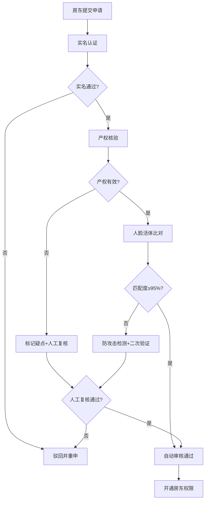
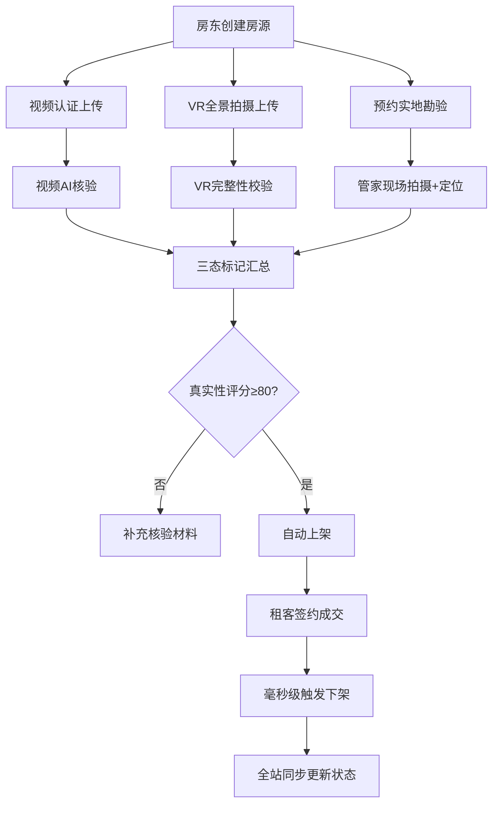
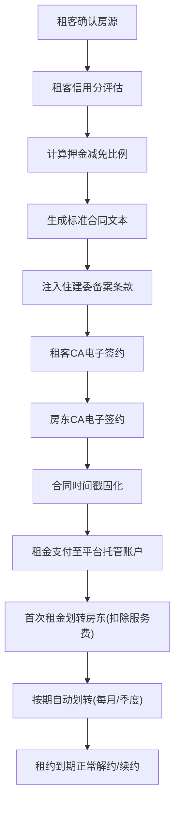

## 1. 产品概述

安居保 - 专业化租房履约保障型SaaS平台，聚焦房源真实性、交易合规性与租后确定性三大核心痛点，打造从房东准入、房源核验、智能匹配、合同签约到租后服务的全链路闭环管理系统。

- 核心价值：通过技术手段建立信任机制，降低租房交易双方的信息不对称风险，保障交易合规、资金安全、服务可溯
- 目标用户：平台运营方、房东业主、租客、管家服务人员、财务结算人员
- 市场定位：面向中长租公寓市场的B2B2C垂直领域SaaS解决方案

## 2. 核心功能

### 2.1 用户角色

| 角色 | 注册方式 | 核心权限 |
|------|----------|----------|
| 超级管理员 | 后台创建 | 系统配置、数据看板、全局权限管理 |
| 审核专员 | 后台创建 | 房东准入审核、房源核验、合规稽查 |
| 财务人员 | 后台创建 | 租金分账、对账结算、发票管理 |
| 房东 | 实名认证+产权核验 | 发布房源、管理租约、查看收益 |
| 租客 | 手机号注册+实名认证 | 搜索房源、在线签约、支付租金、申请服务 |
| 服务管家 | 后台创建 | 工单响应、维修派单、租客服务 |

### 2.2 功能模块

1. **数据看板中心**：核心指标仪表盘、实时数据监控、趋势分析图表
2. **房东准入审核**：实名认证、产权核验、人脸活体比对、准入状态流转
3. **房源真实性管理**：三态标记(视频/VR/实地勘验)、房源状态同步、毫秒级下架机制
4. **智能房源匹配**：通勤距离算法、骑行热力图、租金价格指数模型
5. **合同管理中心**：住建委备案条款、电子签约CA认证、租金托管分账、信用分押金减免
6. **租后服务链路**：管家在线响应、酒店应急安置、维修工单GPS派单、超时自动升级
7. **全链路操作日志**：审计追踪、操作留痕、合规溯源

### 2.3 页面详情

| 页面名称 | 模块名称 | 功能描述 |
|----------|----------|----------|
| 数据看板 | 核心指标卡 | 在租房源数、签约转化率、履约率、投诉率等KPI实时展示 |
| 数据看板 | 趋势图表 | 7天/30天/季度数据走势对比，多维度筛选 |
| 数据看板 | 地图热力分布 | 房源地理分布、成交密度、租金梯度可视化 |
| 房东审核列表 | 筛选搜索 | 按审核状态、提交时间、区域筛选待审核房东 |
| 房东审核详情 | 产权核验 | 房产证号校验、不动产权属信息比对、疑点标记 |
| 房东审核详情 | 人脸活体比对 | 活体检测结果、身份证人脸匹配度评分、防攻击标记 |
| 房源管理列表 | 三态标记 | 视频认证、VR全景、实地勘验三种状态独立标记 |
| 房源管理列表 | 状态同步 | 已租/待租/下架状态，毫秒级同步至前端展示 |
| 房源详情页 | 价格指数 | 小区均价区间、历史成交价走势、同比环比分析 |
| 房源搜索页 | 通勤匹配 | 输入工作地点，按地铁步行时间+骑行时间排序推荐 |
| 房源搜索页 | 骑行热力图 | 周边骑行便捷度可视化叠加图层 |
| 合同列表 | 合同状态 | 待签/已签/履约中/已到期/违约状态管理 |
| 合同详情 | CA电子签约 | 签约流程、证书校验、时间戳固化 |
| 合同详情 | 租金分账 | 平台托管账户、按期划转计划、分账明细 |
| 信用管理 | 租客信用分 | 信用评分维度、押金减免比例计算规则 |
| 服务工单 | 维修派单 | GPS定位就近派单、工程师抢单、超时自动升级 |
| 应急安置 | 触发逻辑 | 不可抗力判定规则、协议自动调用、酒店对接 |
| 操作日志 | 审计追踪 | 全模块操作记录、按人/时间/类型筛选、导出 |

## 3. 核心流程

### 3.1 房东准入审核流程

房东提交注册申请 → 实名认证(身份证+手机号) → 产权核验(房产证+不动产系统比对) → 人脸活体比对(活体检测+身份证照匹配) → 审核专员人工复核 → 准入通过/驳回



### 3.2 房源发布与真实性核验流程

房东创建房源 → 上传基础信息 → 三态核验(视频认证/VR全景/实地勘验) → 真实性评分 → 审核上架 → 签约后毫秒级同步下架



### 3.3 合同签约与履约流程

租客选房 → 信用评估 → 生成合同(含住建委备案条款) → CA电子签约(双方) → 租金托管至平台 → 按期划转房东 → 租后服务保障



### 3.4 租后服务与应急处理流程

租客发起服务请求 → 管家在线响应(SLA计时) → 工单分类(维修/咨询/投诉/应急) → GPS就近派单 → 超时自动升级 → 不可抗力触发应急安置

```mermaid
flowchart TD
    A["租客发起服务请求"] --> B["管家在线响应(≤5分钟)"]
    B --> C["工单分类判定"]
    C --> D["普通维修工单"]
    C --> E["咨询/建议工单"]
    C --> F["应急类工单"]
    D --> G["GPS定位匹配就近工程师"]
    G --> H["工程师抢单/派单"]
    H --> I{"2小时未接单?"}
    I -->|是| J["自动升级至主管+备用池"]
    I -->|否| K["上门服务"]
    F --> L{"不可抗力判定?"}
    L -->|是(火灾/水灾/地震等)| M["自动触发应急安置协议"]
    L -->|否| N["紧急维修处理"]
    M --> O["对接合作酒店系统"]
    O --> P["租客安置+费用结算"]
    K --> Q["服务完成+评价"]
    N --> Q
    E --> R["在线解答处理"]
    R --> Q
```

## 4. 用户界面设计

### 4.1 设计风格

- **主色调**：深海蓝(#0F4C81) - 传达专业、信任、安全感
- **辅助色**：
  - 翡翠绿(#00A86B) - 审核通过、安全、成功状态
  - 警示橙(#FF6B35) - 待处理、预警状态
  - 警示红(#E63946) - 拒绝、异常、高优先级
  - 金色(#D4A574) - 品质、高信用、VIP标识
- **中性色**：烟灰白背景(#F8F9FA)、深炭灰文字(#1A1A2E)、石板灰次级文字(#6B7280)
- **按钮风格**：直角微圆角(4px)、2px描边、悬停微上浮阴影、按下凹陷反馈
- **字体**：
  - 标题字体：Noto Serif SC (宋体衬线体，传达专业严谨)
  - 正文字体：PingFang SC / HarmonyOS Sans (现代无衬线，高可读性)
  - 数字/数据：JetBrains Mono (等宽字体，数据展示清晰对齐)
- **布局风格**：
  - 左侧固定导航栏(可折叠)+ 顶部状态栏 + 右侧主内容区
  - 模块分区采用卡片式布局，卡片标题使用深色分隔条左侧色标
  - 数据表格使用斑马纹+悬停高亮+固定表头
  - 关键指标使用大号数字+Mini Sparkline趋势线组合
- **视觉元素**：
  - 数据看板采用网格仪表盘布局，重要指标居中放大展示
  - 状态流转采用时间轴可视化，关键节点高亮脉冲动画
  - 核验流程采用步骤进度条+完成度圆形进度环
  - 地图模块使用深色底图+暖色热力叠加层

### 4.2 页面设计概览

| 页面名称 | 模块名称 | UI元素 |
|----------|----------|--------|
| 数据看板 | 核心指标区 | 4列2行指标卡网格，大号数据+Mini折线趋势+环比箭头 |
| 数据看板 | 地图热力图 | 深色底图+圆形热力扩散动画+房源点位脉冲标记 |
| 数据看板 | 多维度图表 | 合同履约率环形图、房源分类堆叠柱状图、维修响应SLA甘特图 |
| 房东审核 | 待办列表 | 优先级徽章+申请人头像缩略+核验状态标签+审核倒计时进度条 |
| 房东审核 | 详情侧滑页 | 左右分栏：左为证件材料瀑布流，右为核验结果评分卡 |
| 房东审核 | 活体比对面板 | 左右对比图(证件照/实时抓拍照)+匹配度仪表盘+活体检测指标列表 |
| 房源管理 | 三态标记卡 | 三个圆形状态指示器(灰→绿渐变)+百分比完成度+最近核验时间 |
| 房源管理 | 列表行操作 | 悬浮展开操作按钮组+毫秒级状态同步动画(状态徽章闪烁) |
| 房源搜索 | 通勤筛选器 | 输入工作地→选择交通方式→时间滑块(步行/骑行/驾车) |
| 房源搜索 | 骑行热力图层 | 半透明彩色叠加+路径高亮+时间等值线(10min/15min/20min圈) |
| 合同详情 | 签约时间轴 | 竖向时间轴+节点图标+完成状态对勾+时间戳精确到秒 |
| 合同详情 | 分账计划表格 | 期数列+应转金额+实转金额+状态+操作(查看凭证) |
| 信用管理 | 信用分仪表盘 | 大号半圆仪表盘+评分维度雷达图+历史分趋势 |
| 维修工单 | 派单地图 | 工单位置标红+周边工程师位置+连线距离+ETA预估 |
| 应急安置 | 触发面板 | 不可抗力类型下拉+协议模板选择+酒店对接进度条 |
| 操作日志 | 审计表格 | 操作人/时间/模块/动作/IP/详情/导出筛选器 |

### 4.3 响应式设计

- **桌面端优先**：主内容区最小宽度1280px，采用12列网格系统
- **平板适配**：左侧导航折叠为图标模式，卡片间距紧缩25%
- **移动端适配**：顶部汉堡菜单，表格转卡片列表，图表简化为核心数据
- **触控优化**：操作按钮最小高度44px，列表项增加点击反馈波纹效果

### 4.4 交互与动效

- **页面加载**：骨架屏渐入→内容交错延迟出现(50ms级差)→指标数字滚动动画
- **状态变化**：通过/拒绝等关键操作为徽章脉冲闪烁动画+Toast通知滑入
- **审批流转**：节点完成时触发勾号绘制动画→连线流光效果→下一节点高亮
- **数据更新**：实时数据区域边框呼吸灯效果(每30秒一次淡入淡出)
- **悬浮交互**：卡片悬浮微上浮(translateY -4px)+投影加深+边框高亮
- **地图交互**：热力图层随缩放动态调整透明度，点位点击弹出信息卡片
