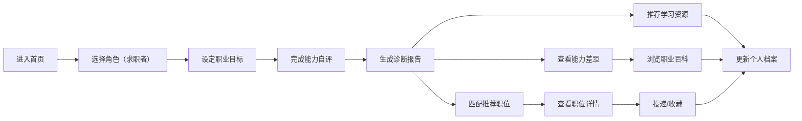
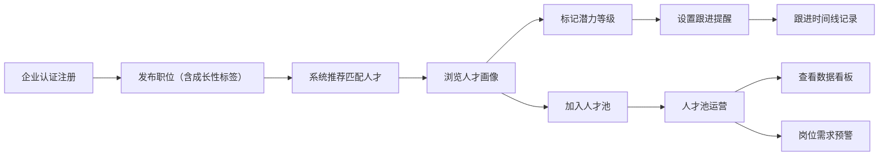

## 1. 产品概述

新一代垂直领域求职匹配系统，以「职业发展导向」为核心，打破传统职位撮合模式，通过职业能力图谱、成长性评估、智能匹配算法，帮助求职者规划职业路径，助力企业发掘高潜力人才。

- **核心价值**：从「找工作」升级为「规划职业人生」，从「招到人」升级为「招到可成长的人」
- **目标用户**：求职者（应届生/职场人）、企业HR、招聘负责人

## 2. 核心功能

### 2.1 用户角色

| 角色 | 注册方式 | 核心权限 |
|------|----------|----------|
| 求职者 | 邮箱/手机号注册 | 职业目标设定、能力诊断、职位搜索、职业百科浏览、个人成长档案 |
| HR招聘者 | 企业认证注册 | 职位发布、人才池运营、潜力人才标记、跟进提醒、岗位需求预警 |
| 系统管理员 | 后台登录 | 职业图谱维护、认证审核、数据统计 |

### 2.2 功能模块

1. **首页（Landing）**：价值主张展示、角色入口、核心功能预览、热门岗位趋势
2. **职业目标设定**：行业/岗位选择、目标职级、期望薪资地点、能力自评问卷
3. **能力差距诊断报告**：胜任力雷达图、硬技能树差距、软技能维度分析、认证推荐、晋升路径可视化
4. **职位智能匹配**：成长性标签筛选、显性条件过滤、隐性信号展示、匹配度评分、双向推荐
5. **职业百科**：岗位工作流视频、从业者访谈音频、入行门槛阶梯图、行业认证资料库
6. **HR控制台**：人才池看板、潜力标签管理、跟进日程、岗位需求变化预警、数据报表
7. **个人成长档案**：能力时间轴、学习任务追踪、成就徽章、面试记录

### 2.3 页面详情

| 页面名称 | 模块名称 | 功能描述 |
|---------|---------|----------|
| 首页 | Hero主视觉 | 动态价值主张、角色切换入口、CTA按钮 |
| 首页 | 核心能力图谱预览 | 交互式3D能力星球、热门岗位能力概览 |
| 首页 | 数据统计展示 | 覆盖岗位数、企业数、成功匹配案例 |
| 职业目标设定 | 目标岗位选择器 | 三级联动（行业→领域→具体岗位），支持搜索 |
| 职业目标设定 | 能力自评问卷 | 硬技能自评滑块、软技能场景选择题、工作经历采集 |
| 职业目标设定 | 期望条件面板 | 薪资范围、城市多选、公司规模、行业偏好 |
| 能力诊断报告 | 胜任力总览 | 六维雷达图（当前 vs 目标）、综合差距百分比 |
| 能力诊断报告 | 硬技能差距树 | 技能树展开/折叠，已掌握高亮，待学习标记优先级 |
| 能力诊断报告 | 软技能分析 | 维度条形图、典型行为描述、改进建议 |
| 能力诊断报告 | 晋升路径图 | 时间轴式路径节点，每节点能力要求与周期预估 |
| 能力诊断报告 | 学习资源推荐 | 认证考试、在线课程、项目实战建议 |
| 职位列表 | 智能搜索栏 | 关键词、成长性标签组合筛选器 |
| 职位列表 | 职位卡片 | 成长性徽章、匹配度分数、隐性信号标签（博客活跃度等） |
| 职位详情 | 能力对齐分析 | 岗位要求 vs 个人能力，对齐度可视化 |
| 职位详情 | 成长性信息 | 培训体系、轮岗计划、技术栈演进路线图 |
| 职位详情 | 隐性信号面板 | 技术博客频率、开源贡献、职级分布健康度图表 |
| 职业百科 | 岗位分类导航 | 左侧目录树，支持搜索过滤 |
| 职业百科 | 岗位详情 | 工作流视频嵌入、音频播放器、入行阶梯图、薪资分布 |
| 职业百科 | 从业者访谈 | 标签筛选（年限/行业/职级）、卡片式展示 |
| HR控制台 | 数据看板 | 人才池规模、跟进状态分布、匹配成功率趋势 |
| HR控制台 | 人才池列表 | 潜力标签、匹配度、上次跟进时间、快捷操作 |
| HR控制台 | 人才详情 | 能力画像、成长潜力评估、跟进时间线记录 |
| HR控制台 | 岗位预警面板 | 招聘周期预警、竞争力变化、需求调整建议 |
| 个人成长档案 | 能力时间轴 | 历次诊断对比、能力提升曲线 |
| 个人成长档案 | 学习任务中心 | 待完成任务、进度条、成就徽章墙 |

## 3. 核心流程

### 求职者主流程

求职者进入首页，选择角色后设定职业目标，完成能力自评问卷，系统生成能力差距诊断报告。基于诊断结果，系统智能匹配带有成长性标签的职位，并推荐学习资源。求职者可浏览职业百科深入了解岗位，同时个人成长档案持续追踪能力提升。

### HR招聘者主流程

HR注册企业认证后，发布带有成长性标签的职位，系统自动推荐匹配人才。HR可标记潜力人才、设置跟进提醒，通过数据看板监控招聘效能，岗位预警面板提示需求调整。

## 4. 用户界面设计

### 4.1 设计风格

- **主色调**：深空靛蓝 `#1E3A5F`（专业与信任感）、翡翠绿 `#10B981`（成长与希望）
- **辅助色**：琥珀金 `#F59E0B`（预警/强调）、薰衣草紫 `#8B5CF6`（潜力/创新）
- **中性色**：炭黑灰阶 `#0F172A` ~ `#F8FAFC`，保证可读性
- **按钮风格**：圆角 8px，悬停微上浮 + 阴影加深，主按钮渐变色
- **字体**：标题用 "Space Grotesk"（几何未来感），正文用 "Noto Sans SC"（中文可读性）
- **布局风格**：卡片式 + 数据可视化驱动，大量留白与呼吸感
- **图标风格**：Lucide 线性图标 + 自定义徽章系统，微交互动画

### 4.2 页面设计概述

| 页面名称 | 模块名称 | UI元素 |
|---------|---------|--------|
| 首页 | Hero主视觉 | 渐变背景 + 3D能力星球动效，双角色切换Tab，渐变色CTA |
| 首页 | 核心能力图谱 | 交互式节点网络图，悬停放大，连线动画 |
| 职业目标设定 | 选择器 | 三级联动卡片流，选中态绿色描边 + 阴影 |
| 职业目标设定 | 自评问卷 | 滑块组件带刻度，选项卡动效切换，进度条顶部 |
| 能力诊断报告 | 雷达图 | 双色叠加（当前/目标），数据标签，图例交互 |
| 能力诊断报告 | 技能树 | 树形展开动画，节点状态徽章，优先级标签 |
| 能力诊断报告 | 晋升路径 | 横向时间轴，节点圆形徽章，连接线渐变 |
| 职位列表 | 卡片 | 成长标签徽章组，匹配度环形进度条，隐性信号Tag |
| 职业百科 | 工作流 | 视频缩略图播放按钮，音频波形播放器，阶梯SVG图 |
| HR控制台 | 看板 | 数据卡片网格，趋势迷你图，预警红/黄点，甘特图式跟进时间线 |

### 4.3 响应式

- **设计策略**：Desktop-first，断点 1280px / 1024px / 768px / 480px
- **桌面端**：1440px 最优，双栏/三栏布局，数据可视化完整展示
- **平板端**：1024px 折叠为双栏，侧边栏变抽屉
- **移动端**：768px 以下单列，卡片紧凑，图表自适应缩放，底部Tab导航
- **触摸优化**：最小点击区域 44x44px，滑动手势支持，禁用文字选中

### 4.4 3D场景与动效

- **首页能力星球**：粒子聚合形成3D球体，节点按能力维度分布颜色，鼠标拖拽旋转
- **能力雷达图过渡**：首次加载数据点依次弹出（stagger 0.1s），更新时平滑过渡
- **卡片悬停**：translateY -4px + 阴影扩散 + 轻微发光
- **页面切换**：淡入 + 从下轻微上浮，stagger 显示子元素
- **徽章系统**：获得新徽章时触发缩放弹跳动画 + 光晕效果
