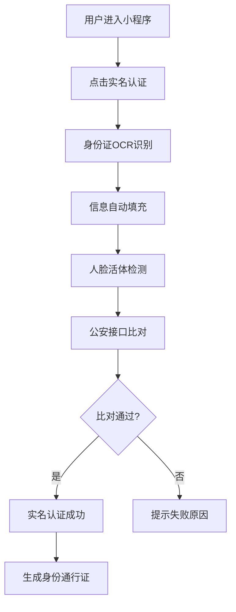
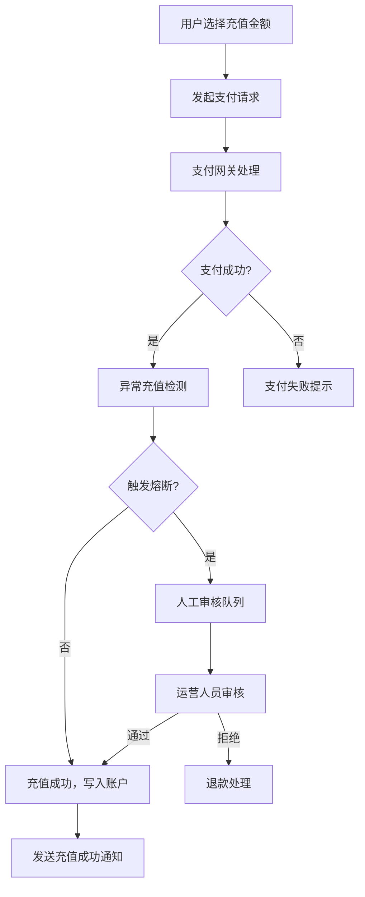
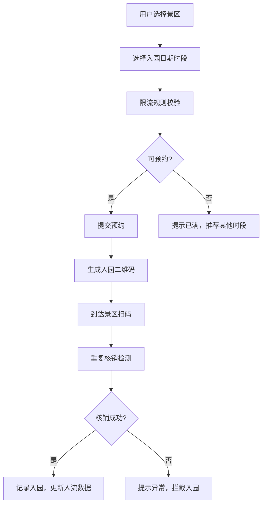

## 1. 产品概述

苏州城市数字服务中台是一个面向苏州市民的一站式城市服务平台，以市民身份主干为统一入口，整合交通、文旅、企业服务、商业服务四大业务域，打造多端一致的数字城市服务生态。

- **核心目标**：构建城市级数字服务中台，实现市民身份统一认证、业务数据互联互通、服务能力统一调度
- **目标用户**：苏州市民（个人用户）、中小微企业（企业用户）、政府运营管理人员（管理用户）、景区/商户（合作方用户）
- **市场价值**：提升城市服务效率，优化市民体验，推动数字政府建设，助力长三角一体化发展

## 2. 核心功能

### 2.1 用户角色

| 角色 | 注册方式 | 核心权限 |
|------|----------|----------|
| 市民用户 | 实名认证+身份核验 | 使用交通、文旅、商业服务等个人服务 |
| 企业用户 | 企业资质认证 | 政策申领、补贴申报、证照协办 |
| 运营管理员 | 后台授权 | 系统配置、数据看板、运营管理 |
| 景区管理员 | 景区入驻审核 | 景区预约管理、限流规则配置、入园核验 |
| 商户管理员 | 商户入驻审核 | 优惠券管理、核销管理、积分配置 |

### 2.2 功能模块

#### 身份主干模块
1. **实名认证**：身份证OCR识别、人脸比对、活体检测
2. **卡证绑定**：电子社保卡、医保卡、驾驶证等电子证照绑定
3. **生物核验**：指纹、人脸、声纹等生物特征可选核验
4. **身份通行证**：统一身份认证、跨域单点登录

#### 交通业务域
1. **NFC虚拟交通卡**：开通、充值、挂失、销户
2. **全国一卡通对接**：对接全国300+城市一卡通平台
3. **同城化折扣**：苏锡常同城化折扣策略配置与实时结算
4. **交易记录**：乘车记录、充值记录、消费明细

#### 文旅业务域
1. **景区预约**：分时预约、入园时段选择
2. **扫码核验**：入园二维码生成、扫码核验API
3. **多景区运营**：独立景区后台、权限隔离
4. **动态限流**：实时人流监控、限流规则配置

#### 企业服务域
1. **政策申领**：政策智能匹配、在线申报、进度追踪
2. **补贴申报**：补贴资格核验、材料上传、审批流程
3. **证照协办**：电子证照申请、材料预审、进度查询
4. **流程引擎**：可视化流程配置、审批节点管理

#### 商业服务域
1. **商户入驻**：资质审核、信息录入、签约管理
2. **优惠券管理**：券模板配置、发放策略、核销记录
3. **积分互通**：积分发放、消费、兑换、跨商户互通

#### 平台能力模块
1. **政务云网关**：市级数据中枢对接、API路由、权限控制
2. **操作审计**：敏感操作留痕、审计日志、合规报告
3. **熔断机制**：异常充值检测、重复核销拦截、风险控制
4. **运营看板**：按行政区划的多维度数据可视化、热力图、TOP排行

### 2.3 页面详情

#### Web管理台页面
| 页面名称 | 模块名称 | 功能描述 |
|---------|----------|---------|
| 登录页 | 身份认证 | 管理员登录、双因素认证、忘记密码 |
| 首页看板 | 运营总览 | 关键指标卡片、实时数据趋势、快捷入口 |
| 市民管理 | 身份主干 | 市民列表、实名认证审核、卡证管理 |
| 企业管理 | 企业服务 | 企业列表、资质审核、申报记录 |
| 交通管理 | 交通业务 | 交通卡管理、交易记录、折扣策略 |
| 文旅管理 | 文旅业务 | 景区管理、预约记录、限流配置 |
| 商户管理 | 商业服务 | 商户列表、入驻审核、优惠券管理 |
| 数据看板 | 运营分析 | 行政区热力图、景区入园热力、交通TOP10 |
| 系统管理 | 平台能力 | 角色权限、审计日志、熔断规则 |

#### 小程序端页面
| 页面名称 | 页面类型 | 功能描述 |
|---------|----------|---------|
| 首页 | TabBar | 服务入口、快捷功能、消息通知 |
| 交通卡 | TabBar | 虚拟交通卡、充值、乘车码、交易记录 |
| 文旅 | TabBar | 景区列表、预约、入园码、我的预约 |
| 服务 | TabBar | 企业服务、政策查询、证照办理 |
| 我的 | TabBar | 个人信息、卡证管理、设置 |
| 实名认证页 | 二级页面 | 身份信息录入、人脸核验、认证结果 |
| 卡证绑定页 | 二级页面 | 社保卡/医保卡绑定、电子证照列表 |
| 景区详情页 | 二级页面 | 景区介绍、预约时段选择、预约确认 |
| 预约成功页 | 二级页面 | 预约信息展示、入园二维码 |
| 充值页 | 二级页面 | 金额选择、支付方式、充值结果 |

## 3. 核心流程

### 3.1 市民实名认证流程

### 3.2 交通卡充值流程

### 3.3 景区预约入园流程

## 4. 用户界面设计

### 4.1 设计风格

**整体风格**：现代简约·科技感·城市温度

- **主色调**：姑苏蓝 `#1E4D8C` - 体现苏州江南水乡的深邃与现代科技的稳重
- **辅助色**：园林绿 `#2D9D72` - 象征苏州园林的生机与文旅特色
- **点缀色**：太湖金 `#E8A838` - 呼应苏州丝绸文化的精致与活力
- **背景色**：页面 `#F5F7FA` / 卡片 `#FFFFFF`
- **文本色**：主要 `#1A1A2E` / 次要 `#4A5568` / 辅助 `#A0AEC0`
- **边框色**：`#E2E8F0`

**按钮风格**：
- 主按钮：圆角 8px，渐变背景，微阴影，悬停时上浮 2px
- 次按钮：圆角 8px，描边样式，悬停时背景色变化
- 危险按钮：红色系 `#E53E3E`

**字体**：
- 中文：PingFang SC / 思源黑体
- 数字：Inter / Roboto Mono
- 层级：标题 20px/24px，正文 14px/16px，辅助 12px

**布局风格**：
- 卡片式设计，圆角 12px，柔和阴影
- 充足留白，8px 网格系统
- 分层设计，通过阴影和边框区分层级

### 4.2 页面设计概述

| 页面名称 | 模块名称 | UI元素 |
|---------|----------|--------|
| 管理台首页 | 运营总览 | 渐变顶部导航、数据卡片网格、趋势折线图、快捷操作区 |
| 市民管理 | 身份主干 | 搜索筛选栏、数据表格、状态标签、分页控件 |
| 数据看板 | 运营分析 | 左侧行政区划树、右侧多图表布局、热力图组件、TOP排行卡片 |
| 小程序首页 | 服务入口 | 轮播Banner、功能网格宫格、消息通知条、热门服务推荐 |
| 交通卡页 | 交通业务 | 拟物化卡面设计、充值/乘车码快捷按钮、交易记录列表 |
| 文旅页 | 文旅业务 | 景区卡片列表、筛选标签栏、预约状态角标 |

### 4.3 响应式

- **Web管理台**：Desktop-first，支持 1280px 以上分辨率，侧边栏可折叠
- **小程序端**：移动端优先，适配 375px-430px 主流机型，支持横屏展示
- **触控优化**：最小点击区域 44x44px，按钮间距 8px 以上

### 4.4 数据可视化规范

- **热力图**：采用蓝-绿-黄-红渐变色阶，支持时间轴动态播放
- **折线图**：平滑曲线，数据点高亮，悬停展示详情
- **柱状图**：圆角顶部，渐变填充，支持分组对比
- **地图**：苏州行政区划轮廓，支持下钻到区县/街道层级
