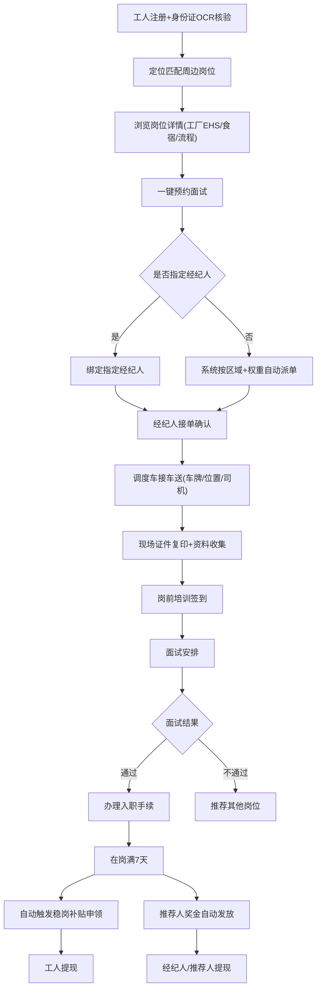
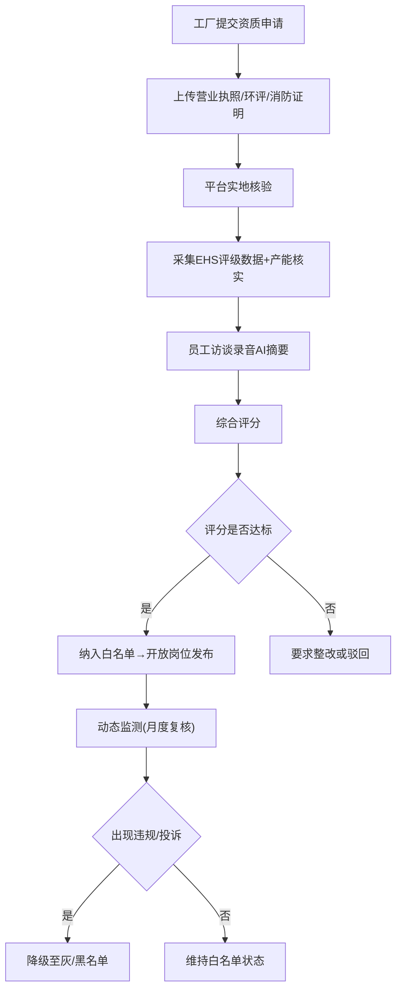

# 蓝领普工就业服务协同平台 产品需求文档

## 1. 产品概述
聚焦长三角制造业密集区的蓝领普工就业服务协同平台，打通工厂、工人、经纪人三方链路，提供从找岗、面试、入职到在岗的全流程数字化服务。
- 核心解决：长三角制造业用工需求与蓝领工人求职信息不对称、服务链条不透明、履约风险难管控等痛点
- 目标用户：制造业工厂HR、蓝领普工求职者、人力资源服务经纪人
- 市场价值：提升用工匹配效率30%+，降低工人流失率，建立可追溯的信用评价体系

## 2. 核心功能

### 2.1 用户角色
| 角色 | 注册方式 | 核心权限 |
|------|----------|----------|
| 工厂用户 | 企业资质审核注册 | 发布岗位、实地核验、查看应聘、发放补贴 |
| 工人用户 | 手机号+身份证OCR实名 | 搜索岗位、预约面试、查看入职进度、领取补贴 |
| 经纪人 | 实名认证+区域绑定 | 接单调度、车接车送、培训签到、服务评价 |
| 平台管理员 | 后台账号 | 工厂白名单审核、信用分管理、异常预警、数据看板 |

### 2.2 功能模块
1. **工人端首页**：岗位推荐、定位匹配、热门岗位搜索、快捷预约入口
2. **岗位详情页**：岗位信息、工厂EHS评级、食宿条件、进厂流程、一键预约
3. **工厂详情页**：工厂信息、EHS评级、真实产能、员工访谈摘要、在招岗位
4. **面试/入职进度页**：面试预约、车接调度、证件复印、培训签到、入职状态
5. **经纪人工作台**：待接订单、调度中心、服务记录、评价看板
6. **管理后台**：工厂白名单、工人信用分、异常离职预警、区域用工热力图

### 2.3 页面详情
| 页面名称 | 模块名称 | 功能描述 |
|----------|----------|----------|
| 工人端首页 | 定位匹配卡 | 基于GPS自动匹配周边50km内空缺岗位，支持距离/薪资/好评排序 |
| 工人端首页 | 热门岗位区 | 展示高补贴/急招/大厂岗位卡片，含薪资、厂名、福利标签 |
| 工人端首页 | 快捷操作区 | 一键预约面试、我的简历、入职进度、补贴申领入口 |
| 岗位详情页 | 岗位信息卡 | 工时规则、加班倍率、食宿条件、进厂流程节点时间线 |
| 岗位详情页 | 工厂信息区 | EHS评级徽章、产能数据、员工访谈摘要、在招岗位列表 |
| 岗位详情页 | 预约面板 | 选择面试日期、填写基本信息、关联经纪人（可选） |
| 工厂详情页 | EHS评级区 | A/B/C/D评级可视化、近12个月安全记录、合规证明 |
| 工厂详情页 | 真实产能区 | 日均产量、产能利用率折线图、淡旺季说明 |
| 工厂详情页 | 员工访谈摘要 | AI摘要标签、关键关键词、满意度星级 |
| 面试进度页 | 流程时间线 | 预约确认→车接安排→现场签到→面试→入职/不通过 |
| 面试进度页 | 经纪人调度 | 车牌信息、司机联系方式、实时位置、服务评价 |
| 入职在岗页 | 入职签到 | 证件复印确认、岗前培训签到、工牌领取确认 |
| 入职在岗页 | 补贴申领 | 稳岗补贴自动触发进度、推荐奖金记录、提现入口 |
| 经纪人工作台 | 待接订单 | 订单卡片（距离、服务费、优先级权重）、一键接单 |
| 经纪人工作台 | 调度中心 | 车接车送排班、证件复印任务、培训签到核销 |
| 经纪人工作台 | 服务评价 | 近30天评分、评价标签、月度排名权重 |
| 管理后台-白名单 | 准入审核 | 工厂资质上传、实地核验照片、EHS初评、审批流 |
| 管理后台-白名单 | 动态管控 | 白名单/灰名单/黑名单切换、风险原因标注 |
| 管理后台-信用分 | 信用看板 | 工人信用分分布、评分维度（履约/出勤/纪律） |
| 管理后台-信用分 | 分数字段 | 历史履约记录、异常行为扣分、加分规则说明 |
| 管理后台-预警 | 离职预警 | 异常离职趋势Top10工厂、风险系数、预警建议 |
| 管理后台-预警 | 离职详情 | 离职原因聚类、工人访谈关键词、关联岗位分析 |
| 管理后台-热力图 | 用工饱和度 | 长三角区县级别热力图、红/黄/绿饱和度等级 |
| 管理后台-热力图 | 供需洞察 | 岗位空缺数、求职人数、薪资趋势柱状对比 |

## 3. 核心流程

### 3.1 找岗-面试-入职全链路流程
工人注册并完成身份证OCR核验后，基于定位匹配周边岗位，选择心仪岗位一键预约面试；系统自动分配或工人指定经纪人，经纪人调度车接车送、现场证件复印、组织岗前培训签到；工人入职满7天后自动触发稳岗补贴申领，推荐人同时获得推荐奖金。

### 3.2 工厂白名单准入流程

## 4. 用户界面设计

### 4.1 设计风格
- **主色调**：工业蓝 `#1E3A5F`（信任、专业）搭配活力橙 `#FF7A00`（行动、温暖）
- **辅助色**：安全绿 `#10B981`（合规、通过）、警示黄 `#F59E0B`（预警）、风险红 `#EF4444`
- **中性色**：深灰 `#1F2937`、中灰 `#6B7280`、浅灰 `#F3F4F6`、纯白 `#FFFFFF`
- **按钮风格**：圆角8px，主按钮带微阴影，hover时轻微上浮（translateY(-1px)）+阴影加深
- **字体**：中文使用「思源黑体」/「PingFang SC」，数字和英文使用「JetBrains Mono」；标题20-28px Bold，正文14-16px Regular，辅助文字12px
- **布局风格**：卡片式布局为主，管理后台采用左侧导航+顶部状态栏+主内容区三栏式
- **图标风格**：Lucide线性图标，尺寸18-24px，关键数据搭配emoji增强辨识度

### 4.2 页面设计概览
| 页面名称 | 模块名称 | UI元素 |
|----------|----------|----------|
| 工人端首页 | 定位匹配卡 | 渐变背景卡片、位置emoji📍、薪资数字大号高亮、滑动切换动画 |
| 工人端首页 | 热门岗位区 | 白色圆角卡片网格、工厂Logo占位、薪资范围突出、福利标签彩色胶囊 |
| 工人端首页 | 快捷操作区 | 四宫格图标按钮、渐变色图标背景、点击缩放反馈 |
| 岗位详情页 | 岗位信息卡 | 分块信息面板、工时/加班/食宿用图标+文字组合、流程节点垂直时间线 |
| 岗位详情页 | EHS评级区 | A/B/C/D大字母徽章、评级圆环进度条、安全记录横向时间轴 |
| 岗位详情页 | 预约面板 | 固定底部悬浮栏、主按钮满宽、日期选择横向滚动卡片 |
| 经纪人工作台 | 待接订单 | 卡片左侧服务权重星级、右上角距离标签、底部接单按钮 |
| 经纪人工作台 | 调度中心 | 日历视图+时间轴、车接/复印/培训不同颜色标识 |
| 管理后台-热力图 | 饱和度地图 | SVG长三角轮廓、区县色块填充、悬停显示详情浮层、图例 |
| 管理后台-预警 | 离职预警 | Top10列表卡、风险等级进度条、趋势迷你折线图 |

### 4.3 响应式
- **桌面优先**：管理后台、工厂端以桌面端为主要设计基准（1440px宽度优化）
- **移动适配**：工人端和经纪人端以移动端为主（375px基准），通过Tailwind断点适配平板
- **触摸优化**：移动端主按钮高度≥48px，卡片间距12px以上，列表项点击区域充足
