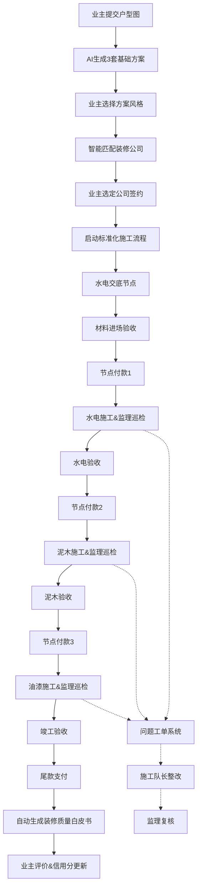
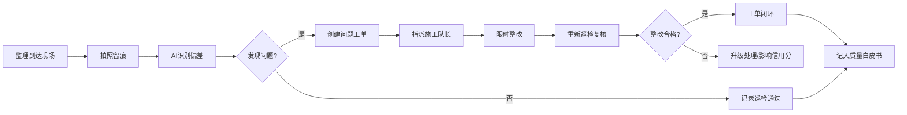

# 装修服务全链路管控平台 产品需求文档 (PRD)

## 1. 产品概述

装修服务全链路管控平台是连接业主、装修公司、第三方监理、建材商四方的产业互联网平台，通过AI技术、标准化流程和数据驱动，实现装修全流程透明化、品质可控化、决策数据化。

- **核心价值**：解决装修行业信息不对称、施工品质不可控、交付延期普遍、材料价格不透明等痛点
- **目标用户**：装修业主、装修公司/施工队、第三方监理机构、建材供应商
- **市场定位**：国内领先的装修产业数字化服务平台，覆盖家装全生命周期

## 2. 核心功能

### 2.1 用户角色

| 角色 | 注册方式 | 核心权限 |
|------|----------|----------|
| 业主 | 手机号/微信注册 | 提交户型图、选择方案/公司、查看施工进度、支付节点款、申请监理、查看质量白皮书 |
| 装修公司 | 企业资质认证 | 接收订单、管理施工流程、提交报价、管理施工队长、维护企业信用 |
| 第三方监理 | 机构认证+个人资质 | 拍照留痕、问题工单、巡检记录、生成验收报告、参与质量白皮书 |
| 建材商 | 企业资质认证 | 维护SKU、处理订单、对接API、库存管理 |
| 平台管理员 | 后台账号 | 信用分管理、AI巡检配置、数据分析、案例管理、系统配置 |

### 2.2 功能模块

1. **业主端**：户型图上传、AI方案生成、装修公司选择、施工进度追踪、节点支付、监理预约、质量白皮书、案例检索
2. **装修公司端**：订单管理、施工流程管控、报价系统、施工队长管理、信用分看板、材料下单
3. **监理端**：巡检任务、拍照留痕、问题工单、验收记录、AI巡检辅助
4. **建材商端**：SKU管理、订单处理、库存同步、API对接管理
5. **后台管理**：信用分动态管理、AI巡检配置、业主决策分析、案例图谱、数据看板

### 2.3 页面详情

| 页面名称 | 模块名称 | 功能描述 |
|-----------|-------------|---------------------|
| 业主首页 | 导航栏/搜索/Banner/推荐案例/快捷入口 | 展示平台核心服务，支持案例快速检索 |
| 户型图提交 | 上传区域/AI生成/方案对比/风格选择 | 支持图片/PDF/DWG上传，AI生成3套基础方案 |
| AI方案详情 | 3D效果图/平面布局/预算估算/材料清单 | 交互式方案展示，支持修改和对比 |
| 装修公司列表 | 筛选/信用分展示/案例展示/报价对比 | 按信用分、地域、价格等多维度筛选 |
| 施工进度页 | 时间轴/节点状态/材料验收/付款节点 | 可视化施工全流程，实时更新进度 |
| 监理工作台 | 巡检任务列表/拍照上传/工单创建/验收记录 | 移动端优先，支持离线拍照 |
| 工单系统 | 问题描述/照片/责任方/整改时限/跟进记录 | 问题直连施工队长，闭环管理 |
| 质量白皮书 | 材料检测报告/工艺验收影像/监理记录/竣工图 | 自动生成，PDF导出，永久存档 |
| 案例图谱 | 户型筛选/预算区间/风格标签/地域聚类 | 100万+案例可视化检索，图谱化展示 |
| 报价明细 | 96项费用清单/国标工艺说明/材料对应 | 穿透式报价，每项费用可追溯工艺标准 |
| 信用分管理 | 评分模型/动态计算/历史趋势/奖惩记录 | 投诉率/工期延误率/整改率多维度 |
| AI巡检 | 图纸比对/偏差识别/自动预警/巡检报告 | 现场照片与设计图纸AI比对识别 |
| 决策分析 | 方案修改轨迹/报价对比热力图/监理介入节点 | 业主决策路径全链路分析 |

## 3. 核心流程

### 3.1 装修全流程

业主提交户型图 → AI生成3套基础方案 → 业主浏览并选择方案 → 匹配推荐装修公司 → 业主选定公司签约 → 启动标准化施工流程（水电交底→水电验收→泥木施工→泥木验收→油漆施工→油漆验收→竣工验收）→ 监理全过程拍照留痕+问题工单 → 各阶段节点付款 → 竣工自动生成装修质量白皮书 → 业主评价与信用分更新

### 3.2 流程图

### 3.3 监理巡检与工单流程

## 4. 用户界面设计

### 4.1 设计风格

- **主色调**：深墨蓝 (#1a365d) - 传递专业、信赖、品质感
- **辅助色**：暖金色 (#d4a574) - 用于重要操作按钮、强调元素，象征温暖家园
- **点缀色**：翡翠绿 (#10b981) - 表示通过、合格、进展顺利；珊瑚红 (#f87171) - 表示问题、告警、需关注
- **中性色**：从 #f8fafc 到 #0f172a 的九级灰度体系
- **按钮风格**：微圆角 (8px)，轻微悬浮阴影，主按钮采用渐变质感
- **字体**：标题使用 "Noto Serif SC" 宋体展现品质感，正文使用 "PingFang SC" 保证可读性
- **布局风格**：卡片式布局，清晰的信息层级，大量留白凸显专业感
- **图标风格**：线性图标，2px描边，与整体精致风格统一

### 4.2 设计原则

- **专业可信赖**：深色系主色调，严谨的布局，数据可视化清晰准确
- **温暖人文**：暖金色点缀，真实装修案例图片，人性化文案
- **透明可控**：进度可视化、价格透明化、过程留痕可追溯
- **高效便捷**：关键操作路径最短，移动端优先的监理端设计

### 4.3 页面设计概览

| 页面名称 | 模块名称 | UI元素 |
|-----------|-------------|-------------|
| 业主首页 | Hero区域 | 大背景图+渐变遮罩，搜索框悬浮，动态数据展示 |
|  | 快捷入口 | 4个核心功能图标卡片，hover微动效 |
|  | 推荐案例 | 瀑布流卡片布局，悬浮显示关键信息 |
|  | 信用排行榜 | 装修公司TOP10，带动画进度条 |
| AI方案页 | 方案对比 | 三栏并列布局，支持切换对比维度 |
|  | 3D预览 | 交互式全景图，热点标记材料信息 |
|  | 预算明细 | 折叠式费用清单，96项逐层展开 |
| 施工进度页 | 时间轴 | 垂直时间轴，节点状态用颜色区分 |
|  | 监理日志 | 照片墙布局，按时间倒序排列 |
|  | 付款节点 | 进度条+金额标注，未解锁节点置灰 |
| 监理工作台 | 任务卡片 | 大尺寸卡片，突出地址和时间 |
|  | 拍照区域 | 模拟相机取景框，实时AI检测提示 |
|  | 工单列表 | 左右分栏，状态标签色彩鲜明 |
| 质量白皮书 | 封面 | 烫金效果，项目信息浮雕式排版 |
|  | 目录导航 | 侧边悬浮目录，滚动高亮 |
|  | 影像资料 | 时间轴照片墙，支持放大查看 |
| 数据看板 | 图表网格 | 多种图表类型组合，支持钻取 |
|  | 信用分趋势 | 折线图+事件标记，可缩放时间范围 |
|  | 决策路径 | 桑基图/漏斗图，展示业主决策轨迹 |

### 4.4 响应式设计

- **设计原则**：Desktop-first，移动端自适应优化
- **断点设计**：
  - 桌面端：≥ 1280px，四栏布局
  - 平板端：768px - 1279px，两栏布局
  - 移动端：< 768px，单栏堆叠，底部tab导航
- **移动端优化**：监理端重点优化触控操作，拍照上传功能，支持离线缓存
- **触控目标**：移动端按钮最小 44x44px，确保可点击区域充足

### 4.5 动效与交互

- **页面切换**：淡入+轻微上移动画，staggered列表项依次出现
- **进度更新**：进度条平滑过渡，数字滚动计数效果
- **卡片悬浮**：轻微上浮 + 阴影加深，过渡时间 200ms
- **状态变化**：问题工单状态变更时，色彩渐变+缩放反馈
- **数据加载**：骨架屏占位，内容渐进式加载
