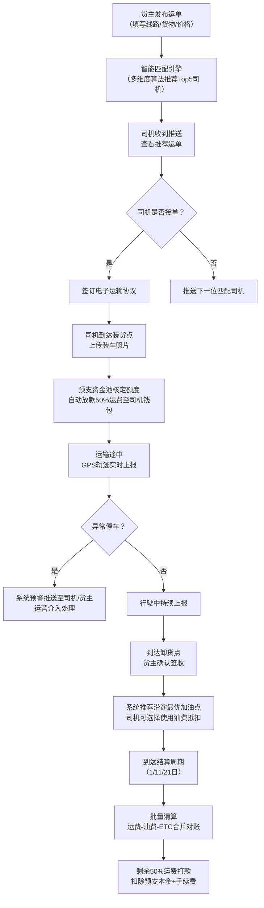
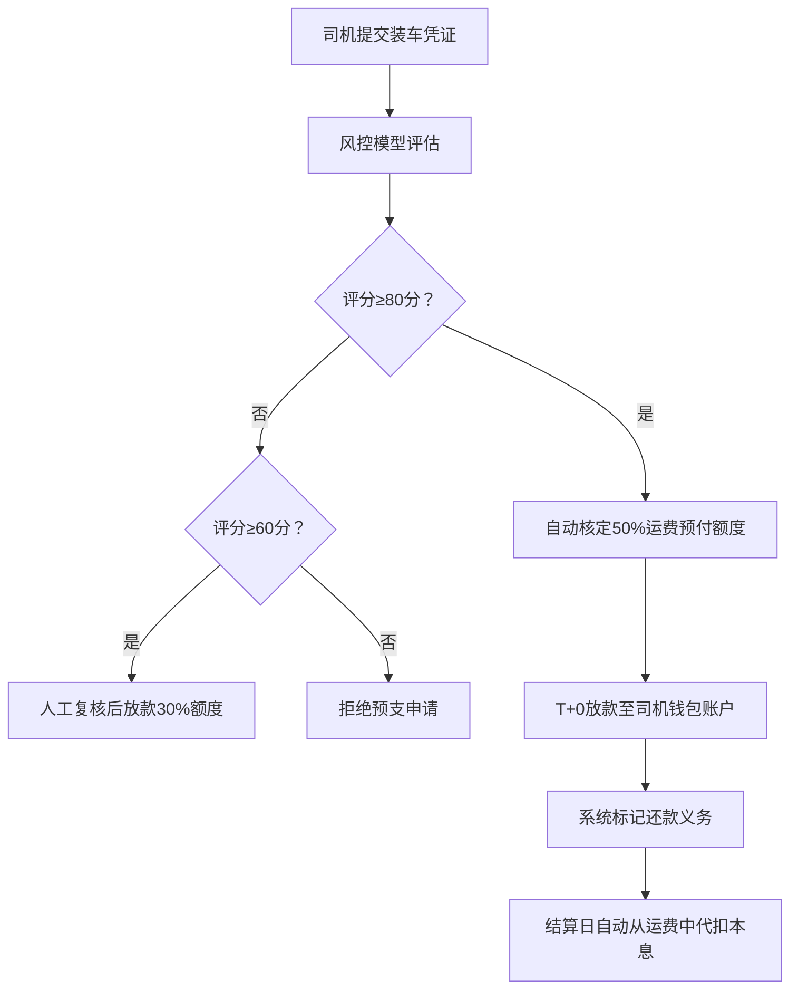

# 货运撮合与运力金融服务平台 PRD

## 1. 产品概述

面向中重型货车司机的货运撮合与运力金融一站式服务平台，解决行业返程空驶率高（>40%）、运费结算周期长（平均35天）、加油成本占比高（30-40%）三大核心痛点。通过AI智能匹配引擎撮合货主与司机，结合装车预支资金池、多周期结算体系与油气站联盟网络，构建"运输+金融+能源"闭环生态。

- **核心目标**：降低空驶率至20%以下，运费结算T+0预付50%，加油成本降低8-15%
- **目标用户**：中重型货车司机（个体/车队）、生产制造/商贸企业货主、物流公司

---

## 2. 核心功能

### 2.1 用户角色

| 角色 | 注册方式 | 核心权限 |
|------|----------|----------|
| 司机端 | 手机号+驾驶证+行驶证+营运证三证认证 | 接单运输、轨迹上报、预支申请、加油优惠、运费结算 |
| 货主端 | 营业执照+法人实名认证 | 发布运单、司机匹配、信用评价、批量结算、资金管理 |
| 运营端 | 后台账号分配 | 订单风控审核、油站联盟管理、资金池监控、系统配置 |

### 2.2 功能模块

1. **司机端工作台**：推荐运单列表、在途状态、资金账户、附近油站、异常预警
2. **货主端工作台**：运单发布、智能匹配推荐、在途追踪、批量对账、信用看板
3. **智能匹配引擎**：多维度双向匹配算法、线路成交价预测、信用评分体系
4. **装车预支资金池**：风控额度核定、T+0放款、资金流水、还款代扣
5. **多周期结算中心**：1/11/21日批量清算、运费-油费-ETC合并对账、发票管理
6. **油气站联盟网络**：3万+站点地图、优惠价目表、里程智能推荐、核销管理
7. **行车轨迹系统**：GPS实时上报、异常停车预警、热力图分析、行程回放
8. **运营管理后台**：风控审核、资金监控、油站维护、数据看板、用户管理

### 2.3 页面详情

| 页面名称 | 模块名称 | 功能描述 |
|----------|----------|----------|
| 司机端首页 | 推荐运单卡片 | 按位置/线路/价格智能排序，显示货主信用分、预估收入、里程 |
| 司机端首页 | 资金账户总览 | 可用余额、待结算、预支额度、累计收入图表 |
| 司机端首页 | 附近油站地图 | 50km内站点标记，显示柴油/汽油优惠价、距离、核销二维码 |
| 运单详情页 | 装卸信息 | 装/卸货地址地图、联系人、时间窗、货物信息（重量/体积/品类） |
| 运单详情页 | 预支申请 | 自动核定50%预付额度，一键申请T+0到账，显示手续费 |
| 运单详情页 | 轨迹上报 | 实时GPS位置、运输进度条、一键异常停车告警 |
| 货主端首页 | 运单管理看板 | 待匹配/运输中/已完成/异常状态分类统计 |
| 货主端首页 | 智能匹配推荐 | Top5司机推荐卡，含匹配度分、历史成交率、运输资质标签 |
| 货主端首页 | 线路成交价趋势 | 近90天同款线路价格走势图，辅助定价决策 |
| 结算中心 | 批量对账单 | 1/11/21日生成周期账单，运费/油费/ETC通行费分项明细 |
| 结算中心 | 资金流水 | 充值/放款/扣款/退款全链路记录，支持导出Excel |
| 油气站管理 | 站点列表 | 3万+站点搜索筛选，坐标编辑，优惠价格维护 |
| 油气站管理 | 加油点推荐配置 | 按运单里程/油耗/油价差自动计算最优加油方案 |
| 行车轨迹 | 轨迹回放 | 时间轴拖动回放，速度曲线，停留点标记（>30分钟标红） |
| 行车轨迹 | 异常告警列表 | 异常停车（偏离线路/超时停留）、急加速/急刹车事件统计 |
| 运营后台 | 风控审核台 | 司机/货主认证资料审核、预支申请人工复核、黑名单管理 |
| 运营后台 | 数据驾驶舱 | 平台GMV、空驶率下降、运费账期缩短、油费节省等核心KPI |

---

## 3. 核心流程

### 3.1 货主发货→司机接单→运输→结算主流程

### 3.2 装车预支资金风控流程

---

## 4. 用户界面设计

### 4.1 设计风格

- **主色**：工业橙 `#FF6B1A`（代表动力、运输、温暖）+ 深海蓝 `#0A2342`（专业、信任、稳健）
- **辅色**：成功绿 `#10B981`、警告黄 `#F59E0B`、危险红 `#EF4444`、信息蓝 `#3B82F6`
- **按钮风格**：大圆角（12px），主按钮带微悬浮渐变阴影，点击有0.1s下沉动效
- **字体**：标题用「思源黑体 Heavy」，正文用「HarmonyOS Sans」，数据数字用「JetBrains Mono」
- **布局**：左侧导航 + 顶部状态栏 + 主内容卡片式布局，司机端移动端优先
- **图标风格**：双色线性图标，橙色主图标配合蓝色辅助元素，拟物化车辆/油站/钞票元素

### 4.2 页面设计概述

| 页面名称 | 模块名称 | UI元素 |
|----------|----------|--------|
| 司机端首页 | 顶部资金卡 | 渐变橙蓝背景，毛玻璃效果，金额数字加粗放大，余额跳动动画 |
| 司机端首页 | 推荐运单流 | 卡片纵向列表，左红右绿价差标签，右下角悬浮「一键抢单」脉冲按钮 |
| 司机端首页 | 附近油站地图 | 高德地图底图，自定义油站标记（带油价标签），路径虚线连接 |
| 货主端首页 | 匹配推荐区 | 横向滚动司机卡片，头像圆形边框（匹配度越高边框越粗），匹配度环形进度条 |
| 货主端首页 | 线路价格趋势 | ECharts面积图，蓝色渐变填充，悬浮十字准星，90天均线叠加 |
| 结算中心 | 合并对账表 | 斑马纹表格，分项可折叠，行内迷你柱状图对比本期/上期 |
| 运营后台 | 数据驾驶舱 | 深色主题暗色模式，KPI卡片带光晕，实时数据流式更新，地图热力图 |
| 轨迹回放页 | 时间轴控件 | 底部拖拽进度条，播放/暂停/倍速控制，轨迹点颜色随速度变化 |

### 4.3 响应式

- 司机端：移动端优先（375px），平板适配（768px），PC端模拟手机窗口展示
- 货主端/运营端：桌面端优先（1440px），最小支持1280px，侧边栏折叠适配
- 触摸优化：司机端按钮最小尺寸48×48px，关键操作区上移避开底部手势区域

---

## 5. 非功能需求

| 指标 | 要求 |
|------|------|
| 匹配引擎响应 | <500ms返回Top20推荐结果 |
| 资金到账时效 | 预支申请审批后T+0实时到账 |
| 轨迹上报频率 | 行驶中每30秒一次，停车后每5分钟一次 |
| 系统可用性 | 99.9%（年停机<8.76小时） |
| 并发支持 | 匹配引擎支持1000QPS，结算批处理单周期10万单 |
| 数据安全 | 司机证件加密存储，资金操作二次验证，全链路审计日志 |
