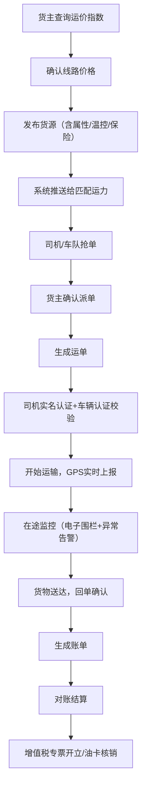
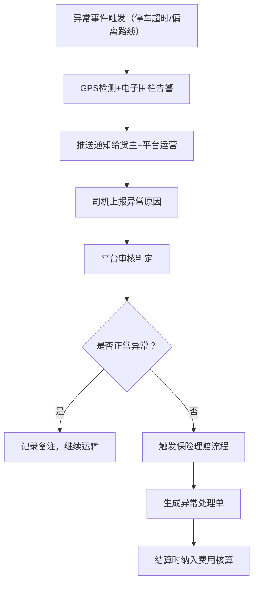

## 1. 产品概述

本平台是面向中小货主的零担与整车货运数字化服务平台，通过整合运价指数、实名认证、GPS追踪、TMS管理等核心功能，解决货运行业信息不对称、价格不透明、管理效率低等痛点问题。

- **目标用户**：中小货主企业、物流车队、个体司机、平台运营方
- **核心价值**：实现货运全流程数字化管理，提升运输透明度，降低运营成本，保障货物安全

---

## 2. 核心功能

### 2.1 用户角色

| 角色 | 注册方式 | 核心权限 |
|------|----------|----------|
| 货主 | 企业资质认证注册 | 发布货源、查询运价、管理订单、对账结算、管理运力池、申请开票 |
| 车队 | 企业资质+道路运输许可证 | 接收货源、管理司机、指派车辆、运输跟踪、对账结算 |
| 个体司机 | 身份证+驾驶证+行驶证实名认证 | 抢单接单、运输执行、GPS上报、异常上报、费用结算 |
| 平台运营 | 内部账号 | 用户审核、运价指数管理、订单监控、财务管理、数据分析 |

### 2.2 功能模块

1. **首页仪表盘**：核心数据概览、快捷操作入口、运价指数走势
2. **运价查询**：线路价格透明化查询、历史价格走势、运价指数对接
3. **货源管理**：货源发布、货物属性配置、温控要求设置、保险选项
4. **认证中心**：司机实名认证、车辆资质认证、企业资质审核
5. **运输管理**：订单管理、运单管理、在途可视化、GPS追踪、电子围栏、异常告警
6. **TMS管理**：订单中心、运单中心、账单中心、结算管理
7. **运力池管理**：承运商白名单、司机/车辆库管理、运力评级
8. **财务管理**：增值税专票开立、电子油卡核销、对账结算
9. **系统设置**：角色权限、账号管理、通知配置

### 2.3 页面详情

| 页面名称 | 模块名称 | 功能描述 |
|---------|----------|----------|
| 登录页 | 身份认证 | 账号密码登录、角色切换、忘记密码 |
| 首页仪表盘 | 数据概览 | 今日订单数、在途运输量、待处理事项、运价趋势图、快捷操作 |
| 运价查询页 | 运价指数 | 起点终点选择、线路价格查询、历史价格对比、运价指数曲线 |
| 货源发布页 | 货源管理 | 货物信息录入、温控要求配置、保险选择、车辆类型要求、一键发布 |
| 货源列表页 | 货源管理 | 货源列表、状态筛选、抢单情况、派单操作 |
| 订单中心 | TMS管理 | 订单列表、订单详情、订单状态跟踪、订单操作 |
| 运单中心 | TMS管理 | 运单列表、运单分配、运输状态、回单管理 |
| 在途监控页 | 运输管理 | 地图可视化、GPS实时定位、电子围栏设置、异常停车告警 |
| 账单中心 | TMS管理 | 账单生成、账单列表、对账管理、发票申请 |
| 结算管理 | 财务管理 | 结算单列表、支付记录、电子油卡核销、增值税专票申请 |
| 运力池管理 | 承运商管理 | 承运商白名单、司机/车辆库、资质审核、运力评级 |
| 认证中心 | 资质管理 | 司机实名认证、车辆认证、企业资质提交与审核 |
| 系统设置 | 权限管理 | 用户管理、角色权限、通知配置、接口配置 |

---

## 3. 核心流程

### 3.1 货运主流程

### 3.2 异常处理流程

---

## 4. 用户界面设计

### 4.1 设计风格

#### 色彩系统
- **主色调**：深海蓝 `#165DFF` - 代表专业、可信赖的物流服务
- **辅助色**：
  - 成功绿 `#00B42A` - 订单完成、正常状态
  - 警示橙 `#FF7D00` - 运输中、待处理
  - 危险红 `#F53F3F` - 异常告警、错误
  - 科技青 `#14C9C9` - 在途监控、数据可视化
- **中性色**：
  - 深灰 `#1D2129` - 主要文字
  - 中灰 `#4E5969` - 次要文字
  - 浅灰 `#C9CDD4` - 边框、分割线
  - 背景色 `#F2F3F5` - 页面背景
  - 卡片白 `#FFFFFF` - 卡片背景

#### 字体系统
- **标题字体**：`"Noto Sans SC"` - 粗体，700 字重，用于页面标题、关键数据
- **正文字体**：`"Inter"` - 常规体，400 字重，用于正文、表格数据
- **等宽字体**：`"JetBrains Mono"` - 用于单号、金额、时间戳等需要精确对齐的内容

#### 按钮与交互
- **主按钮**：圆角 8px，深蓝色填充，悬停色加深 10%，点击时有轻微缩放动效
- **次要按钮**：圆角 8px，边框样式，悬停时背景变浅蓝
- **危险按钮**：圆角 8px，红色填充，用于删除、取消等高危操作
- **卡片**：圆角 12px，微妙阴影（box-shadow: 0 2px 8px rgba(0,0,0,0.06)），悬停时阴影加深

#### 布局风格
- 左侧导航栏 + 顶部状态栏 + 主内容区的三段式布局
- 卡片式信息组织，模块间留白充足
- 数据可视化采用图表与地图结合的方式
- 深色模式可选，适合长时间监控操作

#### 图标风格
- 使用线性图标为主，操作按钮使用填充图标
- 统一 24px 网格系统
- 状态图标使用对应语义色

### 4.2 页面设计概述

| 页面名称 | 模块名称 | UI 元素 |
|---------|----------|---------|
| 首页仪表盘 | 数据概览 | 大型数字卡片展示核心KPI、折线图展示运价走势、环形图展示订单状态分布、快捷操作入口采用渐变图标卡片、整体采用不对称网格布局 |
| 运价查询页 | 运价指数 | 顶部搜索区域（起点/终点/车型）、主区域为交互式地图高亮线路、下方价格走势图表、价格对比表格采用斑马纹+悬停高亮 |
| 在途监控页 | 运输管理 | 全屏地图（深色底）、左侧车辆列表（实时状态标签）、车辆详情抽屉面板、异常告警浮动通知条、电子围栏绘制工具 |
| 货源发布页 | 货源管理 | 分步表单设计（货物信息→运输要求→保险选项→确认发布）、进度条指示、温度控制滑块、保险选项卡片带价格计算 |
| 订单中心 | TMS管理 | 顶部筛选工具栏、数据表格支持列自定义、行展开查看详情、状态标签使用不同语义色、批量操作工具栏 |

### 4.3 响应式设计

- **桌面端优先**：1920px 设计稿，向下兼容至 1280px
- **平板适配**：1024px - 1279px，左侧导航可收起，表格支持横向滚动
- **移动端适配**：768px - 1023px，底部 Tab 导航，卡片式列表，地图支持手势操作
- **触控优化**：按钮最小点击区域 44x44px，表单控件增大触控面积，支持下拉刷新

---

## 5. 非功能需求

### 5.1 性能要求
- 首屏加载时间 < 3s
- 地图渲染 < 1.5s
- 列表查询响应 < 500ms
- GPS 位置上报频率：30秒/次，异常时 5秒/次

### 5.2 安全要求
- 所有接口 HTTPS 加密
- 敏感数据（身份证、银行卡）脱敏展示
- 操作日志完整记录，可审计追踪
- 多因素身份认证可选

### 5.3 可用性要求
- 系统可用性 ≥ 99.9%
- 数据备份：每日增量备份，每周全量备份
- 异常监控：全链路监控告警
