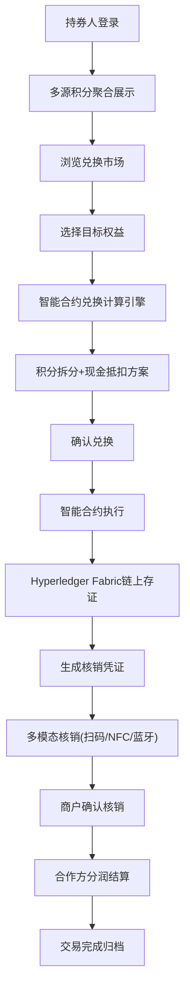

## 1. 产品概述

跨平台数字权益融合兑付平台是一个整合保险积分、银行信用卡积分、航空里程、运营商话费余额等异构权益的可信兑换基础设施。通过区块链存证、智能合约引擎和多模态核销技术，实现多源权益的统一管理、可信兑换和安全核销，为持券人、合作方、商户三方提供高效、透明、安全的数字权益服务生态。

- 解决多平台权益碎片化、兑换壁垒高、流动性差的行业痛点
- 目标用户：持券人（C端用户）、合作方（B端机构）、商户（线下/线上商家）
- 市场价值：构建万亿级数字权益流通市场，提升权益资产流动性与变现效率

## 2. 核心功能

### 2.1 用户角色

| 角色 | 注册方式 | 核心权限 |
|------|----------|----------|
| 持券人 | 手机号/三方账号登录 | 多源积分聚合视图、权益兑换、订单管理、核销凭证、AR互助信息发布 |
| 合作方 | 企业资质审核+API密钥申请 | API接入配置、对账密钥管理、智能合约规则配置、分润结算、数据看板 |
| 商户 | 商户资质审核入驻 | POS核销对接、券码生成、交易流水、结算管理 |
| 平台管理员 | 后台权限分配 | 全平台监控、风控审核、参数配置、合作方/商户审核 |

### 2.2 功能模块

1. **仪表盘总览**：平台数据概览、实时交易监控、权益健康度指标、区块链存证统计
2. **持券人中心**：多源积分账户聚合、资产总览、兑换记录、收藏管理
3. **权益兑换市场**：商品/服务分类浏览、智能匹配推荐、兑换计算引擎、订单确认
4. **智能合约中心**：积分拆分组合规则、现金叠加抵扣配置、AR互助信息模板
5. **合作方管理**：API接入鉴权、对账密钥管理、分润规则配置、结算报表
6. **商户管理**：POS核销配置、线上券码生成、交易记录、财务结算
7. **区块链存证中心**：链上交易哈希查询、时间戳验证、参与方签名核验
8. **权益健康监控**：过期率预警、兑换活跃度分析、异常交易告警
9. **AR元宇宙地理围栏**：社区互助信息发布、地理范围控制、信息审核管理
10. **核销中心**：扫码核销、NFC触发、蓝牙信标近场、多模态状态展示

### 2.3 页面详情

| 页面名称 | 模块名称 | 功能描述 |
|----------|----------|----------|
| 仪表盘总览 | 数据看板 | 今日交易量、活跃用户数、存证总量、合作方数量等核心指标卡片 |
| 仪表盘总览 | 实时交易流 | 滚动展示最新兑换/核销交易，包含权益类型、金额、参与方 |
| 仪表盘总览 | 健康度雷达 | 过期率、兑换率、核销率、活跃度、分润完成度等维度雷达图 |
| 持券人中心 | 积分聚合视图 | 保险/信用卡/航空/运营商多源积分账户卡片，余额趋势图 |
| 持券人中心 | 资产总览 | 总权益估值、可用/冻结/即将过期分类统计 |
| 权益兑换市场 | 商品列表 | 分类筛选、权益组合推荐、兑换所需积分+现金展示 |
| 权益兑换市场 | 兑换计算 | 多积分拆分组合计算、现金抵扣优化、最优方案推荐 |
| 智能合约中心 | 规则引擎 | 可视化规则配置、积分拆分比例、现金叠加阈值、生效周期 |
| 智能合约中心 | AR互助存证 | 互助信息模板、上链存证哈希、签名校验、地理标签 |
| 合作方管理 | API鉴权配置 | AppID/Secret生成、IP白名单、请求频率限制、沙盒环境 |
| 合作方管理 | 对账密钥管理 | RSA公私钥生成、密钥轮换、签名算法配置、历史版本 |
| 合作方管理 | 分润结算报表 | 按日/周/月报表、交易明细、分润比例、可提现金额 |
| 商户管理 | POS核销配置 | 终端编号、NFC配对码、蓝牙信标UUID、商户签名证书 |
| 商户管理 | 券码生成 | 批次生成、二维码/条码/加密券码、有效期、核销限制 |
| 区块链存证中心 | 交易哈希查询 | 输入哈希/订单号查询链上记录、区块高度、时间戳 |
| 区块链存证中心 | 签名验证 | 参与方公钥、签名算法、原始数据比对、验签结果展示 |
| 权益健康监控 | 过期预警看板 | 即将过期权益列表、红黄绿预警等级、推送通知配置 |
| AR地理围栏 | 地图界面 | 可拖拽地理围栏、多边形/圆形区域、互助信息热力图 |
| AR地理围栏 | 信息管理 | 互助信息审核、发布状态、上下线管理、举报处理 |
| 核销中心 | 多模态核销面板 | 扫码/NFC/蓝牙信标三种核销方式切换、核销状态反馈 |

## 3. 核心流程

### 3.1 权益兑换主流程
持券人浏览兑换市场 → 选择目标权益 → 进入兑换计算引擎 → 自动匹配最优积分拆分组合方案（可叠加现金） → 确认兑换 → 智能合约执行 → 积分锁定/划转 → 生成兑换订单 → 链上存证（哈希、时间戳、参与方签名） → 商户/系统生成核销凭证 → 通知持券人

### 3.2 多模态核销流程
持券人出示核销凭证 → 商户选择核销方式（扫码/NFC/蓝牙信标） → 近场触发识别 → 校验凭证有效性 → 调用智能合约校验状态 → 执行核销操作 → 更新链上状态 → 记录核销时间戳 → 分润计算触发 → 交易完成通知

### 3.3 合作方API接入流程
合作方提交资质审核 → 审核通过 → 分配AppID → 生成RSA密钥对 → 配置IP白名单 → 沙盒环境联调测试 → 签署接入协议 → 切换生产环境 → 开启对账服务 → 生成对账密钥 → 按周期自动对账结算

### 3.4 Mermaid流程图

## 4. 用户界面设计

### 4.1 设计风格

**整体美学定位：企业级科技金融风（Tech-Finance Luxury）**
- 主色调：深空靛蓝 #0A1628（主背景）、翡翠金 #C9A962（主品牌色）、数据绿 #10B981（成功指标）、预警橙 #F59E0B（预警）、风险红 #EF4444（告警）
- 辅色体系：科技蓝渐变 #1E3A5F → #0F2744、区块链紫 #7C3AED、里程蓝 #3B82F6、保险绿 #10B981、话费青 #06B6D4
- 按钮风格：微立体玻璃拟态（Glassmorphism）、圆角8px、渐变填充、hover时金属光泽流动动画
- 字体方案：标题使用 Cormorant Garamond（奢华衬线），正文使用 Space Grotesk（科技无衬线），数字数据使用 JetBrains Mono（等宽数字）
- 布局风格：左侧折叠导航栏 + 顶部状态栏 + 主内容卡片式布局、带投影玻璃卡片、非对称栅格突破
- 图标风格：Phosphor Icons 线性图标、关键数据使用发光图标、状态点使用脉冲动画

### 4.2 页面设计概览

| 页面名称 | 模块名称 | UI元素 |
|----------|----------|--------|
| 仪表盘总览 | 数据看板 | 玻璃拟态卡片、渐变数字、发光状态点、悬浮动画延迟入场 |
| 仪表盘总览 | 实时交易流 | 滚动列表、彩色标签分类、脉冲新消息标记、交易哈希渐隐展示 |
| 仪表盘总览 | 健康度雷达 | SVG雷达图、发光网格线、数据填充区域透明度渐变、hover高亮 |
| 持券人中心 | 积分聚合 | 四色权益卡（保险/银行/航空/运营商）、余额滚动数字、趋势迷你图 |
| 权益兑换市场 | 商品列表 | 瀑布流卡片、悬浮放大、角标热门标签、快速兑换浮窗 |
| 智能合约中心 | 规则引擎 | 可视化连线流程图、拖拽配置节点、节点发光状态、执行路径动画 |
| 区块链存证中心 | 哈希查询 | 终端风格输入框、链上区块动画展示、签名验证进度条 |
| AR地理围栏 | 地图界面 | 深色地图、发光围栏边界、热力点脉冲动画、侧滑信息面板 |
| 核销中心 | 多模态面板 | 三栏切换（扫码框/NFC状态/蓝牙信号）、扫描线动画、成功绿光扩散 |

### 4.3 响应式设计
- 设计优先：桌面端（1920px）为核心设计基准
- 适配策略：1280px-1920px 流式布局、768px-1280px 导航折叠、<768px 移动端单列
- 触控优化：可点击区域≥44×44px、滑动手势支持、触控反馈震感提示
- 大屏优化：2K/4K 屏幕下栅格自适应扩展、字号保持可读比例

### 4.4 动效与微交互
- 入场动画：Staggered Fade-in Up（卡片错峰上浮淡入，50ms间隔）
- 数据更新：数字滚动计数动画、图表渐进式绘制、成功绿光涟漪扩散
- 导航交互：侧边栏折叠/展开有弹性过渡、当前页签有高亮渐变下划线
- 按钮交互：按下微凹陷+高光扩散、禁用态灰化+not-allowed光标
- 背景氛围：深空靛蓝背景叠加极淡噪点纹理、数据页面底部有渐变光流
