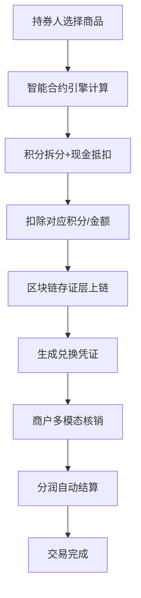
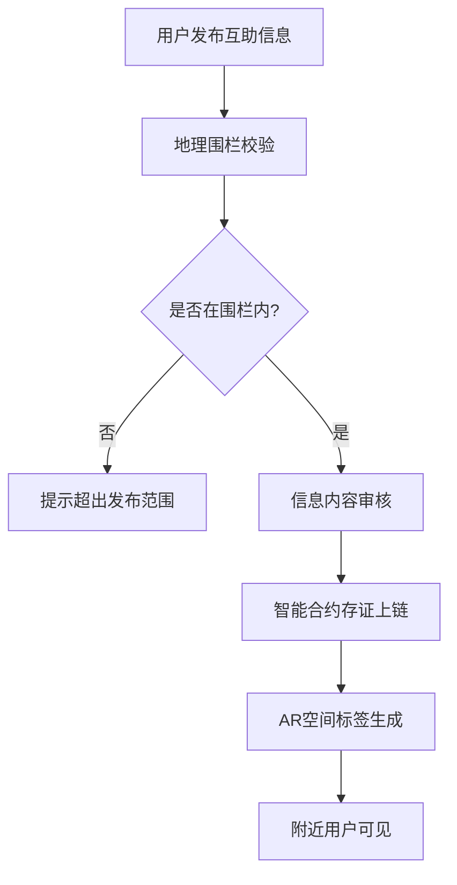

## 1. 产品概述

跨平台数字权益融合兑付平台，整合保险积分、银行信用卡积分、航空里程、运营商话费余额等异构权益，构建可信兑换基础设施。解决多源权益分散、兑换效率低、信任成本高的行业痛点，为持券人、合作方、商户提供一站式权益管理与兑付服务。

- 目标用户：持券人（C端）、合作方（B端金融机构）、商户（B端商家）、平台管理员
- 核心价值：权益聚合、可信存证、智能合约、多模态核销、数据监控

---

## 2. 核心功能

### 2.1 用户角色

| 角色 | 注册方式 | 核心权限 |
|------|----------|----------|
| 持券人 | 手机号/第三方登录 | 多源积分账户聚合、权益兑换、AR互助信息发布、核销记录查询 |
| 合作方 | 企业认证+API密钥 | API接入配置、对账密钥管理、分润报表查看、数据统计 |
| 商户 | 企业认证+POS授权 | 线下POS核销、线上券码生成、交易记录查询、结算管理 |
| 平台管理员 | 内部账号 | 权益健康度监控、分润结算审核、AR地理围栏管理、系统配置 |

### 2.2 功能模块

1. **持券人端**：多源积分聚合视图、权益兑换中心、AR互助社区、个人资产管理
2. **商户端**：POS核销系统、券码生成管理、交易结算、门店管理
3. **合作方端**：API接入配置、对账密钥管理、数据统计报表、分润查询
4. **管理后台**：权益监控仪表盘、分润结算系统、AR地理围栏管理、区块链存证查询
5. **区块链存证层**：兑换记录上链、参与方签名、哈希验证、时间戳存证
6. **智能合约引擎**：积分拆分组合、现金叠加抵扣、AR互助信息存证、分润自动计算
7. **多模态核销模块**：扫码核销、NFC近场触发、蓝牙信标核销

### 2.3 页面详情

| 页面名称 | 模块名称 | 功能描述 |
|---------|----------|----------|
| 持券人首页 | 积分聚合仪表盘 | 多源积分总览、过期预警、快捷兑换入口、资产趋势图 |
| 权益兑换中心 | 兑换商城 | 权益商品展示、积分拆分组合、现金叠加抵扣、兑换流程 |
| AR互助社区 | 互助信息发布 | 地理围栏内信息发布、AR标签叠加、上链存证、信息浏览 |
| 商户POS核销 | 核销工作台 | 扫码/NFC/蓝牙核销、券码验证、交易确认、小票打印 |
| 商户券码管理 | 券码生成 | 批量生成券码、券码配置、发放管理、核销记录 |
| 合作方API配置 | 接入管理 | API密钥生成、IP白名单配置、对账密钥管理、接口文档 |
| 合作方数据报表 | 数据统计 | 兑换量统计、分润明细、趋势分析、数据导出 |
| 管理后台仪表盘 | 权益健康度监控 | 过期率预警、兑换成功率、系统吞吐量、异常告警 |
| 分润结算管理 | 结算系统 | 分润规则配置、结算单生成、审核流程、支付记录 |
| AR地理围栏管理 | 围栏配置 | 区域绘制、半径设置、触发规则、信息发布范围控制 |
| 区块链浏览器 | 存证查询 | 交易哈希查询、区块信息、参与方签名验证、时间戳追溯 |

---

## 3. 核心流程

### 3.1 权益兑换流程

用户选择权益商品 → 智能合约计算积分组合 → 支持现金叠加抵扣 → 兑换请求发送 → 区块链存证（哈希+时间戳+签名）→ 生成券码/直接核销 → 分润自动计算 → 完成交易

### 3.2 AR互助信息发布流程

用户发布互助信息 → 地理围栏验证 → 信息审核 → 智能合约存证 → AR标签渲染 → 附近用户可见

---

## 4. 用户界面设计

### 4.1 设计风格

**设计理念：科技金融感 + 可信未来感**

- **主色调**：深邃科技蓝 `#0A1628` 作为背景主色，营造专业可信的金融科技氛围
- **辅助色**：极光紫 `#7C3AED` 用于强调智能合约与区块链元素，霓虹青 `#06B6D4` 用于AR元宇宙模块，金融金 `#F59E0B` 用于权益与积分
- **中性色**：冷白 `#F8FAFC`、深灰 `#1E293B`、中灰 `#64748B`，构建清晰的信息层级
- **按钮风格**：微立体玻璃拟态按钮，带微妙渐变边框，hover时有光晕扩散效果
- **字体选择**：标题使用 `Space Grotesk` 未来感无衬线字体，正文使用 `Inter` 保证可读性，数字使用 `JetBrains Mono` 等宽字体强化科技感
- **布局风格**：模块化卡片布局，网格化信息架构，数据可视化主导的仪表盘设计
- **视觉特效**：背景渐变网格、数据流动线条、区块联动动画、全息投影效果

### 4.2 页面设计概览

| 页面名称 | 模块名称 | UI 元素 |
|---------|----------|---------|
| 持券人首页 | 积分聚合仪表盘 | 半透明玻璃卡片、环形积分进度图、实时数据流动画、过期预警闪烁标识、3D资产趋势图 |
| 权益兑换中心 | 兑换商城 | 商品卡片悬浮动效、积分组合计算器、智能合约执行进度条、区块链存证标识、兑换成功粒子特效 |
| AR互助社区 | 互助地图 | 地理围栏可视化边界、AR标签悬浮效果、信息卡片层叠布局、发布按钮脉冲动画、上链成功确认弹窗 |
| 管理后台仪表盘 | 权益健康度监控 | 数据大屏布局、实时数据刷新动画、过期率预警热力图、系统状态指示灯、区块高度滚动显示 |
| 区块链浏览器 | 存证查询 | 区块链状可视化、哈希值分段展示、签名验证动画、时间轴追溯组件、区块连接动效 |

### 4.3 响应式设计

- **桌面端优先**：支持1920px及以上宽屏展示，数据大屏采用四象限布局
- **平板适配**：仪表盘模块重排为双列，保持数据可视化完整性
- **移动端**：卡片列表化展示，重点信息前置，简化操作流程
- **触控优化**：增大触控区域，支持滑动操作，优化移动端表单体验

### 4.4 AR元宇宙模块设计

- **环境设置**：半透明深色遮罩 + 霓虹光晕效果，营造元宇宙沉浸感
- **地理围栏可视化**：使用发光渐变圆环展示围栏边界，支持拖拽调整
- **AR标签渲染**：3D浮动标签，带有透明度渐变和轻微浮动动画
- **触发交互**：进入围栏区域时有震动反馈和音效提示
- **后处理效果**：轻微泛光、色彩增强、扫描线效果
