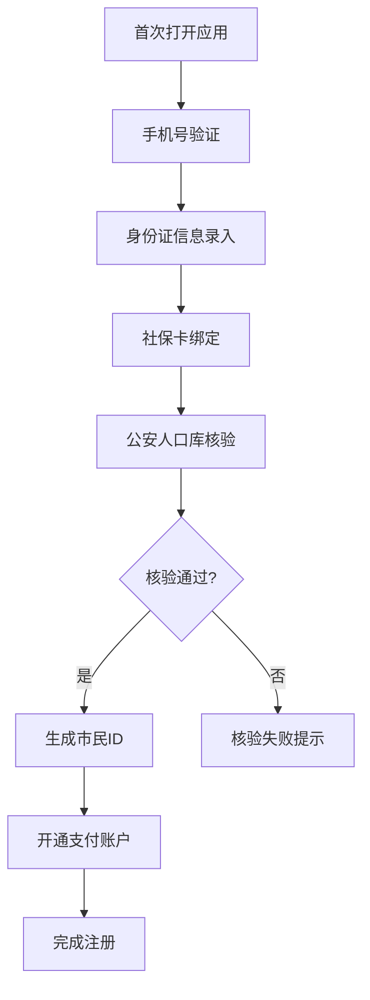

## 1. 产品概述

青岛城市服务融合操作系统是一个以"一个支付码+一个市民账户"为底座的城市级服务融合平台，集成交通、医疗、教育、文旅、政务等12类城市服务，为市民提供一站式智慧生活体验。

- 核心价值：打破城市服务数据孤岛，实现多场景无感通行与智慧服务
- 目标用户：青岛市全体市民、游客及城市运营管理者
- 市场定位：全国领先的城市服务融合标杆项目

## 2. 核心功能

### 2.1 用户角色

| 角色 | 注册方式 | 核心权限 |
|------|----------|----------|
| 市民用户 | 三要素验证（身份证+社保卡+手机号） | 使用所有城市服务、查看个人账户、预约挂号、文旅预约等 |
| 运营管理员 | 后台账号登录 | 区市分级运营配置、服务监控、补贴管理等 |
| 系统管理员 | 超级账号 | 系统配置、SLA监控、全局数据管理 |

### 2.2 功能模块

1. **市民首页**：统一支付码展示、常用服务快捷入口、个人消息中心
2. **无感通行**：公交地铁扫码、ETC通行记录、隧道自动计费
3. **智慧医疗**：在线挂号、候诊预测、药品库存查询
4. **文旅预约**：场馆预约、分时段放号、超售熔断
5. **个人中心**：市民账户、三要素认证、服务记录、设置

### 2.3 页面详情

| 页面名称 | 模块名称 | 功能描述 |
|----------|----------|----------|
| 首页 | 支付码区域 | 动态生成统一支付二维码，支持一键亮码 |
| 首页 | 快捷服务入口 | 12类服务图标导航，支持自定义排序 |
| 首页 | 实时信息卡片 | 公交到站预测、医院号源余量、场馆人流密度 |
| 通行页 | 扫码乘车 | 公交地铁扫码即扣，实时同步扣费记录 |
| 通行页 | ETC记录 | ETC门架数据实时同步，通行明细查询 |
| 通行页 | 隧道计费 | 隧道通行自动计费，账单推送 |
| 医疗页 | 挂号预约 | 医院列表、科室选择、医生号源池 |
| 医疗页 | 候诊预测 | 基于ML模型的候诊队列时长预测 |
| 医疗页 | 药品查询 | 扫码查药、附近药店库存联动 |
| 文旅页 | 场馆列表 | 热门场馆展示、分时段放号信息 |
| 文旅页 | 预约管理 | 预约记录、超售熔断提示（限2场/周） |
| 个人中心 | 市民账户 | 账户余额、交易明细、琴岛通余额 |
| 个人中心 | 实名认证 | 三要素验证进度、身份信息管理 |
| 运营后台 | 分级运营 | 区市独立配置文旅补贴、服务参数 |
| 运营后台 | SLA监控 | 各接口响应时间P95监控、告警展示 |

## 3. 核心流程

### 3.1 市民注册认证流程
用户首次打开应用 → 输入手机号验证码 → 上传身份证信息 → 绑定社保卡号 → 公安人口库三要素核验 → 生成统一市民ID → 开通支付账户

### 3.2 公交地铁扫码通行流程
用户打开支付码 → 闸机扫码 → 实时扣费 → 推送扣费通知 → 记录通行数据

### 3.3 医院挂号候诊流程
选择医院/科室 → 选择医生和时段 → 确认挂号 → ML模型预测候诊时间 → 实时队列更新 → 到号提醒

### 3.4 文旅场馆预约流程
选择场馆 → 选择时段 → 校验周预约次数（≤2场）→ 确认预约 → 生成预约凭证 → 到场核销

## 4. 用户界面设计

### 4.1 设计风格
- **主色调**：海洋蓝 #0066CC（体现青岛海滨城市特色）
- **辅助色**：活力橙 #FF7D00、清新绿 #00B42A、科技紫 #722ED1
- **背景色**：页面 #F5F9FF / 卡片 #FFFFFF
- **文本色**：主要 #1D2129 / 次要 #4E5969 / 辅助 #86909C
- **按钮风格**：全圆角胶囊形状，渐变色彩，点击微缩反馈
- **字体**：系统字体，层级分明（大标题40rpx/标题34rpx/正文28rpx）
- **布局风格**：卡片式设计，轻阴影，大圆角，留白充足
- **图标风格**：线性简约图标，与主题色一致

### 4.2 页面设计概述

| 页面名称 | 模块名称 | UI元素 |
|----------|----------|--------|
| 首页 | 顶部支付码区域 | 蓝色渐变背景，动态二维码，一键亮码动效 |
| 首页 | 快捷服务网格 | 4x3网格布局，彩色图标，点击缩放效果 |
| 首页 | 实时数据卡片 | 横向滚动卡片，人流密度热力色阶，数据微动效 |
| 通行页 | 扫码区域 | 全屏扫码界面，动态扫描线动画 |
| 通行页 | 记录列表 | 时间轴布局，通行类型标签，金额高亮 |
| 医疗页 | 挂号卡片 | 医院Logo、医生头像、候诊预测进度条 |
| 文旅页 | 场馆卡片 | 大图背景、预约按钮、剩余库存进度条 |
| 个人中心 | 账户概览 | 余额大字展示、收支趋势图、功能列表 |

### 4.3 响应性
- 小程序端：优先适配，750rpx基准设计
- H5端：同步适配，响应式布局
- 运营后台：桌面端优先，支持1280px以上分辨率

## 5. 非功能需求

### 5.1 性能要求
- 扫码响应时间 < 200ms
- 页面首屏加载 < 1.5s
- API接口P95响应时间 < 800ms
- 并发支持 ≥ 10万TPS

### 5.2 安全要求
- 三要素数据加密存储
- 支付交易全流程加密
- 敏感数据脱敏展示
- 操作日志完整审计

### 5.3 可用性要求
- 系统SLA ≥ 99.95%
- 数据多地域备份
- 故障自动切换
