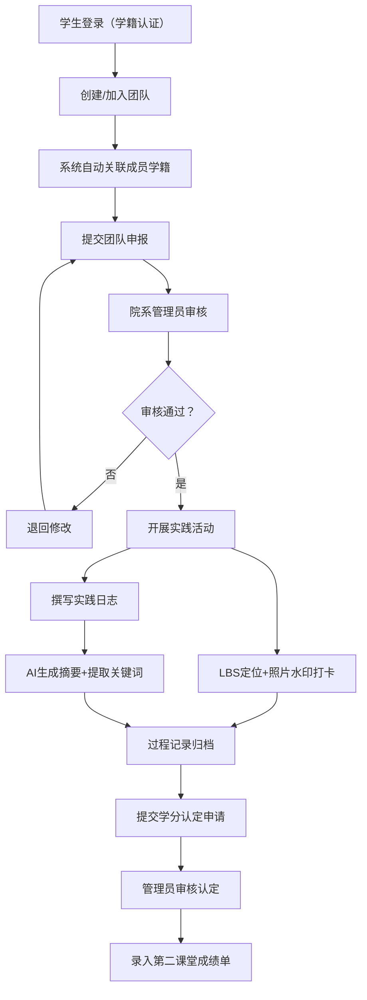
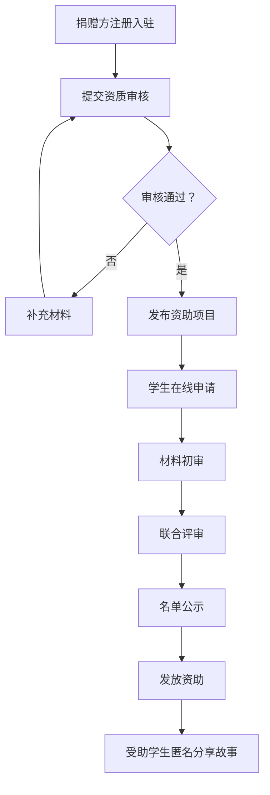

## 1. 产品概述

高校社会实践协同管理平台是服务于全国高校团委与大学生群体的一体化管理系统，打通活动发布、组队报名、过程记录、成果认证全链路。

- **核心目标**：解决高校社会实践管理分散、过程难追溯、学分认定不规范等痛点，实现社会实践数字化、标准化、智能化管理
- **目标用户**：高校学生、院系管理员、校级管理员、实践基地（企业/乡村/社区）、社会捐赠方
- **产品价值**：对接教育部实践学分标准，提供第二课堂成绩单，助力高校人才培养质量提升

## 2. 核心功能

### 2.1 用户角色

| 角色 | 注册方式 | 核心权限 |
|------|----------|----------|
| 学生 | 学籍库对接/统一认证 | 活动报名、组队、打卡记录、日志撰写、学分查询、第二课堂成绩单 |
| 院系管理员 | 校方分配账号 | 活动审核、学分认定、团队管理、数据统计 |
| 校级管理员 | 超级管理员分配 | 全校数据看板、基地管理、标准配置、系统设置 |
| 实践基地 | 申请入驻审核 | 岗位发布、团队接待、满意度评价、成果反馈 |
| 捐赠方 | 注册申请入驻 | 资助项目发布、受助学生查看、匿名故事浏览 |

### 2.2 功能模块

1. **首页仪表盘**：数据概览、快捷入口、通知中心、待办事项
2. **三下乡专项**：团队申报、行程管理、轨迹打卡、日志撰写、AI摘要
3. **奖学金共享**：资助项目、捐赠方入驻、受助故事、申请管理
4. **资讯引擎**：学科标签新闻聚合、政策解读、实践案例、活动通知
5. **实践活动管理**：活动发布、报名审核、组队管理、过程记录
6. **实践基地管理**：基地入驻、岗位发布、接待管理、满意度评价
7. **学分认证中心**：学分申请、审核认定、标准配置、成绩单生成
8. **数据看板**：校级统计、参与率分析、服务时长排名、基地满意度

### 2.3 页面详情

| 页面名称 | 模块名称 | 功能描述 |
|----------|----------|----------|
| 登录页 | 角色选择登录 | 支持学生/管理员/基地/捐赠方多角色登录，统一身份认证入口 |
| 首页仪表盘 | 数据概览卡片 | 展示参与活动数、服务时长、已获学分、待办事项等核心指标 |
| 首页仪表盘 | 快捷操作区 | 快速报名活动、创建团队、撰写日志、申请学分等常用功能入口 |
| 三下乡-团队申报 | 团队创建表单 | 填写团队信息、自动关联成员学籍、选择实践主题、上传申报书 |
| 三下乡-行程管理 | 行程时间轴 | 可视化展示实践行程安排、每日任务、地点信息 |
| 三下乡-轨迹打卡 | 地图打卡界面 | LBS定位打卡、照片上传（自动水印）、打卡记录列表 |
| 三下乡-日志管理 | 日志编辑器 | 富文本编辑、图片上传、AI自动摘要、关键词提取、服务内容标签 |
| 奖学金-项目列表 | 资助项目卡片 | 展示捐赠方、资助金额、申请条件、截止日期、申请状态 |
| 奖学金-受助故事 | 匿名故事墙 | 受助学生匿名分享成长故事，支持点赞、收藏 |
| 资讯引擎 | 新闻聚合流 | 基于学科标签个性化推荐，乡村振兴政策、实践案例、活动通知 |
| 资讯引擎 | 学科标签筛选 | 农林、医学、教育、工科、文科等分类标签，精准过滤内容 |
| 活动管理 | 活动发布表单 | 活动信息、时间地点、招募人数、学分标准、报名条件配置 |
| 活动管理 | 报名审核列表 | 学生报名信息、学籍校验、批量审核、状态管理 |
| 基地管理 | 基地入驻申请 | 企业/乡村/社区信息填写、资质上传、审核流程 |
| 基地管理 | 岗位发布 | 实践岗位、需求人数、技能要求、接待条件、补贴说明 |
| 学分认证 | 学分申请列表 | 学生提交申请、材料上传、审核状态追踪 |
| 学分认证 | 第二课堂成绩单 | 学分汇总、实践经历、证书生成、打印导出 |
| 数据看板 | 校级数据大屏 | 参与率统计、服务时长TOP院系、基地满意度雷达图、趋势分析 |
| 数据看板 | 多维分析图表 | 按学院、年级、专业、基地类型多维度交叉分析 |

## 3. 核心流程

### 3.1 三下乡实践全流程

学生通过学籍认证登录平台，创建或加入实践团队，系统自动校验成员学籍。院系管理员审核通过后，团队开始实践活动，每日通过LBS定位+照片水印打卡，撰写实践日志，AI自动生成摘要并提取关键词。实践结束后，学生提交学分申请，管理员审核认定，学分手动录入第二课堂成绩单。

### 3.2 奖学金资助流程

社会捐赠方入驻平台，发布资助项目，学生在线申请，管理员联合捐赠方评审，公示后发放资助，受助学生可匿名分享成长故事沉淀。

## 4. 用户界面设计

### 4.1 设计风格

- **主色调**：学术蓝 #1E40AF，传递专业、可信、稳重的教育平台气质
- **辅助色**：活力橙 #F97316（强调行动按钮）、成功绿 #10B981（认证状态）、警示红 #EF4444（提醒）
- **背景色**：浅灰蓝渐变 #F0F4F8 → #E2E8F0，营造清爽科技感
- **按钮风格**：圆角矩形（8px），主按钮采用蓝色渐变填充，悬停有微上浮和阴影变化
- **字体**：标题采用"思源黑体 Bold"，正文采用"思源黑体 Regular"，数字和英文使用"JetBrains Mono"
- **布局风格**：卡片式布局配合左侧导航栏，顶部状态栏显示用户信息和通知
- **图标风格**：线性图标（2px描边），统一圆角，配色跟随主题

### 4.2 页面设计概述

| 页面名称 | 模块名称 | UI元素 |
|----------|----------|--------|
| 登录页 | 角色选择登录 | 左侧品牌展示区（渐变背景+校园插画），右侧登录表单，角色切换Tab动画 |
| 首页仪表盘 | 数据概览卡片 | 四个统计卡片带渐变图标，数字滚动动画，悬浮微交互 |
| 首页仪表盘 | 快捷操作区 | 图标按钮组，悬停放大效果，彩色背景区分功能类别 |
| 三下乡-团队申报 | 表单界面 | 分步引导式表单，进度条指示，成员学籍自动校验提示 |
| 三下乡-轨迹打卡 | 地图界面 | 地图底图+打卡点标记，照片预览带时间地点水印，打卡按钮脉冲动画 |
| 三下乡-日志管理 | 编辑器 | 左右分栏（编辑/预览），AI摘要按钮带loading动效，关键词标签自动生成 |
| 奖学金-项目列表 | 卡片列表 | 资助项目卡片展示捐赠方Logo，金额醒目突出，进度条显示申请进度 |
| 奖学金-受助故事 | 瀑布流 | 卡片式瀑布流布局，故事摘要+渐变遮罩，悬停展开全文 |
| 资讯引擎 | 新闻聚合流 | 标签筛选栏（横向滚动），资讯卡片分类配色，学科标签徽章 |
| 数据看板 | 校级大屏 | 深色背景+亮色图表，数据动画加载，雷达图/柱状图/折线图组合 |

### 4.3 响应式设计

- **桌面端优先**：以1440px宽度为主要设计基准，侧边栏固定导航
- **平板适配**：1024px断点，侧边栏折叠为图标模式，卡片网格自适应
- **手机适配**：768px断点，底部Tab导航，卡片单列展示，表单简化为全宽输入
- **触控优化**：移动端按钮最小44px触控区域，列表项支持左滑操作

### 4.4 动效与交互

- **页面加载**：元素淡入上移（staggered 50ms延迟），骨架屏过渡
- **数据卡片**：数字滚动动画（CountUp），图表渐入绘制
- **按钮交互**：悬停translateY(-2px) + 阴影加深，点击波纹效果
- **表单验证**：错误提示抖动动画，成功状态对勾勾绘动画
- **导航切换**：内容区左右滑动过渡，面包屑路径动画
