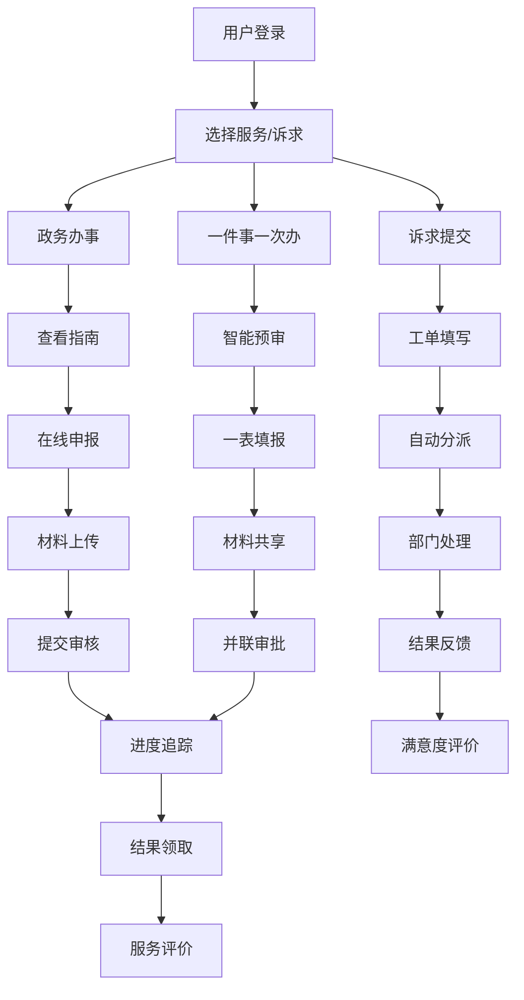

## 1. 产品概述

地市级城市综合服务平台是面向市民的一站式政务服务门户，整合政务办事、民生服务与本地资讯，依托政务云统一身份认证体系，实现"一网通办、一端全办"。平台遵循《全国一体化政务服务平台线上线下融合指南》，提供从服务申请、进度追踪到结果评价的全流程闭环管理。

- 核心价值：打通各委办局业务系统壁垒，实现数据共享和业务协同，提升群众办事体验
- 目标用户：全市市民、企业法人、政务服务工作人员

## 2. 核心功能

### 2.1 用户角色

| 角色 | 注册方式 | 核心权限 |
|------|----------|----------|
| 市民用户 | 政务云统一身份认证（身份证/人脸/手机号） | 办事申请、进度查询、资讯浏览、诉求提交、服务评价 |
| 企业法人 | 统一社会信用代码认证 | 企业办事、资质办理、政策查询 |
| 政务工作人员 | 单位工号认证 | 事项管理、资讯编辑、工单处理、数据查看 |
| 平台管理员 | 系统账号 | 系统配置、用户管理、权限分配、数据统计 |

### 2.2 功能模块

1. **首页**：统一入口、导航区、热门服务、本地资讯轮播、快捷入口
2. **政务办事**：服务分类、事项详情、在线申报、材料上传、预约办理
3. **一件事一次办**：主题集成服务（新生儿出生、企业开办、公民身后事等）、联办流程引导
4. **智能导办**：AI问答助手、用户画像服务推荐、办事场景模拟
5. **服务进度**：办件列表、进度追踪、节点提醒、物流信息
6. **本地资讯**：政务动态、便民提示、政策解读、RSS订阅聚合
7. **诉求响应**：12345热线工单提交、进度查询、结果评价、满意度回访
8. **数据驾驶舱**：服务办结率、群众满意度、热点问题TOP榜、办件趋势分析
9. **个人中心**：用户信息、我的办件、我的收藏、消息通知、设置
10. **无障碍支持**：语音导航、字体放大/缩小、色盲模式、高对比度模式

### 2.3 页面详情

| 页面名称 | 模块名称 | 功能描述 |
|----------|----------|----------|
| 首页 | 导航区 | 顶部导航栏、搜索框、无障碍快捷入口、用户登录入口 |
| 首页 | 轮播区 | 重要公告、政策宣传、活动推广轮播展示 |
| 首页 | 热门服务 | 高频服务快捷入口，支持自定义排序 |
| 首页 | 一件事专区 | 主题集成服务卡片展示 |
| 首页 | 资讯列表 | 最新政务动态、便民提示、政策解读 |
| 政务办事页 | 服务分类 | 按个人/企业、生命周期、主题维度分类展示 |
| 政务办事页 | 事项详情 | 办事指南、申请条件、所需材料、办理流程、收费标准 |
| 政务办事页 | 在线申报 | 表单填写、材料上传、电子签名、提交审核 |
| 一件事一次办页 | 主题列表 | 新生儿出生、企业开办、社保医保等主题服务 |
| 一件事一次办页 | 联办流程 | 多部门联办步骤引导、材料共享、一表填报 |
| 智能导办页 | AI助手 | 自然语言问答、办事场景引导、问题识别 |
| 智能导办页 | 服务推荐 | 基于用户画像的个性化服务推荐 |
| 服务进度页 | 办件列表 | 全部/进行中/已完成办件分类展示 |
| 服务进度页 | 进度详情 | 办理节点、当前状态、经办人员、预计时限 |
| 资讯详情页 | 文章内容 | 资讯正文、相关推荐、分享功能 |
| 诉求提交页 | 工单填写 | 问题类型、事发地点、问题描述、图片上传 |
| 数据驾驶舱 | 统计概览 | 今日办件、办结率、满意度等核心指标 |
| 数据驾驶舱 | 图表展示 | 办件趋势、热点问题排行、部门办理效率对比 |
| 个人中心页 | 用户信息 | 实名认证信息、常用联系人、地址管理 |
| 个人中心页 | 设置 | 无障碍设置、消息通知设置、隐私设置 |

## 3. 核心流程

### 3.1 政务办事主流程

用户登录 → 搜索/选择服务事项 → 查看办事指南 → 在线填写表单 → 上传申报材料 → 提交申请 → 受理审核 → 进度查询 → 领取结果 → 服务评价

### 3.2 一件事一次办流程

选择主题服务 → 智能预审（判断适用条件）→ 一表填报（自动填充已有信息）→ 材料共享复用 → 多部门并联审批 → 进度统一追踪 → 结果统一送达

### 3.3 12345诉求响应流程

提交诉求工单 → 自动分类分派 → 责任部门处理 → 办理结果反馈 → 用户满意度评价 → 办结归档

### 3.4 Mermaid 流程图

## 4. 用户界面设计

### 4.1 设计风格

- **主色调**：政务蓝 (#1E5FBE)，体现政府服务的权威性和可信赖感
- **辅助色**：温暖橙 (#FF7A00)，用于重要操作按钮和提示信息；活力绿 (#22C55E)，用于成功状态和进度完成；警示红 (#EF4444)，用于错误提示
- **中性色**：深灰 (#1F2937)、中灰 (#6B7280)、浅灰 (#F3F4F6)、白色 (#FFFFFF)
- **字体**：
  - 标题字体："PingFang SC", "Microsoft YaHei", sans-serif（官方稳重的中文系统字体）
  - 正文字体："PingFang SC", "Microsoft YaHei", sans-serif
  - 字号层级：32px/28px/24px/20px（标题）、16px/14px/12px（正文）
- **按钮风格**：圆角 8px，主按钮填充政务蓝，悬停加深，点击有微缩反馈
- **布局风格**：卡片式布局，清晰的区域分隔，充足的留白，信息层级分明
- **图标风格**：线性图标，统一线宽 2px，使用 lucide-react 图标库
- **无障碍配色**：支持红绿色盲、蓝黄色盲、全色盲模式，高对比度模式

### 4.2 页面设计概览

| 页面名称 | 模块名称 | UI 元素 |
|----------|----------|---------|
| 首页 | 导航区 | 政务蓝渐变背景、白色文字、圆角搜索框、无障碍快捷按钮 |
| 首页 | 轮播区 | 大图轮播、渐变遮罩、指示器、自动切换动画 |
| 首页 | 服务卡片 | 白色卡片、浅灰边框、悬停阴影、图标+文字组合 |
| 政务办事页 | 分类侧边栏 | 垂直导航、选中高亮、展开/收起动画 |
| 政务办事页 | 事项列表 | 列表卡片、状态标签、办理入口按钮 |
| 一件事一次办页 | 主题卡片 | 渐变色卡片、大图标、步骤指示器 |
| 进度详情页 | 时间轴 | 垂直时间轴、节点状态、连线动画 |
| 数据驾驶舱 | 指标卡片 | 深色背景、发光数字、趋势箭头 |
| 数据驾驶舱 | 图表区 | ECharts 图表、交互式数据提示 |

### 4.3 响应式设计

- **桌面优先**：1280px 以上为主要设计尺寸，采用 12 列栅格系统
- **平板适配**：768px - 1279px，侧边栏转为顶部标签，内容区域自适应
- **移动端适配**：375px - 767px，底部导航栏，卡片单列布局，触控区域 ≥ 44x44px
- **触摸优化**：所有可点击元素确保足够触控面积，按钮间距 ≥ 8px

### 4.4 动效设计

- **页面加载**：骨架屏渐入，内容区域淡入上移
- **卡片交互**：悬停时上移 4px + 阴影加深，时长 200ms
- **进度更新**：节点状态变化时有发光脉冲效果
- **导航切换**：标签切换时内容区域滑动过渡
- **无障碍模式切换**：平滑过渡动画，避免视觉突变
