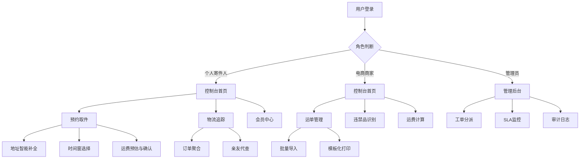

## 1. 产品概述

快递物流全链路数字服务控制台，面向个人寄件人与电商商家提供一站式物流数字化解决方案。系统覆盖从预约取件、面单识别、批量运单管理到物流追踪的全链路服务，同时集成违禁品AI识别、运费时效计算、投诉工单分派、电子发票开具、积分与SVIP会员管理等后台能力。

- 目标用户：个人寄件人（C端）与电商商家（B端），解决物流信息分散、操作繁琐、追踪困难等痛点
- 市场价值：通过数字化与智能化手段，提升物流效率、降低人工成本、增强用户体验与平台粘性

## 2. 核心功能

### 2.1 用户角色

| 角色 | 注册方式 | 核心权限 |
|------|----------|----------|
| 个人寄件人 | 手机号注册 | 预约取件、物流追踪、积分管理、电子发票、投诉工单 |
| 电商商家 | 营业执照认证 | 批量运单导入、模板化打印、违禁品AI校验、运费计算、SVIP权益 |
| 管理员 | 内部授权 | 工单分派、SLA监控、违禁品库管理、审计日志查看 |

### 2.2 功能模块

1. **控制台首页**：数据概览仪表盘、快捷操作入口、待办事项提醒
2. **预约取件页**：时间窗选择、地址智能补全、取件信息确认
3. **面单识别页**：扫码识别、OCR上传识别、面单信息展示
4. **运单管理页**：批量导入、模板化打印、运单列表与状态筛选
5. **物流追踪页**：聚合电商平台订单、物流节点时间线、亲友代查
6. **违禁品识别页**：图像上传识别、文本输入校验、识别结果与风险等级
7. **运费计算页**：距离/重量/服务等级计算、时效预估、费用明细
8. **投诉工单页**：工单创建、自动分派、SLA倒计时、处理进度
9. **电子发票页**：发票开具、税务UKey对接、发票列表与下载
10. **会员中心页**：积分生命周期、SVIP权益、审计日志、权益发放记录

### 2.3 页面详情

| 页面名称 | 模块名称 | 功能描述 |
|----------|----------|----------|
| 控制台首页 | 数据概览仪表盘 | 今日寄件量、在途运单、待处理工单、积分余额等核心指标展示 |
| 控制台首页 | 快捷操作入口 | 一键预约取件、扫码识别、批量导入等高频操作快捷入口 |
| 控制台首页 | 待办事项提醒 | 待取件、待处理工单、发票待开具等提醒 |
| 预约取件页 | 时间窗选择 | 可视化日期时间选择器，支持上午/下午/晚间时段选择 |
| 预约取件页 | 地址智能补全 | 输入地址关键字自动补全，支持历史地址与常用地址 |
| 预约取件页 | 取件信息确认 | 寄件人/收件人信息、物品类型、预估费用确认提交 |
| 面单识别页 | 扫码识别 | 调用摄像头扫描面单条码/二维码 |
| 面单识别页 | OCR上传识别 | 上传面单图片，OCR提取运单号、收寄件人信息 |
| 面单识别页 | 识别结果展示 | 解析后的结构化信息展示，支持手动修正 |
| 运单管理页 | 批量导入 | Excel/CSV文件上传，批量创建运单 |
| 运单管理页 | 模板化打印 | 运单打印模板选择与预览，支持批量打印 |
| 运单管理页 | 运单列表 | 运单状态筛选、搜索、分页展示 |
| 物流追踪页 | 订单聚合 | 关联淘宝/京东/拼多多等平台订单自动同步 |
| 物流追踪页 | 物流时间线 | 节点时间线展示，含地点、时间、状态 |
| 物流追踪页 | 亲友代查 | 通过运单号为他人代查物流，支持分享链接 |
| 违禁品识别页 | 图像识别 | 上传物品图片，AI识别是否违禁品及风险等级 |
| 违禁品识别页 | 文本校验 | 输入物品名称/描述，文本匹配违禁品库 |
| 违禁品识别页 | 识别结果 | 双重校验结果综合展示，风险等级标识 |
| 运费计算页 | 参数输入 | 寄收地址、重量/体积、服务等级选择 |
| 运费计算页 | 费用计算 | 基于距离/重量/等级的动态运费计算与时效预估 |
| 运费计算页 | 费用明细 | 基础运费、附加费、优惠折扣等费用明细展示 |
| 投诉工单页 | 工单创建 | 选择投诉类型、填写问题描述、上传证据 |
| 投诉工单页 | 自动分派 | 根据工单类型与归属地自动分派至责任网点 |
| 投诉工单页 | SLA倒计时 | 工单处理时效倒计时，超时预警 |
| 投诉工单页 | 处理进度 | 工单状态流转、网点回复、处理结果 |
| 电子发票页 | 发票开具 | 选择运单开具电子发票，对接税务UKey |
| 电子发票页 | 发票列表 | 已开发票列表，支持筛选与下载 |
| 会员中心页 | 积分管理 | 积分获取、消费、过期记录，积分兑换 |
| 会员中心页 | SVIP权益 | SVIP等级、权益展示、升级/续费入口 |
| 会员中心页 | 审计日志 | SVIP权益发放记录、操作审计日志 |

## 3. 核心流程

### 3.1 预约取件流程
用户进入预约取件页 → 填写收寄件人地址（智能补全） → 选择取件时间窗 → 选择物品类型与重量 → 违禁品自动校验 → 运费预估 → 确认提交 → 等待快递员上门取件

### 3.2 物流追踪流程
用户输入运单号或选择已关联订单 → 系统聚合物流节点数据 → 时间线展示物流状态 → 可生成代查链接分享给亲友

### 3.3 投诉工单流程
用户创建投诉工单 → 系统根据类型与归属地自动分派至责任网点 → 启动SLA倒计时 → 网点接收并处理 → 用户确认处理结果

## 4. 用户界面设计

### 4.1 设计风格
- **主题风格**：工业科技风，深色主题为主，传达物流行业的专业与高效
- **主色调**：深岩蓝（#0F172A）为底色，琥珀橙（#F59E0B）为强调色，传达活力与紧迫感
- **辅助色**：翡翠绿（#10B981）表示成功/完成，珊瑚红（#EF4444）表示警告/异常
- **按钮风格**：圆角矩形（rounded-lg），主按钮琥珀橙填充，次按钮边框描边
- **字体**：标题使用 Noto Sans SC Bold，正文使用 Noto Sans SC Regular，数据数字使用 JetBrains Mono
- **布局风格**：左侧固定导航栏 + 顶部工具栏 + 主内容区，卡片式模块布局
- **图标风格**：线性图标（Lucide），与整体简洁风格一致

### 4.2 页面设计概览

| 页面名称 | 模块名称 | UI元素 |
|----------|----------|--------|
| 控制台首页 | 数据概览仪表盘 | 深色卡片、数据指标大字展示、微型趋势图、琥珀橙高亮数字 |
| 控制台首页 | 快捷操作入口 | 4宫格图标按钮、悬浮放大动效、琥珀橙边框hover |
| 控制台首页 | 待办事项提醒 | 红点徽标、时间倒计时、滑入动画 |
| 预约取件页 | 时间窗选择 | 日历组件、时段色块、选中态琥珀橙填充 |
| 预约取件页 | 地址智能补全 | 下拉联想列表、历史地址标签、定位图标 |
| 预约取件页 | 取件信息确认 | 步骤条、信息卡片、费用明细表格、确认按钮 |
| 面单识别页 | 扫码识别 | 摄像头视窗、扫描线动画、对焦框 |
| 面单识别页 | OCR上传识别 | 拖拽上传区、进度条、识别字段高亮 |
| 运单管理页 | 批量导入 | 上传区域、进度条、导入结果统计 |
| 运单管理页 | 模板化打印 | 打印预览、模板切换标签、批量操作工具栏 |
| 运单管理页 | 运单列表 | 表格布局、状态标签色块、筛选器、分页器 |
| 物流追踪页 | 物流时间线 | 竖向时间线、节点图标、路径连线动画 |
| 物流追踪页 | 亲友代查 | 分享弹窗、二维码、复制链接按钮 |
| 违禁品识别页 | 图像识别 | 上传区、识别框标注、风险等级色条 |
| 违禁品识别页 | 文本校验 | 输入框、实时校验反馈、违禁词高亮 |
| 运费计算页 | 参数输入 | 表单输入、下拉选择、地图距离可视化 |
| 运费计算页 | 费用明细 | 分项费用卡片、总计突出显示 |
| 投诉工单页 | SLA倒计时 | 圆环倒计时、超时红色闪烁、进度百分比 |
| 电子发票页 | 发票开具 | 表单填写、UKey状态指示灯、开票按钮 |
| 会员中心页 | 积分管理 | 积分环形图、流水列表、兑换商品卡片 |
| 会员中心页 | SVIP权益 | 等级徽章、权益卡片列表、金色渐变装饰 |

### 4.3 响应式设计
- 桌面优先设计，主内容区最小宽度1024px
- 平板端：侧边栏收缩为图标模式，卡片布局自适应
- 移动端：底部Tab导航，卡片单列展示，触控操作优化

### 4.4 3D场景指导
- 不涉及3D场景
