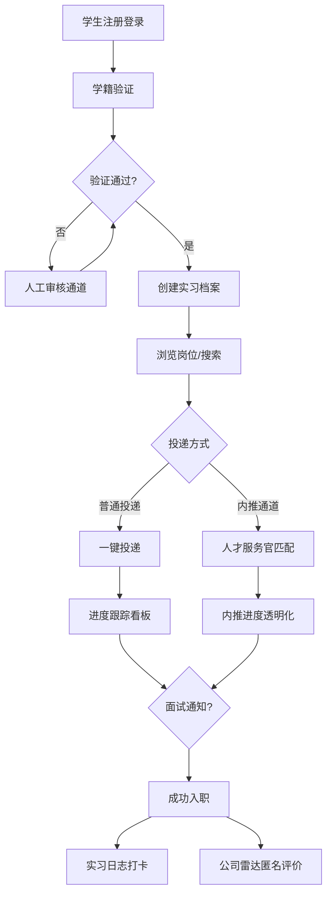
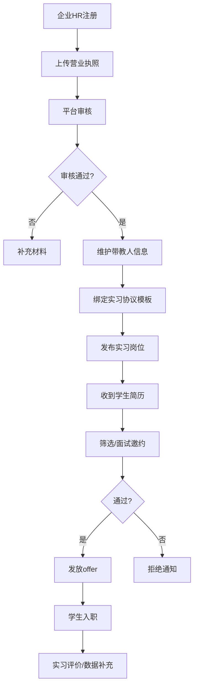

## 1. 产品概述

「展翅实习」—— 专为大专学历群体设计的实习就业赋能平台，聚焦在校生与应届实习生从校园到职场的最后一公里。通过企业资质严选、学生档案数字化、社区化成长支持与真人内推服务，构建大专生专属的信任型实习就业生态。

核心价值：破除大专生求职信息壁垒，降低企业实习招聘风险，打造「学校-学生-企业」三方共赢的实习服务闭环。

## 2. 核心功能

### 2.1 用户角色

| 角色 | 注册方式 | 核心权限 |
|------|----------|----------|
| 学生用户 | 手机号+学籍验证（学生证/教务系统对接） | 浏览岗位、创建实习档案、社区互动、AI工具使用、申请内推 |
| 企业HR | 营业执照认证+企业信息审核 | 发布实习岗位、上传带教人信息、管理应聘、补充公司数据 |
| 人才服务官 | 平台内部账号 | 内推资源匹配、进度跟踪、学生咨询对接 |
| 平台管理员 | 后台权限 | 内容审核、资质审核、数据管理 |

### 2.2 功能模块

1. **首页（信息聚合）**：岗位推荐轮播、核心功能入口、公司雷达TOP榜、社区热榜、个人成长卡
2. **实习岗位广场**：岗位搜索/筛选、岗位详情、企业资质展示、一键投递
3. **企业发布中心**：营业执照上传、实习协议模板管理、带教人信息维护、岗位编辑
4. **学生成长档案**：学籍验证、专业方向选择、技能证书上传、实训项目展示、简历生成
5. **萌新互助社区**：院校/专业/城市分群、匿名提问、学长实名认证答疑、内容推荐
6. **内推通道**：岗位发布、人才服务官分配、进度透明看板、结果通知
7. **公司雷达**：企业搜索、薪资区间、实习转正率、工作环境评分、匿名评价展示
8. **轻量化工具箱**：AI简历优化、实习日志打卡、职业性格测评（MBTI+霍兰德）
9. **个人中心**：消息通知、投递记录、收藏管理、设置

### 2.3 页面详情

| 页面名称 | 模块名称 | 功能描述 |
|----------|----------|----------|
| 首页 | Hero主视觉 | 标语展示、核心数据（岗位数/服务学生数/企业数）、CTA按钮 |
| 首页 | 功能快捷入口 | 6大核心功能卡片（岗位、档案、社区、内推、雷达、工具） |
| 首页 | 热门岗位推荐 | 岗位卡片横向滚动，含薪资/城市/企业/转正率标签 |
| 首页 | 公司雷达TOP榜 | 按城市/行业分类的TOP企业列表，附评分徽章 |
| 首页 | 社区热榜 | 热门话题、高赞问答卡片 |
| 岗位广场 | 筛选栏 | 城市、行业、薪资、转正率、企业类型多条件筛选 |
| 岗位广场 | 岗位列表 | 卡片式布局，含企业认证标识、带教人信息入口 |
| 岗位详情页 | 企业资质区 | 营业执照、企业介绍、带教人信息、实习协议预览 |
| 岗位详情页 | 岗位信息区 | JD、薪资、福利、转正机会说明 |
| 企业中心 | 资质认证 | 营业执照OCR识别、法人信息、审核进度 |
| 企业中心 | 岗位发布 | 富文本JD编辑、带教人绑定、协议模板关联 |
| 学生档案 | 学籍验证 | 学生证上传、院校查询、学号校验 |
| 学生档案 | 档案管理 | 专业、证书、实训、成绩、自我描述模块化编辑 |
| 社区广场 | 分群Tab | 院校/专业/城市切换标签 |
| 社区广场 | 问答卡片 | 匿名标识、学长认证标签、浏览/回复数 |
| 问答详情 | 回答区 | 学长认证标、采纳答案、评论互动 |
| 内推中心 | 内推列表 | 可内推岗位、服务官头像、历史成功案例数 |
| 内推详情 | 进度条 | 5个节点进度：投递→筛选→面试→offer→入职 |
| 公司雷达 | 搜索区 | 企业名/行业搜索、维度筛选（薪资/环境/转正率） |
| 公司雷达 | 企业详情 | 多维度评分雷达图、薪资区间柱状图、学生评价 |
| 工具箱 | AI简历优化 | JD粘贴、简历上传、3秒生成优化建议 |
| 工具箱 | 实习日志 | 结构化模板（今日完成/明日计划/问题反思）、日历视图 |
| 工具箱 | 职业测评 | MBTI 28题+霍兰德60题、报告生成+岗位匹配 |
| 个人中心 | 侧边导航 | 各功能入口、消息红点提醒 |
| 个人中心 | 投递记录 | 申请状态时间轴（待审核/初筛/面试/offer/拒绝） |

## 3. 核心流程

### 3.1 学生求职主流程

学生登录→完成学籍验证→创建实习档案→浏览岗位广场/公司雷达→投递岗位→查看投递进度/内推进度→入职后使用实习日志/社区/评价反馈

### 3.2 企业招聘主流程

企业注册→上传营业执照审核→完善带教人信息→发布实习岗位→收到简历→筛选面试→发放offer→入职管理→评价学生/补充公司数据

## 4. 用户界面设计

### 4.1 设计风格

**美学定位：温暖成长感 · 活力橙青系**
- 面向大专生群体，拒绝冰冷企业风，主打「暖心陪伴成长」的视觉语言
- 以活力橙（行动/希望）+ 深青（专业/信任）为主色，奶白+浅灰为中性色
- 柔和的圆角卡片、温暖的渐变背景、轻盈的微交互动画

**颜色体系：**
- 主色1（活力橙）：`#FF7A3D` → 用于CTA按钮、进度条、核心高亮
- 主色2（成长青）：`#2EC4B6` → 用于次级按钮、评分系统、成功状态
- 中性底：`#FFF8F2`（暖米白）→ 页面底色
- 卡片底：`#FFFFFF` → 纯白卡片，配柔和阴影
- 文字主：`#2D2A3D`（深靛蓝）→ 标题正文
- 文字次：`#7C7894` → 辅助说明
- 警示色：`#E63946`、成功色：`#2EC4B6`

**按钮风格：** 圆角12px，微立体阴影，hover时轻微上浮+阴影加深渐变填充过渡

**字体方案：**
- 标题字体：`"Noto Sans SC"` —— 稳重圆润、中文友好
- 正文字体：`"PingFang SC", "Noto Sans SC"` —— 清晰易读
- 数字/数据展示：`"Poppins"` —— 现代感数字字体
- 字号体系：32/24/20/18/16/14/12px 七级

**布局风格：**
- 顶部固定导航栏 + 左侧次级筛选/导航
- 卡片式内容区，卡片圆角16px，阴影柔和分层
- 模块间留有充足呼吸空间（24px+）
- 图标风格：Lucide 线性图标，描边统一，配合色块背景

### 4.2 页面设计概览

| 页面名称 | 模块名称 | UI元素 |
|----------|----------|----------|
| 首页 | Hero主视觉 | 左右分栏，左文字右插画，橙青渐变点缀，数字滚动动画，按钮悬浮光晕 |
| 首页 | 功能入口 | 6宫格卡片，hover时橙色渐变边框+轻微上浮，图标彩色背景 |
| 首页 | 岗位推荐 | 横向卡片滚动，卡片左侧企业logo右侧信息，顶部认证标签，底部action区 |
| 首页 | 公司雷达榜 | 排名徽章（金/银/铜渐变），评分条橙色填充，hover展开详情 |
| 岗位广场 | 筛选栏 | 折叠式筛选面板，标签选中态橙色填充，滑块组件 |
| 岗位详情 | 资质区 | 三栏展示：营业执照缩略图+带教人卡片+协议预览，证书徽章边框动画 |
| 岗位详情 | JD区 | 分段折叠、关键词高亮（橙色标签）、福利图标列 |
| 社区广场 | 问答流 | 首图+标题+摘要，学长回答头像认证绿色边框，匿名使用默认头像+编码名 |
| 公司雷达 | 详情页 | 六边形雷达图动画填充，薪资区间渐变色柱状图，评价时间轴卡片 |
| 工具箱 | AI简历 | 左右双栏对比，原始vs优化版本差异高亮，3秒倒计时进度动画 |
| 工具箱 | 实习日志 | 日历视图打卡点（橙点标记），表单输入动效聚焦边框 |
| 工具箱 | 职业测评 | 进度条+题目卡片渐入，结果页左右人格卡片+匹配岗位推荐 |
| 内推中心 | 进度条 | 5节点竖线进度，已完成节点青绿色填充带对勾，当前节点橙色脉冲动画 |
| 个人中心 | 成长档案卡 | 顶部渐变色banner，信息卡片错落排布，技能进度条渐变填充 |

### 4.3 响应式设计

- **桌面优先（Desktop-first）**：默认1280px宽度栅格，主内容区最大1200px
- **平板适配（768-1024px）**：侧边栏收起为抽屉式，卡片改为双列，字号缩减1-2px
- **手机适配（<768px）**：单栏全宽，底部Tab导航，顶部导航简化为logo+搜索图标，卡片间距减小至16px，触控目标最小44px
- **触控优化**：移动端所有可点击元素添加 active 状态视觉反馈，滚动区域惯性流畅

### 4.4 动效体系

- **页面加载**：主视觉渐入(200ms)→功能卡错峰上浮(80ms间隔)→列表项瀑布流入场
- **微交互**：按钮hover有1px上移+阴影加深；输入框focus有12px描边光；卡片hover有3px上移+柔和阴影
- **数据可视化**：进度条从左向右填充（0.6s easeOutCubic）；雷达图从中心向外渐出
- **状态转换**：投递成功/审核通过使用Lottie级轻动画（对勾+淡彩散射）
