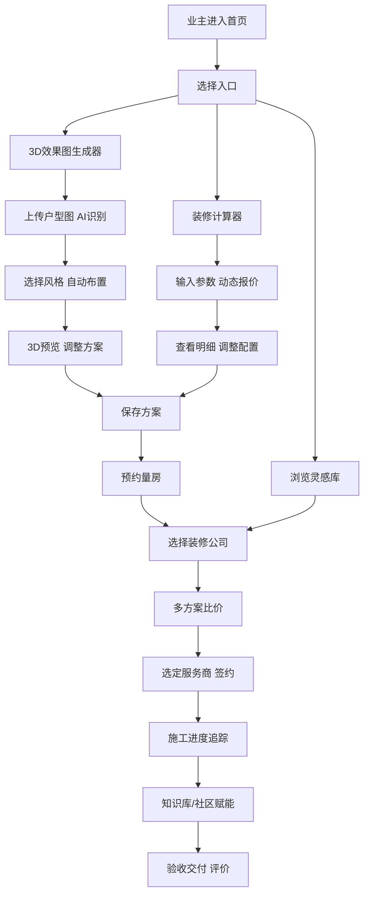
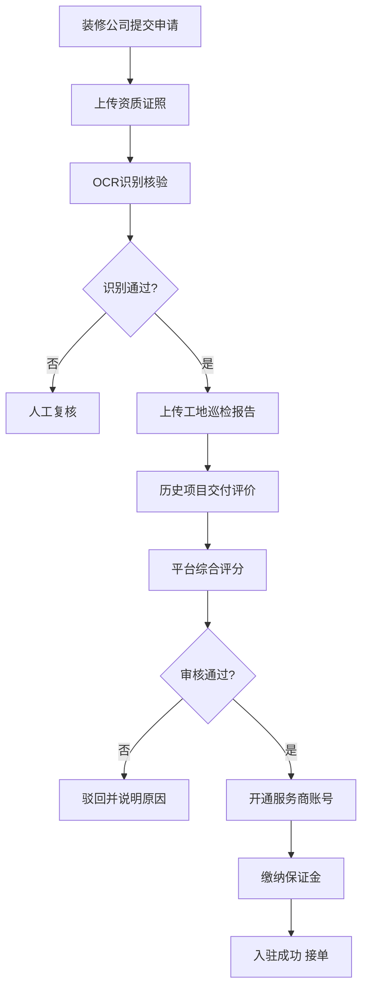
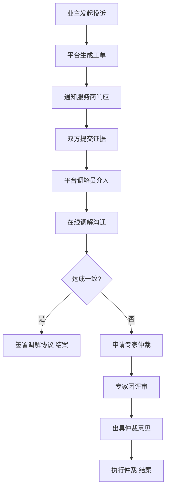

## 1. 产品概述

装修全链路决策支持与服务协同平台，贯通业主决策、服务商履约、知识赋能、后台管控四大场景，为装修全流程提供数字化支撑。解决业主装修信息不对称、服务商管理效率低、行业标准不透明等核心痛点，打造一站式智能装修生态。

- **核心价值**：AI驱动的装修决策 + 全链路服务协同 + 标准化知识体系
- **目标用户**：装修业主、装修公司/设计师、行业专家、平台运营方

---

## 2. 核心功能

### 2.1 用户角色

| 角色 | 注册方式 | 核心权限 |
|------|----------|----------|
| 业主 | 手机号/微信注册 | 户型图上传、3D预览、报价计算、灵感收藏、量房预约、方案比价、社区问答、进度查看 |
| 装修公司 | 资质审核入驻 | 公司信息维护、资质上传、量房接单、方案报价、工地管理、纠纷响应 |
| 设计师 | 公司关联/独立入驻 | 方案设计、3D建模、材质搭配、灵感上传 |
| 行业专家 | 平台认证 | 工艺标准维护、社区问答、纠纷调解 |
| 平台运营 | 后台账号 | 公司审核、进度管控、供应链对接、纠纷处理、数据分析 |

### 2.2 功能模块

#### 业主端（C端）
1. **首页**：导航中心、功能入口、精选灵感、热门公司、平台数据
2. **3D效果图生成器**：户型图上传、AI墙体识别、房间参数设置、风格选择、自动布置、3D预览、方案保存分享
3. **装修计算器**：城市选择、面积输入、工艺分级、主材辅材明细、动态报价、报价导出
4. **风格灵感库**：灵感瀑布流、以图搜图、色彩提取、材质库联动、收藏夹
5. **量房预约**：服务商列表、资质查看、评价展示、预约时间、地址管理
6. **方案比价看板**：多方案对比、施工周期、材料清单、质保条款、结构化差异高亮
7. **业主社区**：问题发布、问题聚类、专家回答、投票、解决方案收藏
8. **个人中心**：我的方案、报价记录、预约订单、装修进度、收藏管理

#### 服务商端（B端）
1. **工作台**：数据概览、待办事项、订单状态
2. **准入审核系统**：资质OCR上传、营业执照/资质证书识别、工地巡检报告、历史项目交付、审核进度
3. **量房调度**：预约列表、接单/派单、上门路线、量房记录、客户信息
4. **方案管理**：方案创建、报价配置、材料清单、质保设置、方案提交
5. **工地管理**：施工日志、进度上报、巡检记录、业主沟通

#### 知识层
1. **施工工艺库**：工艺分类、国标/行标条文、步骤图解、视频教程、注意事项
2. **避坑指南**：水电/泥木/油漆阶段标签、案例分享、专家解读、避坑清单
3. **问答社区**：问题分类、AI聚类、专家认证、回答排序、投票机制

#### 运营后台
1. **进度甘特图**：全局项目视图、任务拖拽、里程碑管理、延期预警
2. **供应链对接**：建材SKU管理、供应商接入、价格同步、库存对接、API配置
3. **纠纷调解**：工单分配、证据上传、调解记录、专家仲裁、处理结果

### 2.3 页面详情

| 页面名称 | 模块名称 | 功能描述 |
|----------|----------|----------|
| 首页 | Hero区 | 大标题+搜索框+3D/计算器双入口动效卡片 |
| 首页 | 核心功能导航 | 六大功能图标卡片，hover悬浮动画 |
| 首页 | 精选灵感 | 瀑布流图片墙，点击进入详情 |
| 首页 | 热门装修公司 | 公司卡片（评分/案例数/资质徽章） |
| 首页 | 平台数据 | 成交数/满意度/覆盖城市等数据看板 |
| 3D效果图生成器 | 户型图上传 | 拖拽上传+AI识别进度条+墙体识别结果预览 |
| 3D效果图生成器 | 房间配置 | 房间类型/尺寸/门窗位置可编辑网格 |
| 3D效果图生成器 | 风格选择 | 现代/北欧/中式/轻奢等风格卡片，3D预览切换 |
| 3D效果图生成器 | 自动布置 | 一键生成软硬装，拖拽调整家具位置 |
| 3D效果图生成器 | 3D场景 | Three.js全景预览，材质切换，昼夜光照 |
| 装修计算器 | 参数配置 | 城市/面积/户型/工艺等级联动选择 |
| 装修计算器 | 报价明细 | 主材/辅材/人工/设计费分类展开，可调整数量品牌 |
| 装修计算器 | 报价对比 | 三档报价（经济/品质/豪华）并排对比 |
| 装修计算器 | 导出 | PDF/Excel导出，保存为方案 |
| 风格灵感库 | 瀑布流 | Masonry布局图片墙，无限滚动 |
| 风格灵感库 | 以图搜图 | 上传参考图，返回相似风格灵感 |
| 风格灵感库 | 色彩提取 | 自动提取主色调/辅助色/点缀色，展示色卡 |
| 风格灵感库 | 材质联动 | 点击颜色跳转材质库，查看品牌/规格/价格 |
| 量房预约 | 服务商列表 | 筛选（资质/评分/距离），卡片式列表 |
| 量房预约 | 公司详情 | 资质证照轮播，工地案例，业主评价，预约表单 |
| 方案比价 | 对比表格 | 多方案并排，差异项高亮，支持勾选隐藏 |
| 方案比价 | 详情弹窗 | 施工周期甘特图，材料清单，质保条款原文 |
| 施工工艺库 | 分类导航 | 水电/泥木/油漆/安装阶段左侧树 |
| 施工工艺库 | 工艺详情 | 步骤+国标条文引用+图解+视频+常见问题 |
| 避坑指南 | 标签筛选 | 阶段标签+风险等级+热门程度筛选 |
| 问答社区 | 问题列表 | AI聚类标签，专家认证标识，投票数排序 |
| 问答社区 | 问题详情 | 问题描述+图文，多个回答，投票+评论 |
| 服务商工作台 | 数据概览 | 订单数/完成率/评分/收入趋势图 |
| 准入审核 | 资质上传 | OCR识别营业执照，证件类型分组上传 |
| 后台甘特图 | 项目管理 | 横向甘特图，任务拖拽调整，颜色标识状态 |
| 纠纷调解 | 工单详情 | 双方陈述+证据链+调解记录+仲裁结果时间线 |

---

## 3. 核心流程

### 3.1 业主装修决策主流程

业主从首页进入，可通过"3D效果图"或"装修计算器"启动决策流程，生成初步方案后，预约量房获取专业方案，通过比价看板选择服务商，进入施工履约阶段，过程中可随时查阅知识库和社区。

### 3.2 服务商入驻审核流程

### 3.3 纠纷调解工作流

---

## 4. 用户界面设计

### 4.1 设计风格

#### 整体美学方向：现代简约 × 温暖质感（家居杂志风）

**色彩体系**：
- 主色：暖木棕 `#8B6914`（传递建材/家居的自然质感）
- 辅色：雾霾蓝 `#6B8E9F`（科技专业感，中和暖色）
- 点缀：赤陶橙 `#C4623A`（行动号召，活力点缀）
- 背景：象牙米 `#FAF8F5` / 深炭灰 `#2A2A2A`（双主题支持）
- 中性：亚麻灰阶 `#F5F2ED / #E8E4DD / #9A9489 / #3D3A35`

**按钮风格**：
- 主按钮：微圆角（8px）+ 微妙渐变 + 2px悬浮上升 + 阴影过渡
- 次按钮：描边 + hover填充 + 轻微呼吸动效
- CTA按钮：赤陶橙填充 + 金色细边框 + 脉冲光晕

**字体选型**：
- 标题：Noto Serif SC（衬线体，传达专业与品质，对标家居杂志标题）
- 正文：PingFang SC / HarmonyOS Sans（无衬线，高可读性）
- 数字/数据：JetBrains Mono（报价、面积等数字场景）
- 字号层级：H1 48px / H2 36px / H3 24px / 正文 15px / 辅助 13px

**布局风格**：
- 卡片式为主，卡片带有1px微描边 + 柔和投影 + 圆角16px
- 大量留白，黄金比例分栏，非对称网格打破单调
- 重要模块采用"卡片层叠 + 背景色带"营造杂志感
- 对角线流动引导视线，局部打破网格创造节奏感

**图标风格**：
- 线性填充混合图标，2px描边，端点圆润
- 关键功能图标加入木质纹理微填充
- 状态图标使用暖色系区分等级

### 4.2 页面设计概览

| 页面名称 | 模块名称 | UI设计要点 |
|----------|----------|-------------|
| 首页 | Hero区 | 全屏大视差背景（户型线稿渐变叠加），主标题衬线体48px，双CTA卡片悬浮+轻微3D翻转 |
| 首页 | 功能导航 | 6宫格非对称布局，图标+文字+功能简述，hover时卡片上浮+木纹质感浮现 |
| 首页 | 灵感瀑布流 | 交错3列布局，图片带描边+标签悬浮，滚动渐入 |
| 首页 | 公司卡片 | 横向卡片，资质徽章右上悬浮，底部评分条+渐变遮罩 |
| 3D生成器 | 操作区 | 左侧280px参数面板（可折叠），中间70% 3D画布，右侧材质抽屉，三步进度条顶置 |
| 3D生成器 | 上传区 | 虚线边框拖拽区，AI识别时显示扫描线动效+墙体识别热力图叠加 |
| 3D生成器 | 风格卡片 | 横向滑动，选中卡片放大+金色边框发光，背景同步切换风格预览 |
| 计算器 | 参数面板 | 城市/面积/工艺分步表单，进度胶囊指示，已完成项打勾+绿色描边 |
| 计算器 | 报价明细 | 手风琴式展开，每类费用有小型条形图占比，hover显示品牌替换建议 |
| 计算器 | 三档对比 | 三列卡片，中间品质档高亮+顶部推荐徽章，差异行底色浅橙标注 |
| 灵感库 | 瀑布流 | 4列交错，图片下方悬浮色彩提取条（3色块），收藏心形按钮右上角 |
| 灵感库 | 以图搜图 | 左侧上传预览，右侧结果网格，相似度百分比徽标 |
| 比价看板 | 对比表 | 固定左侧公司列，横向滚动，差异单元格浅红底色，点击展开详情抽屉 |
| 工艺库 | 详情页 | 左侧步骤时间线，中间国标条文引用块（深灰底+金色左边框），右侧相关避坑推荐 |
| 服务商工作台 | 数据概览 | 顶部4个数据卡片渐变背景，下方折线+柱状组合图，状态任务时间线右侧 |
| 后台甘特图 | 项目视图 | 左侧项目树，右侧甘特图条（颜色标识状态），拖拽时半透明跟随，悬停显示详情气泡 |
| 纠纷调解 | 工单详情 | 双方陈述左右分栏（蓝/橙底色区分），中间时间线+证据卡片，底部操作区固定 |

### 4.3 响应式设计

- **设计原则**：Desktop-First，1440px基准栅格（12列，24px间距）
- **断点设计**：
  - ≥1440px：满版4/5列布局，全功能展现
  - 1024-1439px：3/4列，侧边栏自动收起为图标抽屉
  - 768-1023px：2列，参数面板改为底部抽屉
  - <768px：单列堆叠，3D画布全屏，底部Tab导航
- **触控优化**：移动端点击热区≥44px，滑动手势支持页面切换与3D旋转

### 4.4 3D场景指导

**适用页面**：3D效果图生成器（核心页面）

- **环境与氛围**：室内HDRI光照，配合昼夜切换按钮（自然光/暖黄光/冷白光），默认下午3点柔和自然光，阴影柔和
- **光照设置**：DirectionalLight主光源模拟窗光 + AmbientLight环境光补光 + PointLight模拟筒灯，开启阴影软阴影（PCFSoftShadowMap）
- **相机设置**：默认PerspectiveCamera 45° FOV，初始位置俯视45°房间角落，支持：轨道旋转、鼠标滚轮缩放、WASD自由漫游、预设视角切换（俯视/正视/漫游）
- **构图与焦点元素**：默认相机对准客厅沙发区域，主要家具（沙发/茶几/电视墙）为视觉焦点，通过景深后期处理突出焦点
- **交互与动画**：家具选中时金色描边脉动，拖拽替换时Ghost预览+落点高亮，材质切换时500ms渐变过渡，自动布置时有200ms错峰落入动画
- **后期效果**：启用Bloom（弱）、SSAO（环境光遮蔽增强空间层次）、Vignette（暗角营造聚焦感）、轻微ACES电影色调映射
- **资源与性能**：家具模型使用GLTF压缩格式，单场景面数控制在20万以内，LOD分级渲染，移动端自动降级后期效果，首屏加载≤3s
