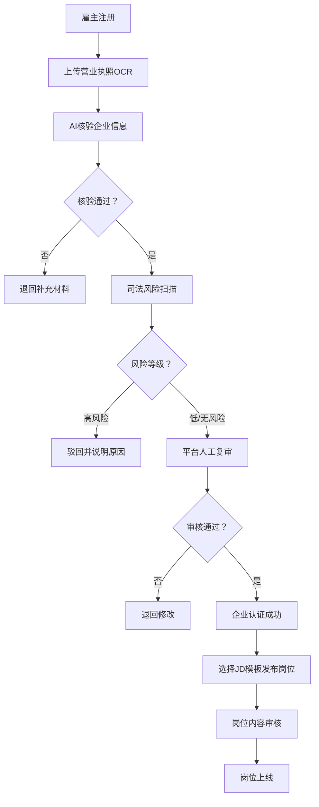
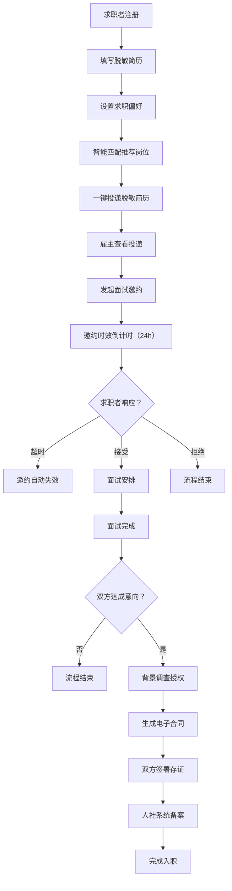
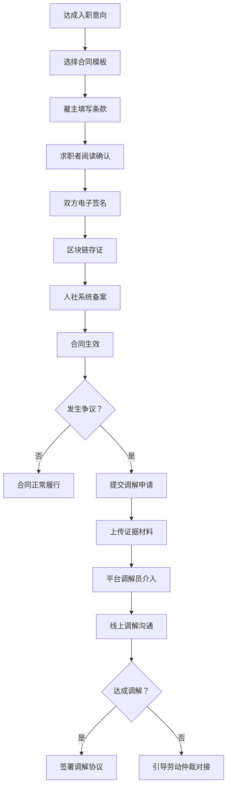

## 1. 产品概述

城市服务业人力资源匹配平台是一款面向城市服务业（餐饮、零售、家政、物流、安保等）的B2C双边人力资源服务平台。平台通过双重风控体系保障C端求职者权益，通过智能化工具提升B端雇主用工效率，构建可信赖的灵活用工生态。

- **核心目标**：解决城市服务业招工难、求职难的信息不对称问题，构建合规、高效、可信赖的灵活用工市场
- **目标用户**：B端服务业雇主（餐饮店长、零售经理、家政公司等）、C端灵活就业者（宝妈、蓝领、兼职学生等）、平台运营审核人员

---

## 2. 核心功能

### 2.1 用户角色

| 角色 | 注册方式 | 核心权限 |
|------|----------|----------|
| 平台管理员 | 后台账号 | 企业资质复审、岗位人工审核、争议调解、数据看板 |
| B端雇主 | 手机号+营业执照 | 企业资质提交、岗位发布、人才库搜索、简历查看、面试邀约、合同签署、招聘数据分析 |
| C端求职者 | 手机号+实名认证 | 简历填写（脱敏）、岗位搜索、一键投递、面试管理、合同签署、背景调查授权 |

### 2.2 功能模块

1. **平台首页**：角色入口选择、平台数据展示、服务介绍、热门岗位
2. **B端雇主中心**：资质核验、岗位管理、人才库、面试邀约、招聘分析、合同管理
3. **C端求职者中心**：简历管理、岗位匹配、投递记录、面试管理、合同管理
4. **风控审核后台**：企业资质AI核验、司法风险扫描、岗位信息人工复审
5. **合同与争议中心**：劳务合同模板库、电子签约存证、争议调解入口、人社备案对接

### 2.3 页面详情

| 页面名称 | 模块名称 | 功能描述 |
|----------|----------|----------|
| 平台首页 | 角色切换入口 | 雇主/求职者身份切换、登录注册入口 |
| 平台首页 | 数据展示看板 | 平台累计匹配数、入驻企业数、求职者满意度等核心指标 |
| 平台首页 | 热门岗位列表 | 服务业热门岗位卡片展示，支持快速查看和投递 |
| B端雇主-资质核验 | 营业执照OCR上传 | 支持拍照/上传营业执照，AI自动识别关键信息 |
| B端雇主-资质核验 | 司法风险扫描 | 对接司法数据源自动扫描企业涉诉、执行、失信等风险 |
| B端雇主-岗位管理 | JD模板配置 | 服务业岗位模板库（餐饮/零售/家政/物流等），支持自定义字段 |
| B端雇主-岗位管理 | 岗位发布与状态 | 岗位发布、上下架、编辑、查看审核状态 |
| B端雇主-人才库 | 智能搜索筛选 | 按技能标签、健康证、经验、通勤半径等多维度筛选 |
| B端雇主-人才库 | 智能打标系统 | 自动识别简历关键词并打标（如"有餐饮经验+持健康证"） |
| B端雇主-面试邀约 | 邀约管理 | 发起邀约、设置时效、查看响应状态、面试反馈 |
| B端雇主-招聘分析 | 效果归因看板 | 各渠道到面率、入职率、招聘成本ROI、岗位转化率漏斗 |
| C端求职者-简历管理 | 脱敏简历 | 手机号脱敏、支持简历隐藏模式，授权后才可查看完整信息 |
| C端求职者-简历管理 | 时段偏好设置 | 支持设置兼职时段（如宝妈夜间18:00-22:00）、可工作日期 |
| C端求职者-岗位匹配 | 智能匹配推荐 | 基于技能标签、通勤半径、薪资期望、时段偏好的智能推荐 |
| C端求职者-投递记录 | 投递追踪 | 查看投递状态、HR查看状态、面试进度 |
| C端求职者-面试管理 | 邀约时效管理 | 显示邀约剩余响应时间、超时自动失效、一键接受/拒绝 |
| C端求职者-背景调查 | 授权链管理 | 查看调查授权记录、授权范围、可随时撤销授权 |
| 风控审核后台 | AI核验仪表盘 | OCR识别结果、风险等级、待人工复核列表 |
| 风控审核后台 | 岗位人工复审 | 岗位内容合规性审核、薪资真实性核验、敏感词过滤 |
| 合同与争议中心 | 合同模板库 | 各行业标准劳务合同模板、自定义条款编辑 |
| 合同与争议中心 | 电子签约存证 | 区块链存证签约记录、签约时间线、合同下载 |
| 合同与争议中心 | 争议调解入口 | 纠纷提交、证据上传、调解进度追踪、仲裁对接 |
| 合同与争议中心 | 人社备案对接 | 劳动关系备案自动同步、备案状态查询 |

---

## 3. 核心流程

### 3.1 雇主入驻与岗位发布流程

雇主通过手机号注册 → 上传营业执照进行OCR识别 → AI自动核验企业信息 → 司法风险扫描 → 平台人工复审 → 审核通过 → 选择岗位JD模板 → 填写岗位详情 → 提交发布 → 岗位内容人工审核 → 审核通过上线 → 进入人才库搜索或等待求职者投递

### 3.2 求职者求职与入职流程

求职者注册 → 填写简历（系统自动脱敏）→ 设置求职偏好（技能/薪资/通勤/时段）→ 浏览/智能推荐岗位 → 脱敏简历一键投递 → 雇主发起面试邀约 → 邀约时效倒计时 → 求职者确认/拒绝 → 面试完成 → 双方互评 → 背景调查授权（如需要）→ 生成电子合同 → 双方签署 → 人社系统备案 → 入职

### 3.3 合同签署与争议调解流程

双方达成入职意向 → 选择合同模板 → 雇主填写合同条款 → 求职者阅读确认 → 双方电子签名 → 区块链存证 → 人社备案 → 合同生效 → （如发生争议）→ 提交调解申请 → 上传证据材料 → 平台调解员介入 → 线上调解 → 达成/未达成调解协议 → （未达成）引导劳动仲裁

---

## 4. 用户界面设计

### 4.1 设计风格

- **主色调**：深蓝 `#1E3A5F`（专业、可信赖）搭配暖橙 `#FF6B35`（活力、服务行业温度）
- **辅助色**：安全绿 `#10B981`（审核通过、成功状态）、警示红 `#EF4444`（风险提示）、信息蓝 `#3B82F6`
- **中性色**：采用锌灰（zinc）色系，从`#FAFAFA`到`#18181B`共9个梯度
- **按钮风格**：圆角12px，主按钮采用渐变填充（深蓝→蓝），次要按钮采用描边+浅灰背景
- **字体方案**：标题使用"Noto Serif SC"（衬线体，专业稳重），正文使用"Noto Sans SC"（无衬线体，清晰易读），数据看板使用"JetBrains Mono"等宽数字字体
- **布局风格**：卡片式布局，信息分组清晰，B端后台采用侧边栏+顶栏结构，C端采用底部Tab+内容流结构
- **图标风格**：使用 Lucide 线性图标，大小统一18px，颜色与文字色保持一致
- **视觉特色**：关键数据卡片采用玻璃拟态效果（backdrop-blur），风险提示卡片采用脉冲光晕动画，重要操作按钮采用悬浮微交互

### 4.2 页面设计概览

| 页面名称 | 模块名称 | UI元素 |
|----------|----------|--------|
| 平台首页 | Hero区 | 深蓝色渐变背景+暖橙色CTA按钮，大标题衬线字体，数据指标卡片悬浮动画 |
| 平台首页 | 角色入口 | 双卡片对比设计（雇主/求职者），悬停放大+阴影加深效果 |
| 平台首页 | 热门岗位 | 横向滚动卡片流，薪资标签高亮，投递按钮悬浮显示 |
| B端雇主-仪表盘 | 数据看板 | 4张核心指标卡+招聘漏斗图+渠道转化率条形图，玻璃拟态风格 |
| B端雇主-资质核验 | 上传区 | 虚线边框拖拽上传区，OCR识别进度条，风险雷达图展示扫描结果 |
| B端雇主-岗位发布 | JD模板 | 行业模板网格选择器，表单分区折叠，实时预览 |
| B端雇主-人才库 | 筛选与列表 | 左侧多条件筛选面板（标签式多选），右侧人才卡片列表，标签彩色高亮 |
| B端雇主-招聘分析 | 数据可视化 | 时间范围选择器，折线图+饼图+数据表格组合，支持导出 |
| C端求职者-首页 | 智能推荐 | 顶部搜索栏+通勤半径滑块，岗位卡片瀑布流，匹配度百分比展示 |
| C端求职者-简历 | 脱敏设置 | 开关式隐私控制，手机号部分脱敏展示，授权记录时间线 |
| C端求职者-面试管理 | 邀约列表 | 时间轴布局，邀约倒计时显示，接受/拒绝胶囊按钮 |
| 风控后台-审核 | 待审列表 | 表格视图，风险等级色块标记，AI核验结果侧滑详情 |
| 合同中心-签约 | 签约流程 | 步骤条导航，合同内容左右分栏对比，签名区手写板 |
| 争议调解 | 调解进度 | 聊天式界面，消息气泡，证据附件卡片，调解员标识 |

### 4.3 响应式设计

- **设计优先**：Desktop-first，针对B端管理后台优化1440px及以上分辨率体验
- **断点策略**：
  - `≥ 1280px`：完整侧边栏+多栏布局
  - `768px - 1279px`：侧边栏可折叠，双栏布局
  - `< 768px`：顶部汉堡菜单，单栏流式布局，表格横向滚动
- **触摸优化**：移动端按钮最小触控区44×44px，关键操作按钮底部固定，列表项滑动手势支持

---

## 5. 数据安全与合规

- **简历脱敏机制**：默认隐藏手机号中间4位、身份证号后6位，雇主付费/授权后才可查看完整信息
- **数据加密存储**：敏感信息（身份证、银行卡）采用AES-256加密，密钥分离管理
- **授权链可追溯**：背景调查授权采用区块链存证，每一次授权/撤销均有时间戳记录
- **人社系统对接**：劳动关系备案数据采用加密传输通道，符合《个人信息保护法》要求
