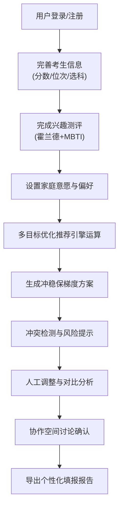

## 1. 产品概述

面向新高考改革的省级志愿决策支持平台，以考生分数、位次、选科组合、兴趣测评为核心输入，通过多目标优化算法提供个性化志愿推荐方案，帮助考生、家长、教师三方协作完成高考志愿填报全过程。

- 核心价值：解决新高考模式下志愿填报信息不对称、冲稳保梯度难以把握、滑档风险高等痛点
- 目标用户：考生、家长、高中教师、教育厅管理人员、升学规划专家

## 2. 核心功能

### 2.1 用户角色

| 角色 | 注册方式 | 核心权限 |
|------|----------|----------|
| 考生 | 手机号注册 | 输入成绩与选科、使用推荐引擎、生成志愿方案、导出报告 |
| 家长 | 手机号注册 | 关联考生账号、查看方案、参与协作讨论、设置家庭意愿 |
| 教师 | 手机号+学校认证 | 查看所带班级学生方案、提供填报指导、参与问答社区 |
| 认证专家 | 平台审核认证 | 回答问题标注专家标签、直播答疑、发布权威解读 |
| 教育厅管理员 | 后台账号 | 审核内容、查看热力图、数据脱敏管理、平台运营监控 |

### 2.2 功能模块

1. **首页**：功能导航、高考政策速递、平台数据概览、快捷入口
2. **智能推荐**：成绩/位次/选科输入、兴趣测评（霍兰德+MBTI）、多目标优化推荐、冲稳保梯度方案、冲突检测
3. **院校库**：全国2800+高校检索、院校详情、历年投档线、学科评估、硕博点查询
4. **专业库**：1600+专业检索、专业等级、就业率、课程体系、选科要求
5. **对比分析**：院校/专业对比矩阵、录取概率动态模拟（三年加权回归）
6. **协作空间**：家长-考生-教师三方协作、问答社区（专家认证）、直播答疑排期
7. **志愿方案**：方案管理、滑档预警、调剂风险系数、个性化报告导出
8. **管理后台**：教育厅审核、数据脱敏策略、区域报考热力图分析

### 2.3 页面详情

| 页面名称 | 模块名称 | 功能描述 |
|----------|----------|----------|
| 首页 | 导航与概览 | 功能入口导航、政策轮播、平台数据统计、用户快捷操作 |
| 信息采集页 | 考生信息录入 | 分数、位次、选科组合、省份、批次、目标城市偏好 |
| 兴趣测评页 | 霍兰德+MBTI | 36题霍兰德职业兴趣测试、12题MBTI简版测试、兴趣匹配报告 |
| 智能推荐页 | 推荐引擎 | 多目标优化算法、权重调节（院校层次/专业偏好/城市/就业）、实时推荐 |
| 志愿方案页 | 冲稳保梯度 | 自动生成冲稳保三档、冲突检测（选科限制/批次冲突）、滑档预警 |
| 院校详情页 | 院校信息 | 基本信息、历年投档线折线图、学科评估、硕博点、就业率、招生计划 |
| 专业详情页 | 专业信息 | 专业介绍、选科要求、课程体系、就业去向、全国院校排名 |
| 对比分析页 | 对比矩阵 | 最多5个院校/专业并排对比、录取概率模拟、优劣势标注 |
| 协作空间页 | 三方协作 | 成员管理、方案讨论、意见标注、历史版本对比 |
| 问答社区页 | 问答交流 | 问题列表、专家回答标识、问题分类、搜索功能 |
| 直播答疑页 | 直播排期 | 专家直播列表、预约提醒、回放查看 |
| 报告导出页 | 报告生成 | PDF格式志愿填报报告、包含方案、风险提示、建议 |
| 管理后台-审核 | 内容审核 | 问答内容审核、专家资质审核、违规处理 |
| 管理后台-数据 | 数据看板 | 区域报考热力图、院校热度排名、数据脱敏配置 |

## 3. 核心流程

考生完成志愿填报的主流程：

## 4. 用户界面设计

### 4.1 设计风格

- **主色调**：深邃蓝 #1e3a8a（代表专业、可信），搭配活力橙 #f97316（强调行动按钮）
- **中性色**：使用 zinc 色系作为基础灰色
- **按钮风格**：圆角 8px，hover 状态带有微妙阴影提升，渐变过渡
- **字体**：标题使用 "Noto Serif SC" 衬线字体体现学术感，正文使用 "Inter" 无衬线保证可读性
- **布局风格**：卡片式布局，清晰的视觉层级，充足留白
- **图标风格**：lucide-react 线性图标，统一 20px 尺寸

### 4.2 页面设计概述

| 页面名称 | 模块名称 | UI 元素 |
|----------|----------|----------|
| 首页 | Hero 区域 | 深蓝渐变背景、大标题突出产品定位、动态数据滚动展示、CCTA 按钮 |
| 智能推荐页 | 配置面板 | 左侧参数配置卡片（带步进动画）、右侧实时推荐结果瀑布流 |
| 志愿方案页 | 梯度展示 | 三栏卡片布局（冲/稳/保），颜色区分，录取概率进度条动画 |
| 对比分析页 | 对比矩阵 | 固定首列的横向滚动表格，关键指标高亮标注 |
| 协作空间页 | 讨论区 | 消息气泡布局，角色标签区分，时间线组织讨论记录 |
| 管理后台 | 热力图 | 中国地图 SVG 着色，省份深浅表示热度，hover 显示详情 |

### 4.3 响应式设计

- 桌面优先设计，适配 1280px 及以上
- 平板断点 768px：侧边栏折叠为图标，卡片改为两列布局
- 移动端断点 480px：单列布局，底部导航，表格横向滚动

### 4.4 交互动效

- 页面加载：staggered 卡片渐入动画（animation-delay 递增）
- 推荐结果：滚动视差效果，卡片 hover 微缩放 + 阴影加深
- 数据可视化：录取概率进度条数字滚动动画，折线图路径绘制动画
- 表单交互：输入框 focus 时背景轻微提亮，错误信息抖动提示
