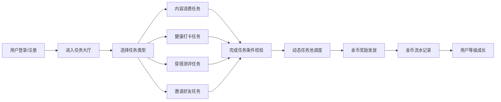
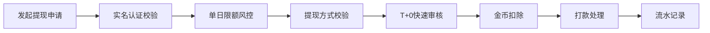
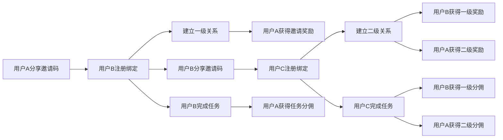

## 1. 产品概述

轻量级任务型收益平台，面向学生、宝妈、白领、中老年等多类兼职人群，用户通过完成碎片化行为任务获取可提现金币。

- 产品定位：人人可参与的碎片化任务收益平台
- 核心价值：利用碎片时间完成简单任务，获取稳定可提现的现金收益
- 目标用户：学生、宝妈、白领、中老年等有碎片时间的兼职人群

## 2. 核心特性

### 2.1 用户角色

| 角色 | 注册方式 | 核心权限 |
|------|----------|----------|
| 普通用户 | 手机号注册 | 完成任务、赚取金币、邀请好友、申请提现 |
| 管理员 | 后台账号登录 | 任务审核、任务池调度、用户管理、数据看板、提现审核 |

### 2.2 功能模块

1. **首页任务大厅**：金币余额展示、每日任务推荐、快速入口导航
2. **任务中心**：分类任务列表（内容消费、健康打卡、穿搭测评、邀请任务）
3. **内容消费模块**：笑话浏览、成语答题
4. **健康打卡模块**：饮水打卡、步数打卡
5. **穿搭测评模块**：发型搭配测评、服饰搭配测评
6. **邀请裂变模块**：邀请海报、二级关系链、分佣奖励
7. **金币流水**：实时金币账本、收入/支出明细
8. **提现中心**：T+0提现、实名认证、银行卡/支付宝/微信绑定
9. **个人中心**：用户等级、成长体系、账户设置
10. **后台管理**：任务审核、任务池调度、用户管理、数据看板、提现风控

### 2.3 页面详情

| 页面名称 | 模块名称 | 功能描述 |
|----------|----------|----------|
| 首页 | 顶部金币栏 | 显示当前金币余额、今日收益、等级进度 |
| 首页 | 任务分类入口 | 四大类任务快捷入口，带动效图标 |
| 首页 | 每日推荐任务 | 展示今日精选高收益任务 |
| 首页 | 邀请好友入口 | 醒目邀请按钮，展示邀请收益 |
| 任务中心 | 任务分类Tab | 内容消费/健康打卡/穿搭测评/邀请任务 |
| 任务中心 | 任务卡片列表 | 任务名称、奖励金币、完成状态、进度条 |
| 笑话浏览页 | 笑话内容区 | 上下滑动浏览笑话，阅读计时奖励 |
| 笑话浏览页 | 点赞/分享 | 互动操作额外奖励 |
| 成语答题页 | 题目展示区 | 成语填空/选择题，倒计时答题 |
| 成语答题页 | 答题结果 | 正确/错误反馈、奖励发放动画 |
| 饮水打卡页 | 水杯进度 | 当日饮水目标、当前进度、一键打卡 |
| 饮水打卡页 | 饮水记录 | 今日饮水时间线 |
| 步数打卡页 | 步数展示 | 今日步数、目标进度、换算金币 |
| 步数打卡页 | 一键同步 | 模拟同步步数数据 |
| 穿搭测评页 | 测评分类 | 发型测评、服饰搭配测评入口 |
| 穿搭测评页 | 测评题目 | 图片选择式测评题 |
| 穿搭测评页 | 测评结果 | 风格分析报告、奖励发放 |
| 邀请好友页 | 邀请海报 | 专属邀请码、分享海报 |
| 邀请好友页 | 二级关系链 | 一级/二级好友列表、贡献收益 |
| 邀请好友页 | 邀请记录 | 邀请成功列表、分佣明细 |
| 金币流水页 | 收支明细 | 收入/支出Tab、流水列表 |
| 金币流水页 | 统计概览 | 今日/本周/本月收益统计 |
| 提现中心 | 提现金额 | 可提现金额、提现金额选择 |
| 提现中心 | 提现方式 | 支付宝/微信/银行卡通道选择 |
| 提现中心 | 实名认证 | 身份证信息填写、实名状态 |
| 提现中心 | 银行卡管理 | 绑定/解绑银行卡 |
| 个人中心 | 用户信息 | 头像、昵称、等级、成长值 |
| 个人中心 | 功能入口 | 我的任务、我的邀请、设置等 |
| 后台登录页 | 登录表单 | 管理员账号密码登录 |
| 后台首页 | 数据概览 | 核心数据指标卡片 |
| 后台任务审核 | 待审核列表 | 敏感词过滤结果、人工复核操作 |
| 后台任务池 | 任务调度 | 动态任务池配置、任务上下架 |
| 后台用户管理 | 用户列表 | 用户信息、等级、余额管理 |
| 后台提现管理 | 提现审核 | T+0风控审核、单日限额校验 |
| 后台数据看板 | 数据图表 | 任务参与率、人均收益、邀请转化漏斗 |

## 3. 核心流程

### 3.1 用户任务完成流程

### 3.2 提现货款流程

### 3.3 邀请裂变流程

## 4. 用户界面设计

### 4.1 设计风格

- **主色调**：金币黄 (#FFB800) 作为主色，搭配活力橙 (#FF6B35) 作为强调色
- **辅助色**：清新绿 (#00C48C) 用于健康打卡，智慧紫 (#7B61FF) 用于知识学习
- **中性色**：深灰 (#1A1A2E) 为主文字，中灰 (#666) 为次文字，浅灰 (#F5F5F7) 为背景
- **按钮风格**：圆角大按钮，渐变填充，带轻微阴影和按压动效
- **字体**：使用系统字体，标题加粗，正文清晰易读
- **布局风格**：卡片式布局，圆角设计，层次分明，留白充足
- **图标风格**：线性填充结合图标，色彩明快，动效流畅

### 4.2 页面设计概览

| 页面名称 | 模块名称 | UI元素 |
|----------|----------|--------|
| 首页 | 顶部金币栏 | 渐变背景、大号金币数字、跳动动画 |
| 首页 | 任务分类入口 | 四宫格图标卡片、悬停上浮动效 |
| 首页 | 每日推荐 | 横向滚动任务卡、进度条、金币标签 |
| 任务中心 | 分类Tab | 顶部切换、下划线指示器、滑动过渡 |
| 任务中心 | 任务卡片 | 左侧图标、中间标题描述、右侧金币+状态 |
| 金币流水页 | 统计卡片 | 渐变色数字卡、趋势箭头 |
| 金币流水页 | 流水列表 | 左侧图标+标题、右侧金额+时间 |
| 提现中心 | 金额选择 | 大数字输入框、快捷金额按钮 |
| 提现中心 | 方式选择 | 三选一卡片、选中高亮边框 |
| 邀请好友页 | 邀请海报 | 卡片式海报、专属二维码、分享按钮 |
| 邀请好友页 | 好友列表 | 两级Tab、头像昵称、贡献收益 |
| 后台数据看板 | 数据卡片 | 大数字指标、环比变化箭头 |
| 后台数据看板 | 图表区 | 折线图/柱状图/漏斗图 |

### 4.3 响应式设计

- 采用桌面端优先设计，同时适配移动端
- 后台管理系统以桌面端为主，采用侧边栏+主内容区布局
- 用户端页面采用响应式布局，移动端单列展示，桌面端多列网格
- 触摸优化：按钮最小高度44px，手势滑动支持

### 4.4 动效与交互

- 金币获得时的数字滚动动画和金币飞入动效
- 任务完成时的打钩动效和庆祝粒子
- 页面切换时的淡入淡出和滑动过渡
- 下拉刷新、上拉加载的弹性动效
- 按钮悬停、按压的状态反馈
