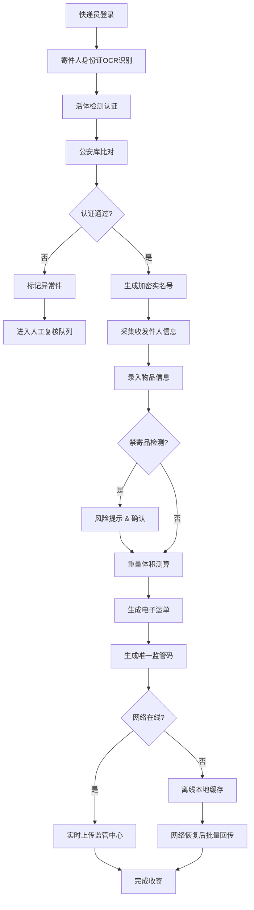

# 国家邮政业实名寄递数字监管平台 - 收寄端系统 PRD

## 1. 产品概述

国家邮政业实名寄递数字监管平台收寄端系统，聚焦快递员现场作业提效与合规留痕。通过身份证OCR识别+活体检测双因子认证、运单结构化采集、电子运单生成、异常件智能标记等核心能力，实现快递实名寄递全流程数字化监管，所有敏感信息符合等保三级加密存储要求。

- **核心目标**：提升快递员现场作业效率，确保实名寄递合规落地，实现全流程可追溯监管
- **目标用户**：快递收寄人员、网点管理员、区域监管员、总部审计人员
- **市场价值**：满足国家邮政局对快递业实名寄递的强制监管要求，降低企业合规风险

## 2. 核心功能

### 2.1 用户角色

| 角色 | 注册方式 | 核心权限 |
|------|----------|----------|
| 快递员 | 网点管理员创建 | 收寄作业、实名认证、运单录入、离线作业 |
| 网点管理员 | 区域管理员创建 | 本网点人员管理、异常复核、数据统计、指令接收 |
| 区域监管员 | 总部创建 | 辖区内网点数据查看、监管指令下发、审计追溯 |
| 总部审计员 | 超级管理员创建 | 全量数据查看、日志审计、权限管理、系统配置 |

### 2.2 功能模块

1. **登录认证页**：账号密码登录、角色权限识别、安全会话管理
2. **首页仪表盘**：今日收寄统计、待办异常、监管通知、快捷入口
3. **实名认证页**：身份证OCR识别、活体检测、公安库比对、加密实名号生成
4. **运单采集页**：收发件人信息、物品信息、禁寄品提示、重量体积测算
5. **电子运单页**：电子运单生成、唯一监管码、打印/分享、离线缓存
6. **异常件处理页**：异常件列表、标记分类、人工复核、处理记录
7. **后台管理 - 人员权限**：用户管理、角色分配、数据权限分级
8. **后台管理 - 日志审计**：操作日志、登录日志、数据变更追溯
9. **后台管理 - 监管指令**：指令接收、执行反馈、闭环跟踪
10. **后台管理 - 数据统计**：多维度统计报表、可视化图表、导出功能

### 2.3 页面详情

| 页面名称 | 模块名称 | 功能描述 |
|----------|----------|----------|
| 登录认证页 | 登录表单 | 账号密码输入、验证码、登录状态保持、错误提示 |
| 登录认证页 | 安全提示 | 系统安全等级标识、等保三级合规说明 |
| 首页仪表盘 | 数据概览 | 今日收寄量、实名认证率、异常件数量、监管通知 |
| 首页仪表盘 | 快捷入口 | 快速收寄、实名认证、异常处理、运单查询 |
| 首页仪表盘 | 待办列表 | 待复核异常件、待执行监管指令、近期操作记录 |
| 实名认证页 | 身份证OCR | 证件拍照/上传、OCR识别、信息回显、手动修正 |
| 实名认证页 | 活体检测 | 摄像头调用、动作指令、人脸比对、活体评分 |
| 实名认证页 | 实名结果 | 公安库比对状态、加密实名号生成、历史记录 |
| 运单采集页 | 收发件人 | 姓名、手机号、地址、实名号关联、历史选择 |
| 运单采集页 | 物品信息 | 品类选择、数量、声明价值、禁寄品智能提示 |
| 运单采集页 | 重量体积 | 手动输入/辅助测算、运费估算 |
| 电子运单页 | 运单展示 | 完整运单信息、唯一监管码二维码、电子签名 |
| 电子运单页 | 离线功能 | 本地缓存、网络检测、恢复后批量回传、同步状态 |
| 异常件处理页 | 异常列表 | 异常分类筛选、状态流转、优先级标记 |
| 异常件处理页 | 人工复核 | 证件存疑比对、地址模糊校验、复核结论记录 |
| 人员权限页 | 用户管理 | 用户增删改查、状态管理、所属网点分配 |
| 人员权限页 | 角色权限 | 角色定义、菜单权限、数据权限（辖区隔离） |
| 日志审计页 | 操作日志 | 操作类型、操作人、时间、IP、操作详情检索 |
| 日志审计页 | 登录日志 | 登录/登出记录、登录地点、设备信息、异常登录告警 |
| 监管指令页 | 指令列表 | 上级指令接收、状态跟踪、截止时间、优先级 |
| 监管指令页 | 执行反馈 | 执行情况填写、附件上传、审核确认、闭环管理 |
| 数据统计页 | 统计报表 | 收寄量、实名率、异常率、网点排名等多维度统计 |
| 数据统计页 | 可视化图表 | 趋势图、饼图、柱状图、热力图、数据导出 |

## 3. 核心流程

### 3.1 快递收寄主流程

快递员登录系统后，首先对寄件人进行身份证OCR识别和活体检测双因子认证，系统自动比对公安库并生成加密实名号。认证通过后采集收发件人信息和物品详情，系统智能提示禁寄品风险并辅助测算重量体积。确认无误后生成含唯一监管码的电子运单，支持离线缓存待网络恢复后批量回传。如遇证件存疑或地址模糊等异常情况，自动标记进入人工复核队列。

### 3.2 监管指令闭环流程

## 4. 用户界面设计

### 4.1 设计风格

- **主色调**：邮政绿 (#006F3C) - 体现行业属性与权威感
- **辅助色**：安全蓝 (#1E40AF) 用于监管与认证模块
- **警示色**：警示橙 (#F59E0B) 用于异常提示，危险红 (#DC2626) 用于严重违规
- **中性色**：深灰 (#1F2937)、中灰 (#6B7280)、浅灰 (#F3F4F6)
- **按钮风格**：圆角矩形（rounded-lg），主按钮带渐变效果和微阴影，hover时有轻微上浮动画
- **字体**：标题使用思源黑体（Source Han Sans CN）Bold，正文使用思源黑体 Regular，数据展示使用等宽字体（JetBrains Mono）
- **布局风格**：左侧导航栏 + 顶部状态栏 + 主内容区，卡片式布局，信息分组清晰
- **图标风格**：使用 Lucide 线性图标，保持统一线宽和视觉风格
- **整体定位**：专业、权威、高效的政务监管系统，简洁稳重不花哨，强调信息密度与操作效率

### 4.2 页面设计概览

| 页面名称 | 模块名称 | UI元素 |
|----------|----------|--------|
| 登录认证页 | 登录表单 | 邮政绿渐变背景，中央卡片式登录框，左侧品牌展示区，右侧表单区，安全加密标识 |
| 首页仪表盘 | 数据概览 | 顶部4个统计卡片（带趋势指标），中部待办列表与通知区，底部快捷入口宫格 |
| 实名认证页 | 识别区域 | 左侧摄像头/上传预览区，右侧识别结果表单区，双栏布局，实时状态指示 |
| 运单采集页 | 表单区域 | 分步表单（收发件人→物品→重量→确认），步骤指示器，表单验证实时反馈 |
| 电子运单页 | 运单展示 | 模拟纸质运单布局，监管码二维码突出显示，加密信息脱敏展示，打印/下载按钮 |
| 异常件处理页 | 异常列表 | 表格布局，状态标签彩色区分，优先级徽章，行内快捷操作按钮 |
| 人员权限页 | 权限矩阵 | 左侧角色树，右侧权限矩阵表格，行展开显示详细权限配置 |
| 日志审计页 | 日志列表 | 高级筛选器，时间范围选择，表格带斑马纹，详情抽屉面板 |
| 监管指令页 | 指令列表 | 卡片列表布局，状态进度条，优先级颜色区分，详情弹窗 |
| 数据统计页 | 图表区域 | 顶部筛选条件，下方多图表网格布局（趋势图+占比饼图+柱状对比） |

### 4.3 响应式设计

- **设计策略**：桌面端优先（Desktop-first），兼顾平板横屏适配
- **核心断点**：
  - ≥1280px：完整双栏/三栏布局，信息密度最高
  - 1024px-1279px：标准布局，适当调整间距
  - 768px-1023px：平板适配，侧边栏可折叠
- **触控优化**：
  - 主要操作按钮尺寸 ≥44px × 44px
  - 列表行高适当增加，便于触控选择
  - 表单输入框增大内边距，避免误触

### 4.4 视觉动效

- **页面加载**：骨架屏渐显过渡，避免白屏闪烁
- **按钮交互**：hover 时轻微上浮（translateY(-1px)）+ 阴影加深，click 时按压反馈
- **数据刷新**：数字滚动动画，图表渐进式绘制
- **状态切换**：Tab 切换使用滑动下划线，模态框使用淡入+缩放
- **认证流程**：活体检测时增加扫描线动画，认证成功显示打勾动效
