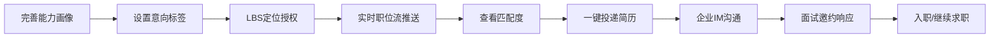

# 垂直服务业智能人才匹配中台 - 产品需求文档

## 1. 产品概述

本产品是面向垂直服务业的智能人才匹配中台，覆盖酒店、餐饮、美业、康养、零售、电商六类业态。通过AI驱动的双向匹配机制，连接企业端用工需求与求职者端能力供给，解决服务业用工难、求职匹配效率低的核心痛点。

- **核心价值**：基于行业知识图谱和多维画像，实现人岗精准匹配，提升招聘效率300%以上
- **目标用户**：企业HR、门店店长、求职者、平台运营管理员
- **市场定位**：垂直服务业SaaS级招聘中台，支持多租户企业入驻

## 2. 核心功能

### 2.1 用户角色

| 角色 | 注册方式 | 核心权限 |
|------|----------|----------|
| 企业HR | 企业资质审核入驻 | 发布JD、查看候选池、发起面试、查看效能看板 |
| 求职者 | 手机号+实名认证 | 完善能力画像、浏览职位流、投递简历、IM沟通 |
| 门店店长 | 企业管理员邀请 | 门店用工需求提交、排班管理、本门店招聘数据 |
| 平台管理员 | 内部账号 | 企业入驻审核、风控管理、区域用工预警、系统配置 |

### 2.2 功能模块

1. **企业端工作台**：JD智能生成器、候选人才池、IM通讯中心、招聘效能看板
2. **求职者端门户**：实时职位流、LBS附近岗位、能力画像中心、视频简历、IM会话
3. **AI匹配引擎**：双向智能匹配、用人痛点分析、技能雷达匹配、行业知识图谱
4. **即时通讯模块**：加密会话、面试邀约、状态同步、消息通知
5. **后台管理中心**：企业入驻审核、虚假信息风控、区域用工热度预警

### 2.3 页面详情

| 页面名称 | 模块名称 | 功能描述 |
|----------|----------|----------|
| 企业端-首页 | 数据概览 | 招聘进度总览、待处理事项、今日推荐候选人 |
| 企业端-JD生成 | 智能JD编辑器 | 用人痛点输入→AI生成JD、技能雷达图配置、薪资结构设置 |
| 企业端-候选池 | 人才列表 | 匹配度排序、多维筛选、批量邀约、人才标签管理 |
| 企业端-IM中心 | 会话列表 | 加密聊天、面试邀约发送、面试状态同步、简历附件 |
| 企业端-效能看板 | 数据可视化 | 岗位填补周期、渠道转化漏斗、人才留存追踪、招聘成本分析 |
| 求职者端-首页 | 职位流 | 实时推荐职位、LBS附近岗位、意向标签筛选、下拉刷新 |
| 求职者端-我的画像 | 能力中心 | 证书上传、经验档案、服务场景适配度、视频简历录制 |
| 求职者端-IM | 消息中心 | 企业消息、面试提醒、offer通知、加密会话 |
| 求职者端-职位详情 | 岗位信息 | 技能雷达匹配度、薪资结构、排班弹性、一键投递 |
| 管理端-企业审核 | 入驻管理 | 企业资质审核、营业执照OCR、行业认证校验 |
| 管理端-风控中心 | 风控引擎 | 虚假信息检测、异常行为监控、风险评分、黑名单管理 |
| 管理端-用工预警 | 热力分析 | 区域用工热度、业态供需分析、缺口预警、趋势预测 |

## 3. 核心流程

### 3.1 企业招聘流程

企业HR输入用人痛点（如"急需3名有3年以上五星级酒店前厅经验的前台，能接受三班倒"）→ AI解析生成标准JD（含技能雷达图、排班弹性度、薪资结构）→ 系统自动匹配候选池 → HR查看候选人画像 → 发起IM沟通 → 发送面试邀约 → 状态同步 → 录用 → 入职追踪。

### 3.2 求职者求职流程

求职者完善能力画像（证书、工作经验、服务场景、视频简历）→ 设置意向标签+LBS定位 → 系统实时推送匹配职位流 → 查看职位详情与匹配度 → 一键投递 → 企业IM沟通 → 面试邀约接受/拒绝 → 入职状态更新。

## 4. 用户界面设计

### 4.1 设计风格

**设计方向**：专业轻奢风 - 融合现代企业级SaaS的专业感与服务业的人文温度

- **主色调**：深海蓝 `#1E3A5F`（专业、可信赖）
- **辅助色**：珊瑚橙 `#FF6B6B`（活力、服务属性）
- **点缀色**：薄荷绿 `#4ECDC4`（成长、积极）
- **中性色**：炭灰 `#2D3436`、浅灰 `#F5F6FA`、纯白 `#FFFFFF`

**字体选择**：
- 标题字体：`Noto Serif SC`（高端、专业的衬线字体，提升品牌质感）
- 正文字体：`Inter`（清晰易读的无衬线字体，确保信息传达效率）

**按钮风格**：
- 主按钮：圆角8px，微渐变填充，悬停上浮+阴影扩散
- 次按钮：细边框+透明背景，悬停填充淡色
- 图标按钮：圆形，点击涟漪效果

**布局风格**：
- 侧边导航+内容区的经典企业级布局
- 卡片式内容容器，圆角12px，柔和投影
- 数据看板采用网格化布局，错落有致的信息密度
- 大面积留白营造呼吸感，关键信息视觉聚焦

**图标风格**：
- 使用 lucide-react 线性图标
- 关键操作使用渐变填充图标增强识别度
- 状态指示器使用彩色小圆点+微动效

### 4.2 页面设计概述

| 页面名称 | 模块名称 | UI元素 |
|----------|----------|----------|
| 企业端-首页 | 数据概览 | 渐变数据卡片、环形进度图、微交互动效、待办事项时间线 |
| 企业端-JD生成 | 智能编辑器 | 大文本输入区、AI打字机动效、技能雷达图、滑块调节器、实时预览 |
| 企业端-候选池 | 人才列表 | 头像卡片、匹配度环形进度条、标签云、筛选抽屉、批量操作栏 |
| 企业端-IM中心 | 会话列表 | 左右分栏、未读红点、消息气泡、在线状态、输入指示器 |
| 企业端-效能看板 | 数据可视化 | 趋势折线图、转化漏斗图、热力地图、数据卡片动效、时间筛选器 |
| 求职者端-首页 | 职位流 | 瀑布流卡片、匹配度徽章、LBS距离标签、下拉刷新动画、滑动操作 |
| 求职者端-我的画像 | 能力中心 | 头像上传、证书墙、经验时间轴、视频简历播放器、适配度雷达图 |
| 管理端-风控中心 | 风控引擎 | 风险仪表盘、异常告警列表、评分滑块、黑白名单切换 |
| 管理端-用工预警 | 热力分析 | 中国地图热力图、业态对比柱状图、趋势预测曲线、预警指示器 |

### 4.3 响应式设计

- **设计策略**：Desktop-first，移动端适配
- **断点设置**：1440px（桌面端）、1024px（平板横屏）、768px（平板竖屏）、480px（手机）
- **移动端优化**：侧边导航收起为底部Tab栏，数据看板转为纵向滚动列表，表单输入优化触控区域

### 4.4 动效与交互

- **页面加载**：骨架屏渐入 → 内容错落延迟显示（stagger 50ms）
- **卡片悬停**：上移2px + 阴影加深 + 边框高亮
- **数据更新**：数字滚动动画（countUp），图表路径绘制动画
- **匹配计算**：进度条加载 → 匹配度数字递增 → 雷达图绘制
- **IM消息**：消息气泡滑入，输入指示器三点跳动
- **导航切换**：内容区淡入淡出过渡
