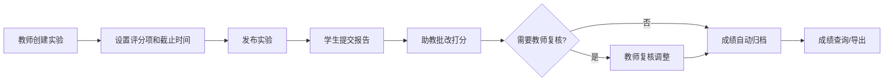

## 1. 产品概述

高校实验报告在线批改系统，面向高校实验课程场景，服务学生、助教、教师和课程管理员四类用户。实现实验任务管理、报告提交、在线批改、成绩归档全流程数字化，确保所有操作可追溯、可复核。

- 核心价值：解决传统纸质报告批改效率低、成绩管理混乱、批改过程不透明等问题
- 目标用户：高校学生、课程助教、授课教师、课程管理员

## 2. 核心功能

### 2.1 用户角色

| 角色 | 注册方式 | 核心权限 |
|------|----------|----------|
| 学生 | 管理员导入/自助注册 | 查看实验任务、提交报告、查看批改结果和成绩 |
| 助教 | 管理员导入 | 批改学生报告、打分、添加批注、退回修改 |
| 教师 | 管理员导入 | 管理实验任务、复核助教评分、查看班级成绩 |
| 课程管理员 | 系统预置 | 用户管理、课程/班级管理、系统配置、成绩导出 |

### 2.2 功能模块

1. **登录认证页**：用户登录、角色选择、密码修改
2. **实验任务管理**：实验创建、模板配置、评分项设置、版本管理
3. **报告提交中心**：报告上传、附件提交、迟交记录、撤回重交
4. **批改工作台**：按评分项打分、文本批注、附件查看、退回修改
5. **成绩管理中心**：成绩归档、教师复核、成绩调整记录、成绩导出
6. **管理后台**：用户管理、课程班级管理、系统配置

### 2.3 页面详情

| 页面名称 | 模块名称 | 功能描述 |
|-----------|-------------|---------------------|
| 登录页 | 登录表单 | 账号密码登录、角色选择、记住登录状态 |
| 学生首页 | 实验任务列表 | 展示待提交、已提交、已批改的实验任务 |
| 报告提交页 | 提交表单 | 上传报告文件、添加数据附件、截图、代码文件 |
| 批改工作台 | 批改界面 | 查看报告、按评分项打分、添加批注、退回/通过 |
| 成绩列表页 | 成绩展示 | 按课程/班级/批次筛选、查看批改详情、导出 |
| 实验管理页 | 任务配置 | 创建/编辑实验、设置评分项、配置模板、版本管理 |
| 用户管理页 | 用户CRUD | 添加/编辑/删除用户、批量导入、角色分配 |

## 3. 核心流程

### 3.1 实验发布流程
教师/管理员创建实验任务 → 配置实验目标、模板、截止时间、评分项 → 发布实验 → 版本记录

### 3.2 报告提交流程
学生查看实验任务 → 准备报告和附件 → 提交报告 → 系统记录提交时间/状态 → 支持撤回重交

### 3.3 报告批改流程
助教查看待批改报告 → 按评分项逐项打分 → 添加文本批注 → 提交评分/退回修改 → 教师可选复核

### 3.4 成绩归档流程
批改完成 → 成绩关联课程/班级/实验批次 → 记录评分版本 → 成绩调整需记录原因

## 4. 用户界面设计

### 4.1 设计风格
- **主色调**：学术蓝 (#1e40af)，体现高校教育的专业性
- **辅助色**：成功绿 (#10b981)、警告橙 (#f59e0b)、错误红 (#ef4444)
- **中性色**：灰白系列 (#f8fafc, #f1f5f9, #e2e8f0, #94a3b8, #64748b, #334155)
- **按钮风格**：圆角 6px，hover 状态阴影和颜色加深
- **字体**：系统字体栈，标题 16-20px，正文 14px，说明文字 12px
- **布局风格**：顶部导航 + 侧边栏 + 内容区卡片式布局
- **图标风格**：Lucide 线性图标

### 4.2 页面设计概述

| 页面名称 | 模块名称 | UI 元素 |
|-----------|-------------|-------------|
| 登录页 | 登录卡片 | 居中卡片、Logo、表单输入、登录按钮、角色切换 |
| 实验列表页 | 任务卡片 | 状态标签、截止时间倒计时、提交状态、操作按钮 |
| 批改工作台 | 双栏布局 | 左侧报告预览、右侧评分面板、批注区域 |
| 成绩列表页 | 数据表格 | 筛选器、分页、行内详情、导出按钮 |
| 实验配置页 | 表单布局 | 分区块表单、评分项动态添加、版本历史 |

### 4.3 响应式
- 桌面端优先设计（1280px 以上）
- 平板端（768-1279px）：侧边栏折叠，内容区自适应
- 移动端（< 768px）：单列布局，底部导航

### 4.4 交互细节
- 提交截止时间倒计时动画
- 批改打分实时计算总分
- 批注高亮联动
- 成绩调整弹窗记录原因
- 数据加载骨架屏
