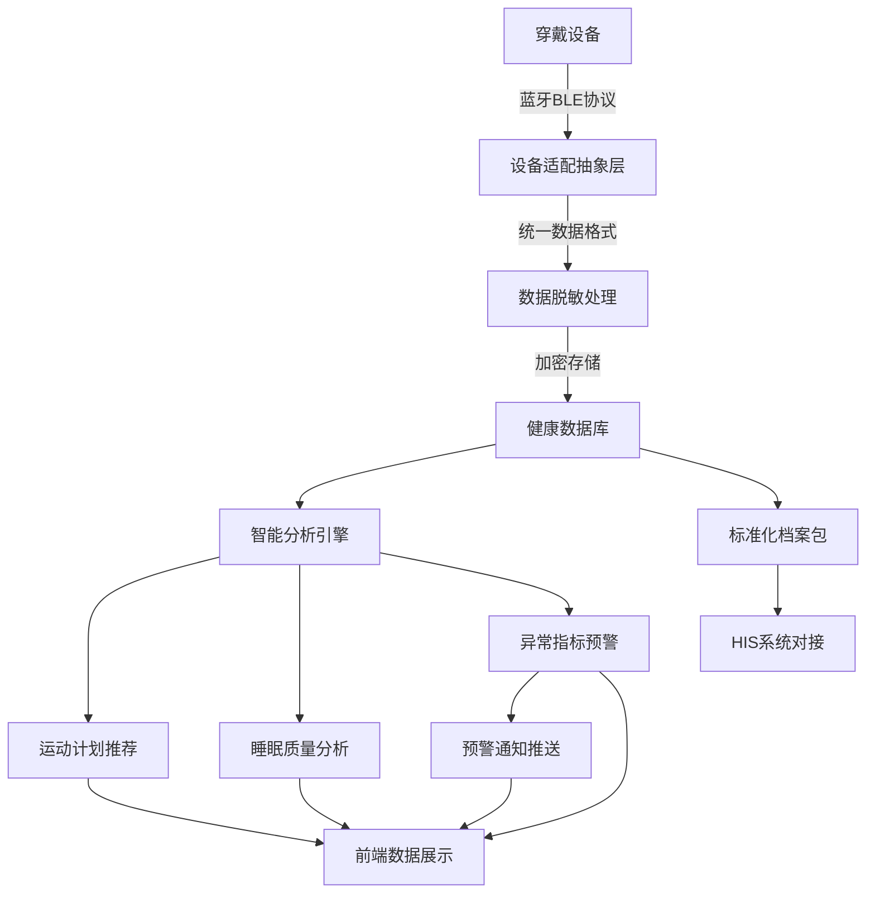

## 1. 产品概述

穿戴设备健康数据中台——面向个人用户与医疗机构的智能健康数据管理平台，通过蓝牙协议直连多品牌手环/手表，实时采集运动轨迹、心率变异性（HRV）、睡眠分期、压力指数等原始生理信号，并提供个性化运动计划推荐、睡眠质量趋势分析、异常生理指标预警等智能服务，同时支持与医院HIS系统对接，输出标准化健康档案包。

- 目标用户：注重健康管理的个人用户、需要远程监测的慢病患者、健康管理机构、医院门诊
- 核心价值：打通穿戴设备数据孤岛，实现多源异构健康数据的标准化采集、智能分析与安全共享

## 2. 核心功能

### 2.1 用户角色

| 角色 | 注册方式 | 核心权限 |
|------|----------|----------|
| 普通用户 | 手机号/邮箱注册 | 绑定设备、查看个人健康数据、接收预警、导出健康档案 |
| 健康管理员 | 机构邀请注册 | 管理分组用户、查看群体健康报告、配置预警规则 |
| 系统管理员 | 后台分配 | 设备协议管理、数据脱敏策略配置、HIS对接管理 |

### 2.2 功能模块

1. **数据总览仪表盘**：设备连接状态、实时生理指标卡片、今日健康评分、异常预警摘要
2. **设备管理中心**：蓝牙设备扫描与绑定、多品牌设备适配、固件升级提示、连接状态监控
3. **运动健康模块**：运动轨迹地图、运动数据统计、个性化运动计划推荐、历史完成率追踪
4. **睡眠分析模块**：睡眠分期可视化（深睡/浅睡/REM）、睡眠质量趋势图、环境噪音关联提示、睡眠改善建议
5. **生理监测模块**：心率变异性（HRV）趋势、压力指数追踪、静息心率异常预警、血氧饱和度监测
6. **预警中心**：实时异常预警弹窗、预警规则配置、预警历史记录、预警分级管理
7. **健康档案模块**：标准化健康档案包导出、医院HIS预约挂号对接、数据脱敏与授权管理

### 2.3 页面详情

| 页面名称 | 模块名称 | 功能描述 |
|----------|----------|----------|
| 数据总览 | 实时指标卡片 | 显示心率、血氧、压力指数、步数等实时数据，带动态波形动画 |
| 数据总览 | 健康评分仪表盘 | 综合评分环形图，分数动态渐变，颜色映射健康等级 |
| 数据总览 | 预警摘要条 | 滚动显示最近异常预警，红色脉冲动画提示紧急程度 |
| 数据总览 | 设备连接状态 | 显示已绑定设备列表及蓝牙连接状态，断连时闪烁提醒 |
| 设备管理 | 设备扫描列表 | 蓝牙扫描附近设备，显示设备名、品牌、信号强度 |
| 设备管理 | 设备绑定流程 | 引导式绑定流程：扫描→选择→配对→同步，含进度动画 |
| 设备管理 | 多设备切换 | 已绑定设备列表，支持快速切换当前活跃设备 |
| 运动健康 | 运动轨迹地图 | 基于GPS轨迹的地图可视化，路线渐变色映射心率强度 |
| 运动健康 | 运动数据面板 | 配速、距离、卡路里、心率区间分布等运动指标统计 |
| 运动健康 | 运动计划推荐 | 基于历史完成率与恢复状态的个性化周计划卡片，含难度标签 |
| 运动健康 | 完成率追踪 | 计划完成率日历热力图，颜色深浅映射完成程度 |
| 睡眠分析 | 睡眠分期图 | 横向堆叠条形图展示深睡/浅睡/REM/清醒各阶段时长占比 |
| 睡眠分析 | 睡眠趋势图 | 7天/30天睡眠质量折线趋势，含平均线与标准差区域 |
| 睡眠分析 | 环境噪音关联 | 睡眠质量与噪音水平的叠加对比图，标注噪音异常时段提示 |
| 睡眠分析 | 改善建议卡片 | 基于睡眠数据的AI改善建议，含环境调节提示 |
| 生理监测 | HRV趋势图 | 心率变异性时域/频域指标趋势，含基准线与异常区域标注 |
| 生理监测 | 压力指数追踪 | 压力等级仪表盘与日间变化曲线，高压力时段标红 |
| 生理监测 | 静息心率预警 | 静息心率突增>20%持续2小时触发红色预警横幅 |
| 生理监测 | 血氧监测 | 血氧饱和度实时值与趋势，低于阈值自动预警 |
| 预警中心 | 实时预警面板 | 按紧急程度分级的预警卡片列表，支持确认与忽略操作 |
| 预警中心 | 预警规则配置 | 自定义预警阈值与触发条件，含预设模板（心率异常、血氧低等） |
| 预警中心 | 预警历史记录 | 可筛选的预警历史时间线，含处理状态标记 |
| 健康档案 | 档案包导出 | 生成符合《移动健康终端设备数据交互规范》的标准化健康档案 |
| 健康档案 | HIS预约挂号 | 与医院HIS系统对接的预约挂号入口，支持科室与医生选择 |
| 健康档案 | 数据授权管理 | 脱敏数据授权分享设置，支持授权期限与范围控制 |

## 3. 核心流程

### 3.1 设备绑定与数据采集流程
用户打开设备管理页→系统通过Web Bluetooth API扫描附近设备→用户选择目标设备→发起蓝牙配对请求→配对成功后建立GATT连接→订阅特征值通知→实时接收生理数据原始信号→数据经协议适配层解析→存入脱敏数据库→触发数据更新事件→前端刷新展示

### 3.2 异常预警触发流程
数据采集层持续接收生理信号→与用户基准值比对→检测到异常（如静息心率突增>20%）→启动持续时间计时器→异常持续达阈值（如2小时）→生成预警事件→推送至预警中心→前端弹出预警通知→记录预警日志

### 3.3 健康档案输出流程
用户选择档案时间范围→系统从脱敏数据库提取数据→按《移动健康终端设备数据交互规范》格式化→生成标准化JSON/PDF档案包→用户确认导出或授权分享→可选推送至医院HIS系统

## 4. 用户界面设计

### 4.1 设计风格

- **主色调**：深海蓝 (#0A1628) + 活力青绿 (#00E5A0)，营造专业医疗与科技感
- **辅助色**：预警红 (#FF4757)、琥珀黄 (#FFBE0B)、冷灰 (#6B7280)
- **按钮风格**：圆角胶囊按钮，主操作使用青绿渐变填充，次操作使用描边样式
- **字体方案**：标题使用 DIN Alternate（数字数据展示），正文使用 PingFang SC
- **布局风格**：左侧固定导航 + 右侧内容区，卡片式模块布局，数据可视化优先
- **图标风格**：线性图标配合微渐变，医疗/科技主题
- **数据可视化**：深色背景 + 发光效果数据线，类似医疗监护仪风格

### 4.2 页面设计概述

| 页面名称 | 模块名称 | UI要素 |
|----------|----------|--------|
| 数据总览 | 实时指标卡片 | 深色卡片、数据数字DIN字体、脉冲动画边框、渐变进度环 |
| 数据总览 | 健康评分仪表盘 | SVG环形进度条、颜色渐变映射（红→黄→绿）、中心大数字 |
| 数据总览 | 预警摘要条 | 红色左边框卡片、闪烁指示灯、滑入动画 |
| 数据总览 | 设备连接状态 | 设备图标+信号强度条、连接态绿色脉冲、断连态红色闪烁 |
| 设备管理 | 设备扫描列表 | 扫描雷达动画背景、设备卡片列表、信号强度指示 |
| 设备管理 | 设备绑定流程 | 步骤进度条、配对动画（两个圆环靠近融合）、成功对勾动画 |
| 运动健康 | 运动轨迹地图 | 深色地图底图、轨迹线条渐变色（绿→黄→红映射心率）、里程标注 |
| 运动健康 | 运动计划推荐 | 周计划时间轴卡片、难度等级色标、完成状态勾选动画 |
| 运动健康 | 完成率追踪 | 日历热力图、色阶从浅青到深绿、悬停显示详情 |
| 睡眠分析 | 睡眠分期图 | 横向堆叠条（深蓝深睡/浅蓝浅睡/紫色REM/灰色清醒）、时间轴 |
| 睡眠分析 | 睡眠趋势图 | 面积折线图、渐变填充、平均线虚线、标准差半透明区域 |
| 睡眠分析 | 环境噪音关联 | 双Y轴叠加图、噪音区域橙色高亮、关联提示气泡 |
| 生理监测 | HRV趋势图 | 折线图+面积填充、基准线标注、异常区域红色底色 |
| 生理监测 | 压力指数追踪 | 半圆仪表盘、指针动画、色区分段（低/中/高/极高） |
| 生理监测 | 静息心率预警 | 红色横幅通知条、心跳图标脉冲动画、倒计时显示 |
| 预警中心 | 实时预警面板 | 分级色标卡片（红/橙/黄）、确认/忽略按钮、时间戳 |
| 预警中心 | 预警规则配置 | 表单式配置、阈值滑块、预设模板选择卡片 |
| 健康档案 | 档案包导出 | 时间范围选择器、数据类型勾选、导出格式切换、进度条 |
| 健康档案 | HIS预约挂号 | 医院选择→科室选择→医生列表→时段选择，步骤卡片布局 |
| 健康档案 | 数据授权管理 | 授权对象卡片、权限开关、有效期倒计时、撤销确认弹窗 |

### 4.3 响应式设计

- 桌面优先设计，核心数据面板在 1440px 宽度最佳展示
- 平板端（768-1024px）：侧边栏折叠为底部Tab导航，卡片改为两列布局
- 移动端（< 768px）：单列卡片布局，数据图表切换为简化视图，手势滑动切换模块
- 触屏优化：图表支持捏合缩放、横滑切换时间范围

### 4.4 3D场景指导

- 本项目无需3D场景，采用2D数据可视化为主
- 数据可视化风格参考医疗监护仪：深色背景、发光数据线、脉冲动画
- 关键动画：心率波形实时描记、设备扫描雷达、预警脉冲扩散
