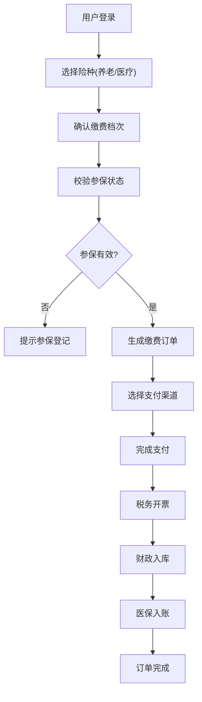
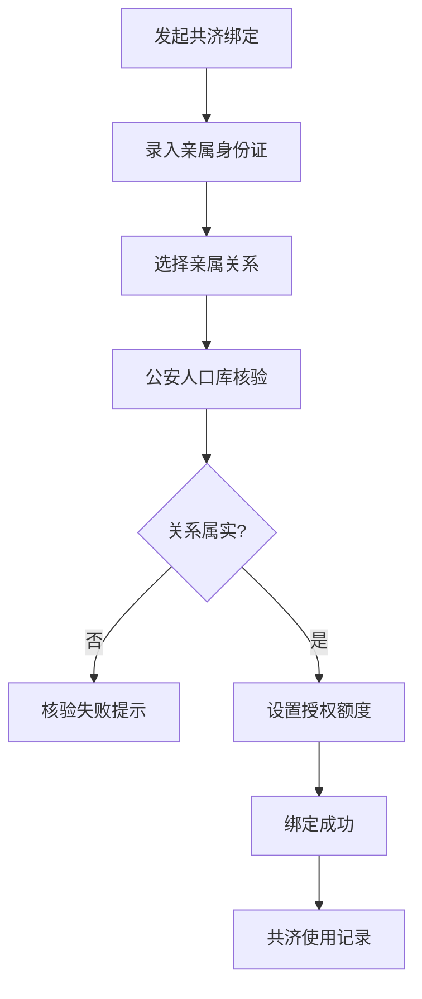

## 1. 产品概述

湖南省社保费税务征缴一体化服务平台，以自然人税收管理系统为底层支撑，为湖南省城乡居民提供全险种社保缴费服务。平台覆盖城乡居民养老保险、医疗保险、灵活就业人员社保等业务，实现多渠道缴费、订单全链路追踪、家庭共济账户绑定、参保信息查询、待遇发放明细、政策计算器等核心功能，同时为税务管理人员提供稽核规则配置、异常预警、跨部门数据共享沙箱等后台管理能力。

## 2. 核心功能

### 2.1 用户角色

| 角色 | 登录方式 | 核心权限 |
|------|----------|----------|
| 城乡居民 | 身份证+手机号登录 | 参保查询、社保缴费、家庭共济绑定、待遇查询、政策测算 |
| 灵活就业人员 | 身份证+手机号登录 | 参保登记、自主选档缴费、缴费记录查询、待遇预估 |
| 税务管理员 | 工号+权限密码 | 稽核规则配置、异常缴费处理、数据统计分析 |
| 运营管理员 | 工号+权限密码 | 系统配置、用户管理、跨部门数据共享管理 |

### 2.2 功能模块

1. **首页导航**：服务入口卡片、快捷缴费、待办提醒、政策公告
2. **参保登记查询**：参保状态、缴费档次、补贴享受、参保历史
3. **社保缴费中心**：险种选择、缴费档次确认、多渠道支付、订单管理
4. **家庭共济账户**：亲属关系核验、额度授权、共济使用记录
5. **待遇发放中心**：养老金发放明细、医保个人账户、待遇资格认证
6. **政策计算器**：养老金预估、缴费档次对比、补贴测算
7. **税务管理后台**：金税三期接口配置、稽核规则配置、异常缴费预警
8. **数据共享管理**：跨部门数据比对、共享沙箱、数据质量监控

### 2.3 页面详情

| 页面名称 | 模块名称 | 功能描述 |
|---------|----------|----------|
| 首页 | 服务导航区 | 九宫格服务入口、快捷缴费按钮、待缴费提醒轮播 |
| 首页 | 个人信息区 | 参保状态展示、最近缴费记录、政策公告滚动 |
| 参保查询页 | 参保信息卡片 | 养老保险参保状态、缴费档次、累计缴费月数、政府补贴 |
| 参保查询页 | 参保历史时间轴 | 历年参保记录、断缴标记、补缴入口 |
| 缴费中心页 | 险种选择 | 养老/医疗/灵活就业险选择、缴费年度、缴费档次 |
| 缴费中心页 | 支付渠道 | 微信支付、支付宝、数字人民币、银行代扣四选一 |
| 缴费中心页 | 订单列表 | 待支付、已支付、已取消订单状态，支持重试和退款 |
| 家庭共济页 | 亲属绑定 | 身份证核验、亲属关系选择（父母/子女/配偶）、绑定审批 |
| 家庭共济页 | 额度授权 | 授权额度设置、使用记录查询、授权变更 |
| 待遇发放页 | 养老金明细 | 月度发放记录、发放银行、待遇调整历史 |
| 待遇发放页 | 医保账户 | 个人账户余额、消费记录、入账明细 |
| 政策计算器页 | 养老金测算 | 输入缴费年限、缴费档次、预计退休年龄，输出预估养老金 |
| 政策计算器页 | 缴费对比 | 不同缴费档次15年/20年/30年收益对比图表 |
| 异常预警页 | 预警列表 | 断缴超3个月自动提醒、缴费异常标记、处理状态 |
| 稽核规则页 | 规则配置 | 稽核条件设置、风险等级、预警阈值配置 |
| 数据共享页 | 沙箱管理 | 卫健/民政/公安人口库比对、数据校验报告、异常数据处理 |

## 3. 核心流程

### 3.1 社保缴费主流程

用户登录后选择险种和缴费档次，系统校验参保状态，生成缴费订单，用户选择支付渠道完成支付，系统同步税务开票、财政入库、医保入账三端状态，用户可实时查看订单状态。

### 3.2 家庭共济绑定流程

用户提交亲属信息，系统通过公安人口库核验亲属关系，核验通过后设置共济授权额度，绑定成功后共济账户可用于亲属医保报销。

## 4. 用户界面设计

### 4.1 设计风格

- **主色调**：政务蓝 #165DFF（代表税务专业、可信）
- **辅助色**：金色 #FFB020（代表社保民生、保障）、绿色 #00B42A（代表成功、健康）
- **警示色**：红色 #F53F3F（异常预警）、橙色 #FF7D00（待办提醒）
- **按钮风格**：圆角8px，主按钮渐变蓝，悬停有微动效
- **字体**：标题使用 Noto Serif SC（庄重正式），正文使用 PingFang SC（清晰易读）
- **布局风格**：卡片式布局，顶部导航+侧边菜单，信息密度适中
- **图标风格**：线性图标，统一2px描边，政务简约风格

### 4.2 页面设计概览

| 页面名称 | 模块名称 | UI元素 |
|---------|----------|--------|
| 首页 | 服务导航区 | 渐变背景banner，3×3九宫格卡片，hover上浮动效 |
| 参保查询页 | 参保信息卡片 | 蓝金配色，状态标签，进度条展示缴费年限，时间轴记录 |
| 缴费中心页 | 支付渠道 | 四宫格支付图标，微信绿/支付宝蓝/数币红/银行灰，选中高亮 |
| 政策计算器页 | 测算表单 | 滑块选择缴费年限，下拉选档次，实时计算结果，ECharts对比图表 |
| 异常预警页 | 预警列表 | 红色圆点标记高风险，表格支持筛选，处理状态标签 |
| 数据共享页 | 沙箱监控 | 数据流向图，三部门比对进度条，异常数据高亮 |

### 4.3 响应式设计

- 桌面端优先设计，1920px基准，适配1440px、1366px
- 侧边菜单在窄屏自动折叠为图标模式
- 表格在小屏转为卡片列表展示
- 触控区域最小44×44px，适配触摸屏操作
