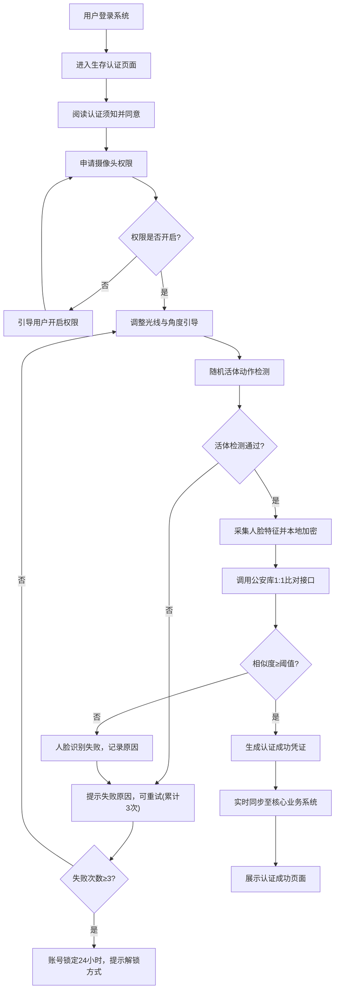
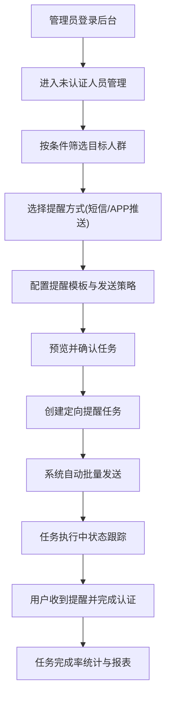

## 1. 产品概述
省级人社公共服务可信数字平台，面向广西壮族自治区参保人员，提供社保权益查询与线上生存认证服务。平台对接广西政务云桂事通身份认证体系与国家社会保险公共服务平台，实现"一网通办、数据可信、安全合规"的人社公共服务数字化转型。

### 核心价值
- **便民服务**：参保人员足不出户即可完成社保查询、待遇领取资格认证等业务
- **数据可信**：对接国家权威数据接口，确保数据准确性与时效性
- **安全合规**：生物特征数据本地加密、敏感信息脱敏展示、操作全链路审计
- **精细管理**：管理后台提供数据洞察与定向任务管理，提升政务服务效能

---

## 2. 核心功能

### 2.1 用户角色

| 角色 | 注册方式 | 核心权限 |
|------|----------|----------|
| 参保用户 | 桂事通实名认证 | 社保权益查询、生存认证、个人中心 |
| 运营管理员 | 后台账号登录 | 数据看板、任务管理、审计日志、系统设置 |
| 系统审计员 | 后台账号登录 | 操作审计、合规检查、日志导出 |

### 2.2 功能模块

**前端用户端（参保人员）**
1. **登录/认证页**：桂事通统一认证入口，人脸识别登录
2. **用户首页**：个人信息概览、快捷功能入口、待办提醒
3. **社保权益查询**：养老/失业/工伤/生育四险种明细查询
4. **数据对比分析**：缴费金额、账户余额同比/环比图表可视化
5. **线上生存认证**：活体检测 + 人脸识别 + 公安库比对
6. **个人中心**：认证记录、操作日志、安全设置

**管理后台（运营/审计）**
1. **数据总览**：认证通过率趋势、业务量统计、活跃用户
2. **认证分析**：通过率趋势图、失败原因分布、地区热力图
3. **高频查询TOP10**：查询事项排行、用户行为分析
4. **任务流管理**：未认证人员定向提醒、任务派发、执行跟踪
5. **审计中心**：操作日志、异常告警、合规报表
6. **系统设置**：参数配置、角色权限、接口管理

### 2.3 页面详情

| 页面名称 | 模块名称 | 功能描述 |
|----------|----------|----------|
| 登录页 | 桂事通认证 | 调用广西政务云SDK，支持账号密码、人脸识别、短信验证码三种方式 |
| 登录页 | 安全提示 | 认证失败3次锁定提示、锁定倒计时、解锁指引 |
| 用户首页 | 信息概览卡 | 脱敏展示姓名、身份证号、参保状态、最近认证时间 |
| 用户首页 | 快捷入口 | 权益查询、生存认证、认证记录、帮助中心四个快捷卡片 |
| 用户首页 | 待办提醒 | 未认证提醒、待领取待遇通知、政策公告 |
| 权益查询 | 险种切换 | Tab切换养老/失业/工伤/生育四个险种 |
| 权益查询 | 缴费明细 | 分页列表展示缴费年月、缴费基数、个人缴费、单位缴费、缴费状态 |
| 权益查询 | 待遇发放 | 待遇项目、发放月份、发放金额、发放银行（脱敏）、到账状态 |
| 权益查询 | 账户余额 | 当前账户总额、累计缴费月数、个人账户/统筹账户拆分 |
| 权益查询 | 同比环比图表 | 12个月缴费趋势柱状图、同比增长率折线图、环形占比图 |
| 生存认证 | 活体检测引导 | 认证须知、光线提示、摄像头权限申请 |
| 生存认证 | 实人检测 | 随机动作指令（眨眼/摇头/张嘴/点头）、活体验证 |
| 生存认证 | 人脸识别比对 | 1:1人脸比对（活体采集照 vs 公安库照片）、相似度得分展示 |
| 生存认证 | 结果反馈 | 认证成功/失败页面、失败原因说明、重试引导 |
| 个人中心 | 认证记录 | 历史认证时间、认证方式、认证结果、操作IP |
| 个人中心 | 安全设置 | 修改密码、生物特征本地加密开关、登录设备管理 |
| 管理后台-数据总览 | KPI指标卡 | 今日认证量、通过率、本月累计、环比增长 |
| 管理后台-数据总览 | 认证通过率趋势 | 近30天通过率折线图、分地区对比 |
| 管理后台-高频查询 | TOP10排行 | 横向柱状图展示查询频次、点击量、用户数 |
| 管理后台-任务流 | 未认证人员列表 | 按地区/年龄/险种筛选，支持批量导出 |
| 管理后台-任务流 | 定向提醒任务 | 创建短信/APP推送任务、设置发送策略、任务进度跟踪 |
| 管理后台-审计中心 | 操作日志 | 全链路操作记录、支持多维度筛选、日志导出 |

---

## 3. 核心流程

### 3.1 用户生存认证流程

参保用户通过桂事通登录后，进入生存认证页面，经活体检测、人脸识别比对后，结果实时同步至核心业务系统。

### 3.2 未认证人员定向提醒任务流程

---

## 4. 用户界面设计

### 4.1 设计风格

- **主色调**：政务蓝 `#1E5FBE`，传递权威可信的政务形象
- **辅助色**：活力橙 `#FF7A18`（提醒/行动）、成功绿 `#00B578`（认证成功）、警示红 `#E53935`（失败/锁定）
- **中性色**：`#1A1A1A`（标题黑）、`#5A5A5A`（正文灰）、`#F5F7FA`（背景灰）、`#FFFFFF`（卡片白）
- **按钮风格**：圆角6px，主按钮蓝色渐变+微阴影，悬停时上移2px+阴影加深
- **字体**：主字体 PingFang SC / Microsoft YaHei；标题字重600，正文字重400；H1 24px，H2 20px，正文 14px，辅助文字 12px
- **布局风格**：卡片式布局，顶部导航+左侧菜单（管理后台），卡片边框1px+8px圆角+柔和阴影
- **图标风格**：线性图标（1.5px描边），统一24x24网格，蓝色系填充
- **动效**：页面切换200ms淡入，卡片悬停80ms上移+阴影过渡，图表数据加载500ms渐进动画

### 4.2 页面设计概述

| 页面名称 | 模块名称 | UI元素 |
|----------|----------|--------|
| 登录页 | 主视觉区 | 左侧品牌区：渐变蓝背景+广西山水装饰元素+平台标语；右侧登录卡：圆角白卡+阴影 |
| 用户首页 | 信息概览卡 | 蓝色渐变头部+脱敏姓名大号展示+社保状态标签+认证时间辅助信息 |
| 用户首页 | 快捷入口 | 4个图标卡片横向排列，悬停时图标放大+轻微上浮 |
| 权益查询 | 图表区 | ECharts多图联动：柱状图+折线图叠加，图例可交互切换，悬停显示详细数据 |
| 生存认证 | 检测区域 | 圆角取景框+实时摄像头预览+动作引导提示浮层+进度圆环 |
| 生存认证 | 结果页 | 成功态：绿色对勾动画+彩色纸屑粒子效果；失败态：红色警示图标+友好说明 |
| 管理后台 | 数据看板 | KPI卡片顶部一行展示+下方左右双栏布局：左趋势图右TOP10排行 |
| 管理后台 | 任务流 | 列表+详情抽屉模式，进度条可视化，操作按钮右侧固定 |
| 管理后台 | 审计日志 | 表格+时间轴双视图，重要操作高亮标记，筛选条件顶部常驻 |

### 4.3 响应式设计

- **设计策略**：Desktop-first，适配移动端（参保用户端重点适配）
- **断点**：Desktop ≥ 1280px，Tablet 768-1279px，Mobile < 768px
- **移动端适配**：
  - 导航栏转为底部Tab栏（首页/查询/认证/我的）
  - 图表组件自适应宽度，支持手势缩放
  - 生存认证页面全屏模式，按钮区域放大便于触控
  - 列表项转为卡片堆叠，减少水平滚动
- **触控优化**：所有可点击元素最小44x44px触控区域，重要操作间距≥12px

---

## 5. 安全合规设计

### 5.1 数据脱敏规则

| 数据类型 | 脱敏规则 | 示例 |
|----------|----------|------|
| 身份证号 | 前6后4保留，中间用*替代 | 450103********1234 |
| 姓名 | 姓保留，名用*替代（2字名保留首字，3字保留首尾） | 张* / 李*明 |
| 手机号码 | 前3后4保留，中间4位用*替代 | 138****5678 |
| 银行卡号 | 前4后4保留，中间用*替代 | 6222 **** **** 1234 |
| 家庭住址 | 保留至区县一级，详细地址用*替代 | 南宁市青秀区**** |

### 5.2 安全控制机制

- **认证失败锁定**：同一用户连续3次认证失败，账号锁定24小时；锁定期间可通过桂事通官方渠道人工解锁
- **生物特征安全**：人脸特征数据仅在设备本地加密存储（AES-256），原始照片与特征向量不上传服务器
- **操作留痕审计**：所有敏感操作（登录、查询、认证、修改设置）记录操作人、时间、IP、设备、操作结果
- **会话安全**：Token有效期30分钟，支持自动续期；异地登录二次验证；同一账号同时在线设备数≤3台
- **传输安全**：全站HTTPS加密，API请求签名验证，防止中间人攻击与重放攻击
