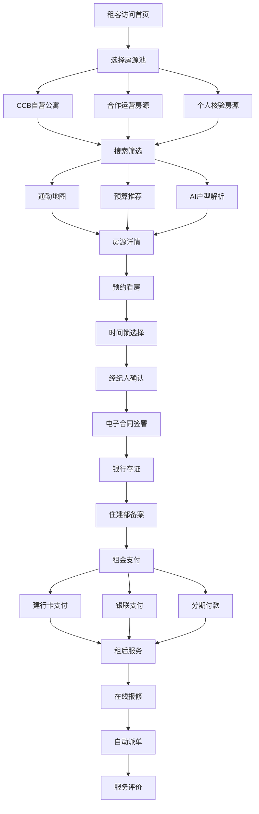

## 1. 产品概述

银行系住房租赁综合服务平台——以建设银行金融信用为背书，打造"金融+租赁+治理"三位一体的住房租赁生态。平台面向城市租房人群、合作运营商及监管机构，通过三层房源池分级管控、全流程线上化签约与支付、住建部监管备案对接及资金穿透式审计，实现"找房-看房-签约-支付-服务-监管"全链路闭环。

- 解决租房市场信任缺失、流程割裂、资金监管空白三大核心痛点
- 目标用户：城市租住人群（20-40岁）、合作运营商、个人房东、住建监管部门

## 2. 核心功能

### 2.1 用户角色

| 角色 | 注册方式 | 核心权限 |
|------|----------|----------|
| 租客 | 手机号+实名认证 | 浏览房源、预约看房、签约、支付、报修、评价 |
| 个人房东 | 手机号+产权验证+人脸识别 | 发布房源、管理合同、查看收益 |
| 运营商务 | 企业资质认证+白名单准入 | 批量管理房源、服务标准履约 |
| 平台管理员 | 内部授权 | 房源审核、合同备案、资金审计、供应商考核 |
| 监管审计员 | 住建部系统对接授权 | 查看备案数据、资金流水穿透审计 |

### 2.2 功能模块

1. **首页**: 品牌形象展示、三大房源池入口、智能搜索栏、热门推荐、金融产品入口
2. **房源搜索页**: 通勤地图搜索、预算区间推荐、AI户型解析、多维度筛选
3. **房源详情页**: 房源信息、户型AI解析、预约看房、价格与费用明细
4. **预约看房页**: 时间锁选择、经纪人确认、预约状态跟踪
5. **电子合同页**: 合同模板、在线签署、银行存证、合同备案
6. **支付中心**: 租金支付（建行卡/他行银联/分期）、账单管理、支付记录
7. **租后服务页**: 在线报修、自动派单、服务评价、供应商考核
8. **后台管理页**: 房源审核、合同备案对接、资金审计追踪、供应商管理

### 2.3 页面详情

| 页面名称 | 模块名称 | 功能描述 |
|----------|----------|----------|
| 首页 | 品牌Hero区 | 建行租赁品牌展示，动态背景，金融安全感视觉传达 |
| 首页 | 房源池入口 | 三层房源池卡片：CCB自营/合作运营/个人房源，差异化标识 |
| 首页 | 智能搜索栏 | 地铁/公交/驾车通勤模式切换，预算输入，户型筛选 |
| 首页 | 金融产品推荐 | 租金分期、押金贷、租房保险等金融产品入口 |
| 房源搜索页 | 通勤地图 | 地铁/公交/驾车多模式通勤时间计算，地图可视化 |
| 房源搜索页 | 预算推荐 | 预算浮动区间滑块，智能推荐性价比房源 |
| 房源搜索页 | AI户型解析 | 上传户型图自动标注面积/朝向/采光评分 |
| 房源搜索页 | 筛选面板 | 区域/价格/户型/楼层/朝向/房源类型多维度筛选 |
| 房源详情页 | 基本信息卡 | 房源图片轮播、价格、面积、楼层、朝向等 |
| 房源详情页 | AI户型解析面板 | 户型图AI标注结果展示，采光热力图，面积分布 |
| 房源详情页 | 费用明细 | 租金、物业费、服务费、押金分项展示 |
| 房源详情页 | 预约看房 | 日历选择+时间段锁定，经纪人实时确认 |
| 预约看房页 | 时间锁选择 | 日历组件，可用时段显示，已锁定时段禁选 |
| 预约看房页 | 经纪人确认 | 经纪人头像/评分，确认/调整时间 |
| 预约看房页 | 状态跟踪 | 预约状态时间线：已提交→经纪人确认→待看房→已完成 |
| 电子合同页 | 合同编辑 | 合同模板填充，条款逐项确认 |
| 电子合同页 | 在线签署 | 手写签名板，双方签署状态展示 |
| 电子合同页 | 银行存证 | 建行存证印章，存证编号，区块链哈希 |
| 电子合同页 | 合同备案 | 住建部备案状态，备案编号回填 |
| 支付中心 | 支付方式 | 建行卡快捷支付/他行银联/租金分期三种通道 |
| 支付中心 | 账单管理 | 月度账单列表，待付/已付/逾期状态 |
| 支付中心 | 支付记录 | 资金流水明细，穿透溯源 |
| 租后服务页 | 在线报修 | 报修类型选择，照片上传，紧急程度标注 |
| 租后服务页 | 自动派单 | 智能匹配物业服务商，派单状态跟踪 |
| 租后服务页 | 服务评价 | 星级评分+文字评价，反哺供应商考核 |
| 后台管理页 | 房源审核 | 三层房源池审核队列，资质/产权/白名单校验 |
| 后台管理页 | 合同备案 | 住建部接口对接，批量备案，状态同步 |
| 后台管理页 | 资金审计 | 穿透式资金流水追踪，异常预警，审计报告 |
| 后台管理页 | 供应商管理 | 考核评分看板，服务标准契约履行监控 |

## 3. 核心流程

**租客核心流程**：首页浏览 → 选择房源池 → 搜索/筛选房源 → 查看详情+AI户型解析 → 预约看房 → 经纪人确认 → 电子签约+银行存证 → 租金支付 → 租后报修+评价

**房源入驻流程**：房东/运营商提交房源 → 平台审核（资质白名单/产权验证/人脸识别）→ 入池上架 → 合同签署 → 监管备案

## 4. 用户界面设计

### 4.1 设计风格

- **主色调**: 建行蓝 (#003DA5) 搭配金色 (#C9A96E) 点缀，传达金融信任感与品质感
- **辅助色**: 深空灰 (#1A1A2E)、冷白 (#F8F9FA)、柔绿 (#2ECC71 用于成功状态)
- **按钮风格**: 圆角8px，主按钮建行蓝填充+白色文字，次按钮描边+蓝色文字，3D微阴影
- **字体**: 标题使用 Noto Serif SC（典雅宋体感），正文使用 Noto Sans SC（清晰易读）
- **布局**: 左侧导航+右侧内容区，卡片式模块，数据面板采用网格布局
- **图标**: 线性图标风格，搭配金融/建筑/家居主题图标
- **视觉元素**: 微妙的几何纹理背景，毛玻璃效果面板，数据可视化图表

### 4.2 页面设计概述

| 页面名称 | 模块名称 | UI元素 |
|----------|----------|--------|
| 首页 | 品牌Hero区 | 全屏渐变背景（深蓝→金），动态粒子效果，品牌标语，搜索框浮层 |
| 首页 | 房源池入口 | 三列卡片，各自品牌色左边框，图标+标题+描述，悬停微上浮 |
| 首页 | 金融产品 | 横向滚动卡片，金色渐变边框，利率/期限突出显示 |
| 房源搜索页 | 通勤地图 | 左侧地图占70%，右侧结果列表30%，地图上标注通勤等时线 |
| 房源搜索页 | 预算滑块 | 双滑块区间选择器，渐变色条，实时显示推荐房源数量 |
| 房源搜索页 | AI户型 | 户型图叠加热力图层，面积标注浮窗，采光等级色块 |
| 房源详情页 | 图片轮播 | 全宽轮播，缩略图导航，支持手势滑动 |
| 房源详情页 | AI面板 | 分栏布局：左图右数据，采光热力图渐变，雷达图评分 |
| 预约看房页 | 日历组件 | 周视图日历，可用时段绿色，已锁灰色，选中蓝色高亮 |
| 电子合同页 | 签署区 | 合同文本滚动区+底部签署区，手写签名画板，存证印章动画 |
| 支付中心 | 支付面板 | 三通道卡片选择，选中态蓝色描边，金额大字突出 |
| 租后服务页 | 报修表单 | 分类图标选择，照片上传网格，紧急程度渐变色按钮 |
| 后台管理页 | 审计面板 | 数据看板布局，资金流水桑基图，异常高亮行，筛选器 |

### 4.3 响应式

- 桌面优先设计（1920px/1440px/1280px断点）
- 平板端：侧边栏折叠为抽屉，地图切换为全屏模式
- 移动端：单列堆叠，底部导航替代侧边栏，触控优化按钮尺寸

### 4.4 3D场景指导

不适用，本项目为2D数据驱动型平台。
