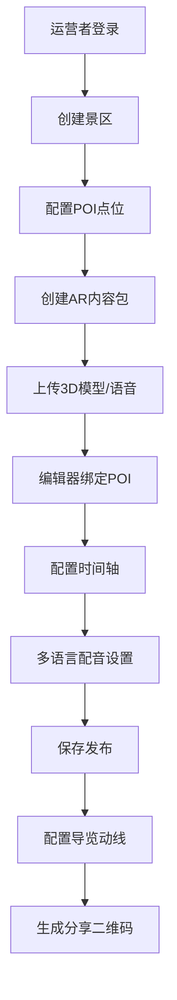
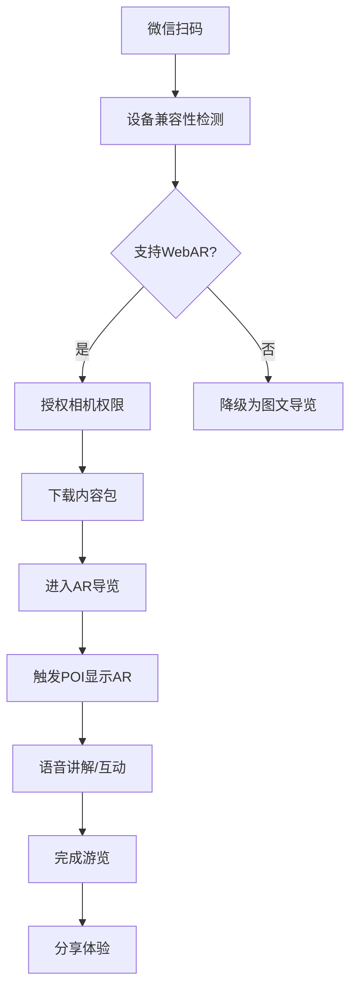

## 1. 产品概述

AR景区导览内容管理系统是面向全国文博单位与景区运营方的轻量化AR内容制作、发布与游客触达平台。系统解决传统导览方式单一、互动性不足、游客行为数据缺失的痛点，通过WebAR技术实现无下载、即用即走的沉浸式导览体验。

- **目标用户**：文博单位内容运营人员、景区管理方、游客
- **核心价值**：降低AR内容制作门槛，提升游客游览体验，沉淀游客行为数据辅助运营决策

## 2. 核心功能

### 2.1 用户角色

| 角色 | 注册方式 | 核心权限 |
|------|----------|----------|
| 系统管理员 | 账号密码登录 | 景区管理、用户管理、系统配置 |
| 景区运营者 | 账号密码登录 | AR内容制作发布、动线配置、数据查看、AB测试 |
| 游客 | 微信扫码授权 | AR导览体验、互动问答、内容分享 |

### 2.2 功能模块

1. **运营后台登录页**：账号登录、权限验证
2. **控制台概览**：数据看板、关键指标、快捷操作
3. **景区管理**：景区列表、空间坐标配置、POI点位管理
4. **AR内容管理**：内容包列表、3D模型上传、语音讲解、历史影像、互动问答配置
5. **AR内容编辑器**：拖拽式POI绑定、时间轴控制、多语言配音上传、GLB模型预览
6. **导览动线配置**：动线规划、节点关联、路径优化
7. **AB测试管理**：测试方案创建、脚本对比、效果分析
8. **游客行为分析**：热力分布、热点停留时长、互动完成率、分享路径追踪
9. **设备兼容性检测**：WebAR能力探针、iOS/Android适配报告
10. **游客端H5**：微信扫码入口、AR导览、离线缓存、互动体验

### 2.3 页面详情

| 页面名称 | 模块名称 | 功能描述 |
|----------|----------|----------|
| 登录页 | 登录表单 | 账号密码输入、验证码、登录状态保持 |
| 控制台概览 | 数据看板 | 今日游客数、AR体验次数、平均停留时长、热门景区TOP5 |
| 景区管理 | 景区列表 | 景区CRUD、地图坐标拾取、POI点位批量导入 |
| 景区管理 | POI管理 | 点位标记、名称描述、关联内容包、半径触发设置 |
| AR内容管理 | 内容包列表 | 内容包CRUD、状态管理、版本控制 |
| AR内容管理 | 资源上传 | GLB模型上传、语音文件上传、图片/视频上传 |
| AR内容编辑器 | 画布区域 | 地图底图、POI点位拖拽、模型预览 |
| AR内容编辑器 | 时间轴 | 动画序列编排、触发条件设置、多轨编辑 |
| AR内容编辑器 | 属性面板 | 模型参数、语音配置、触发距离、多语言设置 |
| 动线配置 | 动线画布 | 路径绘制、节点关联、导览顺序设置 |
| AB测试管理 | 测试列表 | 方案创建、变量配置、流量分配 |
| 行为分析 | 热力图 | 游客分布热力图、区域停留时长统计 |
| 行为分析 | 互动报表 | 问答完成率、分享转化率、设备统计 |
| 游客端首页 | 景区入口 | 景区介绍、AR导览启动、离线下载提示 |
| 游客端AR | AR体验 | 相机画面、3D模型渲染、语音播放、互动问答 |
| 游客端AR | 离线缓存 | 5km半径内容预加载、缓存管理 |

## 3. 核心流程

### 3.1 运营者内容制作流程

运营者登录系统 → 创建景区 → 配置POI点位 → 创建AR内容包 → 上传3D模型/语音 → 在编辑器中绑定POI与内容 → 配置时间轴与触发条件 → 设置多语言配音 → 保存发布 → 配置导览动线 → 生成分享二维码

### 3.2 游客AR体验流程

游客微信扫码 → 设备兼容性检测 → 授权相机权限 → 下载景区内容包 → 进入AR导览 → 触发POI显示AR内容 → 语音讲解/互动问答 → 完成游览 → 分享体验

## 4. 用户界面设计

### 4.1 设计风格

**整体风格**：科技感与文化感融合的现代简约风格，体现AR技术的未来感与文博景区的历史厚重感。

- **主色调**：深海蓝 `#0F172A`（专业、稳重、科技感）
- **辅助色**：青铜金 `#B8860B`（文化、历史、高端感）
- **点缀色**：霓虹青 `#06B6D4`（AR激活、交互高亮）
- **背景色**：深空灰 `#0B1120`（沉浸感、减少反光）
- **字体**：
  - 标题：`Noto Serif SC`（宋体，文化感）
  - 正文：`Inter`（现代无衬线，易读性）
  - 数字/代码：`JetBrains Mono`（科技感）
- **按钮风格**：微圆角（6px）、悬浮发光效果、点击下沉动效
- **布局风格**：左侧导航 + 右侧内容区，卡片式容器，玻璃拟态（Glassmorphism）效果
- **图标风格**：线性图标，统一2px描边，激活状态填充霓虹青

### 4.2 页面设计概述

| 页面名称 | 模块名称 | UI元素 |
|----------|----------|--------|
| 登录页 | 登录表单 | 深色渐变背景、玻璃拟态登录卡片、发光输入框、品牌LOGO动效 |
| 控制台概览 | 数据看板 | 大数字指标卡片、趋势折线图、热力图预览、快捷操作悬浮按钮 |
| 景区管理 | 景区列表 | 表格+卡片双视图、地图缩略图、状态标签、批量操作工具栏 |
| AR内容编辑器 | 画布区域 | 全屏地图画布、可拖拽POI标记、3D模型预览浮窗、网格辅助线 |
| AR内容编辑器 | 时间轴 | 多轨道时间轴、可拖拽关键帧、缩放控制、播放控制栏 |
| 行为分析 | 热力图 | 地图叠加热力图层、时间轴滑块、区域统计弹窗 |
| 游客端AR | AR体验 | 全屏相机画面、AR模型悬浮、底部控制栏、语音波形动效 |

### 4.3 响应式设计

- **设计原则**：Desktop-first，移动端自适应
- **运营后台**：
  - 桌面端（≥1280px）：左侧固定导航 + 主内容区三栏布局
  - 平板端（768px-1280px）：折叠式侧边栏 + 双栏内容区
  - 移动端（<768px）：底部Tab导航 + 单列布局，地图编辑器建议桌面端使用
- **游客端H5**：
  - 移动端优先设计，竖屏操作
  - 全屏相机AR体验，虚拟按钮适配全面屏
  - 触控操作优化，按钮最小尺寸48×48px
  - 弱网环境降级为纯图文模式

### 4.4 3D场景与动效设计

**AR编辑器预览场景**：
- 环境：中性灰HDRI，柔和环境光 + 方向光
- 光照：三点布光，主光45°角，辅助光补亮阴影
- 相机：默认透视相机，可切换正交视图
- 动效：模型入场缩放动画、POI触发脉冲效果、时间轴 scrub 预览

**游客端AR场景**：
- 环境：实景相机画面，AR物体叠加渲染
- 光照：实时环境光估计，虚拟物体与实景光照融合
- 跟踪：视觉惯性测距（VIO），平面检测
- 动效：AR物体出现动画（淡入+上浮）、互动反馈（粒子特效）
- 后处理：轻微 bloom 效果，增强AR沉浸感
- 性能预算：单场景模型面数≤5万，纹理≤1024×1024，帧率≥30fps
