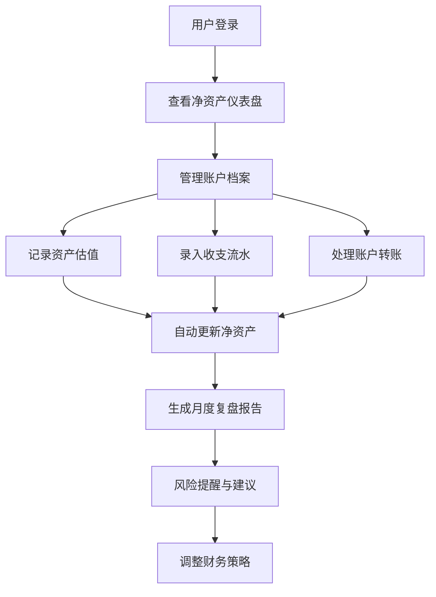

## 1. 产品概述

个人资产负债管理系统，服务于个人用户和家庭协作者，提供统一的财务净资产追踪工具。通过账户管理、资产估值、收支流水和数据分析，帮助用户全面掌握财务状况，实现财富增值目标。

- **核心价值**：一站式管理现金、银行卡、基金、股票、房产、车辆、贷款、信用卡等各类资产负债，自动计算净资产趋势，提供智能分析和风险提醒。
- **目标用户**：个人投资者、家庭财务管理者、需要协作者共同管理的家庭用户。

## 2. 核心功能

### 2.1 用户角色

| 角色 | 注册方式 | 核心权限 |
|------|----------|----------|
| 个人用户 | 本地账户创建 | 完整的账户、资产、收支管理权限，数据看板查看 |
| 家庭协作者 | 邀请加入 | 受限的查看和编辑权限，可分配特定账户的管理权限 |
| 管理员 | 系统配置 | 运营数据查看、系统配置管理、用户管理 |

### 2.2 功能模块

1. **账户档案管理**：现金、银行卡、基金、股票、房产、车辆、贷款、信用卡、其他资产负债的增删改查
2. **资产估值记录**：市值、成本、汇率、估值日期、数据来源、人工调整原因的完整记录
3. **收支与转账流水**：分类、标签、成员、项目、附件管理，避免重复计入资产变化
4. **净资产看板**：资产结构、负债率、现金流、投资收益、目标差距、风险提醒
5. **月度复盘**：变化原因分析、异常支出识别、债务计划、储蓄率计算、下一步行动建议
6. **系统管理**：用户管理、角色权限、系统配置、操作日志审计

### 2.3 页面详情

| 页面名称 | 模块名称 | 功能描述 |
|----------|----------|----------|
| 登录页 | 身份验证 | 用户登录、账户创建、密码重置 |
| 首页仪表盘 | 净资产概览 | 总资产、总负债、净值趋势图、关键指标卡片 |
| 账户管理 | 账户列表 | 账户分类展示、新增编辑删除、余额概览 |
| 账户详情 | 估值记录 | 历史估值曲线、成本市值对比、调整记录 |
| 收支流水 | 交易列表 | 收入支出记录、分类统计、搜索筛选 |
| 转账记录 | 资金划转 | 账户间转账、避免重复记账、关联交易 |
| 资产结构 | 分布分析 | 饼图展示资产配置、类别占比、风险分散度 |
| 月度复盘 | 财务报告 | 自动生成月度报告、异常提醒、行动建议 |
| 目标管理 | 财务目标 | 储蓄目标、债务清偿目标、进度追踪 |
| 系统设置 | 配置管理 | 分类管理、标签管理、成员管理、汇率配置 |
| 运营后台 | 管理视图 | 用户统计、系统状态、操作日志、数据备份 |

## 3. 核心流程

**主要用户流程描述**：
1. 用户登录系统后，首先在仪表盘查看整体财务状况
2. 通过账户管理维护各类资产和负债账户
3. 定期更新资产估值，记录市值变化和调整原因
4. 日常录入收入支出流水，支持分类和标签管理
5. 处理账户间转账，系统自动避免重复记账
6. 系统实时计算净资产并生成趋势图表
7. 每月自动生成复盘报告，识别异常支出和风险
8. 用户根据建议调整财务策略，设定并追踪目标

## 4. 用户界面设计

### 4.1 设计风格

- **主色调**：深邃藏蓝 (#0F172A) 作为主背景，搭配 Emerald 绿 (#10B981) 代表资产增长，玫瑰红 (#F43F5E) 代表负债和风险
- **辅助色**：琥珀橙 (#F59E0B) 用于警告提醒，天空蓝 (#0EA5E9) 用于信息展示
- **按钮风格**：微圆角 (6px)、轻微阴影、悬停时上浮效果，主按钮使用渐变背景
- **字体**：标题使用"Inter SemiBold"，正文使用"Inter Regular"，数字使用等宽字体"JetBrains Mono"增强可读性
- **布局风格**：卡片式布局，网格对齐，充足留白，信息层级分明
- **图标风格**：统一使用 Lucide React 线性图标，保持 24px 标准尺寸
- **数据可视化**：使用 Recharts 库，图表配色与主题一致，动画过渡流畅

### 4.2 页面设计概述

| 页面名称 | 模块名称 | UI 元素 |
|----------|----------|---------|
| 登录页 | 身份验证 | 渐变背景、玻璃拟态卡片、品牌标识、表单动效 |
| 首页仪表盘 | 净资产概览 | 大数字指标卡片、趋势折线图、环形进度图、快捷操作区 |
| 账户管理 | 账户列表 | 分类标签页、卡片式账户展示、余额高亮、操作悬浮按钮 |
| 账户详情 | 估值记录 | 面积图展示估值趋势、数据表格、新增估值表单 |
| 收支流水 | 交易列表 | 日历筛选器、分类统计饼图、交易流水时间线 |
| 资产结构 | 分布分析 | 旭日图展示资产层级、风险评级矩阵、配置建议 |
| 月度复盘 | 财务报告 | 报告封面、关键指标对比、异常项高亮、行动项清单 |
| 系统设置 | 配置管理 | 侧边栏导航、分组表单、实时预览、保存状态反馈 |

### 4.3 响应式

- **设计原则**：桌面优先 (Desktop-first)，向下兼容平板和移动端
- **断点设置**：1280px (桌面)、1024px (平板横屏)、768px (平板竖屏)、480px (手机)
- **适配策略**：
  - 桌面端：侧边导航 + 主内容区 + 右侧信息栏三栏布局
  - 平板端：侧边导航可收起，主内容自适应
  - 移动端：底部 Tab 导航，卡片堆叠展示，图表简化
- **触摸优化**：按钮最小高度 44px，重要操作增加触摸反馈，滑动手势支持

### 4.4 动效设计

- **页面加载**：骨架屏渐显，内容区块错落入场 (staggered animation)
- **数据更新**：数字滚动动画 (count-up)，图表渐进式绘制
- **交互反馈**：按钮点击缩放，表单验证即时反馈，卡片悬停微抬升
- **切换过渡**：页面切换使用淡入淡出，模态框使用缩放+淡入
- **状态变化**：成功操作绿色闪烁提示，错误操作红色震动反馈
