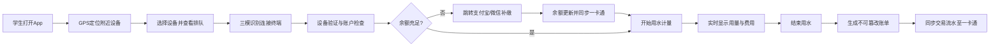

## 1. 产品概述

高校场景下的无感用水物联网管理平台，旨在替代传统校园水卡系统，通过 NFC/蓝牙/二维码三模识别终端实现学生无感用水体验。平台打通支付宝/微信支付与校园一卡通系统，提供投资商设备监控与收益管理、地理围栏设备搜索等核心能力。

- 核心目标：解决传统校园水卡充值不便、设备管理困难、账单不透明等痛点
- 目标用户：在校学生、设备投资商、校园后勤管理员

## 2. 核心功能

### 2.1 用户角色

| 角色 | 注册方式 | 核心权限 |
|------|----------|----------|
| 学生用户 | 学号/手机号注册，绑定校园卡 | 用水支付、账单查询、余额补缴、附近设备搜索 |
| 投资商 | 企业身份审核入驻 | 设备管理、在线率监控、能耗分析、故障诊断、收益结算 |
| 系统管理员 | 后台创建 | 用户管理、设备审核、数据统计、系统配置 |

### 2.2 功能模块

1. **学生端首页**：账户余额、快速用水、附近设备、最近账单
2. **设备搜索页**：地理围栏定位、500米范围设备列表、排队人数展示
3. **用水页面**：三模识别接入、实时计量、费用计算、支付完成
4. **账单中心**：不可篡改账单详情、按学期消费汇总导出
5. **支付充值**：支付宝/微信支付、余额补缴、自动跳转、一卡通同步
6. **投资商控制台**：设备在线率、能耗分析、故障诊断报告、收益分成
7. **设备管理**：终端注册、状态监控、参数配置、固件升级
8. **系统管理**：用户管理、角色权限、日志审计、数据字典

### 2.3 页面详情

| 页面名称 | 模块名称 | 功能描述 |
|----------|----------|----------|
| 登录注册页 | 身份认证 | 学号/手机号登录、短信验证码、忘记密码、角色选择 |
| 学生端首页 | 账户概览 | 余额卡片、快速用水按钮、最近账单列表、附近设备快捷入口 |
| 设备搜索页 | 地图搜索 | GPS定位、500米范围设备标记、排队人数、设备状态、导航跳转 |
| 用水操作页 | 用水流程 | NFC/蓝牙/二维码扫码、设备连接、实时流量计费、结束用水 |
| 账单中心页 | 消费记录 | 账单列表、时间筛选、按学期汇总、PDF/Excel导出 |
| 充值支付页 | 在线支付 | 金额选择、支付宝/微信支付、余额不足自动跳转、交易结果 |
| 投资商控制台 | 数据仪表盘 | 设备总数、在线率、今日收益、能耗趋势、故障告警 |
| 设备管理页 | 终端管理 | 设备列表、状态监控、参数配置、故障诊断报告下载 |
| 收益结算页 | 分成管理 | 收益明细、分成规则、结算记录、对账导出 |
| 系统管理页 | 后台管理 | 用户管理、角色权限、系统配置、操作日志 |

## 3. 核心流程

### 3.1 学生用水主流程

学生进入平台 → GPS定位获取附近500米设备 → 选择目标设备 → 扫码/NFC/蓝牙连接 → 确认开始用水 → 实时计量扣费 → 结束用水生成账单 → 账单同步至一卡通系统。

### 3.2 投资商监控流程

投资商登录 → 控制台总览 → 查看设备在线率/能耗 → 故障告警提示 → 生成诊断报告 → 查看收益分成 → 月度结算。

## 4. 用户界面设计

### 4.1 设计风格

- **主色调**：深海蓝 (#0B3D91) - 体现专业、可靠的科技感
- **辅助色**：水青色 (#00B4D8) - 呼应"用水"主题，代表流动与活力
- **强调色**：活力橙 (#FF6B35) - 用于关键操作按钮与告警提示
- **中性色**：石墨灰 (#1A1A2E) 与云雾白 (#F5F7FA)
- **按钮风格**：圆角胶囊形按钮，带微妙渐变和阴影，hover时有上浮动效
- **字体**：标题使用 Noto Serif SC（优雅衬线体），正文使用 Noto Sans SC
- **布局风格**：卡片式布局 + 玻璃拟态效果，信息层次分明
- **图标风格**：lucide-react 线性图标，统一 24px 基础尺寸
- **动效**：页面切换采用滑动过渡，数据卡片加载有渐入效果

### 4.2 页面设计概览

| 页面名称 | 模块名称 | UI 元素 |
|----------|----------|---------|
| 学生端首页 | 账户余额卡片 | 玻璃拟态卡、渐变背景、余额数字动效、充值按钮 |
| 学生端首页 | 快速用水区 | 大型圆形按钮、水波纹动效、三模识别图标 |
| 设备搜索页 | 地图区域 | 暗色地图底、设备标记点、波纹扩散动效、距离标签 |
| 设备搜索页 | 设备列表 | 卡片横向排列、排队人数胶囊、状态色标、距离显示 |
| 用水操作页 | 实时计量区 | 大号数字显示、用量进度条、实时费用、波动动画 |
| 账单中心页 | 账单列表 | 时间线布局、设备ID标签、用量/金额双列、哈希验印章 |
| 投资商控制台 | 数据仪表盘 | 四色数据卡片、折线趋势图、环形在线率、告警列表 |
| 设备管理页 | 设备表格 | 状态指示灯、在线率进度条、操作下拉菜单 |

### 4.3 响应式设计

- 采用桌面端优先设计，断点 768px / 1024px / 1440px
- 学生端核心页面适配移动端触控操作，按钮最小 44x44px
- 投资商控制台在大屏(>1440px)展示更多数据列，小屏自动折叠
- 地图组件在移动端切换为全屏模式，支持双指缩放

### 4.4 视觉氛围营造

- 背景融入微妙的水波纹理与噪点质感
- 数据卡片采用半透明玻璃态 (backdrop-blur) 营造层次感
- 用水计量页面添加液态流动动画效果
- 关键数字采用渐变文字与发光效果增强视觉重点
