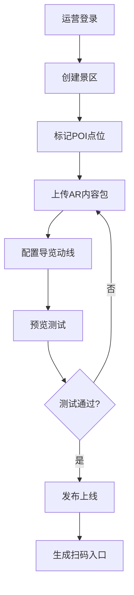
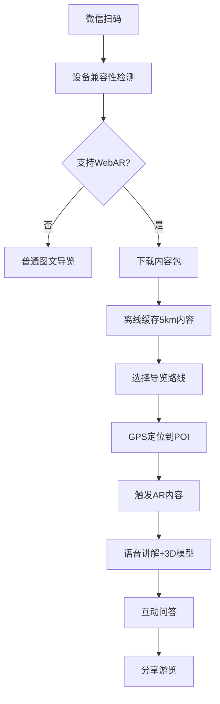

## 1. 产品概述
AR景区导览内容管理系统是面向全国文博单位与景区运营方的轻量化AR内容制作、发布与游客触达平台。系统提供Web端AR内容编辑器、设备兼容性检测、离线缓存策略、游客行为分析等核心能力，运营方可通过后台配置导览动线、进行AB测试、导出热力分布数据。

- **目标用户**：文博单位运营人员、景区管理方、内容制作团队、普通游客
- **核心价值**：降低AR导览内容制作门槛，提升游客景区游览体验，赋能景区数据化运营

## 2. 核心功能

### 2.1 用户角色

| 角色 | 登录方式 | 核心权限 |
|------|----------|----------|
| 景区运营管理员 | 账号密码登录 | 景区管理、POI配置、内容发布、数据分析、AB测试 |
| 内容编辑人员 | 账号密码登录 | AR内容制作、多语言配音、模型上传、时间轴编辑 |
| 游客 | 微信扫码（免登录） | 浏览AR导览、查看景点讲解、参与互动、分享 |

### 2.2 功能模块

1. **运营后台首页**：数据概览看板、快捷操作入口、景区列表
2. **景区与POI管理**：景区信息编辑、地图POI点位拖拽绑定、导览动线规划
3. **AR内容编辑器**：3D模型上传(GLB)、语音讲解管理、时间轴控制、多语言配音、互动问答配置
4. **AB测试中心**：讲解脚本对比、版本发布、效果数据对比
5. **数据分析中心**：游客热力图、热点停留时长、互动完成率、分享路径追踪
6. **游客端AR导览页**：设备兼容性检测、AR场景渲染、离线内容缓存、扫码即用

### 2.3 页面详情

| 页面名称 | 模块名称 | 功能描述 |
|----------|----------|----------|
| 运营后台登录页 | 登录表单 | 账号密码登录、记住登录状态、游客入口跳转 |
| 运营后台首页 | 数据看板 | 今日访问量、AR启动次数、平均停留时长、互动完成率、景区概览卡片 |
| 景区管理页 | 景区列表 | 景区增删改查、启用/停用状态、景区二维码生成、数据概览 |
| POI点位管理页 | 地图编辑器 | 卫星地图视图、POI点位拖拽放置、坐标编辑、导览动线连线 |
| AR内容编辑器 | 主编辑区 | GLB模型预览、时间轴轨道、语音波形可视化、互动节点配置 |
| 多语言配音页 | 配音管理 | 多语言音频上传、自动转文字、配音进度状态 |
| AB测试中心 | 测试列表 | 新建AB测试、脚本版本对比、转化率统计、优胜版本发布 |
| 数据分析页 | 热力图模块 | 景区地图热力叠加、热点停留排名、时间维度筛选、数据导出 |
| 数据分析页 | 行为分析 | 互动完成率、分享路径漏斗、设备分布统计 |
| 游客端首页 | AR导览入口 | 扫码引导、设备检测、景区介绍、导览路线选择 |
| 游客端AR页 | WebAR渲染 | 摄像头AR场景、3D模型叠加、语音播放、互动问答触发 |
| 游客端详情页 | 景点讲解 | 历史影像展示、语音讲解、多语言切换、分享功能 |

## 3. 核心流程

### 3.1 运营方内容制作发布流程
运营管理员登录 → 创建/选择景区 → 在地图上标记POI点位 → 上传AR内容包（3D模型+语音+互动）→ 配置导览动线 → 预览测试 → 发布上线 → 生成游客扫码入口

### 3.2 游客使用流程
游客微信扫码 → 设备兼容性检测 → 下载景区内容包（自动离线缓存）→ 进入AR导览 → 选择导览路线 → 到达POI触发AR内容 → 语音讲解+互动问答 → 查看历史影像 → 分享游览体验

## 4. 用户界面设计

### 4.1 设计风格

- **主色调**：深靛蓝 `#1A237E`（文博/历史厚重感）、辅助色：琥珀金 `#FF8F00`（AR科技感点缀）
- **中性色**：炭灰 `#121212` 背景、月白 `#F5F5F0` 内容区、石板灰 `#607D8B` 次要文字
- **按钮风格**：圆角8px、微悬浮投影、按下微缩反馈；主按钮靛蓝渐变，次按钮描边
- **字体**：标题使用「思源宋体」体现文化厚重感，正文使用「思源黑体」保证可读性；数字和数据使用「JetBrains Mono」等宽字体
- **布局风格**：侧边导航 + 顶部状态栏的经典后台布局，内容区采用卡片式模块组合
- **视觉元素**：细金线分隔、半透明毛玻璃面板、微弱噪点纹理背景、数据可视化带光晕效果
- **图标风格**：线性图标 + 局部填充，2px线宽，圆角端点

### 4.2 页面设计概览

| 页面名称 | 模块名称 | UI元素 |
|----------|----------|--------|
| 运营后台首页 | 数据看板 | 深色渐变背景、靛蓝色数据卡片、金色强调数值、带图表的指标卡、微动效数字滚动 |
| POI点位管理页 | 地图编辑器 | 全屏暗色卫星底图、金色POI标记、靛蓝动线连线、右侧半透明配置面板、拖拽反馈动效 |
| AR内容编辑器 | 主编辑区 | 左模型预览（暗色场景+环境光）、中多轨时间轴、右属性面板、金色时间游标、靛蓝波形 |
| 数据分析页 | 热力图模块 | 暗色地图叠加暖色热力层、渐变色阶图例、金色热点标注、靛蓝筛选控件 |
| 游客端AR页 | WebAR渲染 | 全屏摄像头画面、底部半透明操作栏、AR模型金色描边、靛蓝进度/状态指示 |

### 4.3 响应式

- 运营后台：桌面端优先设计（最小宽度1280px），侧边栏在平板宽度可折叠
- 游客端：移动端优先设计，适配主流手机屏幕（375px~428px宽度），支持横屏AR体验
- 交互：桌面端支持鼠标拖拽、悬停反馈；移动端支持触控滑动、捏合缩放、长按触发

### 4.4 3D场景指导

- **环境与氛围**：AR场景采用PBR材质，使用HDR环境贴图模拟景区真实光照，暗部补靛蓝冷光、高光带金色反射
- **光照设置**：主光源模拟日光（暖色平行光）+ 环境光遮蔽（AO）+ 点光源点缀文物高光
- **相机设置**：游客端使用设备摄像头实时画面作为背景，3D相机与设备陀螺仪联动；编辑器内使用可环绕观察的轨道相机
- **构图与焦点**：AR模型放置在POI中心位置，默认1.5米高度，支持游客远近缩放
- **交互与动画**：模型入场带淡入+悬浮微动效，讲解关键点触发模型高光闪烁，互动节点有金色脉冲提示环
- **后处理效果**：Bloom泛光（金色高光溢出）、轻微Vignette暗角、色彩分级提升饱和度
- **资源与性能**：单个GLB模型压缩后≤5MB，使用Draco压缩+纹理KTX2压缩，目标稳定30fps
