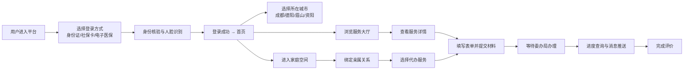
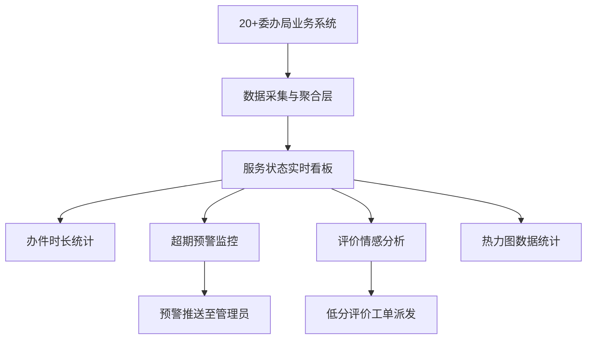

## 1. 产品概述

成都都市圈城市服务总入口平台，整合成都、德阳、眉山、资阳四地政务与民生服务资源，为四城居民提供一站式、跨区域、标准化的政务服务体验。
- 解决四地政务服务分散、异地办事难、身份认证不统一等问题，覆盖全年龄段用户群体
- 打造省级政务服务标杆，实现"同城同服务、跨城通办"，提升四城居民获得感与满意度

## 2. 核心功能

### 2.1 用户角色

| 角色 | 注册方式 | 核心权限 |
|------|----------|----------|
| 普通市民 | 身份证/社保卡/电子医保凭证注册登录 | 办理个人及家庭服务事项、查看办理进度、使用家庭空间 |
| 亲属代办人 | 绑定亲属关系后代办 | 为老人/儿童/残障家属代办政务服务 |
| 运营管理员 | 后台账号 | 服务状态监控、数据看板查看、舆情分析、服务配置 |

### 2.2 功能模块

1. **统一身份认证登录页**：三合一登录（身份证+社保卡+电子医保凭证）、人脸识别、生物特征识别
2. **首页**：四城区域切换、服务分类导航、热门服务推荐、个人中心入口
3. **服务大厅**：服务事项列表（按委办局/主题/地区分类）、服务详情、在线办理
4. **服务状态实时看板**：事项办理时长统计、超期预警监控、用户评价情感分析、20+委办局接入状态
5. **家庭空间**：亲属关系绑定管理、代办服务列表、亲属服务授权
6. **无障碍模式中心**：语音导航开关、字体大小调节（三档）、高对比度主题切换、读屏模式
7. **服务热力图分析页**：按行政区/年龄/时段三维度展示服务使用热力图、高频事项排行

### 2.3 页面详情

| 页面名称 | 模块名称 | 功能描述 |
|----------|----------|----------|
| 登录页 | 登录方式选择 | 身份证/社保卡/电子医保凭证三种登录方式切换，支持人脸识别辅助认证 |
| 登录页 | 身份信息录入 | 证件号码输入、密码/短信验证码、人脸检测动效 |
| 首页 | 区域切换栏 | 成都/德阳/眉山/资阳四地切换，切换后服务列表自动适配 |
| 首页 | 服务快捷入口 | 常用服务九宫格（社保、医保、公积金、教育、交通等） |
| 首页 | 热门服务推荐 | 基于用户画像和热力图的个性化服务推荐 |
| 首页 | 通知公告 | 政务通知、办件提醒、政策推送 |
| 服务大厅 | 分类筛选 | 按委办局（人社/卫健/教育/交通等）、服务主题、办理地筛选 |
| 服务大厅 | 服务卡片列表 | 服务名称、办理时长、所需材料、在线办理按钮 |
| 服务详情页 | 服务信息展示 | 办理指南、材料清单、办理流程、关联服务推荐 |
| 服务详情页 | 在线办理表单 | 分步表单、材料上传、进度保存 |
| 实时看板 | 办件统计概览 | 今日办件量、平均办理时长、按时办结率、好评率指标卡片 |
| 实时看板 | 办理时长趋势 | 近7/30天平均办理时长折线图 |
| 实时看板 | 超期预警监控 | 各委办局超期件数柱状图、超期工单列表 |
| 实时看板 | 情感分析面板 | 用户评价词云、正负向情感占比饼图、低分评价滚动列表 |
| 实时看板 | 委办局接入状态 | 20+委办局系统接入状态一览表（正常/异常/维护） |
| 家庭空间 | 亲属关系管理 | 亲属列表卡片、新增亲属绑定、关系类型选择 |
| 家庭空间 | 代办服务中心 | 待办/已办代办列表、为亲属发起办理 |
| 无障碍设置 | 功能开关面板 | 语音导航、读屏模式、高对比度、字体大小滑块 |
| 热力图页面 | 多维度切换 | 行政区/年龄/时段三个维度Tab切换 |
| 热力图页面 | 可视化图表 | 行政区热力地图、年龄段柱状图、时段热度曲线图、高频事项TOP10 |

## 3. 核心流程

### 3.1 用户主流程
用户通过三合一身份认证登录后，选择所在城市（成都/德阳/眉山/资阳），浏览或搜索服务事项，可选择自助办理或进入家庭空间为亲属代办。办理过程中可随时查看进度，完成后提交评价。运营人员通过实时看板监控全平台服务状态。

### 3.2 运营监控流程

## 4. 用户界面设计

### 4.1 设计风格

- **主色调**：政务蓝 #1E5AA8（权威、专业、可信）
- **辅助色**：活力橙 #FF7A45（温暖、亲民、行动指引）、成功绿 #10B981（办理完成）、警示红 #EF4444（超期预警）
- **中性色**：从 #0F172A（深）到 #F8FAFC（浅）的完整灰阶
- **按钮风格**：圆角 8px，主按钮采用政务蓝渐变，hover 时阴影加深
- **字体**：使用中文专用字体 Noto Sans SC，标题 font-weight: 600，正文 font-weight: 400
- **布局风格**：卡片式布局，顶部导航 + 侧边筛选的经典政务架构，信息密度适中
- **图标风格**：使用 Lucide 线性图标，统一 20px 尺寸，与文字间距 8px

### 4.2 页面设计概览

| 页面名称 | 模块名称 | UI 元素 |
|----------|----------|---------|
| 登录页 | 登录方式卡片 | 三栏Tab切换（身份证/社保卡/电子医保），证件输入框带图标，人脸动效圆形区域，渐变背景+网格纹理 |
| 首页 | 区域切换栏 | 四城胶囊式切换按钮，激活态蓝底白字带城市地标图标 |
| 首页 | 服务快捷入口 | 圆角8px卡片宫格，图标+文字双层，hover 上浮动效 |
| 服务大厅 | 筛选侧边栏 | 折叠式筛选面板，多标签组合筛选 |
| 实时看板 | 数据概览卡片 | 四色指标卡片，数字动画滚动，底部趋势迷你图 |
| 实时看板 | 超期预警 | 红色脉冲警示图标，进度条显示剩余时间 |
| 家庭空间 | 亲属卡片 | 头像+关系标签+代办按钮，支持左右滑动 |
| 无障碍设置 | 控制面板 | 大号开关、滑块、高对比度预览区域 |
| 热力图页面 | 可视化区域 | 四川地图着色热力、多维图表网格布局 |

### 4.3 响应式

- 桌面端优先设计（1440px 基准），自适应至 1024px 平板
- 移动端单列布局，底部 Tab 导航，服务列表改为瀑布流
- 无障碍模式下触控目标最小 44×44px，字体放大 150%

### 4.4 无障碍模式特殊设计

- **语音导航**：使用 Web Speech API 实现页面元素朗读
- **字体放大**：三档调节（标准/大/特大），通过 CSS 变量全局切换
- **高对比度**：黑白高对比主题，背景 #000，文字 #FFF，边框 #FFD700
- **键盘导航**：所有交互元素支持 Tab 聚焦，Focus Ring 高亮显示
