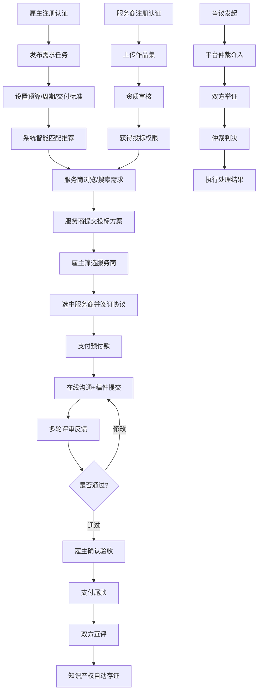

# 创意服务众包平台 - 产品需求文档

## 1. 产品概述

面向企业雇主的创意服务众包平台，连接企业需求与专业服务商，覆盖 UI/工业/动漫设计、软件开发、商标注册、文案策划等多类型创意服务。通过资质认证、双向匹配、在线协作、多轮评审和知识产权存证，构建安全高效的服务交易闭环。

## 2. 核心功能

### 2.1 用户角色

| 角色 | 注册方式 | 核心权限 |
|------|----------|----------|
| 企业雇主 | 企业认证注册 | 发布需求、浏览人才库、邀请服务商、稿件评审、验收打款、争议申请 |
| 服务商 | 资质认证注册 | 浏览需求、提交方案、参与投标、在线沟通、稿件提交、查看收入 |
| 管理员 | 后台授权 | 任务监控、服务商分级、知识产权管理、争议仲裁、合规审计 |

### 2.2 功能模块

1. **任务大厅**：需求搜索、分类筛选、预算区间、任务详情、投标入口
2. **发布需求**：任务类型选择、预算周期设置、交付标准定义、审核节点配置
3. **人才库**：服务商列表、资质认证展示、作品集预览、履约评分、筛选匹配
4. **工作台**：任务列表、在线沟通、稿件提交、版本管理、评审反馈、验收确认
5. **后台管理**：任务状态看板、服务商分级、知识产权存证、争议仲裁、审计日志

### 2.3 页面详情

| 页面名称 | 模块名称 | 功能描述 |
|----------|----------|----------|
| 任务大厅 | 搜索筛选 | 关键词搜索、服务类型筛选（UI设计/工业设计/动漫设计/软件开发/商标注册/文案策划）、预算区间、周期筛选、发布时间排序 |
| 任务大厅 | 任务列表 | 卡片展示任务标题、预算范围、周期、发布时间、已投标人数、任务状态标签 |
| 任务详情 | 基本信息 | 任务类型、预算、周期、交付标准、审核节点说明、附件下载 |
| 任务详情 | 投标信息 | 已投标服务商列表、投标方案预览、邀请投标、选标操作 |
| 发布需求 | 类型选择 | 服务类型选择、行业分类、需求标题、详细描述 |
| 发布需求 | 配置设置 | 预算金额（固定/区间）、周期设置、交付标准定义、审核节点数量和时间要求 |
| 发布需求 | 附加设置 | 保密协议、知识产权归属、预付款比例、延期赔偿条款 |
| 人才库 | 筛选搜索 | 技能标签、资质等级、价格区间、评分筛选、所在地域 |
| 人才库 | 服务商卡片 | 头像、认证标识、技能标签、履约评分、历史成交数、起价、作品集预览 |
| 服务商详情 | 基本信息 | 个人简介、资质证书、认证状态、联系方式、服务报价 |
| 服务商详情 | 作品集 | 案例展示、项目描述、客户评价、作品分类 |
| 服务商详情 | 履约记录 | 历史成交项目、客户评分、完成率、平均交付时间 |
| 工作台 - 雇主 | 任务概览 | 进行中任务、待验收、待付款、任务进度卡片 |
| 工作台 - 雇主 | 任务详情 | 服务商信息、沟通记录、稿件版本、评审意见、验收按钮 |
| 工作台 - 雇主 | 多轮评审 | 稿件版本对比、评审意见填写、通过/修改/驳回操作、审核节点进度 |
| 工作台 - 服务商 | 任务概览 | 进行中任务、待提交、待评审、收入统计 |
| 工作台 - 服务商 | 稿件提交 | 文件上传、版本说明、提交备注、历史版本对比 |
| 工作台 - 沟通 | 即时消息 | 文字消息、文件传输、截图、消息已读状态、重要消息标记 |
| 后台管理 - 任务看板 | 状态总览 | 按状态统计任务数、趋势图、异常任务预警、平均成交周期 |
| 后台管理 - 服务商 | 分级管理 | 认证审核、等级评定（金牌/银牌/普通）、权限配置、黑名单管理 |
| 后台管理 - 知识产权 | 存证管理 | 稿件存证列表、区块链存证哈希、权属证明、存证时间 |
| 后台管理 - 争议仲裁 | 争议列表 | 争议类型、举证材料、仲裁记录、处理结果、赔偿执行 |
| 后台管理 - 审计日志 | 操作记录 | 全链路操作日志、敏感操作标记、筛选查询、导出报表 |

## 3. 核心流程

## 4. 用户界面设计

### 4.1 设计风格

- **主色调**：专业紫 `#6366F1`（创意、高端），搭配活力橙 `#F97316`（行动、热情）
- **辅助色**：成功绿 `#10B981`，警告黄 `#F59E0B`，危险红 `#EF4444`
- **中性色**：深灰 `#1F2937`，中灰 `#6B7280`，浅灰 `#F3F4F6`
- **字体**：标题使用 Inter SemiBold，正文使用 Inter Regular，数字使用 JetBrains Mono
- **按钮风格**：圆角 12px，主按钮渐变紫，悬停有轻微放大效果和发光阴影
- **布局风格**：顶部全局导航 + 左侧功能导航 + 右侧内容区，卡片式布局，层次分明
- **图标风格**：线性图标，统一 24px 网格，关键功能使用渐变彩色图标

### 4.2 页面设计概览

| 页面名称 | 模块名称 | UI 元素 |
|----------|----------|----------|
| 任务大厅 | 搜索区 | 大搜索框、分类图标标签、高级筛选展开面板、渐变紫背景 |
| 任务大厅 | 任务卡片 | 标题、预算标签（醒目橙色）、周期、投标人数、发布时间、状态标签动效 |
| 发布需求 | 分步表单 | 步骤指示器（带对勾动画）、分段表单、实时保存草稿、进度条 |
| 人才库 | 筛选区 | 技能标签云、价格滑块、星级评分筛选、资质认证多选 |
| 人才库 | 服务商卡片 | 头像+认证标识组合、技能标签组、评分星星动效、作品集缩略图轮播 |
| 工作台 | 沟通区 | 左右气泡布局、文件卡片、时间轴分割、未读消息红点、重要消息星标 |
| 工作台 | 稿件区 | 版本时间轴、左右分屏对比、评审批注弹层、通过/驳回按钮组 |
| 后台管理 | 任务看板 | 大数字指标卡（带趋势箭头）、状态分布图、实时任务流动画 |
| 后台管理 | 数据表格 | 斑马纹、状态标签、多列筛选、行展开详情、批量操作 |

### 4.3 响应式设计

- 桌面端优先（1440px+），顶部导航固定，左侧导航可折叠
- 平板端（768-1439px）：左侧导航折叠为图标模式，内容区自适应
- 移动端（<768px）：底部 Tab 导航，卡片垂直堆叠，表格转列表展示

### 4.4 动效设计

- 页面加载：顶部渐变进度条 + 内容区骨架屏渐变填充
- 数据更新：数字滚动动画、状态标签颜色平滑过渡
- 卡片交互：悬停上浮 6px + 阴影扩散 + 边缘光晕
- 表单提交：按钮加载状态旋转 + 成功对勾描边动画
- 消息通知：右下角滑入 + 轻微弹跳 + 消失淡出
- 步骤流转：当前步骤发光高亮 + 已完成步骤连线动画
