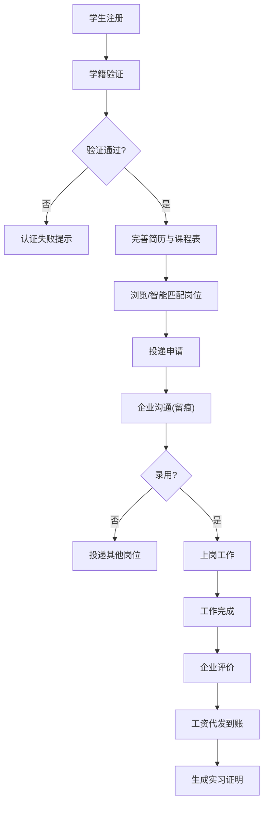
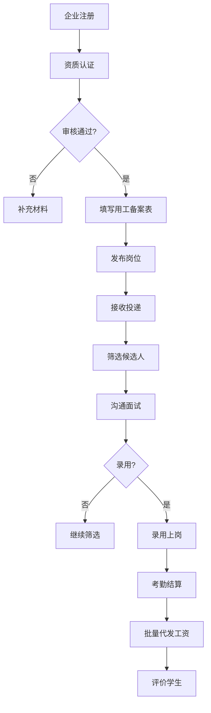
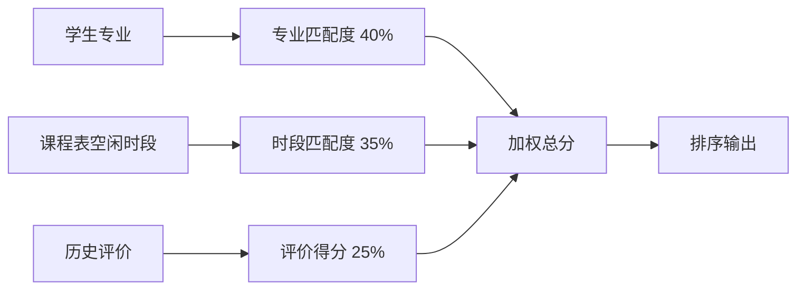

## 1. 产品概述

高校兼职用工撮合平台，聚焦学生身份真实性与用工合规性，通过学籍验证、用工备案、智能匹配、沟通留痕、财务代发、监管看板六大核心体系，打造安全、透明、高效的大学生兼职用工生态。

- 核心价值：解决高校兼职市场身份造假、用工不规范、薪资纠纷等痛点，保障学生权益，降低企业用工风险，满足教育部门监管需求
- 目标用户：在校大学生、有用工需求的企业、教育局/高校监管部门

## 2. 核心功能

### 2.1 用户角色

| 角色 | 注册方式 | 核心权限 |
|------|----------|----------|
| 学生用户 | 学籍号 + 教育部学籍验证API | 浏览岗位、智能匹配、投递申请、在线沟通、实习证明生成、工资提现 |
| 企业用户 | 营业执照 + 企业认证审核 | 发布岗位（用工备案表）、候选人管理、批量代发工资、沟通留痕 |
| 教育局监管 | 管理员账号分配 | 全局数据看板、院校监控、投诉处理、合规检查 |

### 2.2 功能模块

1. **首页/岗位大厅**：岗位推荐、智能匹配、筛选搜索、热门岗位
2. **学生中心**：学籍认证、个人简历、课程表管理、投递记录、收藏岗位
3. **企业中心**：企业认证、岗位发布（含用工备案表）、候选人管理、工资代发
4. **智能匹配引擎**：专业匹配度计算、课程表空闲时段匹配、历史评价加权排序
5. **沟通系统**：在线消息、强制留痕、实习证明一键生成
6. **财务中心**：企业充值、批量代发、学生提现（支付宝/微信）、账单明细
7. **教育局监管看板**：数据总览、院校排名、岗位监控、投诉分析、薪资达标率

### 2.3 页面详情

| 页面名称 | 模块名称 | 功能描述 |
|----------|----------|----------|
| 登录/注册 | 角色选择 | 学生/企业/管理员三种身份入口，学籍号验证 |
| 岗位大厅 | 岗位列表 | 卡片式岗位展示、多维度筛选（薪资、专业、地点、时长）、搜索 |
| 岗位详情 | 岗位信息 | 岗位描述、薪资标准、工时要求、企业信息、备案表公示、投递按钮 |
| 智能匹配 | 匹配结果 | 按匹配度排序的岗位列表、匹配原因说明（专业/空闲时段/评价） |
| 学生中心 | 学籍认证 | 学籍号输入、教育部API验证、认证状态展示 |
| 学生中心 | 课程表管理 | 周课表录入/导入、空闲时段自动计算 |
| 学生中心 | 我的投递 | 投递记录、面试通知、录用状态、评价管理 |
| 学生中心 | 钱包/提现 | 余额展示、支付宝/微信绑定、提现申请、流水记录 |
| 学生中心 | 实习证明 | 历史兼职记录、一键生成实习证明PDF、电子签章 |
| 企业中心 | 企业认证 | 营业执照上传、企业信息填写、审核状态 |
| 企业中心 | 岗位发布 | 岗位信息填写、《大学生兼职用工备案表》强制填写、发布审核 |
| 企业中心 | 候选人管理 | 投递列表、简历查看、面试安排、录用/拒绝 |
| 企业中心 | 工资代发 | 工资单生成、批量代发、银行接口对接、发放记录 |
| 消息中心 | 聊天列表 | 对话列表、未读提醒、消息强制留痕 |
| 消息中心 | 聊天详情 | 实时消息、文件传输、聊天记录导出 |
| 监管看板 | 数据总览 | 全局岗位数、学生数、企业数、投诉率、薪资达标率 |
| 监管看板 | 院校监控 | 各院校岗位发布量、学生参与度、异常预警 |
| 监管看板 | 投诉处理 | 投诉列表、处理流程、结案记录 |

## 3. 核心流程

### 3.1 学生求职流程

学生注册 → 学籍验证（对接教育部API）→ 完善简历与课程表 → 浏览/智能匹配岗位 → 投递申请 → 企业沟通（留痕）→ 录用上岗 → 工作完成 → 企业评价 → 工资到账 → 生成实习证明

### 3.2 企业用工流程

企业注册 → 资质认证审核 → 填写用工备案表 → 发布岗位 → 接收投递 → 筛选候选人 → 沟通面试 → 录用 → 考勤结算 → 批量代发工资 → 评价学生

### 3.3 智能匹配算法流程

获取学生专业 → 获取课程表空闲时段 → 获取学生历史评价 → 遍历岗位库 → 计算专业匹配度（40%）→ 计算时段匹配度（35%）→ 计算评价得分（25%）→ 加权总分排序 → 返回匹配结果

## 4. 用户界面设计

### 4.1 设计风格

- **设计定位**：专业可信、清爽简洁的教育政务风格，兼顾年轻群体的活力感
- **主色调**：深海蓝 `#0F4C81`（专业、可信、稳重）
- **辅助色**：活力橙 `#FF7A45`（行动、温暖、年轻）、翠绿 `#36B37E`（成功、成长）
- **中性色**：以 `slate` 灰阶为基础，从 slate-50 到 slate-900
- **按钮风格**：圆角 8px、轻微阴影、hover 时上浮效果
- **字体**：标题使用 "Noto Sans SC" Medium，正文使用 "Noto Sans SC" Regular
- **布局风格**：卡片式布局、顶部导航 + 侧边栏（后台）、留白充足
- **图标风格**：线性图标（lucide-react），统一 20px 尺寸

### 4.2 页面设计概览

| 页面名称 | 模块名称 | UI元素 |
|----------|----------|--------|
| 登录页 | 角色切换 | 三角色Tab切换、左侧品牌展示区、右侧表单区、渐变背景 |
| 岗位大厅 | 岗位列表 | 顶部搜索栏、左侧筛选面板、右侧卡片瀑布流、匹配度标签、薪资高亮 |
| 岗位详情 | 信息展示 | 顶部岗位标题+薪资、标签组、企业信息卡、备案表公示区、申请按钮悬浮底栏 |
| 智能匹配 | 结果页 | 匹配度进度条、匹配维度拆解、岗位卡片、一键投递 |
| 学生中心 | 学籍认证 | 步骤引导、学籍号输入、验证状态徽章、认证成功动画 |
| 课程表 | 周视图 | 7列时间网格、课程色块、空闲时段高亮、拖拽编辑 |
| 企业中心 | 岗位发布 | 分步表单、备案表强制填写、实时预览、提交审核 |
| 监管看板 | 数据总览 | 大屏数据卡片、趋势折线图、院校排名柱状图、饼图分布 |
| 聊天页 | 消息对话 | 左侧对话列表、右侧聊天区、输入框+附件、实习证明快捷生成 |

### 4.3 响应式

- 采用桌面优先设计，适配 1440px / 1024px / 768px 断点
- 移动端转为底部Tab导航，列表转为单列卡片
- 课程表支持手势缩放，表单自动适配全宽

### 4.4 动效设计

- 页面加载：元素渐入 + 轻微上移，stagger 延迟 80ms
- 按钮交互：hover 时 translateY(-2px) + shadow 加深，active 时按压缩放
- 卡片悬停：背景色微变、边框色高亮、轻微放大 1.02 倍
- 状态变化：认证成功、发薪到账等关键节点使用 confetti 粒子动效
- 数据看板：数字滚动动画、图表渐进式绘制
