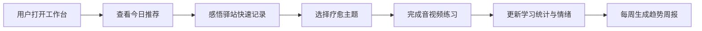
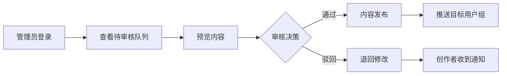
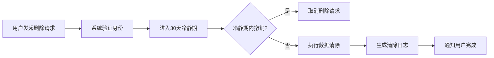

## 1. 产品概述

心身疗愈工作台是一款专注心身健康干预的轻量级数字疗愈平台，服务蒙医医院及亚健康人群。系统通过"感悟驿站"与"多媒体内容中枢"双核心模块，帮助用户记录身心状态、获取专业疗愈资源，并为医师提供临床辅助评估工具；后台管理确保内容质量、用户分组精细化运营，以及 GDPR 式隐私合规。

## 2. 核心功能

### 2.1 用户角色

| 角色 | 注册方式 | 核心权限 |
|------|---------|---------|
| 普通用户 | 手机号/邮箱注册 | 日记录入、情绪查看、内容浏览与学习、个人数据管理 |
| 医师 | 管理员邀请注册 | 查看授权用户日志、评估量表填写、数据统计概览 |
| 管理员 | 系统内置 | 内容审核、用户分组标签管理、数据隐私管理、系统配置 |

### 2.2 功能模块

1. **首页工作台**：快捷入口、今日情绪速记、推荐内容、学习进度摘要
2. **感悟驿站**：每日文字/语音记录、情绪标签选择、情绪热力图、趋势周报、授权医师查看
3. **多媒体内容中枢**：主题分类浏览（呼吸训练/正念引导/蒙医养生）、音视频播放、离线缓存、播放进度同步、学习时长统计
4. **医师端**：患者情绪概览、评估量表嵌入、授权日志查看
5. **后台管理**：内容审核流、用户分组标签、隐私合规/GDPR 删除、数据统计

### 2.3 页面详情

| 页面名称 | 模块名称 | 功能描述 |
|---------|---------|---------|
| 首页工作台 | 快捷入口卡片 | 今日速记、继续学习、我的周报、离线内容入口 |
| 首页工作台 | 情绪速记 | 点击情绪标签快速记录当日身心状态 |
| 首页工作台 | 推荐内容 | 根据用户标签智能推荐疗愈资源 |
| 首页工作台 | 学习进度 | 本周学习时长、连续打卡天数 |
| 感悟驿站-日记列表 | 日记时间轴 | 按日期展示用户所有日志条目 |
| 感悟驿站-日记列表 | 搜索与筛选 | 按情绪标签、日期范围搜索日志 |
| 感悟驿站-新建日记 | 文字录入 | 富文本编辑器，支持情绪标签、天气、睡眠质量标记 |
| 感悟驿站-新建日记 | 语音录入 | 语音录制并自动转文字，支持蒙语/汉语 |
| 感悟驿站-情绪热力图 | 日历热力图 | 按日历展示情绪分布，颜色深浅映射情绪强度 |
| 感悟驿站-趋势周报 | 周报摘要 | 自动生成情绪趋势折线图、关键指标统计、AI 洞察建议 |
| 内容中枢-主题首页 | 主题入口 | 呼吸训练、正念引导、蒙医养生三大主题卡片 |
| 内容中枢-主题详情 | 内容列表 | 按主题筛选音视频，支持搜索/排序/类型过滤 |
| 内容中枢-播放器 | 音视频播放 | 播放控制、进度条、倍速、后台播放 |
| 内容中枢-播放器 | 离线缓存 | 一键缓存至本地，离线模式播放 |
| 内容中枢-学习统计 | 学习概览 | 累计学习时长、完成课程数、学习日历 |
| 医师端-患者概览 | 患者列表 | 授权用户列表、情绪概览、异常预警标识 |
| 医师端-患者详情 | 日志查看 | 查看授权用户的具体日志条目与情绪数据 |
| 医师端-评估量表 | 量表嵌入 | 嵌入式评估量表（如 PHQ-9、GAD-7），结果关联用户 |
| 后台-内容审核 | 审核队列 | 待审核内容列表，支持通过/驳回/修改意见 |
| 后台-用户管理 | 分组标签 | 用户分组标签管理（焦虑倾向、睡眠障碍等） |
| 后台-隐私合规 | 数据隔离 | 用户数据隔离展示、GDPR 式删除请求处理 |
| 后台-数据统计 | 运营概览 | 活跃用户、内容消费、情绪分布等核心指标 |

## 3. 核心流程

### 3.1 用户每日疗愈流程

用户打开工作台 → 查看今日推荐 → 在感悟驿站快速记录身心状态 → 选择一个疗愈主题 → 完成音视频练习 → 系统自动更新学习统计与情绪数据 → 每周自动生成趋势周报

### 3.2 内容审核流程

管理员登录后台 → 查看待审核队列 → 预览内容 → 通过/驳回 → 内容状态更新 → 推送给目标用户组

### 3.3 隐私合规流程

用户发起删除请求 → 系统验证身份 → 进入冷静期（30天） → 冷静期后自动执行数据清除 → 清除日志记录生成 → 通知用户完成

## 4. 用户界面设计

### 4.1 设计风格

- **主色调**：草原绿（Grassland Green #3B7A57）+ 蒙古靛（Mongol Indigo #1E3A5F），传递自然与沉稳
- **辅助色**：阳光金（Sunlight Gold #E8B931）、药草紫（Herb Purple #7B5E7B）、温暖珊瑚（Warm Coral #E07A5F）
- **中性色**：以 zinc 色系为基础，搭配微暖调灰
- **按钮风格**：圆角 12px，柔和阴影，hover 时微上浮+阴影加深
- **字体**：标题使用 Noto Serif SC（宋体韵味），正文使用 Noto Sans SC，数字/代码使用 JetBrains Mono
- **布局风格**：卡片式布局，圆角大（16-24px），顶部导航+侧边栏（后台），毛玻璃质感装饰
- **图标风格**：Lucide 图标库，线宽 1.5-2px，与文字同色系
- **装饰元素**：蒙古纹样（Mongol Pattern）作为背景纹理，圆形/弧形装饰，渐变光晕

### 4.2 页面设计概览

| 页面名称 | 模块名称 | UI 元素 |
|---------|---------|---------|
| 首页工作台 | 快捷入口 | 2x2 卡片网格，渐变背景+图标，hover 微上浮 |
| 首页工作台 | 情绪速记 | 5个情绪图标横排（😊😌😐😔😰），点击高亮+涟漪动效 |
| 首页工作台 | 推荐内容 | 横向滑动卡片，封面图+标题+时长标签 |
| 首页工作台 | 学习进度 | 圆环进度图+数字指标，连续打卡火焰图标 |
| 感悟驿站-日记列表 | 时间轴 | 左侧日期竖线+圆点，右侧卡片，情绪色标 |
| 感悟驿站-情绪热力图 | 日历热力图 | 月历网格，每格填充情绪色（绿→黄→红），hover 弹出详情 |
| 感悟驿站-趋势周报 | 折线图 | 渐变填充折线图，关键指标卡片，AI 建议气泡 |
| 内容中枢-主题首页 | 主题卡片 | 大尺寸渐变卡片，蒙文纹样背景，图标+标题+副标题 |
| 内容中枢-播放器 | 播放界面 | 全屏沉浸式，波形可视化，底部控制栏 |
| 医师端-患者概览 | 患者列表 | 表格+头像，情绪标签列，预警红点 |
| 后台-内容审核 | 审核队列 | 表格+状态标签，预览弹窗，操作按钮组 |
| 后台-隐私合规 | 数据管理 | 用户搜索+数据卡片，删除请求状态时间线 |

### 4.3 响应式策略

- 桌面优先（Desktop-first），最小宽度 1024px 为完整体验
- 平板（768-1024px）：侧边栏收起为抽屉，卡片变为双列
- 手机（<768px）：单列布局，底部导航栏替代顶部导航，播放器全屏沉浸
- 触控优化：按钮最小 44px 点击区域，滑动操作支持

### 4.4 动效设计

- 页面切换：淡入+微上移（200ms ease-out）
- 卡片 hover：y 轴上浮 4px + 阴影加深
- 情绪速记：选中时 scale 弹跳 + 涟漪扩散
- 播放器：音频波形动画，进度条渐变填充
- 热力图：月份切换时格子逐个淡入（stagger 20ms）
- 周报生成：数据驱动动画，数字滚动计数
