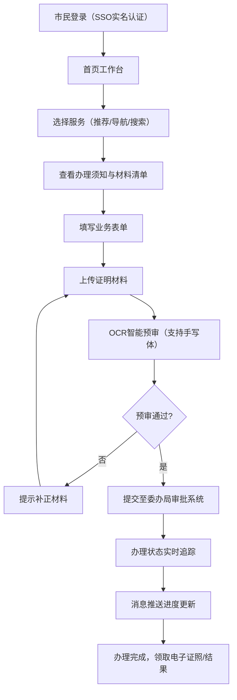
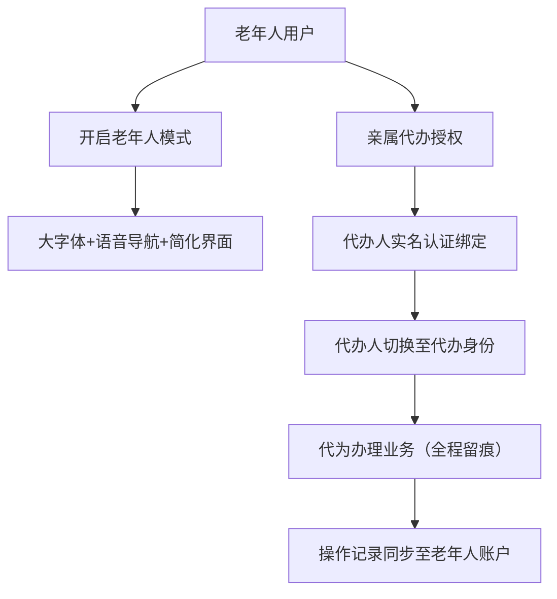

## 1. 产品概述

长沙市统一城市服务数字工作台是面向市民的一站式政务服务融合型中台系统，聚合交通出行、社会保障、户籍办理、教育服务、医疗健康等高频政务服务，打通市级12个委办局数据接口，实现"一网通办、一码通行"。

- 目标用户：长沙市全体市民，涵盖各年龄层群体，重点关注老年人使用体验
- 核心价值：让市民少跑腿、好办事，打造"指尖上的政务服务中心"
- 市场定位：构建市级政务服务标杆，成为市民生活必备的数字基础设施

## 2. 核心功能

### 2.1 用户角色

| 角色 | 注册方式 | 核心权限 |
|------|----------|----------|
| 普通市民 | 实名认证/身份证/手机号 | 浏览和使用全部政务服务，查询个人信息，办理业务 |
| 老年人用户 | 同上 + 亲属代办授权 | 大字体模式、语音导航、简化操作流程 |
| 亲属代办人 | 实名认证 + 授权绑定 | 代授权人办理业务、查询信息（需授权） |
| 系统管理员 | 后台专用账号 | 系统配置、用户管理、审计日志查看 |

### 2.2 功能模块

1. **首页工作台**：服务导航、高频推荐、消息通知、快捷入口、天气/交通实况
2. **扫码乘车**：地铁公交二维码、NFC刷卡、乘车记录查询、线路规划
3. **社保公积金**：账户余额查询、缴费明细、明细导出PDF、政策咨询
4. **户籍业务**：落户申请、居住证申领、新生儿入户、办理进度追踪
5. **教育服务**：幼升小报名、学区划片地图可视化、学校查询、入学政策
6. **健康码与电子证照**：健康码亮证、身份证/驾驶证/结婚证电子证照、核验功能
7. **事项办理引擎**：全流程状态追踪、材料提交、OCR预审、消息推送
8. **用户中心**：个人信息、亲属管理、老年人模式切换、操作记录、设置

### 2.3 页面详情

| 页面名称 | 模块名称 | 功能描述 |
|----------|----------|----------|
| 登录页 | 单点登录模块 | 实名认证、手机号登录、人脸识别、SSO对接省级平台 |
| 首页工作台 | 服务导航区 | 九宫格+瀑布流服务入口，支持个性化排序 |
| 首页工作台 | 个性化推荐区 | 基于用户画像推送高频服务，展示使用频率 |
| 首页工作台 | 消息通知区 | 办理进度提醒、政策更新、系统公告 |
| 扫码乘车页 | 二维码/NFC区 | 乘车码实时刷新、NFC开关、余额显示 |
| 扫码乘车页 | 出行记录 | 历史乘车记录列表、按日期筛选、消费统计 |
| 社保公积金页 | 账户概览 | 五险余额、公积金余额、缴费状态卡片 |
| 社保公积金页 | 明细查询 | 缴费/提取明细、时间范围筛选、导出PDF |
| 户籍业务列表页 | 事项卡片 | 落户/居住证/新生儿入户，显示办理条件与流程 |
| 户籍业务办理页 | 表单提交 | 多步骤表单、材料上传、OCR识别预审 |
| 户籍业务进度页 | 状态时间轴 | 办理全流程节点、预计完成时间、需补材料提示 |
| 教育服务页 | 学区地图 | 交互式地图标注学区、学校信息弹窗、划片范围可视化 |
| 教育服务页 | 报名系统 | 幼升小报名表单、材料提交、审核状态 |
| 健康码亮证页 | 健康码展示 | 动态二维码、疫苗接种信息、核酸检测记录 |
| 电子证照页 | 证照列表 | 身份证/驾驶证/结婚证等电子证照卡片展示 |
| 电子证照页 | 亮证核验 | 证照详情展示、核验二维码、有效期管理 |
| 用户中心页 | 个人信息 | 头像、姓名、实名认证状态、亲属管理 |
| 用户中心页 | 模式切换 | 老年人模式开关、字体大小调整、语音导航开关 |
| 用户中心页 | 操作审计 | 登录记录、业务办理记录、敏感操作留痕 |

## 3. 核心流程

### 3.1 用户办理业务主流程

市民通过单点登录进入系统，根据个性化推荐或服务导航选择目标业务，系统展示办理须知与所需材料，在线填写表单并上传材料，OCR引擎自动预审核材料完整性，材料通过后提交至委办局审批系统，用户可实时查看办理进度，完成后通过消息通知领取电子证照或办理结果。

### 3.2 老年人/亲属代办流程

老年人可选择大字体模式和语音导航，也可授权亲属代为办理。代办人通过亲属授权绑定后，可切换身份代为操作，所有操作均记录审计日志。

## 4. 用户界面设计

### 4.1 设计风格

- **主色调**：政务蓝 (#0052D9) 为主色，辅以橙红 (#FF6B35) 作为警示和强调色
- **辅助色**：浅蓝 (#E8F0FE) 背景、深灰 (#1F2937) 文字、中灰 (#6B7280) 次要文字
- **按钮风格**：圆角8px，主按钮蓝色渐变，悬停有阴影微动效，老年模式下按钮放大1.5倍
- **字体**：标题使用 Noto Serif SC（思源宋体庄重感），正文使用 Noto Sans SC（思源黑体可读性），老年模式全局字号提升2-4号
- **布局风格**：卡片式布局，顶部固定导航栏，左侧二级菜单，内容区网格排布服务卡片
- **图标风格**：Lucide 线性图标，线条粗细1.5px，配色与主色调统一

### 4.2 页面设计概览

| 页面名称 | 模块名称 | UI 元素 |
|----------|----------|----------|
| 首页工作台 | Hero 区域 | 渐变蓝紫背景、欢迎语、天气/交通实况卡片、大圆角设计 |
| 首页工作台 | 服务导航 | 8列网格服务卡片、hover 上浮动效、图标+文字双层结构 |
| 首页工作台 | 个性化推荐 | 横向滚动卡片、"常用服务"标签、使用频次徽章 |
| 登录页 | 登录表单 | 玻璃拟态（Glassmorphism）卡片、背景城市剪影渐变动画 |
| 扫码乘车页 | 乘车码 | 居中大尺寸动态二维码、蓝绿渐变发光边框、NFC开关大按钮 |
| 社保公积金页 | 账户概览 | 渐变数字卡片、数字滚动动画、环形进度条显示缴费状态 |
| 户籍业务办理页 | 多步表单 | 步骤指示器、左侧时间轴进度、右侧表单区、材料拖拽上传 |
| 教育服务页 | 学区地图 | 全幅交互式地图、学校标记点、划片范围半透明色多边形覆盖 |
| 健康码亮证页 | 健康码 | 大尺寸绿色动态码、疫苗/核酸信息条带、倒计时刷新动画 |
| 电子证照页 | 证照卡片 | 仿实体证件设计（身份证蓝/驾驶证褐）、全息防伪动效、翻转展示详情 |
| 用户中心 | 老年模式切换 | 大号开关按钮、模式预览对比、一键应用全站 |

### 4.3 响应式设计

- 采用 Desktop-first 设计，优先适配 1440px 及以上桌面端
- 移动端断点 768px：导航转为底部 Tab 栏、服务卡片改为 4 列、表单全屏展示
- 老年模式：全站字号 +3px、按钮最小高度 56px、点击区域扩大、操作确认弹窗增强
- 触控优化：所有可点击元素最小 44x44px，避免过密排布

### 4.4 动效与微交互

- 页面加载：主内容区淡入 + 卡片错落上浮动画（staggered reveal）
- 服务卡片：hover 时 translateY(-4px) + 阴影加深，过渡 0.3s cubic-bezier
- 健康码：30秒倒计时刷新，进度条渐变动画
- 数字展示：账户余额采用 countUp 数字滚动动画
- 表单步骤：切换时水平滑动过渡，步骤节点脉冲高亮
- 电子证照：点击卡片 3D 翻转展示背面详情
