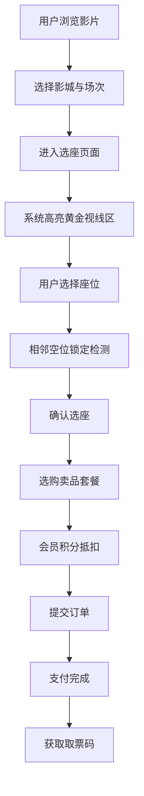
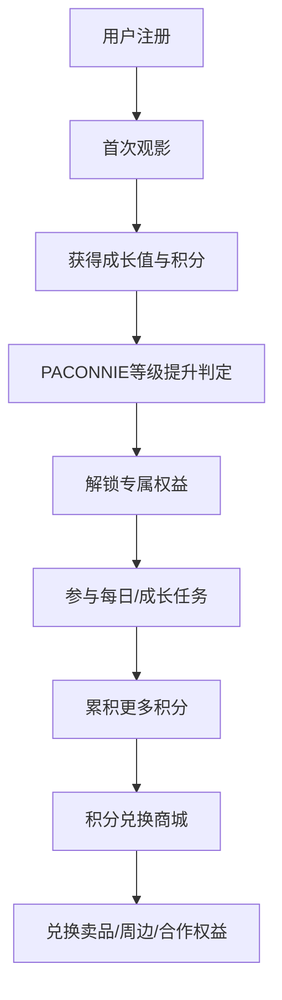
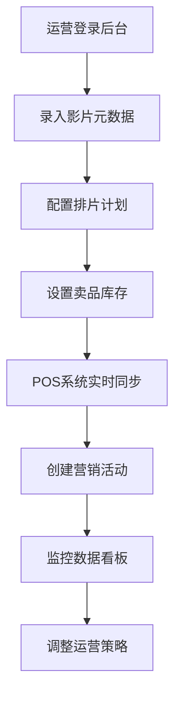

## 1. 产品概述

连锁影院官方数字服务平台，面向观影用户与影院运营管理者的一站式数字化服务系统。涵盖影城信息展示、在线选座购票、卖品套餐购买、会员体系运营、营销活动推广等全链路服务，同时提供后台管理能力支撑影院日常运营。

- 核心目标：打造沉浸式观影体验，提升用户转化率与复购率，构建完善的会员忠诚度体系
- 目标用户：C端观影用户、B端影院运营管理人员
- 市场价值：整合影院资源，实现线上线下一体化运营，数据驱动精细化营销

## 2. 核心功能

### 2.1 用户角色

| 角色 | 注册方式 | 核心权限 |
|------|---------|---------|
| 游客用户 | 无需注册 | 浏览影片/影城信息、查看排片、查看座位图 |
| 注册会员 | 手机号注册/第三方登录 | 在线购票、卖品购买、积分兑换、等级成长 |
| PACONNIE CLUB会员 | 累计消费/付费升级 | 专属客服、优先选座、专属权益兑换、生日礼遇 |
| 运营管理员 | 后台账号 | 影片元数据管理、排片管理、库存管理、营销活动配置 |

### 2.2 功能模块

1. **首页**: 影城导航、热映影片轮播、即将上映、促销活动横幅、快速购票入口
2. **影片详情页**: 影片信息、预告片/剧照、评分影评、排片时间表、购票入口
3. **选座购票页**: 影厅座位图、黄金视线区高亮、相邻座位锁定、价格分区、实时锁座
4. **卖品商城页**: 单品展示、组合套餐、动态折扣、购物车、库存状态
5. **会员中心页**: PACONNIE等级进度、积分余额、任务中心、权益卡券、订单记录
6. **积分兑换页**: 积分商品（卖品/周边/合作权益）、兑换记录
7. **营销活动页**: 限时抢座、早鸟票、团体购票优惠码、活动详情与规则
8. **管理后台首页**: 数据看板、营业统计、排片概览、库存预警
9. **影片管理后台**: 影片元数据录入、预告片/剧照管理、影评审核
10. **库存管理后台**: 卖品库存实时同步、POS对接、预警设置、出入库记录

### 2.3 页面详情

| 页面名称 | 模块名称 | 功能描述 |
|---------|---------|---------|
| 首页 | 影城导航 | 定位附近影城、按区域/特色筛选、厅型标签（IMAX/4DX/Dolby） |
| 首页 | 热映轮播 | 大图轮播展示重点影片，自动切换+手动切换，悬停暂停 |
| 首页 | 影片列表 | 海报网格布局，悬停显示快速购票按钮与评分信息 |
| 首页 | 活动横幅 | 营销活动滚动展示，点击跳转活动详情 |
| 影片详情页 | 影片介绍 | 海报、片名、导演、主演、时长、类型、上映日期 |
| 影片详情页 | 多媒体区 | 预告片播放、剧照画廊、评分统计、用户影评列表 |
| 影片详情页 | 排片表 | 按日期+影城维度展示场次，显示厅型语言、余座情况、票价 |
| 选座购票页 | 座位图 | 可视化座位布局，已售/可选/已选状态区分，支持缩放 |
| 选座购票页 | 智能选座 | 黄金视线区自动高亮标识，已选座位相邻空位锁定提示 |
| 选座购票页 | 价格分区 | VIP区/标准区/特惠区不同价格，座位颜色区分 |
| 卖品商城页 | 商品展示 | 爆米花/饮料/周边商品卡片，显示价格、库存、折扣标签 |
| 卖品商城页 | 套餐组合 | 动态组合推荐，显示组合折扣价与节省金额 |
| 卖品商城页 | 购物车 | 实时计算总价、优惠金额、应付金额，支持数量调整 |
| 会员中心页 | 等级卡片 | PACONNIE等级进度条、当前等级、升级所需消费 |
| 会员中心页 | 积分面板 | 当前积分、即将过期积分、积分获取记录 |
| 会员中心页 | 任务中心 | 每日任务、成长任务，完成获取积分/成长值 |
| 会员中心页 | 权益卡券 | 优惠券、兑换券、专属权益列表与使用入口 |
| 积分兑换页 | 兑换商品 | 按积分档位展示可兑换商品，支持分类筛选 |
| 营销活动页 | 活动列表 | 限时抢座/早鸟票/团体票活动卡片，显示倒计时与优惠力度 |
| 营销活动页 | 优惠码 | 优惠码输入与验证、团体购票申请入口 |
| 管理后台 | 数据看板 | 今日票房、观影人次、卖品销售额、会员新增等指标 |
| 管理后台 | 影片管理 | 影片CRUD、多媒体上传、排片计划配置 |
| 管理后台 | 库存管理 | 库存实时监控、POS同步状态、低库存预警 |

## 3. 核心流程

### 3.1 购票主流程

用户浏览影片 → 选择影城与场次 → 进入选座页 → 系统高亮黄金视线区 → 用户选择座位（相邻空位锁定提示） → 确认座位 → 选购卖品套餐 → 会员积分抵扣 → 提交订单 → 支付完成 → 获取取票码

### 3.2 会员成长流程

用户注册 → 完成首次观影 → 获得成长值与积分 → 升级PACONNIE等级 → 解锁专属权益 → 参与任务获取更多积分 → 积分兑换卖品/周边/权益

### 3.3 运营管理流程

运营登录后台 → 录入影片元数据 → 配置排片计划 → 设置卖品库存（对接POS） → 创建营销活动 → 实时监控数据看板 → 调整运营策略

## 4. 用户界面设计

### 4.1 设计风格

- **主色调**: 深邃午夜蓝 #0A1628 作为主背景，营造影院沉浸感；铂金色 #D4AF37 作为品牌强调色，体现高端质感
- **辅助色**: 爆米花黄 #FFC857、观影红 #E63946、IMAX蓝 #00A3E0
- **按钮风格**: 圆角12px，渐变色填充，悬停时轻微上浮+发光效果
- **字体**: 标题使用 "Playfair Display" 衬线字体（高端典雅），正文使用 "Noto Sans SC" 无衬线字体（清晰可读）
- **布局风格**: 卡片式布局配合深色背景，大量留白与阴影层次，局部采用金色边框点缀
- **图标风格**: 线性图标配合渐变填充，整体精致现代

### 4.2 页面设计概览

| 页面名称 | 模块名称 | UI元素 |
|---------|---------|--------|
| 首页 | 顶部导航 | 深色半透明背景，金色品牌LOGO，搜索框，会员入口，导航悬浮固定 |
| 首页 | Hero轮播 | 全屏大图，渐变遮罩，影片标题叠加，淡入淡出切换动画 |
| 首页 | 影片卡片 | 圆角海报，悬停放大+金色边框光晕，评分徽章悬浮右下角 |
| 首页 | 影城卡片 | 厅型标签（IMAX/4DX彩色标识），距离信息，快速购票按钮 |
| 影片详情页 | 头部区域 | 海报大图+模糊背景延伸，影片信息浮动叠加，金色评分展示 |
| 影片详情页 | 剧照画廊 | 横向滚动缩略图，点击放大灯箱效果，淡入过渡动画 |
| 选座购票页 | 座位图 | 屏幕发光效果，座位圆角方块，黄金区金色描边，已选座位脉冲动画 |
| 选座购票页 | 信息面板 | 右侧固定，场次信息、已选座位、价格明细，金色确认按钮 |
| 卖品商城页 | 商品卡片 | 图片+描述+价格，折扣标签红色角标，组合套餐渐变背景 |
| 会员中心页 | 等级卡片 | 金色渐变边框，进度条发光效果，等级徽章，权益图标网格 |
| 管理后台 | 数据看板 | 深色仪表盘风格，数据卡片发光边框，图表深色主题 |

### 4.3 响应式设计

- **桌面优先**: 以1440px宽度为基准设计，采用12列栅格系统
- **平板适配**: 1024px断点，侧边栏收起为抽屉菜单，卡片数量自适应
- **移动端适配**: 768px断点，单列布局，底部Tab导航，座位图支持手势缩放
- **触控优化**: 移动端按钮最小高度48px，座位点击区域放大

### 4.4 动效设计

- 页面切换：路由切换时淡入+轻微上移动画，时长300ms
- 卡片悬停：10px上浮+金色光晕扩散，transform过渡
- 座位选中：脉冲缩放动画+选中音效提示
- 数据加载：骨架屏渐变闪烁占位
- 弹窗出现：从底部上滑+背景模糊遮罩
