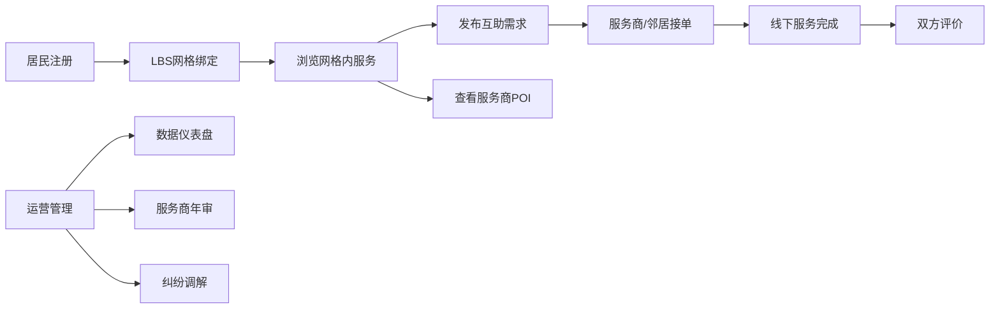

## 1. 产品概述
县域级本地生活服务操作系统，聚焦山东、河南、河北、湖北、江苏32个地市的精准运营，打造LBS强绑定的社区生活服务平台。
- 核心目标：实现本地化生活服务的数字化、网格化运营，连接居民、服务商、社区管理者
- 市场价值：解决县域级生活服务信息不对称，提升社区治理效率，创造就业机会

## 2. 核心功能

### 2.1 用户角色
| 角色 | 注册方式 | 核心权限 |
|------|----------|----------|
| 普通居民 | 手机号+网格认证 | 浏览网格内服务、发布互助需求、使用地图服务 |
| 本地服务商 | 资质审核+街道备案 | 管理POI信息、接单服务、查看业绩 |
| 社区团长 | 社区推荐认证 | 推荐激励管理、结算查看、团队统计 |
| 县域运营管理员 | 后台授权 | 数据仪表盘、服务商管理、纠纷调解、年审提醒 |

### 2.2 功能模块
1. **用户端首页**：LBS定位、网格内服务推荐、邻里互助池、社区公告
2. **本地生活服务地图**：多图层切换（外卖/拼车/二手/求职）、POI详情展示
3. **服务商中心**：资质管理、服务时段设置、订单管理
4. **邻里互助需求池**：需求发布、接单、评价体系
5. **县域运营仪表盘**：服务覆盖率统计、需求TOP10、纠纷成功率、各街镇数据
6. **服务商年审模块**：年审提醒、资质更新、状态管理
7. **团长激励结算**：推荐关系链、激励计算、结算记录

### 2.3 页面详情
| 页面名称 | 模块名称 | 功能描述 |
|---------|----------|----------|
| 用户端首页 | 网格定位与切换 | 自动定位注册网格，手动切换已认证网格 |
| 用户端首页 | 服务快捷入口 | 家政维修、拼车出行、二手交易、求职招聘 |
| 用户端首页 | 需求池展示 | 最新互助需求卡片列表，一键接单 |
| 生活服务地图 | 多图层切换 | 外卖、拼车、二手、求职图层独立切换 |
| 生活服务地图 | POI详情弹窗 | 营业状态、人均消费、服务时段、联系方式 |
| 服务商列表 | 资质筛选 | 街道备案认证、服务评分、距离优先 |
| 需求发布页 | 需求表单 | 类型选择、描述、地点、酬金、截止时间 |
| 运营仪表盘 | 数据概览 | 服务覆盖率、需求TOP10、纠纷调解成功率图表 |
| 运营仪表盘 | 街镇对比 | 各镇街数据横向对比柱状图 |
| 服务商管理 | 年审提醒 | 到期预警、批量提醒、状态更新 |
| 团长结算 | 激励明细 | 推荐关系链展示、激励计算、结算记录 |

## 3. 核心流程

### 3.1 主要业务流程
1. 用户注册→LBS定位→绑定社区网格→浏览网格内服务→发布/接单需求→完成交易→评价
2. 服务商申请→街道备案→资质审核→POI信息维护→接单服务→结算提现
3. 运营管理→数据监控→服务商年审→纠纷调解→团长激励结算

## 4. 用户界面设计

### 4.1 设计风格
- 主色调：温暖橙色系 #FF7A45（生活服务的亲和感）+ 深蓝 #1E3A5F（专业可靠）
- 辅助色：绿色 #22C55E（成功/营业中）、红色 #EF4444（警告/已打烊）
- 按钮风格：大圆角（12px）、轻微阴影、悬停缩放效果
- 字体：标题使用 Noto Serif SC（稳重），正文使用 Noto Sans SC（清晰易读）
- 布局风格：卡片式布局，适度留白，信息层级分明
- 图标风格：线性图标，统一2px描边，圆角处理

### 4.2 页面设计概览
| 页面名称 | 模块名称 | UI元素 |
|---------|----------|--------|
| 用户端首页 | 顶部定位栏 | 半透明毛玻璃效果、当前网格名称、位置图标动画 |
| 用户端首页 | 快捷入口区 | 4×2网格图标、渐变背景、悬浮上浮效果 |
| 用户端首页 | 需求池卡片 | 白色卡片、需求类型标签、发布人头像、距离显示 |
| 服务地图 | 地图容器 | 全屏地图、图层切换浮动按钮、POI标记聚类 |
| 运营仪表盘 | 数据卡片组 | 渐变数字卡片、环比箭头、微缩趋势图 |
| 运营仪表盘 | 图表区域 | ECharts柱状图/折线图、交互动效、数据钻取 |

### 4.3 响应式设计
- Desktop-first设计，适配1920×1080、1440×900等主流分辨率
- 平板端：侧边栏折叠为图标，卡片布局自适应宽度
- 移动端：底部导航栏，单列卡片布局，地图手势优化
- 触摸优化：按钮最小尺寸44×44px，列表项充足点击区域

### 4.4 动效设计
- 页面加载：骨架屏渐入，内容 staggered 动画
- 地图POI：标记点脉冲动画，选中时弹跳效果
- 数据卡片：数字滚动计数动画
- 操作反馈：按钮点击缩放、表单验证抖动、成功确认钩形动画
