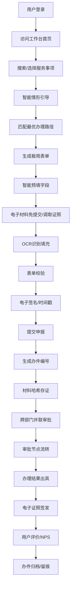

## 1. 产品概述
安徽省一体化政务服务平台省级工作台，支撑千项高频服务"一网通办"，实现政务服务数字化转型。
- 面向自然人和法人用户，提供全流程在线政务服务办理能力；面向运营管理人员，提供服务效能监测和事项生命周期管理能力。
- 解决政务服务"跑多门、跑多次、材料繁"问题，实现"一网通办、全程网办、跨省通办"，提升政府治理能力现代化水平。

## 2. 核心功能

### 2.1 用户角色
| 角色 | 注册方式 | 核心权限 |
|------|----------|----------|
| 自然人用户 | 实名认证注册 | 办理个人事项、亮证、查询办件进度 |
| 法人用户 | 企业认证注册 | 办理企业事项、授权经办人、管理企业证照 |
| 窗口工作人员 | 内部账号分配 | 收件审核、帮办代办、出具办理结果 |
| 审批人员 | 内部账号分配 | 事项审批、并联会签、出具审批意见 |
| 运营管理人员 | 内部账号分配 | 效能监测、事项管理、数据资源管理 |
| 系统管理员 | 内部账号分配 | 用户管理、权限配置、系统参数设置 |

### 2.2 功能模块
1. **省级工作台首页**：服务导航、办件提醒、常用服务、政策公告、智能推荐
2. **智能情形引导引擎**：用户画像分析、历史办件匹配、情形树引导、最优路径推荐
3. **政务服务事项中心**：事项检索、事项详情、材料清单、办理流程、在线申报
4. **极简表单生成器**：动态字段渲染、智能预填、表单校验、草稿保存
5. **电子材料免提交**：证照库自动调取、OCR识别填充、材料复用、电子印章
6. **电子证照中心**：证照列表、证照详情、二维码亮证、使用记录审计
7. **跨部门并联审批**：审批流配置、部门会签、数据共享、进度跟踪
8. **办件过程留痕**：操作日志、材料哈希存证、电子签名时间戳、全程可追溯
9. **服务效能监测平台**：超期预警、堵点分析、满意度NPS、热力图展示
10. **事项生命周期管理**：事项新增/下线、版本比对、迭代记录、发布审批
11. **政务数据资源目录**：接口目录、调用统计、响应耗时、错误率监控

### 2.3 页面详情
| 页面名称 | 模块名称 | 功能描述 |
|----------|----------|----------|
| 工作台首页 | 服务导航区 | 高频服务快捷入口、分类导航、智能搜索 |
| 工作台首页 | 办件提醒区 | 在办件、待补件、已办件数量提醒、进度卡片 |
| 工作台首页 | 智能推荐区 | 基于用户画像推荐常用服务、政策推送 |
| 事项列表页 | 检索筛选区 | 关键词搜索、部门筛选、主题分类、办理深度 |
| 事项列表页 | 事项卡片区 | 事项名称、办理时限、跑动次数、在线申报入口 |
| 事项详情页 | 基本信息区 | 事项名称、实施主体、办理时限、咨询电话 |
| 事项详情页 | 情形引导区 | 情形树问答、自动匹配办理路径 |
| 事项详情页 | 材料清单区 | 所需材料列表、证照免提交标识、示例下载 |
| 在线申报页 | 表单填写区 | 动态表单生成、智能预填、实时校验 |
| 在线申报页 | 材料上传区 | 本地上传、证照调用、OCR识别、材料复用 |
| 电子证照中心 | 我的证照区 | 32类证照卡片展示、证照有效期提醒 |
| 电子证照中心 | 亮证功能区 | 动态二维码生成、扫码记录、使用审计 |
| 办件进度页 | 进度跟踪区 | 办理节点、审批意见、时间轴展示 |
| 效能监测平台 | 概览仪表盘 | 办件量、办结率、平均耗时、满意度统计 |
| 效能监测平台 | 超期预警区 | 超期办件列表、预警等级、处置督办 |
| 效能监测平台 | 堵点分析区 | 堵点环节识别、优化建议、改进跟踪 |
| 事项管理后台 | 事项列表区 | 事项上下线、版本管理、迭代比对 |
| 数据资源目录 | 接口目录区 | 接口列表、调用频次、响应耗时、错误率 |

## 3. 核心流程

## 4. 用户界面设计

### 4.1 设计风格
- 主色调：政务蓝 `#0052D9`，体现庄重、专业、可信赖
- 辅助色：成功绿 `#00B42A`、警告橙 `#FF7D00`、危险红 `#F53F3F`
- 中性色：基于 `zinc` 色系，从 `#FAFAFA` 到 `#1F1F1F`
- 按钮风格：圆角 6px，主按钮蓝色渐变，次要按钮描边风格
- 字体：正文使用 `PingFang SC`，标题使用 `Microsoft YaHei`
- 布局风格：顶部导航 + 侧边栏 + 内容区三栏布局，卡片式模块划分
- 图标风格：使用 `lucide-react` 线性图标，统一 18px 尺寸

### 4.2 页面设计概述
| 页面名称 | 模块名称 | UI元素 |
|----------|----------|--------|
| 工作台首页 | Hero区域 | 政务蓝渐变背景、系统名称、欢迎语、统计数据卡片 |
| 工作台首页 | 快捷入口 | 8宫格图标导航、hover动效、点击反馈 |
| 工作台首页 | 办件列表 | 表格展示、状态标签、进度条、操作按钮 |
| 事项详情页 | 情形引导 | 步骤指示器、问答卡片、选项按钮、下一步引导 |
| 在线申报页 | 动态表单 | 分组字段、联动显示、校验提示、自动保存 |
| 电子证照中心 | 证照卡片 | 拟物化证照样式、全息防伪纹、二维码角标 |
| 效能监测平台 | 数据大屏 | 暗色背景、荧光色数据、动态图表、实时刷新 |

### 4.3 响应式设计
- 采用桌面优先设计，最小支持 1280px 宽度
- 侧边栏可折叠，适配 1366px 小屏
- 表格支持横向滚动，适配窄屏显示
- 触控设备优化按钮尺寸，不小于 44px
