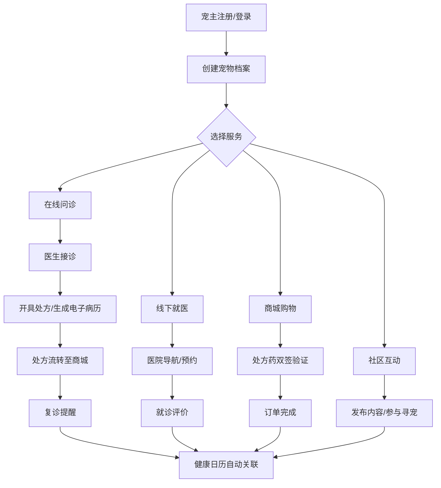
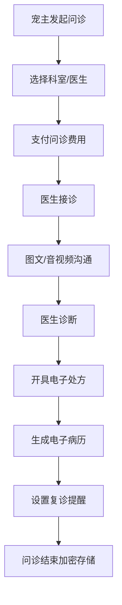

## 1. 产品概述

宠生园 PetLife 是一款覆盖宠物全生命周期管理的SaaS化服务平台，致力于为宠主、宠物医生、宠物医院及商家提供一站式数字化服务解决方案。平台整合在线问诊、线下就医、宠物商城、宠物社区及健康管理五大核心模块，打通宠物从出生到老年的全流程服务闭环。

## 2. 核心功能

### 2.1 用户角色

| 角色 | 注册方式 | 核心权限 |
|------|----------|---------|
| 宠主 | 手机号/微信注册 | 宠物档案管理、在线问诊、商城购物、社区发布、寻宠公益 |
| 宠物医生 | 资质审核入驻 | 问诊接诊、处方开具、排班管理、病历管理 |
| 宠物医院 | 机构认证入驻 | POI信息管理、服务定价、医生管理、评价管理 |
| 商家 | 营业执照备案 | 商品上架、订单管理、资质备案 |

### 2.2 功能模块

1. **首页仪表盘**：快捷入口、健康日历、在线问诊入口、附近医院、热门商品、社区动态
2. **宠物档案管理**：多宠档案、健康数据模板、疫苗驱虫记录
3. **在线问诊模块**：图文问诊、音视频问诊、处方流转、电子病历、复诊提醒
4. **线下就医模块**：医院POI导航、服务项目对比、医生评分、在线预约
5. **宠物商城模块**：类目搜索、商品详情、购物车、处方药双签验证、订单管理
6. **社区模块**：结构化内容发布、疫苗驱虫标签、寻宠公益、LBS扩散、线索核验
7. **健康日历引擎**：疫苗/驱虫/体检提醒、服务预约、健康数据统计
8. **医生工作台**：排班管理、问诊记录、患者管理
9. **医院管理后台**：POI信息、服务定价、评价管理、医生管理
10. **商家管理后台**：SKU管理、资质备案、订单处理

### 2.3 页面详情

| 页面名称 | 模块名称 | 功能描述 |
|---------|---------|---------|
| 首页仪表盘 | Hero区域 | 轮播Banner、快捷功能入口、健康提醒卡片 |
| 首页仪表盘 | 健康日历 | 月度视图、待办事项、快捷预约 |
| 首页仪表盘 | 在线问诊 | 医生列表、科室分类、快速接诊 |
| 宠物档案 | 宠物列表 | 多宠卡片展示、添加新宠物 |
| 宠物档案 | 健康详情 | 基本信息、疫苗记录、驱虫记录、体检报告 |
| 在线问诊 | 问诊列表 | 进行中/历史问诊、状态筛选 |
| 在线问诊 | 问诊详情 | 图文消息、音视频通话、处方查看 |
| 在线问诊 | 电子病历 | 病历模板、症状描述、诊断结果 |
| 医院列表 | 筛选导航 | 地图视图、列表视图、距离/评分筛选 |
| 医院详情 | POI信息 | 地址导航、营业时间、服务项目、医生团队 |
| 医院详情 | 评价系统 | 评分展示、评价列表、反作弊标识 |
| 商城首页 | 类目导航 | 物种/年龄/健康状态筛选 |
| 商品详情 | 商品信息 | SKU选择、处方药标识、双签验证流程 |
| 社区首页 | 内容流 | 结构化帖子、疫苗/驱虫标签筛选 |
| 社区发布 | 发布表单 | 内容编辑、标签选择、关联宠物档案 |
| 寻宠公益 | 任务列表 | LBS附近寻宠、线索提交、领养意向 |
| 医生工作台 | 排班管理 | 日历排班、预约查看、状态切换 |
| 医生工作台 | 问诊记录 | 加密存储、患者列表、病历管理 |
| 医院后台 | 信息管理 | POI编辑、服务定价、评价管理 |
| 商家后台 | 商品管理 | SKU上架、资质备案、库存管理 |

## 3. 核心流程

宠主核心流程：注册登录 → 创建宠物档案 → （在线问诊/线下就医/商城购物/社区互动）→ 健康日历自动提醒

医生问诊流程：

## 4. 用户界面设计

### 4.1 设计风格

- **主色调**：温暖治愈的森林绿 #2D8653 作为主色，代表生命与健康；辅以奶油白 #FFFBF5 作为背景
- **辅助色**：暖橙色 #FF8C42 用于强调和CTA按钮，代表活力与温暖
- **按钮风格**：圆润胶囊形按钮，柔和阴影，悬停微缩放效果
- **字体**：展示字体使用圆润友好的 Quicksand，正文字体使用现代清晰的 Noto Sans SC
- **布局风格**：卡片式布局，大量留白，圆角设计，柔和渐变背景
- **图标风格**：Lucide图标库，线性风格，统一圆角

### 4.2 页面设计概览

| 页面名称 | 模块名称 | UI元素 |
|---------|---------|--------|
| 首页仪表盘 | Hero区域 | 渐变背景、大标题、宠物插画、功能图标网格 |
| 首页仪表盘 | 健康日历 | 月历卡片、提醒事项、渐变边框 |
| 宠物档案 | 宠物卡片 | 宠物头像、基本信息标签、健康状态指示器 |
| 在线问诊 | 医生卡片 | 医生头像、评分、科室标签、在线状态 |
| 医院列表 | 地图视图 | POI标记、信息气泡、筛选浮层 |
| 商城首页 | 商品卡片 | 商品图、物种标签、价格、处方药标识 |
| 社区首页 | 内容卡片 | 用户头像、宠物标签、互动按钮 |

### 4.3 响应式设计

- Desktop-first设计，断点设置为1280px、1024px、768px、480px
- 移动端优化触控区域，最小点击区域44x44px
- 侧边栏在移动端转为底部Tab导航
- 地图组件在小屏幕隐藏次要信息

### 4.4 动效设计

- 页面加载采用渐入+上移动画
- 卡片悬停微上浮+阴影加深
- 按钮点击缩放反馈
- 问诊消息气泡弹出动画
- 日历日期切换平滑过渡
- 健康提醒脉冲动画
