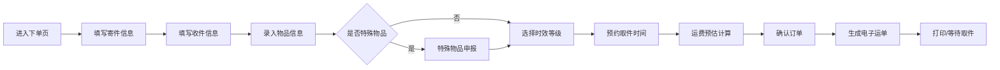
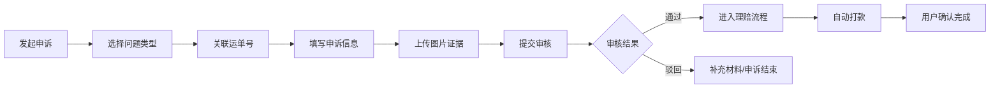

# 中通快递统一业务中枢系统 - 产品需求文档 (PRD)

## 1. 产品概述

中通快递统一业务中枢系统，整合寄件、查件、网点检索、运费预估、售后理赔及网点管理全链路业务，服务于寄件用户、收件用户及网点运营管理员三大角色。通过数字化技术提升寄递服务效率，降低运营成本，优化客户体验，构建智能化快递业务生态。

## 2. 核心功能

### 2.1 用户角色

| 角色 | 注册方式 | 核心权限 |
|------|----------|----------|
| 寄件用户 | 手机号注册/登录 | 自助下单、电子运单打印、预约取件、特殊物品申报、售后申诉 |
| 收件用户 | 手机号注册/物流单号绑定 | 物流查询、半年记录批量查询、物流节点推送订阅 |
| 网点管理员 | 后台分配账号 | 网点数据查看、效能分析、CLV 报表、热力图监控 |

### 2.2 功能模块

1. **首页门户**：快捷入口导航、运费预估、服务公告、热门网点
2. **自助下单**：寄/收件信息填写、物品信息、时效选择、电子运单、预约取件
3. **物流查询**：单号查询、账号绑定批量查询、节点时间线、推送订阅
4. **网点检索**：地图 POI 聚合、营业时间筛选、服务能力标签、网点详情
5. **运费时效预估**：四维参数计算（始发地/目的地/重量/时效等级）
6. **售后中心**：破损/丢件申诉、图片证据上传、理赔进度跟踪、自动打款
7. **管理后台**：网点效能热力图、平均响应时长、投诉率、签收准时率、CLV 计算

### 2.3 页面详情

| 页面名称 | 模块名称 | 功能描述 |
|----------|----------|----------|
| 首页 | Hero 导航区 | 六大功能快捷入口卡片、动态 Banner、品牌展示 |
| 首页 | 运费预估组件 | 始发地/目的地/重量/时效四级联动计算器 |
| 首页 | 热门服务 | 网点推荐、服务公告、时效承诺展示 |
| 自助下单页 | 寄件信息表单 | 寄件人姓名/手机/地址自动补全 |
| 自助下单页 | 收件信息表单 | 收件人信息、地址簿快速选择 |
| 自助下单页 | 物品信息 | 重量/体积/物品类型/特殊物品申报 |
| 自助下单页 | 时效与服务 | 普通/次日达/隔日达等级选择、增值服务 |
| 自助下单页 | 预约取件 | 日期时间选择器、取件地址确认 |
| 自助下单页 | 电子运单 | 运单预览、PDF 打印、二维码生成 |
| 物流查询页 | 单号输入 | 多单号批量输入、快速查询 |
| 物流查询页 | 时间线展示 | 物流节点事件、时间地点详情 |
| 物流查询页 | 账号绑定 | 手机号绑定、半年历史记录列表 |
| 物流查询页 | 推送订阅 | 微信/短信/APP 推送开关 |
| 网点检索页 | 地图视图 | POI 聚合标记、缩放交互 |
| 网点检索页 | 筛选面板 | 营业时间、服务类型、距离范围过滤 |
| 网点检索页 | 网点卡片 | 地址、电话、服务标签、评分展示 |
| 售后中心页 | 申诉列表 | 进行中/已完成申诉分类展示 |
| 售后中心页 | 申诉提交 | 类型选择（破损/丢件）、运单关联、金额填写 |
| 售后中心页 | 证据上传 | 多图片上传、预览、删除 |
| 售后中心页 | 进度跟踪 | 审核中/理赔中/已打款阶段时间线 |
| 管理后台 | 数据概览 Dashboard | KPI 卡片、趋势图、核心指标 |
| 管理后台 | 网点效能热力图 | 地图热力渲染、响应时长/投诉率/准时率维度切换 |
| 管理后台 | CLV 分析 | 客户生命周期价值模型、分层统计、趋势预测 |

## 3. 核心流程

### 3.1 自助下单流程

用户进入下单页 → 填写寄件人信息 → 填写收件人信息 → 录入物品信息与特殊申报 → 选择时效等级与增值服务 → 预约取件时间 → 系统计算运费 → 确认订单并支付 → 生成电子运单 → 打印运单/等待取件

### 3.2 售后理赔流程

用户发起申诉 → 选择问题类型（破损/丢件）→ 关联运单号 → 填写申诉金额与描述 → 上传图片证据 → 提交审核 → 客服审核 → 审核通过进入理赔 → 自动打款 → 用户确认完成

## 4. 用户界面设计

### 4.1 设计风格

- **主色调**：中通蓝 `#0058FF`，代表专业与可信赖
- **辅助色**：活力橙 `#FF6B1A` 用于强调交互，成功绿 `#00B578`，警示红 `#F53F3F`
- **中性色**：深灰 `#1D2129`、中灰 `#4E5969`、浅灰 `#C9CDD4`、背景 `#F2F3F5`
- **按钮风格**：圆角 8px，主按钮实心中通蓝，次按钮描边，悬停有微缩放和阴影变化
- **字体**：标题使用「思源黑体 Bold」，正文使用「PingFang SC / 思源黑体 Regular」，数据展示使用等宽字体
- **布局风格**：顶部导航 + 侧边栏（后台），卡片式内容区，充足留白，大间距 24px/16px/8px 三级体系
- **图标风格**：Lucide 线性图标，24px 标准尺寸，颜色跟随语义

### 4.2 页面设计概览

| 页面名称 | 模块名称 | UI 元素 |
|----------|----------|---------|
| 首页 | Hero 导航区 | 渐变蓝背景、圆角功能卡片、悬浮微动效、品牌 Slogan 大字排版 |
| 首页 | 运费预估组件 | 玻璃态卡片、下拉选择器、滑块重量输入、实时计算结果高亮 |
| 自助下单页 | 多步表单 | 步骤条指示器、分组卡片、自动填充地址、表单实时校验 |
| 自助下单页 | 电子运单 | 模拟纸质运单样式、条形码渲染、打印按钮固定悬浮 |
| 物流查询页 | 时间线 | 竖线节点设计、已完成节点蓝色实心、当前节点脉冲动画 |
| 网点检索页 | 地图视图 | 高德/百度地图风格、POI 聚合气泡、网点信息弹窗 |
| 售后中心页 | 证据上传 | 拖拽上传区、缩略图网格、删除按钮悬浮出现 |
| 管理后台 | 热力图 | ECharts 热力图层、颜色渐变图例、维度切换 Tab |
| 管理后台 | Dashboard | KPI 卡片网格、迷你趋势图、深色数据大屏风格可选 |

### 4.3 响应式

- Desktop-first 设计，1440px 基准宽度
- 1024px 断点：侧边栏折叠、卡片两列变一列
- 768px 断点：顶部导航变汉堡菜单、表单单列、地图全屏
- 触控优化：最小点击区域 44×44px，移动端按钮放大至 48px 高度

### 4.4 3D 场景指引（管理后台大屏模式可选）

- 环境：深色科技感 HDRI，深蓝紫色调
- 光照：顶部主光 + 轮廓边缘光，突出数据卡片悬浮感
- 相机：轻微俯视 15°，平移浏览数据面板
- 动效：数据面板浮出动画、数字滚动计数、KPI 达标光效
- 后期：Bloom 发光、轻微颗粒感增加质感
