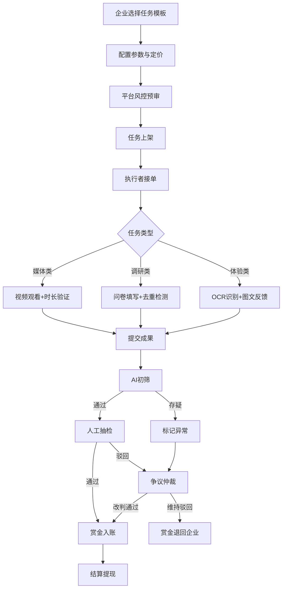
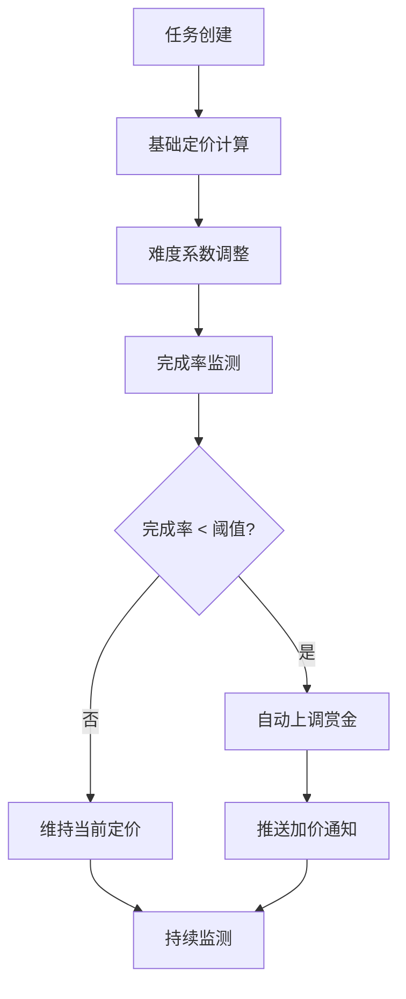
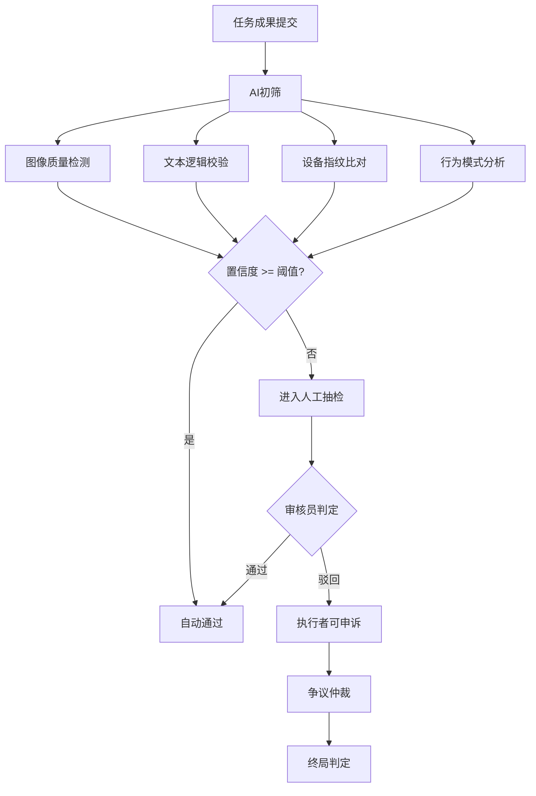

## 1. 产品概述

轻量级众包任务分发与结算平台，面向企业端（任务发布方）与个人端（任务执行者），通过AI驱动的风控与审核机制，实现高效、合规、防刷的任务分发与劳务结算闭环。平台核心价值在于：降低企业众包运营成本、保障执行者真实收益、构建可信赖的微任务生态。

- 目标用户：需要大规模数据采集/曝光推广/用户体验调研的中小型企业；寻求灵活兼职收入的个人用户
- 市场价值：解决众包行业信任缺失、刷量泛滥、结算不透明三大痛点

## 2. 核心功能

### 2.1 用户角色

| 角色 | 注册方式 | 核心权限 |
|------|----------|----------|
| 企业发布方 | 企业邮箱+营业执照认证 | 创建任务模板、发布任务、查看ROI报表、提现管理 |
| 任务执行者 | 手机号+实名认证 | 浏览任务、接单执行、提交成果、提现收益 |
| 平台管理员 | 内部账号 | 风控监控、审核仲裁、系统配置、数据看板 |

### 2.2 功能模块

1. **首页/任务大厅**：任务分类导航、热门任务推荐、实时收益滚动、搜索筛选
2. **任务发布中心（企业端）**：任务模板库、动态定价配置、投放设置、预算管理
3. **任务执行工作台（执行者端）**：任务详情、执行指引、成果提交、进度追踪
4. **风控与审核中心**：AI初筛结果、人工抽检队列、争议仲裁、异常设备监控
5. **结算与钱包**：收益明细、提现申请、银行账户管理、税务信息
6. **数据看板（企业端）**：任务健康度、完成率拐点、ROI分析、用户画像
7. **平台管理后台**：全局风控监控、企业资质审核、系统参数配置

### 2.3 页面详情

| 页面名称 | 模块名称 | 功能描述 |
|----------|----------|----------|
| 首页/任务大厅 | Hero区 | 平台品牌展示、核心数据（累计发放赏金/在线任务数/注册用户数）、动态粒子背景 |
| 首页/任务大厅 | 任务分类卡片 | 媒体类/调研类/体验类三大分类入口，悬浮展示当前可接任务数 |
| 首页/任务大厅 | 热门任务列表 | 实时热门任务卡片流，显示赏金、剩余名额、预计时长、难度标签 |
| 首页/任务大厅 | 收益滚动条 | 顶部实时滚动展示最近完成任务的用户收益 |
| 企业工作台 | 任务模板库 | 预设模板：视频观看、问卷调研、新品体验，支持自定义字段 |
| 企业工作台 | 动态定价面板 | 根据难度/完成率/市场行情实时推荐赏金区间，可视化曲线 |
| 企业工作台 | 投放设置 | 目标人群筛选（年龄/地域/设备）、预算上限、投放时段 |
| 企业工作台 | ROI看板 | 曝光量、转化率、单次获取成本、用户画像沉淀数据 |
| 执行者工作台 | 任务详情页 | 任务类型标识、执行步骤指引、赏金与时长、防刷提示 |
| 执行者工作台 | 媒体类执行 | 视频播放器（时长验证）、跳转检测提示、完成确认 |
| 执行者工作台 | 调研类执行 | 问卷表单（逻辑跳转）、IP/设备指纹自动采集 |
| 执行者工作台 | 体验类执行 | OCR拍照上传（签收凭证）、图文反馈编辑器、防刷题检测 |
| 执行者工作台 | 进度追踪 | 已接/进行中/已完成/争议中任务列表与状态标签 |
| 风控审核中心 | AI初筛面板 | 批量审核结果列表、置信度评分、异常标记高亮 |
| 风控审核中心 | 人工抽检队列 | 待抽检任务列表、放大查看提交内容、通过/驳回操作 |
| 风控审核中心 | 争议仲裁 | 申诉详情、双方证据展示、仲裁判定操作 |
| 风控审核中心 | 异常监控 | 异常设备集群热力图、可疑账号列表、一键封禁 |
| 结算钱包 | 收益总览 | 累计收益/可提现/冻结中/已提现四维数据卡片 |
| 结算钱包 | 提现管理 | 单日限额提示、银行二类户绑定入口、个税代扣明细 |
| 结算钱包 | 交易流水 | 收支明细时间线、筛选与导出 |
| 平台管理后台 | 全局监控 | 任务完成率拐点预警、异常设备集群识别、实时指标大屏 |
| 平台管理后台 | 企业审核 | 企业资质审核队列、营业执照OCR识别、黑名单管理 |
| 平台管理后台 | 系统配置 | 动态定价参数、审核规则阈值、提现限额设置 |

## 3. 核心流程

### 3.1 任务发布与执行流程

企业发布方选择任务模板 → 配置任务参数与定价 → 平台风控预审 → 任务上架至任务大厅 → 执行者浏览并接单 → 按类型执行任务（媒体/调研/体验） → 提交成果 → AI初筛自动审核 → 人工抽检 → 审核通过 → 赏金入账 → 结算提现

### 3.2 动态定价流程

### 3.3 风控审核链

## 4. 用户界面设计

### 4.1 设计风格

- **主色调**：深空蓝 (#0A1628) 为底，搭配电子青 (#00F0FF) 作为高亮强调色，辅以琥珀金 (#FFB800) 表示赏金/收益
- **辅助色**：成功绿 (#00E676)、警告橙 (#FF9100)、危险红 (#FF3D71)
- **按钮风格**：圆角8px，主按钮采用渐变填充（青→蓝），次按钮描边透明化，悬浮时发光效果
- **字体**：标题使用 DM Sans（粗体/黑体），正文使用 Noto Sans SC，数据展示使用 JetBrains Mono
- **布局风格**：左侧固定导航栏 + 内容区卡片式布局，卡片采用微透明玻璃态（frosted glass）
- **图标风格**：线性图标，2px描边，统一使用 Lucide Icons
- **整体氛围**：科技感+金融级专业感，深色主题为主，数据可视化突出

### 4.2 页面设计概览

| 页面名称 | 模块名称 | UI元素 |
|----------|----------|--------|
| 首页/任务大厅 | Hero区 | 深空渐变背景+粒子动画、核心数据计数器动画、搜索框 |
| 首页/任务大厅 | 任务分类卡片 | 三列玻璃态卡片、图标+任务计数角标、hover发光边框 |
| 首页/任务大厅 | 热门任务列表 | 纵向卡片流、赏金金色高亮、进度条展示剩余名额 |
| 首页/任务大厅 | 收益滚动条 | 顶部固定条、横向滚动文字、绿色收益数字 |
| 企业工作台 | 任务模板库 | 网格布局模板卡片、预览缩略图、使用次数标签 |
| 企业工作台 | 动态定价面板 | 交互式折线图、滑块调整器、实时推荐区间 |
| 企业工作台 | ROI看板 | 多维度图表（柱状/饼图/漏斗）、数据卡片、时间范围选择器 |
| 执行者工作台 | 任务详情页 | 步骤指引时间线、类型色标、安全认证徽章 |
| 执行者工作台 | 媒体类执行 | 内嵌视频播放器、进度环、防跳转全屏遮罩 |
| 执行者工作台 | 调研类执行 | 动态表单、进度指示器、逻辑跳转动画 |
| 执行者工作台 | 体验类执行 | 拍照上传区域、OCR识别动画、富文本编辑器 |
| 风控审核中心 | AI初筛面板 | 表格布局、置信度进度条、异常红色高亮行 |
| 风控审核中心 | 异常监控 | 热力图、设备集群散点图、实时告警卡片 |
| 结算钱包 | 收益总览 | 四维数据卡片、环形进度图、趋势迷你图 |
| 结算钱包 | 提现管理 | 银行卡展示、金额输入、限额提示条 |
| 平台管理后台 | 全局监控 | 大屏布局、实时指标、拐点预警折线图 |

### 4.3 响应式设计

- 桌面端优先（1440px+），确保数据密集型页面的信息密度与可读性
- 平板端（768px-1024px）侧边栏折叠为图标模式，卡片网格自适应
- 移动端（<768px）底部Tab导航，卡片单列堆叠，关键操作浮窗化

### 4.4 动效设计

- 页面加载：交错渐入动画（stagger reveal），数据计数器滚动
- 卡片悬浮：微上移+发光边框渐现
- 任务状态变更：状态色渐变过渡+图标旋转
- 数据更新：数字翻转动画（flip animation）
- 页面切换：淡入淡出+轻微位移
