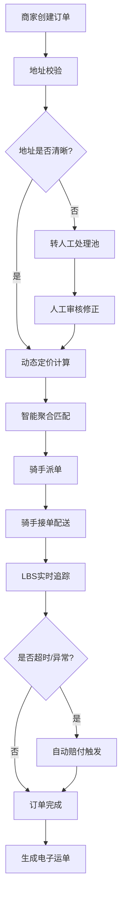
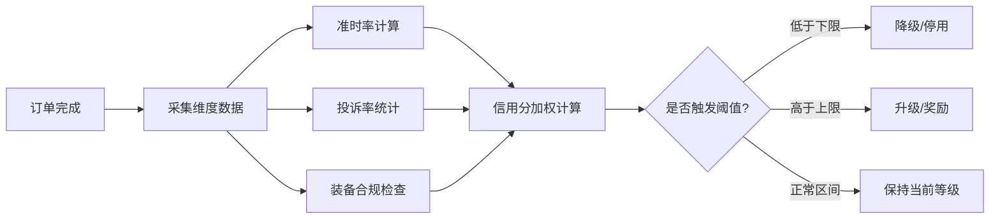

## 1. 产品概述

同城即时配送调度中台是面向B端商家的专业物流配送管理系统，支持商家、骑手、客户三方协同作业。通过智能订单聚合、动态定价、实时LBS追踪等核心能力，提升配送效率、降低运营成本、优化用户体验。

- 核心目标：为B端商家提供一站式配送调度解决方案，实现订单全链路数字化管理
- 目标用户：连锁餐饮、生鲜电商、零售企业等有即时配送需求的B端商家

## 2. 核心功能

### 2.1 用户角色

| 角色 | 注册方式 | 核心权限 |
|------|----------|----------|
| 商家管理员 | 企业资质审核注册 | 订单管理、API配置、数据看板、面单打印 |
| 骑手 | 个人实名认证 | 接单、配送、LBS上报、收益查看 |
| 运营管理员 | 平台内部创建 | 热力图监控、信用分管理、赔付审核、运单导出 |
| 客户 | 手机号登录 | 下单、订单追踪、评价投诉 |

### 2.2 功能模块

1. **商家看板仪表盘**：实时订单概览、运力监控、营收统计、异常告警
2. **订单管理中心**：订单列表、智能聚合调度、状态追踪、异常熔断
3. **动态定价配置**：距离/时段/天气/货品类型多维定价规则
4. **骑手管理系统**：骑手档案、LBS实时追踪、信用分体系、装备管理
5. **热力图大屏**：运力分布热力图、订单密度热力图、预测预警
6. **赔付自动化**：超时/丢件自动检测、补偿券发放、赔付记录
7. **电子运单中心**：税务合规运单生成、批量导出、打印驱动
8. **API集成中心**：ERP系统对接、Webhook配置、接口文档

### 2.3 页面详情

| 页面名称 | 模块名称 | 功能描述 |
|----------|----------|----------|
| 商家仪表盘 | 实时数据概览 | 今日订单数、完成率、平均配送时长、营收统计卡片 |
| 商家仪表盘 | 实时订单流 | WebSocket推送的订单状态变更滚动列表 |
| 商家仪表盘 | 运力分布地图 | 区域骑手分布与在线状态展示 |
| 订单管理 | 订单列表 | 多维度筛选、批量操作、订单详情抽屉 |
| 订单管理 | 智能聚合调度 | 3公里内多单路径规划展示、人工调整 |
| 订单管理 | 异常订单池 | 地址模糊自动转人工、异常类型标记、处理记录 |
| 动态定价 | 定价规则引擎 | 距离阶梯价、时段溢价、天气系数、货品类型加价 |
| 动态定价 | 运价模拟 | 输入条件实时计算预估运费 |
| 骑手管理 | 骑手列表 | 骑手档案、在线状态、信用分、装备合规状态 |
| 骑手管理 | LBS实时追踪 | 骑手位置实时更新、预计送达倒计时、路径偏差预警 |
| 骑手管理 | 信用分体系 | 准时率/投诉率/装备合规评分、扣分记录、等级升降 |
| 热力图大屏 | 运力热力图 | 区域骑手密度热力渲染、时间轴回放 |
| 热力图大屏 | 订单热力图 | 订单密度分布、高峰时段预警 |
| 赔付管理 | 赔付规则 | 超时阈值、丢件判定、补偿券面额配置 |
| 赔付管理 | 赔付记录 | 自动赔付流水、人工审核、补偿券发放状态 |
| 电子运单 | 运单列表 | 税务合规运单查询、状态筛选 |
| 电子运单 | 批量导出 | 按日期/商家导出PDF、电子面单打印驱动 |
| API集成 | ERP对接 | API密钥管理、Webhook配置、调用日志 |
| API集成 | 接口文档 | OpenAPI规范文档、SDK示例代码 |

## 3. 核心流程

### 3.1 订单配送主流程

商家通过API或后台创建订单 → 系统校验地址完整性（模糊地址自动转人工）→ 动态定价引擎计算运费 → 智能聚合模块匹配3公里内同方向订单 → 调度中心派单给附近骑手 → 骑手接单并通过LBS实时上报位置 → 配送过程中预计送达倒计时与偏差预警 → 订单完成/异常触发赔付判定 → WebSocket推送全链路状态至商家看板 → 生成税务合规电子运单

### 3.2 骑手信用分评估流程

## 4. 用户界面设计

### 4.1 设计风格

- **主色调**：深空蓝 `#0F172A` 作为主背景色，搭配科技感琥珀橙 `#F59E0B` 作为强调色
- **辅助色**：成功绿 `#10B981`、预警黄 `#EAB308`、危险红 `#EF4444`、信息蓝 `#3B82F6`
- **按钮风格**：扁平化直角设计，1px边框，hover状态微妙光影反馈
- **字体**：展示字体使用 JetBrains Mono 营造科技专业感，正文字体使用 Noto Sans SC
- **布局风格**：深色仪表盘风格，左侧固定导航栏+顶部状态栏+主内容区卡片式布局
- **图标风格**：Lucide 线性图标，统一20px尺寸，配合状态色点指示

### 4.2 页面设计概览

| 页面名称 | 模块名称 | UI元素 |
|----------|----------|--------|
| 商家仪表盘 | 数据概览卡片 | 大数字指标+趋势小图+状态指示灯、渐变背景、微妙边框光效 |
| 商家仪表盘 | 实时订单流 | 滚动列表、新订单高亮脉冲动画、状态标签色彩区分 |
| 商家仪表盘 | 运力地图 | 深色底图、骑手点标记、热力渲染、悬浮信息卡 |
| 订单管理 | 订单列表 | 斑马行、批量选择、状态列色点、展开行详情 |
| 热力图大屏 | 热力渲染 | 全屏暗色地图、渐变热力层、时间轴控制条、数据悬浮窗 |
| 骑手管理 | LBS追踪 | 动态路径线、骑手移动动画、ETA倒计时圆环、偏差警告闪烁 |

### 4.3 响应式设计

- 采用桌面优先设计，最小支持宽度1280px
- 热力图大屏支持1920×1080满屏展示
- 侧边栏在<1440px时可收起为图标模式
- 表格在窄屏下支持横向滚动，关键列固定

### 4.4 动效与交互

- 页面加载采用错落延迟的渐入动画（staggered fade-in）
- 实时数据更新采用数字滚动动效
- 新订单推送采用左侧滑入+脉冲高光效果
- 地图标记采用呼吸灯动效表示在线状态
- 异常告警采用红色边框闪烁+低频震动提示
