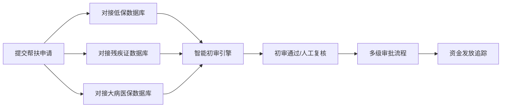
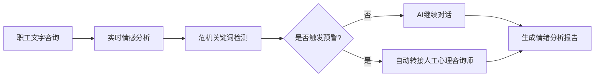

## 1. 产品概述

省级工会数字化服务平台，覆盖职工、基层工会、省级总工会三级组织体系，提供全链条数字化服务。通过对接公安、社保、民政等外部数据系统，实现实名制入会、法律援助、困难帮扶、职业技能培训等核心业务的智能化办理；同时提供婚恋交友、心理健康、普惠商城等增值服务；后台管理端具备组织管理、数据分析、资金审计等治理能力。

## 2. 核心功能

### 2.1 用户角色

| 角色 | 注册方式 | 核心权限 |
|------|----------|----------|
| 职工用户 | 实名制认证注册 | 申请入会、法律援助、困难帮扶、课程学习、婚恋交友、心理咨询、商城购物 |
| 基层工会管理员 | 总工会授权 | 审核入会申请、初审帮扶项目、管理基层组织数据、处理职工诉求 |
| 省级总工会管理员 | 系统内置账号 | 组织图谱管理、资金审计、数据分析、律师资质审核、系统配置 |
| 执业律师 | 资质认证注册 | 接收法律援助案件、上传案件处理进度、与申请人沟通 |

### 2.2 功能模块

1. **首页**：服务入口导航、工会动态、政策公告、个人快捷入口
2. **实名制入会**：个人信息填写、公安人口库核验、社保数据核验、工会组织选择
3. **法律援助**：在线申请、自动匹配律师、证据链上传、案件进度追踪
4. **困难帮扶**：智能初审（低保/残疾/大病数据比对）、多级审核、资金发放追踪
5. **工匠学院**：课程学习、进度追踪、学时认证、职业技能证书对接
6. **婚恋交友**：隐私保护模式、脱敏标签展示、兴趣匹配、安全聊天
7. **心理驿站**：AI情绪初筛、文字聊天、情感分析、危机关键词预警、人工转接
8. **普惠商城**：商品浏览、农特产品直供、订单管理、供应链追踪
9. **后台管理-组织图谱**：工会组织树形图谱、建会覆盖率动态展示
10. **后台管理-诉求分析**：职工诉求情感倾向分析、投诉/建议/表扬分类统计
11. **后台管理-资金审计**：帮扶资金流向穿透式审计、全程留痕追踪

### 2.3 页面详情

| 页面名称 | 模块名称 | 功能描述 |
|----------|----------|----------|
| 首页 | 导航栏 | 用户登录入口、角色切换、服务分类导航 |
| 首页 | Banner轮播 | 工会重要活动、政策宣传轮播展示 |
| 首页 | 快捷服务 | 八大核心服务快捷入口卡片 |
| 首页 | 工会动态 | 最新政策、活动公告列表展示 |
| 登录页 | 登录模块 | 账号密码登录、实名认证登录 |
| 实名制入会页 | 信息填写 | 个人基本信息、工作信息、所属工会选择 |
| 实名制入会页 | 身份核验 | 公安人口库对接核验、社保缴纳数据核验 |
| 实名制入会页 | 进度展示 | 申请状态、审核进度追踪 |
| 法律援助页 | 申请表单 | 案件类型选择、案情描述、证据上传 |
| 法律援助页 | 律师匹配 | 自动匹配专业律师、律师列表展示 |
| 法律援助页 | 案件管理 | 案件列表、沟通记录、进度追踪 |
| 困难帮扶页 | 帮扶申请 | 帮扶类型选择、家庭情况填写、证明材料上传 |
| 困难帮扶页 | 智能初审 | 低保/残疾/大病数据库自动比对、初审结果展示 |
| 困难帮扶页 | 进度追踪 | 审核流程、资金发放状态 |
| 工匠学院页 | 课程列表 | 课程分类、推荐课程、搜索筛选 |
| 工匠学院页 | 学习中心 | 学习进度、学时统计、证书获取 |
| 婚恋交友页 | 个人资料 | 脱敏资料设置、标签设置 |
| 婚恋交友页 | 匹配推荐 | 兴趣匹配、同城推荐 |
| 婚恋交友页 | 安全聊天 | 隐私保护聊天、内容审核 |
| 心理驿站页 | AI聊天 | 智能对话、情绪实时分析 |
| 心理驿站页 | 情绪报告 | 情绪分析报告、心理健康建议 |
| 心理驿站页 | 危机预警 | 关键词检测、自动转人工 |
| 普惠商城页 | 商品首页 | 推荐商品、分类导航、农特产专区 |
| 普惠商城页 | 商品详情 | 商品信息、供应链溯源、加入购物车 |
| 普惠商城页 | 订单管理 | 订单列表、物流追踪 |
| 组织图谱页 | 树形图谱 | 三级工会组织树、动态展开收起 |
| 组织图谱页 | 覆盖率统计 | 建会覆盖率、入会率数据可视化 |
| 诉求分析页 | 情感分析 | 诉求情感倾向饼图、趋势图 |
| 诉求分析页 | 分类统计 | 投诉/建议/表扬分类统计图表 |
| 资金审计页 | 资金流向 | 资金拨付、审批、发放全流程追踪 |
| 资金审计页 | 审计日志 | 操作留痕、异常预警 |

## 3. 核心流程

### 3.1 实名制入会流程

### 3.2 法律援助申请流程

### 3.3 困难帮扶智能初审流程

### 3.4 AI情绪初筛流程

## 4. 用户界面设计

### 4.1 设计风格

- **主色调**：工会红 (#C41E3A) - 代表工会组织属性，温暖而庄重
- **辅助色**：金色 (#D4AF37) - 代表荣誉与工匠精神
- **中性色**：深灰 (#2C3E50)、浅灰 (#F5F7FA)、白色 (#FFFFFF)
- **按钮风格**：圆角8px，主按钮为工会红渐变，hover状态有微上浮效果
- **字体**：标题使用"Noto Serif SC"宋体，体现庄重感；正文使用"PingFang SC"，清晰易读
- **布局风格**：卡片式布局，层次分明，适当留白，政务风格与现代设计结合
- **图标风格**：线性图标，统一24px尺寸，主色填充

### 4.2 页面设计概览

| 页面名称 | 模块名称 | UI元素 |
|----------|----------|----------|
| 首页 | Hero区域 | 大气渐变背景，大标题展示，动态数据统计展示 |
| 首页 | 服务卡片 | 8个核心服务卡片，图标+文字，hover有动画效果 |
| 实名制入会页 | 进度条 | 分步进度指示器，清晰展示办理阶段 |
| 法律援助页 | 律师卡片 | 律师头像、专业领域、评分、案例数量展示 |
| 工匠学院页 | 课程卡片 | 课程封面、学习进度条、学时标签 |
| 婚恋交友页 | 用户卡片 | 脱敏标签展示（如'35岁成都IT男'），头像模糊处理 |
| 心理驿站页 | 聊天界面 | 气泡式对话，情绪指示器实时显示 |
| 组织图谱页 | 树形图 | 可交互树形结构，节点显示组织名称和覆盖率数据 |
| 资金审计页 | 流向图 |  Sankey图展示资金流向，节点可点击查看详情 |

### 4.3 响应式设计

- **桌面端优先**：1920px为主设计尺寸，适配1440px、1280px
- **平板端**：960px~1280px，侧边栏收起为图标，内容区域自适应
- **移动端**：375px~768px，顶部导航，底部标签栏，卡片单列布局
- **触控优化**：按钮最小尺寸44x44px，列表项间距增大，支持滑动操作

### 4.4 数据可视化设计

- **组织图谱**：树形结构图，节点颜色根据覆盖率变化（绿色达标，黄色预警，红色未达标）
- **情感分析**：环形图展示投诉/建议/表扬占比，折线图展示趋势变化
- **资金流向**：桑基图展示资金从拨款到发放的全过程，节点可追溯
- **学习进度**：环形进度条，配合学时数字展示
