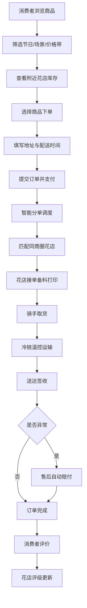

## 1. 产品概述
本平台为全国鲜花礼品即时履约平台，是一个连接6000城花店入驻的B2C/B2B双模式鲜花礼品电商系统。
- 面向消费者提供同城1-3小时达、异地次日达的鲜花束/蛋糕/礼盒即时配送服务；面向花店提供订单管理、库存管理、异常上报等SaaS工具；面向运营提供智能调度、温控监控、售后赔付、评级管理能力。
- 目标是打通花店端到端履约链路，保障鲜花品质与配送时效，构建行业领先的即时履约平台。

## 2. 核心功能

### 2.1 用户角色
| 角色 | 注册方式 | 核心权限 |
|------|----------|----------|
| 消费者 | 手机号注册 | 浏览商品、筛选下单、查看物流、申请售后 |
| 花店商家 | 入驻审核后开通 | 商品管理、订单处理、损耗登记、异常上报 |
| 调度员 | 后台账号 | 智能分单、温控监控、售后处理 |
| 运营管理员 | 后台账号 | 花店评级、热销榜、数据统计 |

### 2.2 功能模块
1. **消费者端首页**：节日/场景/价格带筛选、附近花店列表、实时库存与预计送达时间
2. **商品详情页**：商品信息、保鲜期说明、配送半径、养护知识库、加入购物车、立即购买
3. **订单中心**：订单列表、订单详情、物流追踪、售后申请
4. **花店端工作台**：订单自动打印、今日订单、花材损耗登记、配送异常上报
5. **调度中心**：智能分单、冷链车GPS与温控监控、售后自动赔付
6. **运营后台**：花店评级体系、区域热销榜、数据看板

### 2.3 页面详情
| 页面名称 | 模块名称 | 功能描述 |
|-----------|-------------|---------------------|
| 消费者首页 | 筛选模块 | 按节日（情人节/母亲节/春节）、场景（生日/告白/探望/哀思）、价格带（0-100/100-300/300-500/500+）筛选 |
| 消费者首页 | 花店列表 | 展示附近花店、库存状态、预计送达时间、评分 |
| 商品详情页 | 商品信息 | 图片、价格、保鲜期、配送半径、花材说明 |
| 商品详情页 | 养护知识库 | 嵌入养护指南、保鲜小贴士 |
| 下单页 | 收货地址 | 地址管理、配送时间选择（立即送/预约送） |
| 订单列表 | 我的订单 | 全部/待付款/待配送/已完成/售后 |
| 订单详情 | 物流追踪 | 实时物流节点、骑手信息、预计送达时间 |
| 花店工作台 | 订单管理 | 新订单提醒、自动打印、订单状态流转 |
| 花店工作台 | 库存管理 | 花材批次登记、损耗登记 |
| 花店工作台 | 异常上报 | 收件人拒收、花材损耗、配送延误，上传凭证 |
| 调度中心 | 智能分单 | 自动匹配同商圈花店+库存充足+骑手在岗 |
| 调度中心 | 温控监控 | 冷链车GPS位置、温度传感器实时数据 |
| 调度中心 | 售后赔付 | 超时/损毁按比例自动退现 |
| 运营后台 | 花店评级 | 准时率/差评率/复购率综合评分 |
| 运营后台 | 热销榜 | 区域热销商品、热销花店排行 |

## 3. 核心流程

消费者浏览商品→选择商品与花店→填写收货地址→提交订单→支付→智能分单匹配花店与骑手→花店接单备料→骑手取货配送→温控运输监控→送达签收→售后自动赔付（如有异常）→评价→花店评级更新

## 4. 用户界面设计

### 4.1 设计风格
- 主色调：玫瑰红 #E11D48（鲜花品牌色，传递温暖与浪漫
- 辅助色：嫩芽绿 #10B981（保鲜与活力）、暖金 #F59E0B（温馨感）
- 中性色：以 slate 系列，保证内容层级清晰
- 按钮风格：圆角8px，微阴影，hover 时轻微上浮 + 颜色加深
- 字体：标题使用 Noto Serif SC（典雅衬线，体现花艺品质感；正文使用 Noto Sans SC
- 布局：卡片式布局，顶部导航 + 左侧筛选 + 主内容瀑布流
- 图标：lucide-react 线性图标，配合花艺主题装饰元素

### 4.2 页面设计概述
| 页面名称 | 模块名称 | UI 元素 |
|-----------|-------------|-------------|
| 消费者首页 | Hero 区域 | 全屏轮播节日主题 banner，渐入动画 |
| 消费者首页 | 筛选栏 | 标签式筛选，选中态有底色 + 下划线动画 |
| 消费者首页 | 商品卡片 | 圆角12px，hover 阴影加深，轻微上浮 |
| 商品详情页 | 商品大图 | 主图 + 缩略图切换，放大镜效果 |
| 商品详情页 | 价格区域 | 大字价格 + 倒计时保鲜期提示 |
| 花店工作台 | 订单卡片 | 新订单红色徽章提醒，自动打印按钮 |
| 调度中心 | 监控面板 | 冷链车地图轨迹 + 温度曲线图表 |
| 运营后台 | 数据看板 | 卡片式数据统计 + 评级仪表盘 |

### 4.3 响应性
- Desktop-first 设计，断点 1024px / 768px，移动端自适应，触摸优化

### 4.4 动画交互
- 页面加载时 staggered 渐入动画，按钮 hover 微动画，筛选切换平滑过渡
