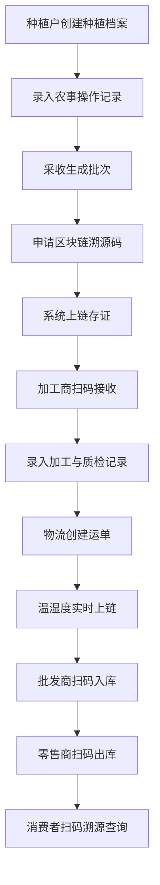
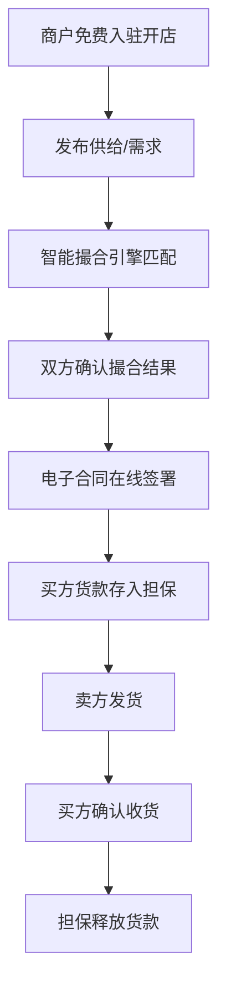

## 1. 产品概述

农产品全链条可信溯源与交易协同平台，面向农产品产业链上的种植户、加工商、批发商、零售商及终端消费者，提供从田间到餐桌的区块链存证溯源与B2B/B2C交易协同服务。平台解决的核心问题是：农产品来源不可信、流通信息断裂、交易信任成本高、监管数据滞后。

- 核心目标：为每批次农产品生成唯一区块链溯源码，实现全链条数据穿透；构建免佣金交易市场与智能供需撮合引擎；配套农技服务知识库与政府监管对接能力
- 市场价值：降低农产品流通环节信任成本，提升区域农产品品牌溢价，助力监管部门实现数字化精准治理

## 2. 核心功能

### 2.1 用户角色

| 角色 | 注册方式 | 核心权限 |
|------|----------|----------|
| 种植户/生产者 | 手机号实名注册 | 创建种植档案、录入农事操作、申请溯源码、开设店铺、发布供给 |
| 加工商 | 手机号+营业执照认证 | 接收原料批次、录入加工记录、关联溯源链、开设店铺 |
| 批发商 | 手机号+营业执照认证 | 批量采购、仓储管理、分销出库、价格发布 |
| 零售商 | 手机号+营业执照认证 | 零售进货、门店管理、消费者溯源查询入口 |
| 消费者 | 手机号/微信注册 | 溯源查询、在线购买、评价反馈 |
| 农技专家 | 邀请制注册 | 回答工单、病虫害诊断、发布知识文章 |
| 监管机构 | 专属账号分配 | 数据看板、抽检追溯、质量趋势报告导出 |
| 平台管理员 | 内部账号 | 全局管理、系统配置、争议仲裁 |

### 2.2 功能模块

1. **溯源首页**：平台定位展示、实时交易数据、溯源入口、品类导航
2. **溯源查询页**：扫码/输入溯源码、全链条时间轴可视化、区块链存证验证
3. **种植档案管理**：地块管理、农事操作记录、投入品使用、采收批次关联
4. **加工流转管理**：原料接收、加工工序记录、质检报告上传、成品批次生成
5. **物流追踪**：温湿度实时监控、运输轨迹、异常预警、交接确认
6. **交易市场**：供需大厅、智能撮合、品类/地域/规格筛选、价格行情
7. **店铺管理**：在线开店、商品上架、订单管理、信用保证金、货款担保
8. **电子合同**：合同模板、在线签署、履约跟踪、违约处理
9. **农技知识库**：专家问答工单、病虫害图像识别、知识文章、气象预警推送
10. **监管对接与数据看板**：监管数据上报、抽检查询、区域质量趋势分析

### 2.3 页面详情

| 页面名称 | 模块名称 | 功能描述 |
|----------|----------|----------|
| 溯源首页 | Hero区 | 平台核心Slogan、动态粒子背景、溯源扫码入口、实时交易额滚动 |
| 溯源首页 | 数据看板 | 当日溯源查询次数、在线商户数、累计溯源批次、交易总额 |
| 溯源首页 | 品类导航 | 按蔬菜/水果/粮食/畜牧/水产分区快速进入 |
| 溯源首页 | 最新动态 | 最新溯源记录、交易成交、质检通过等滚动消息 |
| 溯源查询页 | 溯源码输入 | 支持扫码/手动输入溯源码，自动跳转结果 |
| 溯源查询页 | 全链条时间轴 | 生产→加工→物流→批发→零售全环节可视化，每个节点可展开详情 |
| 溯源查询页 | 区块链存证验证 | 存证哈希、上链时间、区块高度、验证状态 |
| 溯源查询页 | 产品基础信息 | 品名、规格、产地、认证标识、保质期 |
| 溯源查询页 | 检测报告 | 农残检测、重金属检测、微生物检测报告PDF预览 |
| 种植档案页 | 地块管理 | 地块地图标记、面积、土壤类型、种植品种 |
| 种植档案页 | 农事日历 | 播种、施肥、灌溉、用药、采收等操作时间线 |
| 种植档案页 | 投入品记录 | 农药/化肥名称、用量、安全间隔期倒计时 |
| 种植档案页 | 批次关联 | 采收批次与溯源码自动绑定 |
| 加工管理页 | 原料接收 | 扫码接收原料批次，关联上游溯源链 |
| 加工管理页 | 工序记录 | 清洗、分拣、包装、杀菌等工序录入 |
| 加工管理页 | 质检上传 | 检测报告、合格证电子化上传 |
| 物流追踪页 | 运单管理 | 创建运单、关联批次、设置温湿度阈值 |
| 物流追踪页 | 实时监控 | 温湿度曲线图、GPS轨迹地图、异常告警 |
| 交易市场页 | 供需大厅 | 供给/需求卡片瀑布流，支持品类/地域/规格/价格筛选 |
| 交易市场页 | 智能撮合 | 根据供需双方条件自动匹配推荐，匹配度评分 |
| 交易市场页 | 价格行情 | 品类价格走势图、区域价差对比 |
| 店铺管理页 | 店铺装修 | 店铺Logo、名称、简介、资质展示 |
| 店铺管理页 | 商品管理 | 商品上架/下架、库存管理、溯源码关联 |
| 店铺管理页 | 订单中心 | 待处理/进行中/已完成订单列表、物流跟踪 |
| 店铺管理页 | 保证金管理 | 信用保证金缴纳/退还、违规扣款记录 |
| 店铺管理页 | 担保支付 | 货款担保状态流转、提现管理 |
| 电子合同页 | 合同模板 | 标准采购/销售合同模板，支持自定义条款 |
| 电子合同页 | 在线签署 | 电子签名、签章验证、签署流程跟踪 |
| 电子合同页 | 履约管理 | 发货/收货确认、付款/退款节点、违约申诉 |
| 农技知识库页 | 专家问答 | 提交问题工单、专家认领回复、评价闭环 |
| 农技知识库页 | 病虫害识别 | 上传作物图片、AI识别病虫害、给出防治建议 |
| 农技知识库页 | 知识文章 | 分类浏览农技文章、视频教程 |
| 农技知识库页 | 气象预警 | 实时天气、灾害预警推送、农事建议 |
| 监管看板页 | 数据总览 | 区域产量、合格率、违规率、溯源覆盖率 |
| 监管看板页 | 抽检追溯 | 对接市场监管抽检数据、问题批次快速追溯 |
| 监管看板页 | 趋势报告 | 区域农产品质量趋势分析图表、报告导出 |

## 3. 核心流程

### 3.1 溯源流程
种植户创建种植档案并录入农事操作 → 采收时生成批次并申请溯源码 → 系统在区块链上存证并返回唯一溯源码 → 加工商扫码接收原料，录入加工与质检记录 → 物流创建运单，温湿度实时上链 → 批发/零售扫码入库出库，关联销售记录 → 消费者扫码查看全链条信息并验证真伪

### 3.2 交易流程
商户免费入驻开店 → 发布供给/需求 → 智能撮合引擎匹配 → 双方确认进入合同签署 → 电子合同在线签署 → 买方货款存入担保账户 → 卖方发货 → 买方确认收货 → 担保账户释放货款至卖方

### 3.3 农技服务流程
农户提交问题描述/病虫害图片 → 系统AI初步识别并推荐知识文章 → 工单流转至专家 → 专家回复诊断与建议 → 农户评价闭环 → 气象预警主动推送至相关区域农户

## 4. 用户界面设计

### 4.1 设计风格

- **主色调**：翡翠绿 (#0D7C3E) — 代表生态、自然、可信赖；辅助色：暖金 (#D4A017) — 代表品质、丰收；深棕 (#3E2723) — 代表土地、稳重
- **按钮风格**：圆角矩形（8px），绿色主按钮带微妙阴影悬浮效果，金色次要按钮
- **字体**：标题使用"思源宋体"（Noto Serif SC）彰显专业权威感，正文使用"思源黑体"（Noto Sans SC）保证可读性
- **布局风格**：顶部导航 + 侧边栏二级导航，卡片式内容组织，数据看板采用网格布局
- **图标风格**：线性图标，统一2px描边，绿色为主，搭配金色点缀
- **整体风格**：大地色系 + 现代感数据可视化，融合自然纹理与科技感，体现"数字农业"定位

### 4.2 页面设计概览

| 页面名称 | 模块名称 | UI要素 |
|----------|----------|--------|
| 溯源首页 | Hero区 | 深绿渐变背景 + 粒子动画模拟农田，居中大标题+扫码按钮，数据滚动条 |
| 溯源首页 | 数据看板 | 四宫格统计卡片，数字动态递增动画，图标+趋势小箭头 |
| 溯源首页 | 品类导航 | 横向滑动卡片，每品类配插图+名称，悬浮微上浮效果 |
| 溯源首页 | 最新动态 | 左侧时间线布局，节点图标区分类型，右侧详情 |
| 溯源查询页 | 溯源码输入 | 居中搜索框，扫码图标，输入后回车跳转 |
| 溯源查询页 | 全链条时间轴 | 垂直时间轴，圆形节点+连线，节点图标区分环节，悬浮展开详情面板 |
| 溯源查询页 | 区块链验证 | 独立卡片，哈希值等宽字体，绿色验证通过徽章 |
| 溯源查询页 | 检测报告 | PDF预览缩略图，点击放大查看 |
| 种植档案页 | 地块管理 | 地图组件+地块标记，侧边列表 |
| 种植档案页 | 农事日历 | 日历网格视图，日期标记操作类型，点击弹出详情 |
| 加工管理页 | 工序记录 | 步骤条横向展示，当前步骤高亮 |
| 物流追踪页 | 实时监控 | 温湿度折线图+GPS地图双栏布局 |
| 交易市场页 | 供需大厅 | 卡片瀑布流，供给卡绿色边框，需求卡金色边框 |
| 交易市场页 | 价格行情 | 折线走势图，区域对比柱状图 |
| 店铺管理页 | 店铺装修 | 左侧预览+右侧编辑面板 |
| 电子合同页 | 在线签署 | 合同PDF预览+底部签名板 |
| 农技知识库页 | 病虫害识别 | 拖拽上传区+识别结果对比展示 |
| 农技知识库页 | 气象预警 | 天气卡片+预警横幅（红/橙/黄分级） |
| 监管看板页 | 数据总览 | 大屏风格，深色背景，图表为主，数据高亮 |
| 监管看板页 | 趋势报告 | 多维度图表组合，支持导出PDF |

### 4.3 响应式设计

- 桌面优先设计，核心操作在1440px+宽度下最优体验
- 平板端（768px-1024px）：侧边栏收起为汉堡菜单，卡片从4列变2列
- 移动端（<768px）：单列布局，底部Tab导航，表格转卡片视图，溯源扫码入口悬浮按钮

### 4.4 3D场景指引

- 溯源首页Hero区可考虑轻量3D农田场景作为背景，使用Three.js渲染
- 场景氛围：清晨薄雾中的农田，远山轮廓，晨光照射
- 光照：方向光模拟日出，暖色调环境光
- 相机：固定俯视角度，轻微自动旋转
- 交互：鼠标移动产生视差效果
- 性能预算：首屏加载3D资源<2MB，帧率保持30fps以上
