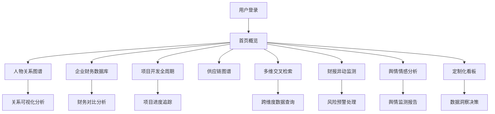

# 房地产全产业链专业数据库与舆情分析平台 - 产品需求文档

## 1. 产品概述

房地产全产业链专业数据库与舆情分析平台，面向房企、投研机构、监管单位提供结构化决策支持。平台整合房企人物关系、企业财务、项目开发全周期、物业与家居供应链四大核心数据域，通过多维交叉检索、财报异动监测、舆情情感分析、定制化数据看板四大功能模块，为用户提供深度洞察与决策依据。

- **目标用户**：房地产企业战略部、投研机构分析师、监管单位风控部门、行业研究学者
- **核心价值**：打通数据孤岛，实现跨维度数据关联分析，提升决策效率与准确性
- **市场定位**：专业级B端房地产数据智能平台，覆盖开发、投资、风控全场景

## 2. 核心功能

### 2.1 用户角色

| 角色 | 登录方式 | 核心权限 |
|------|----------|----------|
| 企业用户 | 账号密码/SSO | 全功能访问、数据导出、看板定制 |
| 投研用户 | 账号密码 | 数据检索、舆情监测、财务分析 |
| 监管用户 | 专属账号 | 全量数据访问、风险预警、统计报表 |
| 访客用户 | 免费注册 | 基础数据浏览、限次检索 |

### 2.2 功能模块

1. **首页数据看板**：核心指标概览、行业动态、预警提醒、快捷入口
2. **人物关系图谱**：高管任职轨迹、股权穿透分析、司法风险关联、关系链路图
3. **企业财务数据库**：年报数据、债券发行、土储动态、财务指标对比
4. **项目开发全周期**：拿地信息、开工进度、销售数据、交付情况
5. **物业与家居供应链**：供应商图谱、合作关系、采购规模、行业集中度
6. **多维交叉检索**：自然语言查询、多条件筛选、关联分析、结果导出
7. **财报异动监测**：指标异动预警、阈值配置、预警历史、趋势分析
8. **舆情情感分析**：新闻情感识别、信源权威度、舆情热度、传播路径
9. **定制化数据看板**：拖拽式布局、指标组合、同比环比下钻、看板分享

### 2.3 页面详情

| 页面名称 | 模块名称 | 功能描述 |
|----------|----------|----------|
| 首页 | 顶部导航 | 全局搜索、用户中心、消息通知、模块切换 |
| 首页 | 核心指标卡 | 房企数量、项目总数、舆情条数、预警数量等关键指标 |
| 首页 | 行业动态 | 最新资讯滚动、热门房企排行榜、市场趋势图 |
| 首页 | 预警提醒 | 财务异动预警、司法风险预警、舆情负面预警 |
| 首页 | 快捷入口 | 图谱分析、财务对比、项目检索、舆情监测 |
| 人物关系图谱 | 搜索栏 | 人物/企业名称搜索、关系类型筛选 |
| 人物关系图谱 | 可视化画布 | 力导向图展示、节点拖拽、缩放平移、详情弹窗 |
| 人物关系图谱 | 侧边信息栏 | 人物/企业详情、任职轨迹、股权结构、司法记录 |
| 企业财务数据库 | 企业列表 | 筛选排序、企业卡片、财务指标概览 |
| 企业财务数据库 | 财务详情 | 年报数据、利润表、资产负债表、现金流量表 |
| 企业财务数据库 | 债券发行 | 发行列表、利率走势、到期分布、违约记录 |
| 企业财务数据库 | 土储动态 | 土储规模、区域分布、拿地节奏、楼面价趋势 |
| 项目开发全周期 | 项目地图 | 地图可视化、区域筛选、项目分布热力图 |
| 项目开发全周期 | 项目列表 | 全周期进度条、拿地/开工/销售/交付节点 |
| 项目开发全周期 | 项目详情 | 基本信息、开发团队、销售数据、交付记录 |
| 物业与家居供应链 | 供应商图谱 | 头部供应商、合作网络、市场份额 |
| 物业与家居供应链 | 品类分析 | 精装/建材/设备各品类供应链分析 |
| 多维交叉检索 | 查询构建器 | 维度选择、条件组合、自然语言输入 |
| 多维交叉检索 | 结果展示 | 数据表格、图表可视化、数据导出 |
| 财报异动监测 | 预警总览 | 异动指标排行、预警趋势、异常企业列表 |
| 财报异动监测 | 阈值配置 | 指标选择、阈值设定、预警方式配置 |
| 财报异动监测 | 预警详情 | 异动分析、历史对比、关联数据 |
| 舆情情感分析 | 舆情总览 | 情感分布、热度趋势、信源分布、关键词云 |
| 舆情情感分析 | 舆情列表 | 新闻列表、情感标签、权威度标识、时间筛选 |
| 舆情情感分析 | 舆情详情 | 文章内容、情感分析、传播路径、相关企业 |
| 定制化数据看板 | 看板编辑 | 拖拽布局、组件库、指标配置、样式设置 |
| 定制化数据看板 | 看板展示 | 多看板切换、下钻分析、同比环比切换 |
| 定制化数据看板 | 看板管理 | 保存、分享、删除、权限设置 |

## 3. 核心流程

### 3.1 用户核心操作流程

用户登录平台后，可通过导航栏进入各功能模块。典型使用场景包括：

1. **投资研究场景**：投研人员通过多维交叉检索筛选目标企业 → 查看企业财务数据与土储情况 → 分析人物关系与股权结构 → 生成定制化研究看板

2. **风险监控场景**：监管用户设置财报异动阈值 → 系统自动监测并推送预警 → 查看预警详情与关联数据 → 追踪舆情与司法风险

3. **供应链分析场景**：房企采购人员查看供应链图谱 → 筛选区域与品类供应商 → 分析合作关系与市场集中度 → 导出供应商列表

### 3.2 数据检索流程

## 4. 用户界面设计

### 4.1 设计风格

**专业金融数据风格 - 深色主题**

- **主色调**：深邃藏青 `#0A1628` 作为背景基调，营造专业、沉稳的金融数据氛围
- **强调色**：科技蓝 `#2563EB` 用于主交互元素，数据增长用翡翠绿 `#10B981`，下跌用朱砂红 `#EF4444`
- **辅助色**：琥珀黄 `#F59E0B` 用于预警提示，紫色 `#8B5CF6` 用于关系图谱节点
- **字体**：标题使用「思源黑体 Heavy」，正文使用「Inter」，数字使用「Roboto Mono」等宽字体
- **卡片风格**：半透明玻璃拟态效果，边框微光，阴影层次感强
- **图标风格**：线性图标，粗细统一为 1.5px，hover 时填充色彩
- **动效风格**：数据数字滚动动画、图表渐入动画、图谱节点悬浮发光

### 4.2 页面设计概述

| 页面名称 | 模块名称 | UI 元素 |
|----------|----------|---------|
| 首页 | 顶部导航 | 深色导航栏、品牌标识、全局搜索框、功能菜单、用户头像 |
| 首页 | 核心指标区 | 四张指标卡片、数字滚动动画、环比箭头、趋势迷你图 |
| 首页 | 行业动态 | 左侧资讯列表、右侧图表区、标签切换、时间筛选 |
| 首页 | 预警中心 | 三级预警卡片、预警数量、预警类型图标、查看更多 |
| 人物关系图谱 | 顶部工具栏 | 搜索框、关系类型筛选、布局切换、全屏/导出 |
| 人物关系图谱 | 中心画布 | 力导向关系图、节点发光效果、连线动效、缩放控制 |
| 人物关系图谱 | 右侧详情 | 头像/Logo、基本信息、标签组、时间轴轨迹、关联列表 |
| 企业财务数据库 | 左侧筛选 | 行业分类、区域筛选、规模筛选、财务指标筛选 |
| 企业财务数据库 | 中间列表 | 企业卡片、关键指标、趋势箭头、对比勾选框 |
| 企业财务数据库 | 右侧详情 | 标签页切换（年报/债券/土储）、数据表格、图表组合 |
| 项目开发全周期 | 顶部地图 | 地图可视化、区域色块、项目点标记、缩放平移 |
| 项目开发全周期 | 底部列表 | 项目卡片、进度条、各阶段状态标识、详情入口 |
| 舆情情感分析 | 顶部仪表盘 | 情感分布环形图、热度折线图、信源柱状图、关键词云 |
| 舆情情感分析 | 舆情列表 | 新闻标题、来源标识、情感标签、权威度星级、发布时间 |
| 定制化看板 | 左侧组件库 | 图表组件列表、拖拽手柄、组件分类标签 |
| 定制化看板 | 中间画布 | 网格布局、组件卡片、拖拽占位、缩放调整 |
| 定制化看板 | 右侧配置 | 指标选择、时间范围、样式设置、数据下钻选项 |

### 4.3 响应式设计

- **桌面端优先**：针对 1920×1080 及以上分辨率优化，支持 2K/4K 高清显示
- **平板适配**：1024-1440px 宽度，侧边栏可收起，图表自适应缩放
- **移动端**：768px 以下简化为核心数据浏览，图谱类功能降级为列表展示
- **触控优化**：移动端支持手势缩放图谱、滑动切换标签页

### 4.4 数据可视化规范

- **图表类型**：折线图（趋势）、柱状图（对比）、环形图（占比）、热力图（分布）、关系图（关联）
- **配色方案**：统一使用 6 色数据调色板，支持色盲友好模式切换
- **交互规范**：hover 显示数据详情、点击下钻、支持双轴对比、数据标签可配置
- **性能要求**：单图数据点 ≤ 10000 个，支持数据抽样与懒加载
