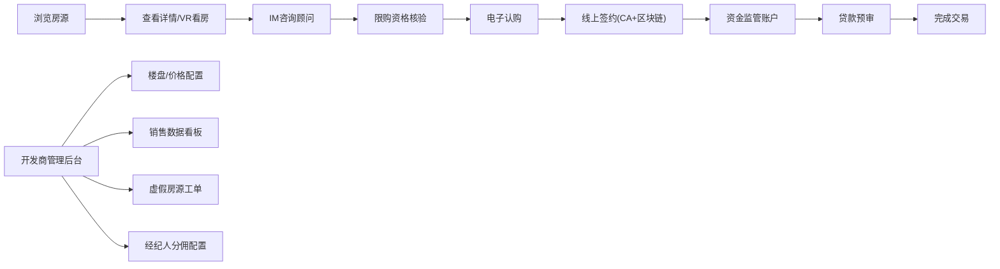

## 1. 产品概述

开发商直连型新房交易数字化工作台，核心打通开发商ERP/销控系统，实现房源状态、价格、优惠的毫秒级同步；提供VR三维穿透式浏览、置业顾问IM在线系统、全流程线上购房（电子认购、CA认证签约、资金监管、贷款预审）；支持开发商侧管理后台与多城市区域化运营。

目标用户包括购房客户、置业顾问、开发商运营管理人员、经纪人，产品价值在于实现新房交易全流程数字化、透明化、合规化，提升交易效率与客户体验。

## 2. 核心功能

### 2.1 用户角色

| 角色 | 注册方式 | 核心权限 |
|------|----------|----------|
| 购房客户 | 手机号注册 | 浏览房源、VR看房、在线咨询、发起认购、签约、资金监管、贷款预审 |
| 置业顾问 | 开发商账号分配 | 接待客户、IM沟通、会话存档、SOP话术、客户打标、跟进提醒 |
| 开发商管理员 | 企业账号登录 | 楼盘配置、销售看板、分佣规则、虚假房源审核、工单处理 |
| 经纪人 | 经纪人注册 | 推荐客户、查看分佣、客户跟进 |

### 2.2 功能模块

1. **房源大厅**：房源列表、实时状态标签（在售/已锁/已售/下架）、一房一价、优惠策略展示、多条件筛选
2. **VR看房中心**：样板间→售楼处→楼盘全景→周边街景穿透式浏览、3D户型标注
3. **IM在线咨询**：实时聊天、会话存档、SOP话术库、客户打标、跟进提醒
4. **购房流程**：限购资格核验、电子认购、线上签约（CA认证+区块链存证）、资金监管对接、贷款预审
5. **开发商管理后台**：楼盘信息配置、销售数据看板、经纪人分佣配置、虚假房源AI识别与工单流
6. **合规校验**：多城市限购政策、资格前置核验、区域化运营

### 2.3 页面详情

| 页面名称 | 模块名称 | 功能描述 |
|---------|----------|----------|
| 房源大厅页 | 房源列表模块 | 展示房源卡片、实时状态标签、价格/折扣信息、支持区域/价格/户型筛选 |
| 房源详情页 | 基本信息模块 | 楼盘详情、户型图、一房一价表、优惠活动详情 |
| 房源详情页 | VR浏览模块 | 嵌入VR看房入口、支持三维穿透式浏览切换 |
| VR浏览页 | 3D场景模块 | 样板间、售楼处、楼盘全景、周边街景四场景自由切换 |
| IM咨询页 | 聊天模块 | 实时消息、历史会话、SOP话术快捷回复、客户标签管理 |
| IM咨询页 | 客户管理模块 | 客户画像、跟进记录、预约提醒、成交意向评级 |
| 购房流程页 | 资格核验模块 | 限购资格前置校验、材料上传、合规结果展示 |
| 购房流程页 | 认购签约模块 | 电子认购书签署、CA认证、区块链存证、资金监管账户跳转 |
| 购房流程页 | 贷款预审模块 | 贷款资格评估、材料提交、银行接口对接、预审结果 |
| 管理后台首页 | 数据看板模块 | 转化率漏斗、客源渠道分析、成交周期统计、实时成交数据 |
| 管理后台房源 | 楼盘配置模块 | 楼盘信息录入、户型管理、价格策略、优惠活动配置 |
| 管理后台运营 | 工单处理模块 | 虚假房源AI识别结果、人工复核工单流、处理记录 |
| 管理后台财务 | 分佣管理模块 | 经纪人分佣规则配置、分佣结算记录、业绩报表 |

## 3. 核心流程

购房客户从浏览房源开始，筛选意向楼盘后查看详情与VR样板间，发起在线咨询与置业顾问沟通，完成限购资格核验后，进行电子认购、线上签约、资金监管、贷款预审，最终完成交易。开发商管理员在后台管理楼盘配置、查看销售数据、处理虚假房源工单、配置分佣规则。

## 4. 用户界面设计

### 4.1 设计风格
- **主色调**：深蓝色（#1E3A8A）代表专业可信，搭配金色（#D4AF37）作为高端房产的点缀色
- **辅助色**：翡翠绿（#10B981）表示在售/可认购，橙色（#F59E0B）表示已锁/限时优惠，红色（#EF4444）表示已售
- **按钮风格**：圆角8px，主按钮使用渐变背景，悬停时带微缩放动效
- **字体**：标题使用"Noto Serif SC"营造高端质感，正文使用"PingFang SC"保证可读性
- **布局风格**：卡片式布局，顶部全局导航+侧边分类，大面积留白突出房源信息
- **图标风格**：线性图标，使用SVG实现，保持统一24px尺寸

### 4.2 页面设计概述

| 页面名称 | 模块名称 | UI元素 |
|---------|----------|--------|
| 房源大厅页 | 房源列表模块 | 栅格布局卡片、状态标签角标、价格大字展示、筛选侧边栏、VR标识徽章 |
| VR浏览页 | 3D场景模块 | 全屏3D画布、场景切换Tab、热点标注点、楼层/户型导航、VR模式切换按钮 |
| IM咨询页 | 聊天模块 | 左侧会话列表、中间聊天区、右侧客户画像、底部输入框+SOP话术面板 |
| 管理后台首页 | 数据看板模块 | 顶部关键指标卡片、中部转化率漏斗图、底部渠道饼图/成交趋势折线图 |
| 购房流程页 | 流程模块 | 顶部步骤进度条、卡片式当前步骤、材料上传拖拽区、电子签名画布 |

### 4.3 响应式
采用桌面优先设计，适配1920px为主，向下兼容1440px与1366px；核心操作区保持最小960px宽度；移动端浏览模式下优化列表展示与触控交互。

### 4.4 3D场景指导
- **环境**：VR样板间使用柔和室内光，HDRI采用办公室环境，售楼处使用暖色调，楼盘全景使用户外天光，街景使用城市环境
- **光照**：每个场景独立设置3盏区域光，突出材质质感，避免过曝
- **相机**：第一人称视角，默认高度1.6米，移动速度0.5，支持鼠标拖拽环视与点击热点跳转
- **交互**：热点点击弹出信息面板，场景切换使用淡入淡出过渡，家具可点击查看尺寸
- **后处理**：Bloom效果增强光感，ACES色调映射，FXAA抗锯齿
- **资产来源**：使用GLTF格式模型，单场景面数控制在5万以内，纹理压缩至1024x1024
