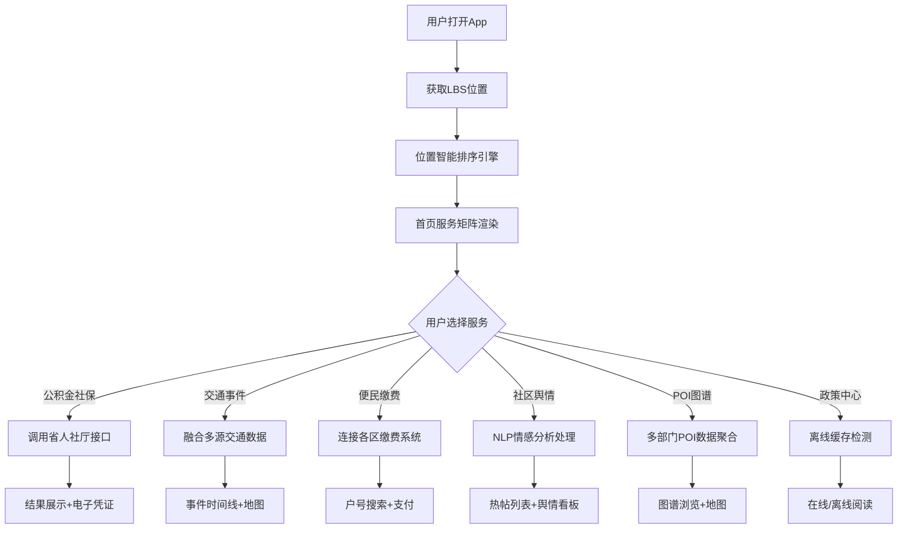

## 1. 产品概述

青岛城市级政务民生服务聚合平台，深度对接本地政务系统，为市民提供一站式政务、交通、缴费、社区舆情与本地生活服务。所有服务入口基于用户LBS位置智能排序，支持离线缓存关键政策文本。

- 核心目标：打通青岛政务服务孤岛，实现民生服务聚合化、智能化、移动化
- 目标用户：青岛市全体市民及常住居民
- 市场价值：提升政务服务效率，优化市民生活体验，打造智慧城市标杆

## 2. 核心功能

### 2.1 用户角色

| 角色 | 注册方式 | 核心权限 |
|------|----------|----------|
| 普通市民 | 手机号实名认证 | 查询、缴费、浏览、收藏 |
| 游客 | 无需注册 | 浏览公开信息、POI查询 |

### 2.2 功能模块

1. **首页聚合门户**：LBS智能排序服务入口、天气/交通概览、政策公告、快捷入口
2. **公积金/社保查询**：账户余额、缴费明细、电子凭证生成、政策解读
3. **交通事件融合**：事故快报、地铁延误、公交到站预测、实时路况
4. **便民缴费网关**：水电气暖宽带缴费、分户号模糊搜索、缴费记录
5. **社区舆情中心**：青青岛社区热帖、NLP情感分析、舆情等级标注
6. **本地生活POI图谱**：A级景区、餐饮评级、医疗机构白名单、地图展示
7. **政策离线中心**：政策文本缓存、离线阅读、收藏管理

### 2.3 页面详情

| 页面名称 | 模块名称 | 功能描述 |
|----------|----------|----------|
| 首页 | LBS服务排序 | 基于用户地理位置对服务入口进行智能加权排序 |
| 首页 | 实时概览 | 天气、空气质量、交通指数、紧急通知轮播 |
| 首页 | 快捷服务矩阵 | 九宫格服务入口，支持自定义排序 |
| 公积金社保页 | 账户总览 | 公积金余额、社保各险种缴费状态卡片展示 |
| 公积金社保页 | 明细查询 | 按月/年筛选缴费明细，支持图表可视化 |
| 公积金社保页 | 电子凭证 | PDF电子凭证生成与下载，带电子签章 |
| 交通融合页 | 事件时间线 | 交警事故、地铁延误、公交异常按时间轴融合展示 |
| 交通融合页 | 公交预测 | 收藏线路实时到站预测，多线路对比 |
| 交通融合页 | 路况地图 | 实时拥堵热力图叠加展示 |
| 缴费网关页 | 服务选择 | 水/电/气/暖/宽带分类缴费入口 |
| 缴费网关页 | 户号搜索 | 模糊搜索户号，关联历史缴费记录 |
| 缴费网关页 | 订单支付 | 订单确认、在线支付、电子发票 |
| 社区舆情页 | 热帖列表 | 青青岛社区热帖同步，按热度/时间排序 |
| 社区舆情页 | 情感分析 | 正面/中性/负面标签标注，舆情等级预警 |
| 社区舆情页 | 舆情看板 | 舆情趋势图、关键词云、情感分布统计 |
| POI图谱页 | 分类浏览 | 景区/餐饮/医疗三大分类筛选 |
| POI图谱页 | 详情卡片 | A级景区等级、餐饮卫生评级、医疗机构资质 |
| POI图谱页 | 地图视图 | POI点位地图标注，支持路线规划 |
| 政策中心 | 政策列表 | 最新政策公告按部门/类型分类 |
| 政策中心 | 离线管理 | 已缓存政策文本管理，离线阅读模式 |
| 个人中心 | 用户信息 | 实名认证状态、收藏夹、浏览历史 |
| 个人中心 | 设置 | LBS权限、缓存管理、消息通知设置 |

## 3. 核心流程

### 3.1 主流程描述

用户进入首页 → 系统获取LBS位置 → 基于位置智能排序服务入口 → 用户选择服务 → 跳转对应模块 → 数据查询/业务办理 → 结果展示 → 可选择收藏或离线缓存

### 3.2 核心流程图

## 4. 用户界面设计

### 4.1 设计风格

- **主色调**：政务蓝 #1E6FFF（信任、专业），辅助色：活力橙 #FF7A45（警示、强调）
- **中性色**：以 slate 为基础，从 slate-50 到 slate-900 构建层次
- **按钮风格**：圆角 12px，主按钮带微妙渐变与投影，悬停有上浮动效
- **字体**：标题使用 "Noto Serif SC"（庄重典雅），正文使用 "PingFang SC"（清晰易读）
- **布局风格**：卡片化布局，分区明确，信息密度适中，大量留白
- **图标风格**：lucide-react 线性图标，统一 20px 尺寸，配合填充色块

### 4.2 页面设计概览

| 页面名称 | 模块名称 | UI元素 |
|----------|----------|--------|
| 首页 | 头部区域 | 渐变背景 + 城市问候语 + 实时天气卡片 + LBS定位指示 |
| 首页 | 服务矩阵 | 圆角卡片网格，图标+文字，LBS排序高亮动画 |
| 首页 | 信息滚动 | 横向滚动通知条，紧急事件红底闪烁 |
| 公积金社保 | 数据卡片 | 大数字展示余额，环形进度条显示缴费比例 |
| 公积金社保 | 明细图表 | 面积图展示月度缴费趋势，支持交互 |
| 交通融合 | 时间线 | 左侧彩色竖线标识事件类型，卡片悬浮展开详情 |
| 交通融合 | 公交预测 | 动态倒计时显示到站时间，线路色块区分 |
| 缴费网关 | 分类入口 | 图标+渐变色块，点击展开户号输入 |
| 缴费网关 | 搜索联想 | 输入时模糊匹配历史户号，下拉快速选择 |
| 社区舆情 | 热帖卡片 | 情感标签色条（绿/灰/红），舆情等级徽章 |
| 社区舆情 | 看板统计 | 环形图展示情感分布，词云悬浮放大 |
| POI图谱 | 分类Tab | 景区/餐饮/医疗切换，筛选条件联动 |
| POI图谱 | 地图视图 | 自定义Marker根据评级变色，点击弹出详情 |
| 政策中心 | 列表卡片 | 左侧部门图标，右侧已缓存标识（下载图标） |
| 政策中心 | 离线模式 | 顶部灰色离线状态条，仅展示已缓存内容 |

### 4.3 响应式设计

- 采用移动端优先策略，桌面端自适应扩展
- 断点：sm(640px) 手机横屏、md(768px) 平板、lg(1024px) 桌面
- 首页服务矩阵：移动端 3x3、平板 4x3、桌面 5x3
- 地图与图表组件：始终占满容器宽度，高度自适应
- 触摸优化：所有可点击区域 ≥ 44x44px，手势支持下拉刷新

### 4.4 动效设计

- 页面入场：模块按序渐入（stagger 80ms），从下方 20px 滑入
- 服务排序：LBS排序完成时，卡片有轻微位置调整动画
- 数据加载：骨架屏脉冲动画，内容渐入替换
- 卡片交互：悬停时 y 轴 -2px + 投影加深，点击时缩放 0.98
- 事件通知：紧急事件从顶部滑入，带轻微震动反馈提示
