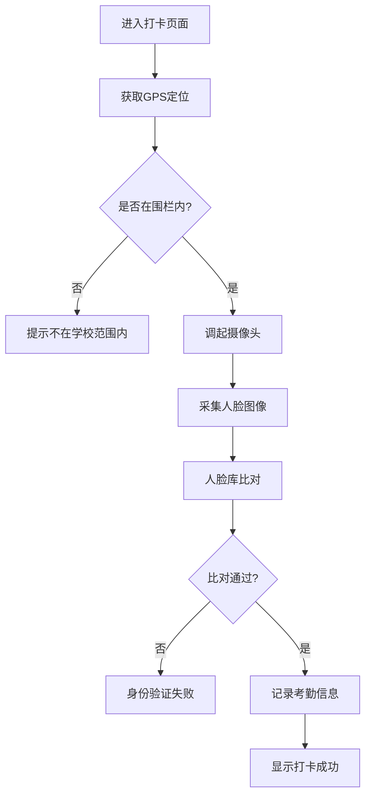
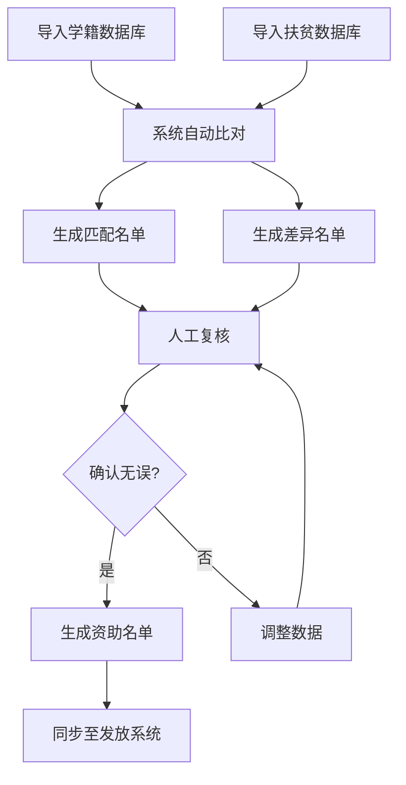

# 河南省中职学生资助监管服务平台 - 移动端管理端 PRD

## 1. 产品概述

河南省中职学生资助监管服务平台是面向学校管理员与地市资助中心的移动端管理系统，通过人脸打卡+GPS地理围栏双重核验技术实现学生在校状态精准监管，结合资助名单动态比对与发放追踪，确保资助资金精准发放、全程可追溯。

- 核心解决问题：学生考勤监管难度大、资助资金发放不透明、异常离校难以及时发现
- 目标用户：学校管理员、地市资助中心工作人员
- 市场价值：提升中职学生资助管理效率，确保资助政策精准落地

## 2. 核心功能

### 2.1 用户角色

| 角色 | 注册方式 | 核心权限 |
|------|----------|----------|
| 学校管理员 | 系统分配账号 | 管理本校学生、查看本校考勤、处理本校预警、查看本校资助数据 |
| 市级管理员 | 系统分配账号 | 汇总分析全市数据、查看所有学校、跨校统计分析、管理下级账号 |

### 2.2 功能模块

1. **登录页**：账号密码登录、记住登录状态、离线登录支持
2. **首页**：数据概览、今日考勤统计、待处理预警、快捷功能入口
3. **考勤管理**：人脸打卡、GPS围栏校验、考勤记录查询、异常处理
4. **学生管理**：学生信息管理、班级管理、人脸库管理、地理围栏设置
5. **资助管理**：资助名单比对、发放进度追踪、电子签收凭证、学籍扶贫数据对接
6. **统计报表**：班级考勤统计、年级考勤汇总、校级报表、资助发放统计
7. **预警中心**：异常离校预警、考勤异常预警、资助异常预警、预警处理记录
8. **个人中心**：个人信息、密码修改、操作日志、离线数据同步、系统设置

### 2.3 页面详情

| 页面名称 | 模块名称 | 功能描述 |
|----------|----------|----------|
| 登录页 | 身份认证 | 账号密码登录、离线登录、密码重置 |
| 首页 | 数据概览 | 今日出勤率、在校人数、待处理预警数、快捷打卡入口 |
| 首页 | 快捷功能 | 考勤管理、学生管理、资助管理、统计报表快速入口 |
| 考勤管理 | 打卡页面 | 人脸采集、GPS定位、围栏校验、打卡结果反馈 |
| 考勤管理 | 考勤记录 | 按日期/班级筛选、考勤详情、异常标记处理 |
| 学生管理 | 学生列表 | 学生信息增删改查、批量导入、人脸信息管理 |
| 学生管理 | 地理围栏 | 学校围栏设置、围栏范围可视化、多校区支持 |
| 资助管理 | 名单比对 | 自动比对学籍库与扶贫库、差异标注、人工复核 |
| 资助管理 | 发放追踪 | 补贴发放进度、批次管理、发放状态更新 |
| 资助管理 | 电子凭证 | 签收凭证生成、二维码/条形码、凭证下载打印 |
| 统计报表 | 考勤统计 | 班级/年级/校级多维度统计、图表可视化、数据导出 |
| 预警中心 | 预警列表 | 异常离校预警、考勤异常、资助异常、状态筛选 |
| 预警中心 | 预警处理 | 预警详情查看、处理记录、标记已处理 |
| 个人中心 | 账户管理 | 个人信息、密码修改、权限查看 |
| 个人中心 | 离线管理 | 离线数据缓存状态、手动同步、同步日志 |
| 个人中心 | 操作日志 | 操作留痕记录、操作类型筛选、时间范围查询 |

## 3. 核心流程

### 3.1 人脸打卡流程

管理员进入打卡页面 → 系统获取GPS定位 → 判断是否在学校地理围栏内 → 调起摄像头进行人脸采集 → 人脸比对验证身份 → 记录打卡信息 → 显示打卡结果。

### 3.2 资助名单比对流程

导入学籍数据 → 导入扶贫数据 → 系统自动匹配比对 → 生成差异名单 → 人工复核确认 → 生成最终资助名单 → 同步至发放系统。

## 4. 用户界面设计

### 4.1 设计风格

- **主色调**：政务蓝 (#1E40AF)，代表专业、可信
- **辅助色**：警示橙 (#F59E0B) 用于预警、成功绿 (#10B981) 用于正常状态、危险红 (#EF4444) 用于异常
- **中性色**：深灰 (#1F2937)、中灰 (#6B7280)、浅灰 (#F3F4F6)、白色 (#FFFFFF)
- **按钮风格**：圆角 8px，中等高度 44px，点击有明显反馈动效
- **字体**：系统字体，标题 18px 加粗，正文 14px，小字 12px
- **布局风格**：卡片式布局，底部导航栏，顶部状态栏，内容区域可滚动
- **图标风格**：线性图标，使用 Lucide 图标库，统一 24px 尺寸

### 4.2 页面设计概述

| 页面名称 | 模块名称 | UI 元素 |
|----------|----------|----------|
| 登录页 | 登录表单 | Logo、输入框、登录按钮、政务风格背景 |
| 首页 | 数据概览 | 数据卡片网格、统计图表、数字滚动动画 |
| 考勤管理 | 打卡页面 | 圆形人脸取景框、GPS状态指示、打卡按钮 |
| 学生管理 | 学生列表 | 列表卡片、头像、搜索框、筛选标签 |
| 资助管理 | 发放进度 | 进度条、时间线、状态标签 |
| 统计报表 | 图表展示 | 柱状图、折线图、饼图、数据表格 |
| 预警中心 | 预警列表 | 带颜色标识的卡片、预警级别标签 |
| 个人中心 | 功能列表 | 分组列表、箭头指示、开关控件 |

### 4.3 响应式设计

- **移动端优先**：以手机端为主要设计目标，适配 375px - 430px 宽度
- **平板适配**：在平板设备上采用两列布局，充分利用屏幕空间
- **触摸优化**：所有可点击元素最小 44x44px，确保触控精准
- **手势支持**：支持下拉刷新、上拉加载、左右滑动切换标签

### 4.4 离线与弱网体验

- 核心数据本地缓存，离线状态可查看缓存数据
- 弱网环境下操作进入队列，网络恢复后自动同步
- 离线状态明显标识，同步进度可视化显示
- 数据冲突时提供合并策略，优先保留最新操作
